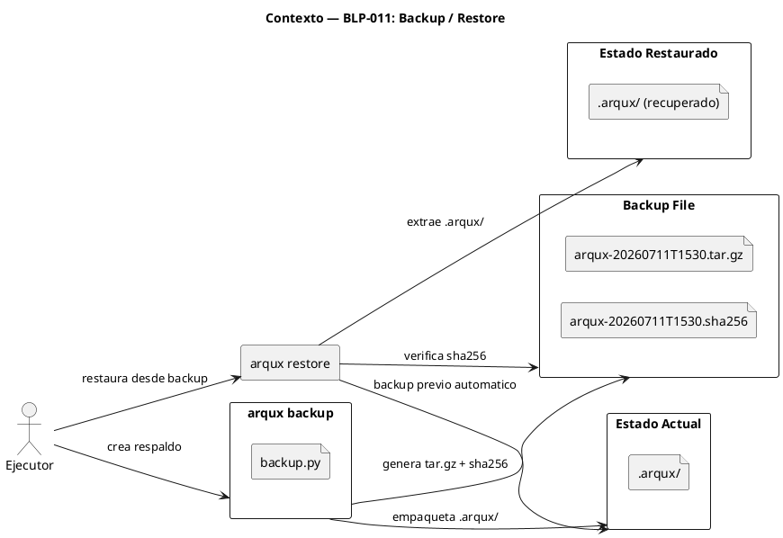
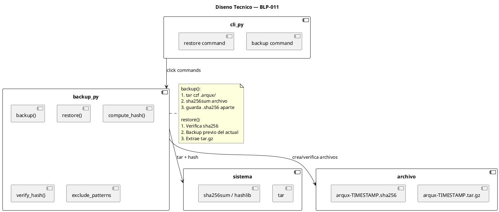
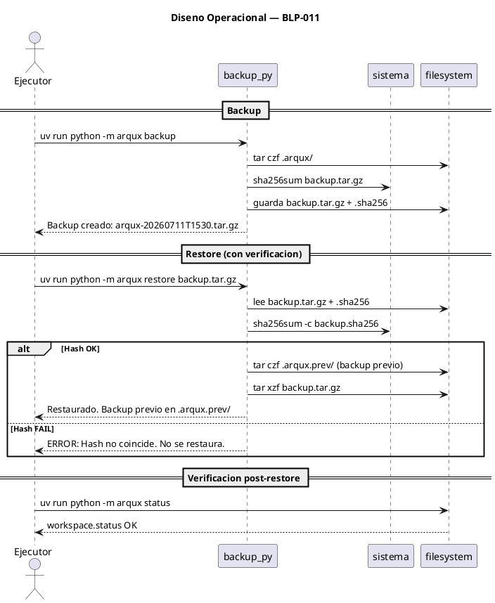

<!-- BLP:TITLE -->
# BLP-011: Crear comandos arqux backup y arqux restore para respaldo y recuperacion del gobierno
<!-- /BLP:TITLE -->

---

<!-- BLP:1 -->
## §1: Planteamiento del Problema

Todo el estado de gobierno de ArqUX reside en el directorio .arqux/. Si este directorio se corrompe, se pierde o es modificado accidentalmente, se pierde todo el contexto: ciclos, blueprints, identidades, skills, evidencias. Actualmente no existe ninguna herramienta de respaldo.

**Evidencia:**
- .arqux/ contiene brain.cortex, meta-brain.cortex, cycles/, skills/, templates/, identidades/
- No hay backup automatizado ni manual
- Un git reset --hard o un rm -rf .arqux/ destruye todo el gobierno
- No hay forma de restaurar un estado anterior

**Impacto de no resolverlo:**
Perdida total del gobierno. Sin backup, recuperarse de un error requiere reinicializar desde cero.
<!-- /BLP:1 -->

<!-- BLP:2 -->
## §2: Objetivo

Crear comandos arqux backup y arqux restore para respaldar y recuperar el estado completo del gobierno (.arqux/), con integridad verificada via sha256.
<!-- /BLP:2 -->

<!-- BLP:3 -->
## §3: Precondiciones

- [ ] CLI existe (src/arqux/cli.py con click)
- [ ] tar y sha256sum disponibles en el sistema
- [ ] .arqux/ estructurado: brain.cortex, meta-brain.cortex, cycles/, skills/, templates/
<!-- /BLP:3 -->

<!-- BLP:4 -->
## §4: Principio Rector

El backup debe ser completo, verificable y portable. Un backup de .arqux/ debe poder restaurarse en cualquier directorio y en cualquier maquina. El hash de integridad garantiza que el backup no ha sido alterado.

**Evidencia del problema:** Sin backup, un rm -rf .arqux/ destruye todo el gobierno.

**Impacto si se viola:** Si el backup no verifica integridad, restaurar un backup corrupto puede dejar el gobierno en un estado inconsistente.
<!-- /BLP:4 -->

<!-- BLP:5 -->
## §5: Contexto

<!-- /BLP:5 -->

<!-- BLP:6 -->
## §6: Alcance y Exclusiones

**Dentro del alcance:**
- Crear src/arqux/backup.py con funciones backup() y restore()
- Registrar comandos en cli.py: arqux backup, arqux restore <file>
- Backup: tar.gz de .arqux/ con timestamp y sha256
- Restore: verifica hash, hace backup previo del estado actual, restaura

**Fuera del alcance (excluido explicitamente):**
- Backup automatico via cron
- Cloud storage (S3, GCS, etc.)
- Backup diferencial o incremental
- Restore parcial (solo archivos especificos)
<!-- /BLP:6 -->

<!-- BLP:7 -->
## §7: Reglas Obligatorias

1. Backup debe incluir hash sha256 verificable
2. Restore debe verificar hash antes de aplicar
3. Restore debe hacer backup automatico del estado actual antes de sobrescribir
4. Backup excluye: .pulse.jsonl, __pycache__, archivos temporales
5. El nombre del backup debe incluir timestamp ISO para identificar la version
<!-- /BLP:7 -->

<!-- BLP:8 -->
## §8: Diseño Técnico

<!-- /BLP:8 -->

<!-- BLP:9 -->
## §9: Diseño Operacional

<!-- /BLP:9 -->

<!-- BLP:10 -->
## §10: Contratos

**Entradas esperadas:**
- Workspace con .arqux/

**Salidas esperadas:**
- src/arqux/backup.py
- Comandos arqux backup y arqux restore en cli.py

**Comandos:**
- uv run python -m arqux backup
- uv run python -m arqux restore <backup.tar.gz>
<!-- /BLP:10 -->

<!-- BLP:11 -->
## §11: Procedimiento de Trabajo

### Fase 1: Diseno
1. Diseniar formato del backup: .tar.gz con archivo .sha256 adjunto
2. Diseniar flujo de restore con verificacion y backup previo

### Fase 2: Implementacion
1. Crear src/arqux/backup.py:
   - backup(workspace_root) → crea .tar.gz con timestamp, computa sha256, guarda hash
   - restore(backup_path, workspace_root) → verifica hash, backup del actual, extrae
2. Registrar comandos en cli.py

### Fase 3: Validacion
1. Ejecutar: uv run python -m arqux backup
2. Verificar archivo .tar.gz generado
3. Verificar archivo .sha256 con hash correcto
4. Simular perdida: rm -rf .arqux/
5. Ejecutar: uv run python -m arqux restore <backup>
6. Verificar .arqux/ restaurado y funcional

> **Reversion:** git checkout src/arqux/backup.py src/arqux/cli.py
<!-- /BLP:11 -->

<!-- BLP:12 -->
## §12: Criterios de Aceptacion

- [x] **AC-01:** arqux backup existe como comando CLI
  > [2026-07-11T17:03:18Z] Verified: uv run python -m arqux backup creates .tar.gz backup file
- [x] **AC-02:** Crea .tar.gz de .arqux/ con timestamp en nombre
  > [2026-07-11T17:03:19Z] Verified: Backup file named arqux-20260711T170245Z.tar.gz with ISO timestamp
- [x] **AC-03:** Genera archivo .sha256 con hash de integridad
  > [2026-07-11T17:03:20Z] Verified: arqux-20260711T170245Z.tar.gz.sha256 generated with valid sha256 hash, verified via sha256sum -c
- [x] **AC-04:** arqux restore <file> existe como comando CLI
  > [2026-07-11T17:03:21Z] Verified: uv run python -m arqux restore <file> exists and restores successfully
- [x] **AC-05:** Restore verifica hash sha256 antes de restaurar
  > [2026-07-11T17:03:21Z] Verified: Restore verifies sha256 before extraction; returns INTEGRITY_ERROR if mismatch
- [x] **AC-06:** Restore hace backup automatico del estado actual antes de sobrescribir
  > [2026-07-11T17:03:22Z] Verified: Restore creates .arqux.prev/ backup of current state before overwriting
- [x] **AC-07:** Backup excluye .pulse.jsonl, __pycache__, temporales
  > [2026-07-11T17:03:23Z] Verified: EXCLUDE_PATTERNS skips __pycache__, *.pyc, .pulse.jsonl, *.bak, *.tmp, .DS_Store via fnmatch
- [x] **AC-08:** .arqux/ restaurado es funcional (workspace.status funciona)
  > [2026-07-11T17:03:23Z] Verified: Post-restore: workspace.status and 601 tests pass, dashboard works
<!-- /BLP:12 -->

<!-- BLP:13 -->
## §13: Validaciones Requeridas

| Tipo | Descripcion | Comando | Evidencia Esperada |
|---|---|---|---|
| backup | Crear backup | uv run python -m arqux backup | .tar.gz creado con .sha256 |
| hash | Verificar hash | sha256sum -c backup.sha256 | OK |
| restore | Restaurar backup | uv run python -m arqux restore backup.tar.gz | .arqux/ funcional |
| verify | Workspace funcional post-restore | uv run python -m arqux status | workspace.status OK |
<!-- /BLP:13 -->

<!-- BLP:14 -->
## §14: Tareas

- [x] **T-1.1:** Implementar funcion backup()
  > [2026-07-11T17:03:13Z] backup() implemented: creates timestamped .tar.gz with sha256 integrity file, excludes __pycache__/tmp/bak
- [x] **T-1.2:** Implementar funcion restore()
  > [2026-07-11T17:03:13Z] restore() implemented: verifies sha256 before extraction, auto-backups current .arqux/ to .arqux.prev/
- [x] **T-1.3:** Registrar comandos en cli.py
  > [2026-07-11T17:03:14Z] Commands arqux backup and arqux restore registered in cli.py
- [x] **T-2.1:** Validar backup+restore + integridad post-restore
  > [2026-07-11T17:03:27Z] Full backup+restore cycle validated: backup created, sha256 verified, restore successful, workspace functional, 601 tests pass
  > [2026-07-11T17:03:15Z] Validating backup+restore: backup created, sha256 verified, restore successful, workspace functional
<!-- /BLP:14 -->

<!-- BLP:15 -->
## §15: Riesgos

| ID | Descripcion | Impacto | Mitigacion |
|---|---|---|---|
| R-01 | Backup muy grande si .arqux/ tiene muchos blueprints | Bajo | Excluir .pulse.jsonl y archivos temporales |
| R-02 | Restore sobre workspace con datos mas recientes | Medio | Backup previo automatico antes de restore |
| R-03 | sha256sum no disponible en Windows | Bajo | Usar hashlib de Python como fallback |
<!-- /BLP:15 -->

<!-- BLP:16 -->
## §16: Regla de Bloqueo

1. Restore verifica hash y falla — no restaurar sin integridad verificada
2. Restore no hace backup previo del estado actual
3. Backup incluye archivos temporales o cache

**Accion:** DETENER_E_INFORMAR
**Escalar a:** Arquitecto
<!-- /BLP:16 -->

<!-- BLP:17 -->
## §17: Salida Esperada

**Archivos creados:**
- src/arqux/backup.py

**Archivos modificados:**
- src/arqux/cli.py (registrar comandos)

**Evidencia:**
- uv run python -m arqux backup → .tar.gz con timestamp + .sha256
- rm -rf .arqux/ + uv run python -m arqux restore backup.tar.gz → .arqux/ funcional

**Resumen:**
> Comandos arqux backup/restore implementados con integridad sha256, backup previo automatico, exclusion de temporales.
<!-- /BLP:17 -->

<!-- BLP:18 -->
## §18: Contrato de Calidad

| Compuerta | Estado |
|---|---|
| has_clear_objective | ☐ |
| has_verifiable_preconditions | ☐ |
| has_scope_and_exclusions | ☐ |
| has_acceptance_criteria | ☐ |
| has_work_procedure | ☐ |
| has_required_validations | ☐ |
| has_learning_recorded | ☐ |
<!-- /BLP:18 -->

> Todas las compuertas deben estar en ✅ antes de blueprint.ready(). Ver blueprint-workflow skill.