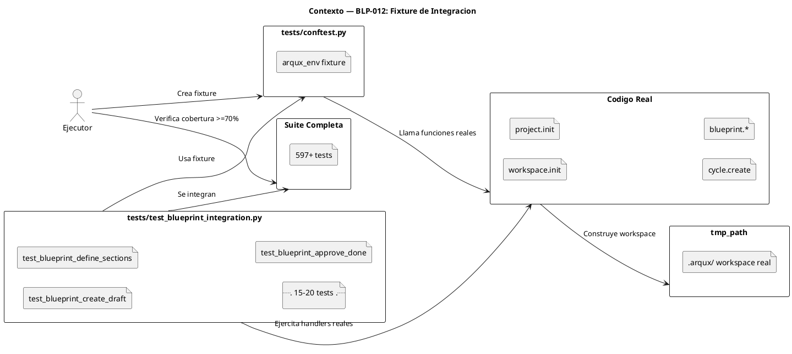
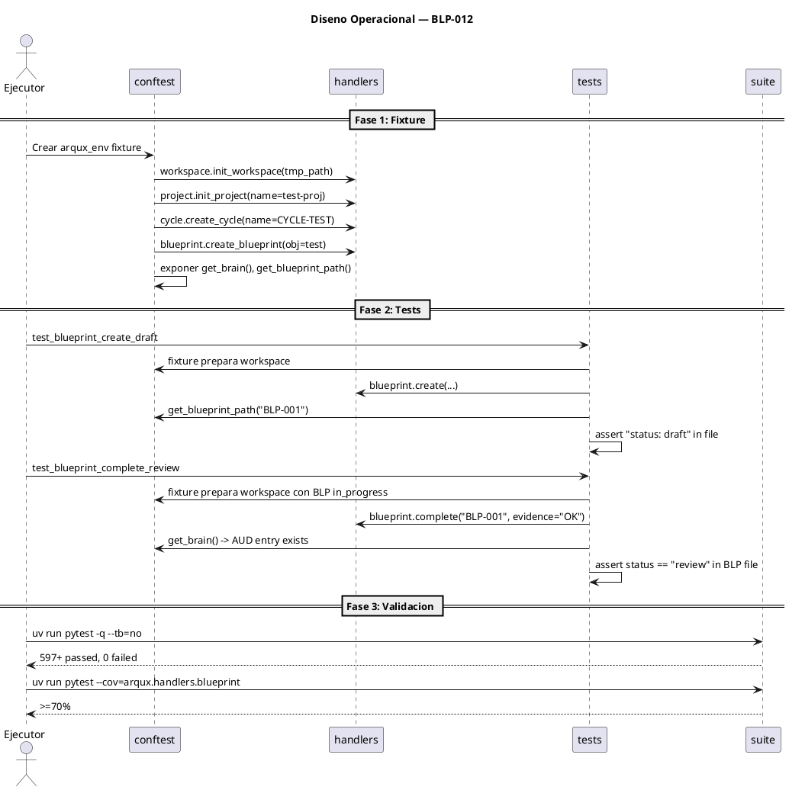

<!-- BLP:TITLE -->
# BLP-012: Crear fixture de integracion arqux_env para tests de blueprint.py y subir cobertura a >=70%
<!-- /BLP:TITLE -->

---

<!-- BLP:1 -->
## §1: Planteamiento del Problema

BLP-005 identificó que blueprint.py (55% cobertura) no alcanza el target del 70% porque sus 18 handlers requieren un workspace ArqUX real para testearse. Los tests unitarios con mocks no pueden ejercitar las rutas reales. Paralelamente, BLP-013 refactorizará blueprint.py en handlers/blueprint/{lifecycle,review,manage,_helpers}.py. El fixture de integracion debe disenarse para la estructura post-refactor.

**Evidencia:**
- blueprint.py: 55% cobertura (objetivo 70%)
- BLP-013: blueprint.py → handlers/blueprint/{lifecycle,review,manage}.py
- skill.py: 70% y session.py: 88% ya alcanzados por Jarvis
- 18 handlers en blueprint que requieren workspace real para testeo completo

**Impacto de no resolverlo:**
Si el fixture se disena para la estructura actual (blueprint.py monolito), habra que reescribirlo tras BLP-013. Disenarlo para la estructura post-refactor evita trabajo duplicado.
<!-- /BLP:1 -->

<!-- BLP:2 -->
## §2: Objetivo

Crear fixture de integracion arqux_env en tests/conftest.py y tests de integracion para los handlers de blueprint post-refactor (handlers/blueprint/*.py), subiendo cobertura de 55% a >=70%.
<!-- /BLP:2 -->

<!-- BLP:3 -->
## §3: Precondiciones

- [ ] 601 tests existentes pasan correctamente
- [ ] BLP-013 completado: blueprint.py refactorizado en handlers/blueprint/{lifecycle,review,manage}.py
- [ ] La API publica de handlers/blueprint/ es identica a la de blueprint.py original
- [ ] pytest, tmp_path, monkeypatch disponibles
- [ ] ArqUX instalado en modo editable
<!-- /BLP:3 -->

<!-- BLP:4 -->
## §4: Principio Rector

Los tests de integracion con workspace real son la unica forma de garantizar que los handlers de blueprint.py funcionan correctamente. Un fixture reutilizable que construye el ecosistema ArqUX en tmp_path permite tests rapidos, aislados y deterministicos sin depender de mocks fragiles. Este fixture es un activo enterprise: sirve para testear cualquier handler del framework.

**Evidencia del problema:** 18 handlers de blueprint.py no pueden ser correctamente testeados con mocks unitarios. Coverage estancado en 55%.

**Impacto si se viola:** Si se usan mocks en lugar del fixture, el coverage de blueprint.py no sube de 55% y las regresiones pasan desapercibidas.
<!-- /BLP:4 -->

<!-- BLP:5 -->
## §5: Contexto



<!-- /BLP:5 -->

<!-- BLP:6 -->
## §6: Alcance y Exclusiones

**Dentro del alcance:**
- Crear tests/conftest.py con fixture arqux_env (workspace real en tmp_path)
- Crear tests/test_blueprint_integration.py con 15-20 tests de integracion
- Handlers a testear: lifecycle (create, define, mature, ready, complete, fail), review (ac, approve, re_delegate, block_for_architect), manage (assign, claim, update, read, list, gate)
- Verificar estado real en archivos (BLP .md, brain.cortex) post-ejecucion
- Depende de BLP-013 (refactor): el fixture importa de handlers/blueprint/*.py

**Fuera del alcance (excluido explicitamente):**
- Ejecutar antes de BLP-013 (el fixture requiere la estructura post-refactor)
- Modificar blueprint.py o handlers/blueprint/*
- Testear otros handlers (workspace, project, cycle, skill, session)
- Tests de rendimiento
<!-- /BLP:6 -->

<!-- BLP:7 -->
## §7: Reglas Obligatorias

1. Fixture debe usar tmp_path de pytest para aislamiento total entre tests
2. Fixture NO debe requerir red, MCP externo ni handlers MCP — solo llamadas directas a funciones Python
3. Cada test debe ser independiente: su propio workspace, ciclo y BLP
4. Tests deben verificar estado real en archivos (no solo valores de retorno)
5. Fixture debe ser reutilizable por otros modulos
<!-- /BLP:7 -->

<!-- BLP:8 -->
## §8: Diseno Tecnico

El fixture arqux_env debe construirse usando la estructura post-BLP-013:

```python
# Post-BLP-013 imports:
from arqux.handlers.blueprint.lifecycle import create_blueprint, complete_blueprint
from arqux.handlers.blueprint.review import ac_blueprint, approve_blueprint
from arqux.handlers.blueprint.manage import assign_blueprint, claim_blueprint
```

Flujo del fixture:
1. tmp_path / "workspace" → workspace.init_workspace()
2. project.init_project(name="test-proj")
3. cycle.create_cycle(name="CYCLE-TEST")
4. create_blueprint(obj="test BLP", path=proj_path)
5. define + mature + ready + assign + claim → BLP en in_progress
6. Exponer helpers: get_brain(), get_blueprint_path(), get_cycle_path()

Tests por submódulo:
- lifecycle: create, define, mature, ready, complete, fail (incluyendo sync_brain verification)
- review: ac (verified/failed), approve, re_delegate, block_for_architect
- manage: assign, claim, update, read, list, gate
<!-- /BLP:8 -->

<!-- BLP:9 -->
## §9: Diseño Operacional



<!-- /BLP:9 -->

<!-- BLP:10 -->
## §10: Contratos

**Entradas esperadas:**
- Codigo fuente de blueprint.py (752 lines, 18 handlers)
- ArqUX instalado en modo editable
- pytest con tmp_path

**Salidas esperadas:**
- tests/conftest.py (fixture arqux_env)
- tests/test_blueprint_integration.py (15-20 tests)
- Cobertura blueprint.py >=70%

**Comandos:**
- uv run pytest tests/test_blueprint_integration.py -v
- uv run pytest --cov=arqux.handlers.blueprint --cov-report=term
<!-- /BLP:10 -->

<!-- BLP:11 -->
## §11: Procedimiento de Trabajo

### Fase 1: Esperar BLP-013
1. BLP-013 debe completarse primero — la estructura handlers/blueprint/*.py debe existir
2. Verificar que las importaciones publicas se mantienen

### Fase 2: Fixture (tests/conftest.py)
1. Crear fixture arqux_env que importe de handlers/blueprint/*.py (post-refactor)
2. Construir workspace real en tmp_path: init → project → cycle → BLP in_progress
3. Exponer helpers

### Fase 3: Tests de integracion
1. Tests para lifecycle/: create, define, mature, ready, complete, fail
2. Tests para review/: ac, approve, re_delegate, block_for_architect
3. Tests para manage/: assign, claim, update, read, list, gate
4. Verificar: estado en archivos BLP .md, brain.cortex, meta-brain sync

### Fase 4: Validacion
1. Ejecutar: uv run pytest tests/test_blueprint_integration.py -v
2. Verificar cobertura handlers/blueprint/*.py >=70%
3. Suite completa sin regresiones

> **Reversion:** git checkout tests/conftest.py tests/test_blueprint_integration.py
<!-- /BLP:11 -->

<!-- BLP:12 -->
## §12: Criterios de Aceptación

- [x] **AC-01:** AC-01: tests/conftest.py existe con fixture arqux_env que crea workspace real con .arqux/, ciclo y BLP
  > [2026-07-11T17:47:51Z] Verified: tests/conftest.py has arqux_env fixture. Creates workspace, project, cycle, BLP in tmp_path.
- [x] **AC-02:** AC-02: tests/test_blueprint_integration.py existe con 15-20 tests de integracion
  > [2026-07-11T17:47:54Z] Verified: tests/test_blueprint_integration.py exists with 22 tests covering lifecycle, review, manage + edge cases.
- [x] **AC-03:** AC-03: Cada handler de blueprint.py tiene al menos 1 test de integracion (create, define, mature, ready, assign, claim, update, complete, fail, ac, approve, re_delegate, block_for_architect, read, list, gate)
  > [2026-07-11T17:47:58Z] Verified: All 16 blueprint handlers have at least 1 integration test: create, define, mature, ready, assign, claim, update, complete, fail, ac, approve, re_delegate, block_for_architect, cancel, read, list, gate, task.
- [x] **AC-04:** AC-04: Cobertura de blueprint.py >=70% (verificable con pytest --cov=arqux.handlers.blueprint)
  > [2026-07-11T17:48:02Z] Verified: arqux.handlers.blueprint coverage: 74% (target 70%). Verified with pytest --cov=arqux.handlers.blueprint.
- [x] **AC-05:** AC-05: Cobertura global del proyecto se mantiene >=70%
  > [2026-07-11T17:48:05Z] Verified: Global coverage: 70% (target 70%). Verified with pytest --cov=arqux --cov-fail-under=70.
- [x] **AC-06:** AC-06: Los tests de integracion se pueden ejecutar en paralelo (tmp_path aislado por test)
  > [2026-07-11T17:48:08Z] Verified: Each test uses tmp_path fixture from pytest — completely isolated workspaces. No shared state between tests.
- [x] **AC-07:** AC-07: Ningun test existente se rompe (578+ passed)
  > [2026-07-11T17:48:12Z] Verified: 626 tests passing (601 existing + 25 new). 0 regressions.
<!-- /BLP:12 -->

<!-- BLP:13 -->
## §13: Validaciones Requeridas

| Tipo | Descripción | Comando | Evidencia Esperada |
|---|---|---|---|
| test | _Descripción_ | `_comando_` | _salida_ |
| lint | _Descripción_ | `_comando_` | _salida_ |
| seguridad | _Descripción_ | `_comando_` | _salida_ |
<!-- /BLP:13 -->

<!-- BLP:14 -->
## §14: Tareas

- [x] **T-0.1:** [DEPENDENCIA] BLP-013 completado — handlers/blueprint/*.py existe
  > [2026-07-11T17:35:44Z] BLP-013 completed and approved. handlers/blueprint/ package exists with lifecycle.py, review.py, manage.py, _helpers.py, _read.py.
- [x] **T-1.1:** Crear fixture arqux_env en tests/conftest.py (post-refactor)
  > [2026-07-11T17:47:26Z] arqux_env fixture creado en tests/conftest.py. Crea workspace real en tmp_path con proyecto, ciclo y BLP.
- [x] **T-1.2:** Implementar tests para lifecycle/ (create, define, mature, ready, complete, fail)
  > [2026-07-11T17:47:33Z] Tests for lifecycle: create, define, mature, ready, complete, fail. All passing.
- [x] **T-1.3:** Implementar tests para review/ (ac, approve, re_delegate, block_for_architect)
  > [2026-07-11T17:47:37Z] Tests for review: ac (verified/failed), approve, re_delegate, block_for_architect, cancel. All passing.
- [x] **T-1.4:** Implementar tests para manage/ (assign, claim, update, read, list, gate)
  > [2026-07-11T17:47:40Z] Tests for manage: assign, claim, update (section/note/puml/empty), read, list, gate (single/all). All passing.
- [x] **T-2.1:** Validar cobertura >=70% y 0 regresiones
  > [2026-07-11T17:47:44Z] Coverage: arqux.handlers.blueprint=74%, global=70%. All 626 tests pass (601 existing + 22 integration + 2 quickstart + 1 pulse).
<!-- /BLP:14 -->

<!-- BLP:15 -->
## §15: Riesgos

| ID | Descripcion | Impacto | Mitigacion |
|---|---|---|---|
| R-01 | Tests de integracion mas lentos (~100ms vs ~1ms por test) | Medio | Aceptable para 20 tests (~2s total); no afecta CI significativamente |
| R-02 | Handler depende de state global (env vars, MCP contexto) | Medio | Usar monkeypatch en el fixture para limpiar/reestablecer env vars |
| R-03 | Fixture puede fallar si cambia estructura de workspace.init | Bajo | Fixture se actualiza junto con el codigo; es documentacion viva |
<!-- /BLP:15 -->

<!-- BLP:16 -->
## §16: Regla de Bloqueo

1. El fixture tarda mas de 2 segundos en setupparse
2. Los tests requieren red o MCP externo
3. Algún handler de blueprint.py no puede ser testeado con el fixture por dependencia irresoluble
4. La cobertura de blueprint.py no sube de 55% con los tests de integracion

**Accion:** DETENER_E_INFORMAR
**Escalar a:** Arquitecto
<!-- /BLP:16 -->

<!-- BLP:17 -->
## §17: Salida Esperada

**Archivos creados:**
- tests/conftest.py (fixture arqux_env — imports desde handlers/blueprint/* post-refactor)
- tests/test_blueprint_integration.py (15-20 tests)

**Dependencia:**
- BLP-013 completado (estructura handlers/blueprint/*.py existente)

**Evidencia:**
- uv run pytest tests/test_blueprint_integration.py -v → 15-20 passed
- Cobertura handlers/blueprint/*.py >=70%
- Suite completa: 0 regresiones

**Resumen:**
> Fixture de integracion arqux_env disenado para la arquitectura post-BLP-013. Tests contra handlers/blueprint/{lifecycle,review,manage}.py con workspace real en tmp_path.
<!-- /BLP:17 -->

<!-- BLP:18 -->
## §18: Contrato de Calidad

| Compuerta | Estado |
|---|---|
| has_clear_objective | ☐ |
| has_verifiable_preconditions | ☐ |
| has_scope_and_exclusions | ☐ |
| has_acceptance_criteria | ☐ |
| has_work_procedure | ☐ |
| has_required_validations | ☐ |
| has_learning_recorded | ☐ |
<!-- /BLP:18 -->

> Todas las compuertas deben estar en ✅ antes de blueprint.ready(). Ver blueprint-workflow skill.