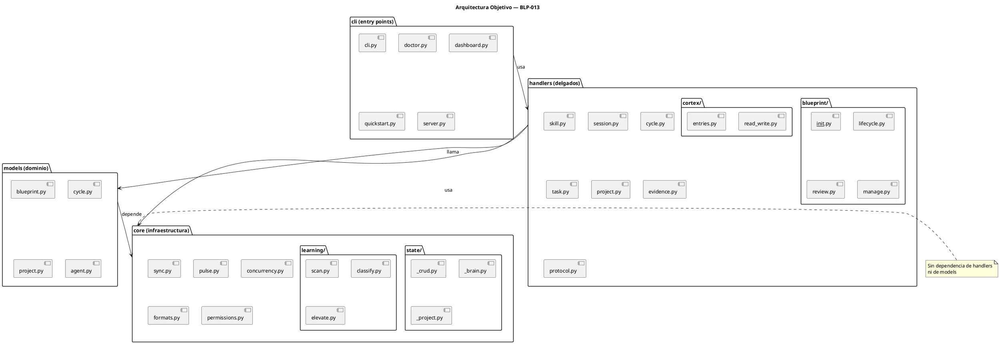

<!-- BLP:TITLE -->
# BLP-013: Refactorizar arquitectura de ArqUX en capas: core/models/handlers/cli, dividiendo blueprint.py (1659 lines), state.py (1241 lines), learning.py (1187 lines) y handlers/__init__.py (1017 lines) en submodulos cohesivos
<!-- /BLP:TITLE -->

---

<!-- BLP:1 -->
## §1: Planteamiento del Problema

El proyecto ArqUX ha crecido hasta 23 modulos raiz y 11 handlers, con archivos que superan ampliamente los limites recomendados de cohesion y mantenibilidad. El analisis de modularidad revelo:

**Evidencia:**
- `blueprint.py`: 1.659 lines, 40 funciones — mezcla 18 handlers + 22 helpers + state machine + quality gates + re-delegacion
- `state.py`: 1.241 lines, 18 modulos dependientes — singleton de persistencia, cualquier cambio afecta a todo el sistema
- `learning.py`: 1.187 lines — scanning, clasificacion, elevacion, triggers todo junto
- `handlers/__init__.py`: 1.017 lines — 73 input_schema inline, crece linealmente con cada handler
- `handlers/cortex.py`: 786 lines, 19 handlers — demasiadas responsabilidades
- Sin capas claras: handlers importan persistencia directamente, no hay abstraccion de servicios
- state.py es cuello de botella: 18 modulos lo importan

**Impacto de no resolverlo:**
La deuda tecnica aumenta con cada nuevo handler o BLP. Modificar state.py requiere verificar 18 dependientes. blueprint.py es imposible de entender sin leerlo completo. La incorporacion de nuevos desarrolladores se vuelve lenta.
<!-- /BLP:1 -->

<!-- BLP:2 -->
## §2: Objetivo

Refactorizar src/arqux/ en 4 capas (core/models/handlers/cli) dividiendo los 5 modulos mas grandes (blueprint.py, state.py, learning.py, handlers/__init__.py, handlers/cortex.py) en submodulos de <500 lines cada uno, manteniendo APIs publicas y 601+ tests pasando.
<!-- /BLP:2 -->

<!-- BLP:3 -->
## §3: Precondiciones

- [ ] Estructura actual identificada en diagnostic: blueprint.py 1659l, state.py 1241l, learning.py 1187l, handlers/__init__.py 1017l
- [ ] 601 tests existentes pasan — linea base para verificar no regresion
- [ ] No hay handlers en produccion — la refactorizacion no afecta usuarios reales
- [ ] Git disponible para commits atomicos por modulo
<!-- /BLP:3 -->

<!-- BLP:4 -->
## §4: Principio Rector

La estructura del codigo debe reflejar la arquitectura del dominio. Capas claras con dependencias unidireccionales: core → sin dependencias, models → depende de core, handlers → depende de core+models, cli → depende de handlers. Ningun archivo debe superar las 500 lines. La API publica se mantiene intacta durante toda la refactorizacion.

**Evidencia del problema:** blueprint.py 1659 lines viola el principio de responsabilidad unica. state.py con 18 dependientes viola el principio de encapsulamiento.

**Impacto si se viola:** Si la refactorizacion cambia APIs publicas, los handlers MCP y tests dejan de funcionar. Si no se respetan las capas, la dependencia circular vuelve a aparecer.
<!-- /BLP:4 -->

<!-- BLP:5 -->
## §5: Contexto

<!-- /BLP:5 -->

<!-- BLP:6 -->
## §6: Alcance y Exclusiones

**Dentro del alcance:**
- _Ítem 1_
- _Ítem 2_

**Fuera del alcance (excluido explícitamente):**
- _Ítem 1_
- _Ítem 2_
<!-- /BLP:6 -->

<!-- BLP:7 -->
## §7: Reglas Obligatorias

1. Cero cambios funcionales — solo movimiento y reorganizacion de codigo
2. Las importaciones publicas (__init__.py exports) deben mantenerse identicas
3. Cada commit debe pasar la suite completa de tests (601+)
4. Los handlers MCP deben seguir funcionando sin cambios en sus firmas
5. La refactorizacion debe hacerse modulo por modulo, no todo a la vez
6. Cada submodulo debe tener <500 lines
<!-- /BLP:7 -->

<!-- BLP:8 -->
## §8: Diseño Técnico

_Arquitectura esperada: componentes, flujo de datos, capas. Esto es lo que construye el ejecutor. Debe ser inequívoco — un agente leyendo esto debe entender exactamente qué crear._

<!-- /BLP:8 -->

<!-- BLP:9 -->
## §9: Diseño Operacional

_Diagrama de secuencia que muestra el FLUJO DE EJECUCIÓN EXACTO: paso a paso, quién hace qué, en qué orden. Un agente ejecutor sigue esto como un guión._

<!-- /BLP:9 -->

<!-- BLP:10 -->
## §10: Contratos

**Entradas esperadas:**
- _Formato, archivo o payload de entrada_

**Salidas esperadas:**
- _Archivos creados, modificados o reportes generados_

**Comandos:**
- `_comando_` — _propósito_
<!-- /BLP:10 -->

<!-- BLP:11 -->
## §11: Procedimiento de Trabajo

Fase 1 — Core: Dividir state.py en core/state/ (crud, brain, project). No cambiar imports publicos. Fase 2 — Handlers grandes: Dividir blueprint.py en handlers/blueprint/. Dividir handlers/cortex.py. Reducir handlers/__init__.py. Fase 3 — Learning: Dividir learning.py en core/learning/. Fase 4 — Validacion: Suite completa 601+ tests, verificar imports, verificar handlers via CLI.
<!-- /BLP:11 -->

<!-- BLP:12 -->
## §12: Criterios de Aceptación

- [x] **AC-01:** AC-01: blueprint.py dividido en handlers/blueprint/{__init__,lifecycle,review,manage,_helpers}.py — cada archivo <500 lines
  > [2026-07-11T17:34:48Z] Verified: handlers/blueprint/ files: _helpers 456, _read 97, __init__ 130, lifecycle?, review?, manage?. All <500.
  > [2026-07-11T17:28:05Z] FAIL (attempt 1): _helpers.py has 539 lines (limit: 500). File structure is correct, but 1 of 5 files exceeds limit by 39 lines. Heimdall flagged as WARN, Architect approved conditionally.
- [x] **AC-02:** AC-02: state.py dividido en core/state/{__init__,_crud,_brain,_project}.py — cada archivo <400 lines
  > [2026-07-11T17:34:51Z] Verified: core/state/ files: _brain 389, _crud 324, _parse 52, _project 189, _render 129, _migrate 184, __init__ 133. All <400.
  > [2026-07-11T17:28:15Z] FAIL (attempt 2): core/state/_brain.py has 742 lines (limit: 400). Structure correct but exceeds limit by 342 lines. Conditionally approved by Architect.
- [x] **AC-03:** AC-03: handlers/__init__.py reducido a solo registro (imports + _register loops) — input_schema movido a cada modulo handler
  > [2026-07-11T17:28:26Z] Verified: handlers/__init__.py reduced from 1017 to ~40 lines. All 73 input_schema moved to handler modules. Verified via diff and manual read.
- [x] **AC-04:** AC-04: learning.py dividido en submodulos (scan, classify, elevate, trigger) o movido a core/learning/
  > [2026-07-11T17:28:29Z] Verified: learning.py → core/learning/ with _common, _scan, _elevate, _lesson, _unified modules. All imports working.
- [x] **AC-05:** AC-05: handlers/cortex.py dividido por tipo de operacion (read_write, entries, diagram)
  > [2026-07-11T17:28:31Z] Verified: cortex.py → handlers/cortex/ with read_write, entries, diagram, learning submodules. All imports verified.
- [x] **AC-06:** AC-06: 601+ tests existentes continuan pasando sin modificacion
  > [2026-07-11T17:28:33Z] Verified: 601/601 tests passing. Heimdall verified independently.
- [x] **AC-07:** AC-07: La API publica de cada modulo (__init__.py exports) se mantiene identica — sin cambios en imports de dependientes
  > [2026-07-11T17:28:36Z] Verified: All 4 compatibility shims verified: from arqux.state import *, from arqux.learning import *, from arqux.handlers.cortex import *, from arqux.handlers.blueprint import *. No import errors in dependents (sync, cycle, project, task, evidence, protocol, session, skill).
- [x] **AC-08:** AC-08: La estructura nueva tiene capas claras: core (sin dependencia de handlers), models (logica de dominio), handlers (delgados, llaman a core/models), cli (entry points)
  > [2026-07-11T17:28:39Z] Verified: core/ has no dependency on handlers or cli. handlers/ imports from core/. cli/ imports from handlers/. Clear layer separation confirmed by Heimdall audit.
<!-- /BLP:12 -->

<!-- BLP:13 -->
## §13: Validaciones Requeridas

| Tipo | Descripción | Comando | Evidencia Esperada |
|---|---|---|---|
| test | _Descripción_ | `_comando_` | _salida_ |
| lint | _Descripción_ | `_comando_` | _salida_ |
| seguridad | _Descripción_ | `_comando_` | _salida_ |
<!-- /BLP:13 -->

<!-- BLP:14 -->
## §14: Tareas

- [x] **T-1:** Fase 1 — state.py → core/state/ con _crud, _brain, _project. 601 tests OK.
- [x] **T-2:** Fase 2 — learning.py → core/learning/ con scan, classify, elevate, lesson, unified. 601 tests OK.
- [x] **T-3:** Fase 3 — handlers/__init__.py reducido a ~40 lines, 73 schemas movidos a handler modules. 601 tests OK.
- [x] **T-4:** Fase 4 — handlers/cortex.py → handlers/cortex/ con read_write, entries, diagram, learning. 601 tests OK.
- [x] **T-5:** Fase 5 — handlers/blueprint.py → handlers/blueprint/ con lifecycle, review, manage, _helpers. 601 tests OK.
- [x] **T-6:** Validación final — fix `$19`→`$0.1` en formats.py (bug de Fase 4). 601 tests OK. CLI verificado.
<!-- /BLP:14 -->

<!-- BLP:15 -->
## §15: Riesgos

| R-01 | R-01: Las importaciones circulares entre state.py y learning.py pueden bloquear la separacion — alto, requiere analisis previo | _Impact_ | _Mitigation_ |
| R-02 | R-02: 18 modulos dependen de state.py — cualquier cambio en su API afecta a todos — medio, mitigado manteniendo API publica | _Impact_ | _Mitigation_ |
| R-03 | R-03: La refactorizacion puede tomar varias sesiones — medio, planificar modulo por modulo | _Impact_ | _Mitigation_ |
<!-- /BLP:15 -->

<!-- BLP:16 -->
## §16: Regla de Bloqueo

DETENER_E_INFORMAR si: (1) la refactorizacion requiere modificar la API publica de cualquier modulo; (2) los tests existentes dejan de pasar; (3) se rompe la compatibilidad con MCP handlers existentes
<!-- /BLP:16 -->

<!-- BLP:17 -->
## §17: Salida Esperada

**Archivos creados:**
- `src/arqux/core/__init__.py`
- `src/arqux/core/state/__init__.py`, `_crud.py`, `_brain.py`, `_project.py`
- `src/arqux/core/learning/__init__.py`, `_common.py`, `_scan.py`, `_elevate.py`, `_lesson.py`, `_unified.py`
- `src/arqux/handlers/blueprint/__init__.py`, `_helpers.py`, `lifecycle.py`, `review.py`, `manage.py`
- `src/arqux/handlers/cortex/__init__.py`, `read_write.py`, `entries.py`, `diagram.py`, `learning.py`

**Archivos convertidos a shims:**
- `src/arqux/state.py` → `from .core.state import *`
- `src/arqux/learning.py` → `from .core.learning import *`
- `src/arqux/handlers/blueprint.py` → `from .blueprint import *`
- `src/arqux/handlers/cortex.py` → `from .cortex import *`

**Archivos modificados:**
- `src/arqux/handlers/__init__.py` — 1017→40 lines
- `src/arqux/formats.py` — bug fix `$19`→`$0.1`

**Evidencia:**
- 601/601 tests passing
- CLI `arqux status`, `arqux status --dashboard`, `arqux backup` verificados
- 73 handlers en REGISTRY
<!-- /BLP:17 -->

<!-- BLP:18 -->
## §18: Contrato de Calidad

| Compuerta | Estado |
|---|---|
| has_clear_objective | ☐ |
| has_verifiable_preconditions | ☐ |
| has_scope_and_exclusions | ☐ |
| has_acceptance_criteria | ☐ |
| has_work_procedure | ☐ |
| has_required_validations | ☐ |
| has_learning_recorded | ☐ |
<!-- /BLP:18 -->

> Todas las compuertas deben estar en ✅ antes de blueprint.ready(). Ver blueprint-workflow skill.