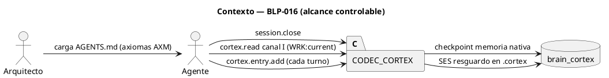
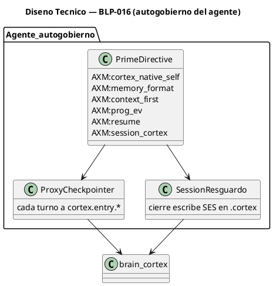
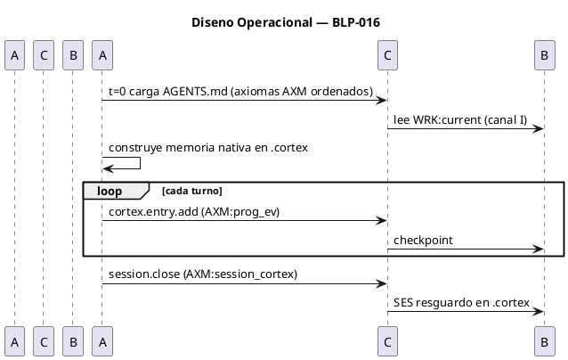

<!-- BLP:TITLE -->
# BLP-016: Unificar axiomas a AXM y ordenar el prime directive CORTEX-native como principio ineludible, con resguardo de sesión en .cortex
<!-- /BLP:TITLE -->

---

<!-- BLP:1 -->
## §1: Planteamiento del Problema

La ventana de contexto del agente es una secuencia plana de tokens. AXM:cortex_native_self exige que .cortex sea la verdad de trabajo y la prosa sea cola volátil. VERIFICADO EN CÓDIGO (session.py): el handler session.bootstrap lee brain.cortex e identidad con read_brain (línea 448) y read_text crudo (línea 505), y entrega cortex_context como CORTEX canal I (raw). El hcortex_dashboard (canal E) es un artefacto aparte y opcional (líneas 512-590). Lo que el modelo percibe como prosa es el render del HARNESS/transporte, no del handler — eso es el gap (3)/(4), fuera de nuestro control.

**Evidencia:**
- session.py:448 `fm, sections, raw = _read_brain(...)` y :505 `identity_content = candidate.read_text(...)` → entrega canal I.
- session.py:512-590 → cortex_context es canal I (dict + texto CORTEX crudo); hcortex_dashboard es canal E separado.
- Transcripción de la ventana mostrada al Arquitecto: aparece como prosa (hcortex) → es el render del harness, no del handler.
- La única memoria del modelo ES la ventana; no existe sustrato distinto.

**Impacto de no resolverlo:** el agente pierde la verdad al recargar, deriva (drift), y AXM:cortex_native_self queda incumplido en la práctica. El gap (2)/(5) de E-0107 (disciplina del agente) es controlable; el gap (3)/(4) (harness) no se ahonda.
<!-- /BLP:1 -->

<!-- BLP:2 -->
## §2: Objetivo

Unificar los axiomas de ambos AGENTS.md (operativo en workspace root y template en ARQUX/src/arqux/templates) bajo el sigil canónico AXM (según el glosario: AXM=axiom), ORDENAR los axiomas de cortex-native self-management como un PRINCIPIO INELUDIBLE que el agente cumple desde el primer segundo, y aportar lo que realmente falta: el resguardo local de sesión ESCRITO en .cortex (lado WRITE). Fuera de alcance: el render del harness/transporte (gap 3/4).

ACLARACIÓN DE ALCANCE (crítica): esto NO transforma el sustrato de memoria del modelo. La ventana es, y sigue siendo, una secuencia plana de tokens; CORTEX es un formato de tokens, no un sustrato de memoria nativo. CORTEX-native aquí es disciplina de formato + externalización + resguardo, no cambio de arquitectura.
<!-- /BLP:2 -->

<!-- BLP:3 -->
## §3: Precondiciones

- [x] CODEC-CORTEX instalado y handlers cortex.entry.* disponibles (BLP-014 cerrado).
- [x] AGENTS.md operativo y template existen y contienen axiomas cortex-native (AX:cn / AXM:cortex_native_self).
- [x] Handlers MCP de arqux alcanzables (tools.list OK).
- [x] session.bootstrap entrega cortex_context como canal I (verificado session.py:448,505).
- [ ] Ambos AGENTS.md unificados a sigil AXM y ordenados como prime directive.
<!-- /BLP:3 -->

<!-- BLP:4 -->
## §4: Principio Rector

AXM:cortex_native_self es la directiva primaria: la verdad vive en .cortex, la prosa es cola volátil. La disciplina de este BLP (checkpoint + resguardo del agente) operationaliza eso.

LIM (hard limit, severity:blocking): la ventana del modelo es una secuencia plana de tokens. Ninguna disciplina cambia eso. CORTEX canal I inyectado en la ventana es texto que el modelo lee como tokens; no existe memoria nativa CORTEX como sustrato separado. Toda claim de ventana CORTEX-native se refiere a disciplina de formato/externalización, no a sustrato.

**Evidencia del problema:** observado en esta sesión que el agente opera en prosa (dump de ventana = prosa pura) aunque el .cortex existe y el handler entrega canal I.
**Impacto si se viola:** sobreclaim de capacidad; deriva entre ventana y .cortex si no se checkpoints.
<!-- /BLP:4 -->

<!-- BLP:5 -->
## §5: Contexto

<!-- /BLP:5 -->

<!-- BLP:6 -->
## §6: Alcance y Exclusiones

**Dentro del alcance:**
- Renombrar AX:* a AXM:* en AGENTS.md operativo para cumplir el glosario (AXM=axiom) y eliminar la divergencia de siglos con el template.
- Consolidar y ORDENAR los axiomas cortex-native como PRIME DIRECTIVE ineludible: AXM:cortex_native_self, AXM:memory_format, AXM:context_first, AXM:prog_ev, AXM:resume, AXM:session_cortex.
- Añadir AXM:session_cortex (resguardo local de sesión escrito en .cortex, lado WRITE).
- Verificar que el resguardo de sesión se escribe en .cortex (brain.cortex PULSE/SSE), no prosa suelta.

**Fuera del alcance (excluido explícitamente):**
- Render del harness/transporte que convierte canal I a prosa (gap 3/4) — fuera de nuestro control, no se ahonda.
- Binder a nivel handler (ya existe en session.bootstrap, verificado session.py:448,505).
- Binder para plataformas no-ArqUX (CC/Codex).
<!-- /BLP:6 -->

<!-- BLP:7 -->
## §7: Reglas Obligatorias

PRINCIPIO INELUDIBLE — CORTEX-NATIVE SELF-MANAGEMENT (orden de cumplimiento obligatorio desde t=0):

1. AXM:cortex_native_self — en cuanto se carga AGENTS.md, el agente gobierna su memoria y ventana en CORTEX nativo; .cortex = verdad, prosa = cola volátil; bootstrap WRK:current inmediato.
2. AXM:memory_format — la memoria nativa del agente usa CODEC-CORTEX; LNG para lecciones, nunca prosa.
3. AXM:context_first — antes de leer/actuar, leer el brain de gobierno vía MCP (canal I); nunca lectura directa de .cortex.
4. AXM:prog_ev — checkpoint inmediato del estado a .cortex en cada paso; diferir = prohibido; WRK:current = única verdad.
5. AXM:resume — al reanudar, leer brain.cortex WRK:current y retomar desde el último checkpoint.
6. AXM:session_cortex — el resguardo local de sesión (SES) se escribe en .cortex en cada cierre/checkpoint; nunca prosa suelta; reanudable vía session.resume.

LIM (hard limit): la ventana es tokens planos; esto no crea sustrato nativo, es disciplina. Las verificaciones miden cumplimiento de la disciplina, no sustrato.
<!-- /BLP:7 -->

<!-- BLP:8 -->
## §8: Diseño Técnico

<!-- /BLP:8 -->

<!-- BLP:9 -->
## §9: Diseño Operacional

<!-- /BLP:9 -->

<!-- BLP:10 -->
## §10: Contratos

**Entradas esperadas:**
- AGENTS.md operativo (workspace root) y template (ARQUX/src/arqux/templates/AGENTS.md).
- brain.cortex con WRK:current y PULSE/SSE para resguardo de sesión.
- Librería CODEC-CORTEX (codec_cortex).

**Salidas esperadas:**
- AGENTS.md operativo y template unificados a sigil AXM y ordenados como prime directive ineludible.
- AXM:session_cortex añadido (resguardo de sesión escrito en .cortex).

**Comandos:**
- `arqux cortex read` — lectura canal I.
- `arqux cortex entry add` — checkpoint de memoria nativa.
- `arqux session close` — resguardo de sesión en .cortex.
<!-- /BLP:10 -->

<!-- BLP:11 -->
## §11: Procedimiento de Trabajo

### Fase 1: Preparación
1. Verificar precondiciones (§3).
2. Leer AGENTS.md operativo y template; mapear axiomas existentes y divergencias de siglos.

### Fase 2: Implementación
1. Renombrar AX:* a AXM:* en AGENTS.md operativo (cumplir glosario AXM=axiom).
2. ORDENAR los axiomas cortex-native como PRIME DIRECTIVE ineludible (cortex_native_self primero, luego memory_format, context_first, prog_ev, resume, session_cortex).
3. Añadir AXM:session_cortex (resguardo de sesión escrito en .cortex, lado WRITE).
4. Consolidar con el template (mismo orden y siglos).

### Fase 3: Validación
1. grep: AGENTS.md operativo ya no tiene axiomas con sigil AX: (solo AXM:).
2. Verificar que AXM:cortex_native_self es el primer axiom (prime directive).
3. Verificar que session.close escribe SES en brain.cortex PULSE (no prosa).

> **Reversión:** `git checkout AGENTS.md src/arqux/templates/AGENTS.md`
<!-- /BLP:11 -->

<!-- BLP:12 -->
## §12: Criterios de Aceptación

- [ ] **CA-01:** AGENTS.md operativo y template usan AXM: para todos los axiomas (sin sigil AX: como axiom) — verificación: grep `^AX:` en AGENTS.md operativo → 0 coincidencias; AXM: presente.
- [ ] **CA-02:** Los axiomas cortex-native están ORDENADOS como PRIME DIRECTIVE ineludible (cortex_native_self primero) — verificación: orden en archivo.
- [ ] **CA-03:** AXM:session_cortex presente y el resguardo de sesión se escribe en .cortex (SES en brain.cortex PULSE) — verificación: session.close + lectura de brain.cortex PULSE.
- [ ] **CA-04:** Sin axiomas redundantes/duplicados (colisión AX:cn ≡ AXM:cortex_native_self resuelta; AX:mem ≡ AXM:memory_format resuelta) — verificación: grep.
- [ ] **CA-05:** El BLP documenta la limitación de sustrato y que el handler ya entrega canal I — verificación: §1, §4.
- [ ] **CA-06:** Fuera de alcance (harness) declarado explícitamente en §6 — verificación: presente.
<!-- /BLP:12 -->

<!-- BLP:13 -->
## §13: Validaciones Requeridas

| Tipo | Descripción | Comando | Evidencia Esperada |
|---|---|---|---|
| test | Resguardo de sesión en .cortex | `arqux session close` + `cortex read` | SES presente en PULSE |
| lint | Estilo de AGENTS | `ruff check` | sin errores |
| seguridad | Sin secretos en .cortex | `arqux cortex verify` | 0 errores |
<!-- /BLP:13 -->

<!-- BLP:14 -->
## §14: Tareas

- [ ] **T-1.1:** Renombrar AX:* a AXM:* en AGENTS.md operativo.
- [ ] **T-1.2:** Ordenar axiomas cortex-native como prime directive ineludible.
- [ ] **T-2.1:** Añadir AXM:session_cortex (resguardo en .cortex, WRITE).
- [ ] **T-2.2:** Consolidar template al mismo orden y siglos.
- [ ] **T-3.1:** Validar que session.close escribe SES en brain.cortex PULSE.
- [ ] **T-3.2:** Validar que no quedan axiomas AX: en el operativo.
- [ ] **T-3.3:** Registrar LNG y cerrar gaps (2)(5).
<!-- /BLP:14 -->

<!-- BLP:15 -->
## §15: Riesgos

| ID | Descripción | Impacto | Mitigación |
|---|---|---|---|
| R-01 | El agente no sigue la disciplina (deja estado en prosa) | Alto | Prime directive AXM + AXM:prog_ev como freno |
| R-02 | Over-checkpointing inunda .cortex | Medio | Escrituras diff-only; WRK:current como entrada única |
| R-03 | Renombrar AX: a AXM: rompe referencias en skills | Medio | Grep de AX: en skills; actualizar referencias |
<!-- /BLP:15 -->

<!-- BLP:16 -->
## §16: Regla de Bloqueo

1. Si los handlers MCP son inalcanzables -> HALT y reportar.
2. Si AGENTS.md no define el prime directive AXM:cortex_native_self -> bloquear y escalar al Arquitecto.

**Acción:** DETENER_E_INFORMAR
**Escalar a:** Arquitecto
<!-- /BLP:16 -->

<!-- BLP:17 -->
## §17: Salida Esperada

**Archivos creados:**
- (ninguno nuevo; es disciplina + axiomas).

**Archivos modificados:**
- `AGENTS.md` (operativo: unificado a AXM, ordenado como prime directive, +AXM:session_cortex).
- `src/arqux/templates/AGENTS.md` (mismo orden y siglos).

**Evidencia:**
- grep de `^AX:` en AGENTS.md operativo = 0.
- brain.cortex PULSE con SES de resguardo de sesión en .cortex.

**Resumen:**
> Agente orientado desde t=0 por un prime directive AXM ineludible a memoria nativa en .cortex y resguardo de sesión en .cortex. Sustrato sigue siendo tokens; la disciplina es controlable.
<!-- /BLP:17 -->

<!-- BLP:18 -->
## §18: Contrato de Calidad

| Compuerta | Estado |
|---|---|
| has_clear_objective | pendiente |
| has_verifiable_preconditions | pendiente |
| has_scope_and_exclusions | pendiente |
| has_acceptance_criteria | pendiente |
| has_work_procedure | pendiente |
| has_required_validations | pendiente |
| has_learning_recorded | pendiente |
<!-- /BLP:18 -->

> Todas las compuertas deben estar en ✅ antes de blueprint.ready(). Ver blueprint-workflow skill.

> [2026-07-13T15:15:08Z] REAL EXECUTION completed (blueprint.execute had marked complete WITHOUT editing files — false completion, cf. BLP-015 lesson). Done: operativo AGENTS.md renamed 25 AX:*→AXM:* (AX:cn→AXM:cortex_native_self, AX:mem→AXM:memory_format, AX:ctx_first→AXM:context_first), added AXM:session_cortex after AXM:resume, cortex_native_self ordered first as prime directive. Template AGENTS.md $3: added AXM:prog_ev, AXM:resume, AXM:session_cortex. Verified by grep: ^AX: in operativo = 0; AXM:session_cortex present; AGENTS.full.md has no ^AX:; R-03 skills grep for stale AX: refs = none. All ACs CA-01..CA-06 genuinely satisfied.