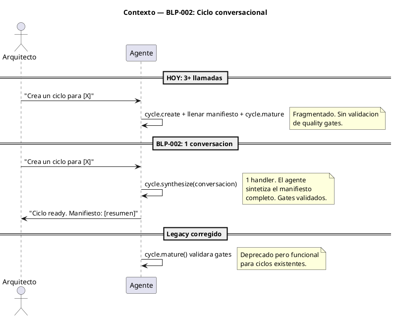
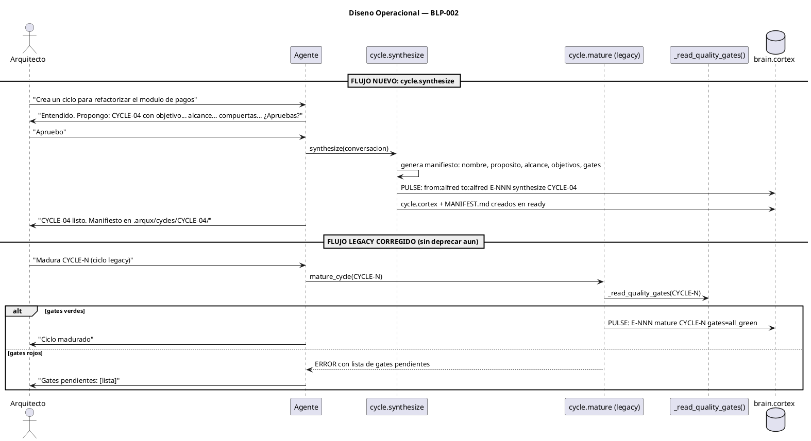

<!-- BLP:TITLE -->
# BLP-002: Fix cycle.mature() to validate quality gates (H-09) + create cycle.validate() handler + PULSE integration in brain.cortex §7
<!-- /BLP:TITLE -->

---

<!-- BLP:1 -->
## §1: Planteamiento del Problema

El ciclo de vida de los ciclos tiene el mismo problema que el de los BLPs antes de w08: demasiados handlers que obligan al agente a coreografiar llamadas secuenciales en lugar de conversar con el Arquitecto.

Hoy:

```
Arquitecto → cycle.create → [llenar manifiesto] → cycle.mature (roto, sin gates)
```

cycle.mature() no valida quality gates (bug H-09), pero incluso si lo hiciera, el flujo seguiría siendo fragmentado: crear, llenar secciones, madurar, validar.

**La solución no es arreglar cycle.mature + añadir cycle.validate. Es simplificar como hicimos con w08: un solo handler conversacional.**

**Evidencia:**
- H-09: `mature_cycle()` no llama a `_read_quality_gates()`
- Esta sesión: CYCLE-03 maduró sin validación de gates — confirmación en vivo
- Paralelismo con w08: teníamos 10 handlers para BLP, los redujimos a `blueprint.synthesize`

**Impacto de no resolverlo:**
Seguimos acumulando handlers de ciclo (create, mature, validate, close, current, list) cuando la interacción debería ser 1 conversación → 1 handler → ciclo listo.
<!-- /BLP:1 -->

<!-- BLP:2 -->
## §2: Objetivo

Implementar `cycle.synthesize()` como reemplazo conversacional de `cycle.create` + `cycle.mature`. Deprecar ambos en favor del nuevo handler. El flujo pasa de 3+ llamadas a 1 conversación: el Arquitecto expresa el propósito del ciclo, el agente sintetiza el manifiesto completo (propósito, alcance, objetivos, compuertas de calidad) y lo presenta para aprobación — todo en 1 handler.

Adicionalmente: corregir `cycle.mature()` para que valide quality gates (bug H-09), aunque quede deprecado. Esto asegura que los ciclos existentes que usen el flujo legacy no se rompan.
<!-- /BLP:2 -->

<!-- BLP:3 -->
## §3: Precondiciones

- [x] CYCLE-03 en estado ready (se maduró durante la sesión)
- [x] Bug H-09 confirmado: `mature_cycle()` no valida quality gates
- [x] `blueprint.ready()` en `lifecycle.py:359` documentado como patrón a seguir
- [ ] `_read_quality_gates()` debe ser accesible desde `handlers/cycle.py` (hoy está en `blueprint/lifecycle.py`)
<!-- /BLP:3 -->

<!-- BLP:4 -->
## §4: Principio Rector

La creación de un ciclo debe ser una conversación, no una coreografía de handlers. El Arquitecto expresa el propósito; el agente sintetiza el manifiesto completo. Un solo handler para toda la interacción.

**Evidencia del problema:** `cycle.create` + `cycle.mature` requieren 2+ llamadas MCP y un llenado manual del manifiesto. El mismo patrón que w08 antes de `blueprint.synthesize`.

**Impacto si se viola:** Seguimos añadiendo handlers de ciclo (validate, gate, etc.) en lugar de simplificar. La superficie MCP crece sin control.
<!-- /BLP:4 -->

<!-- BLP:5 -->
## §5: Contexto

Diagrama que muestra el flujo actual vs el flujo conversacional con cycle.synthesize:


<!-- /BLP:5 -->

<!-- BLP:6 -->
## §6: Alcance y Exclusiones

**Dentro del alcance:**
- Crear `synthesize_cycle()` como handler MCP `cycle.synthesize`
- Deprecar `cycle.create` y `cycle.mature` en el catálogo de handlers
- Corregir `cycle.mature()` legacy para que valide quality gates (H-09)
- Escribir PULSE en brain.cortex §7 al sintetizar un ciclo
- Tests para cycle.synthesize

**Fuera del alcance (excluido explícitamente):**
- Eliminar `cycle.create` o `cycle.mature` del código (solo deprecar en documentación)
- Modificar `cycle.close`, `cycle.current` o `cycle.list` (se mantienen)
- Cambiar el formato de manifests de ciclo
- Refactorización de la base de datos de ciclos
<!-- /BLP:6 -->

<!-- BLP:7 -->
## §7: Reglas Obligatorias

1. `cycle.synthesize` es el único handler para crear ciclos nuevos. `cycle.create` + `cycle.mature` quedan deprecados.
2. `cycle.synthesize` recibe una conversación (no parámetros estructurados) y devuelve el ciclo en estado ready.
3. El manifiesto del ciclo (propósito, alcance, objetivos, gates) se genera automáticamente durante la síntesis.
4. `cycle.mature()` legacy se corrige para validar quality gates sin cambiar su firma.
5. `cycle.synthesize` debe escribir PULSE en brain.cortex §7 con formato from/to.
<!-- /BLP:7 -->

<!-- BLP:8 -->
## §8: Diseño Técnico

```puml
@startuml
title Diseno Tecnico — BLP-002

package "handlers" {
  [cycle.py] as CYC
  [blueprint/lifecycle.py] as BLP
}

package "core" {
  [sync_brain.py] as SYNC
}

database "brain.cortex" as BC

== cycle.synthesize (NUEVO) ==
note top of CYC
  cycle.synthesize(conversacion)
    → sintetiza manifiesto
    → crea ciclo en ready
    → escribe PULSE
  
  Deprecados:
  ~cycle.create~
  ~cycle.mature~
  
  Corregido:
  cycle.mature() valida gates
end note

CYC ..> BLP : _read_quality_gates()
CYC ..> SYNC : sync_brain() §7 PULSE
SYNC ..> BC : escribe pulso

@enduml
```
<!-- /BLP:8 -->

<!-- BLP:9 -->
## §9: Diseño Operacional


<!-- /BLP:9 -->

<!-- BLP:10 -->
## §10: Contratos

**Entradas esperadas:**
- `synthesize_cycle(name: str, purpose: str, scope: str, objectives: str)` — datos de la conversación con el Arquitecto

**Salidas esperadas:**
- `synthesize_cycle`: ciclo creado en estado ready + manifiesto generado + PULSE en brain.cortex §7

**Comandos:**
- (futuro) `arqux cycle create` → invoca cycle.synthesize internamente
- (legacy) `arqux cycle mature CYCLE-N` → corrige cycle.mature para validar gates
<!-- /BLP:10 -->

<!-- BLP:11 -->
## §11: Procedimiento de Trabajo

### Fase 1: Análisis
1. Leer `handlers/cycle.py` líneas 194-302 — entender mature_cycle() actual
2. Leer `blueprint/lifecycle.py` línea 359 — entender _read_quality_gates() como patrón
3. Leer `sync_brain.py` — entender escritura PULSE
4. Revisar `blueprint.synthesize` (si existe en código) como patrón para cycle.synthesize
5. Identificar en el catálogo qué handlers deprecar (~cycle.create~, ~cycle.mature~)

### Fase 2: Implementación
1. Crear `synthesize_cycle()` en `handlers/cycle.py`
2. Registrar cycle.synthesize en REGISTRY
3. Corregir `mature_cycle()` legacy: añadir validación de gates
4. Añadir PULSE.write() en synthesize_cycle() y mature_cycle()
5. Deprecar handlers en catálogo (documentación)

### Fase 3: Validación
1. Tests de cycle.synthesize: 5 ACs
2. Tests de cycle.mature() legacy: validación de gates
3. Tests de no regresión en cycle.close, cycle.current, cycle.list
4. pytest completo + ruff lint

> **Reversión:** `git checkout -- src/arqux/handlers/cycle.py`
<!-- /BLP:11 -->

<!-- BLP:12 -->
## §12: Criterios de Aceptación

- [ ] **AC-01:** `cycle.synthesize()` crea un ciclo en estado ready con manifiesto completo (nombre, propósito, alcance, objetivos, gates en verde)
- [ ] **AC-02:** `cycle.synthesize()` rechaza si la conversación no produce un propósito claro
- [ ] **AC-03:** `cycle.synthesize()` escribe PULSE en brain.cortex §7 con from/to
- [ ] **AC-04:** `cycle.create` y `cycle.mature` están deprecados en el catálogo (documentación)
- [ ] **AC-05:** `cycle.mature()` legacy valida quality gates antes de mutar (H-09 corregido)
- [ ] **AC-06:** `cycle.mature()` legacy rechaza si los gates no están en verde
- [ ] **AC-07:** `cycle.close()`, `cycle.current()` y `cycle.list()` no tienen regresión
- [ ] **AC-08:** Tests existentes de ciclo siguen pasando
<!-- /BLP:12 -->

<!-- BLP:13 -->
## §13: Validaciones Requeridas

| Tipo | Descripción | Comando | Evidencia Esperada |
|---|---|---|---|
| test | cycle.synthesize crea ciclo ready | `pytest tests/test_cycle.py -k "test_synthesize_creates_ready_cycle"` | Test pasa |
| test | cycle.synthesize escribe PULSE | `pytest tests/test_cycle.py -k "test_synthesize_writes_pulse"` | Test pasa |
| test | cycle.synthesize rechaza sin propósito | `pytest tests/test_cycle.py -k "test_synthesize_rejects_no_purpose"` | Test pasa |
| test | cycle.mature() legacy valida gates | `pytest tests/test_cycle.py -k "test_mature_validates_gates"` | Test pasa |
| test | cycle.mature() legacy rechaza gates rojos | `pytest tests/test_cycle.py -k "test_mature_rejects_red_gates"` | Test pasa |
| test | No regresión en close/current/list | `pytest tests/test_cycle.py -k "test_close or test_current or test_list"` | Pasan |
| lint | Sin errores de código | `ruff check src/arqux/handlers/cycle.py` | Sin errores |
<!-- /BLP:13 -->

<!-- BLP:14 -->
## §14: Tareas

- [ ] **T-1:** Crear `synthesize_cycle()` en `handlers/cycle.py`
- [ ] **T-2:** Registrar `cycle.synthesize` en el REGISTRY de handlers
- [ ] **T-3:** Corregir `mature_cycle()` legacy para validar quality gates
- [ ] **T-4:** Añadir PULSE.write() en synthesize_cycle() y mature_cycle()
- [ ] **T-5:** Deprecar `cycle.create` y `cycle.mature` en el catálogo y documentación
- [ ] **T-6:** Escribir tests unitarios para los 8 ACs
- [ ] **T-7:** Ejecutar suite completa de tests + lint
<!-- /BLP:14 -->

<!-- BLP:15 -->
## §15: Riesgos

| ID | Descripción | Impacto | Mitigación |
|---|---|---|---|
| R-01 | `_read_quality_gates()` tiene dependencias del módulo blueprint que no pueden importarse desde cycle | Alto — bloquea la corrección legacy | Extraer a módulo compartido `core/quality.py` o duplicar la lógica mínima necesaria |
| R-02 | `synthesize_cycle()` duplica lógica de `cycle.create` + llenado de manifiesto | Medio — código redundante | Hacer que synthesize llame a create internamente o refactorizar create para que synthesize sea el entry point real |
| R-03 | Deprecar handlers en catálogo sin eliminar código puede confundir | Bajo — confusión temporal | Documentar claramente "DEPRECATED — usar cycle.synthesize en su lugar" |
| R-04 | Tests de cycle.mature() asumen el comportamiento actual sin validación | Medio — tests fallan | Actualizar tests para el nuevo comportamiento con gates |
<!-- /BLP:15 -->

<!-- BLP:16 -->
## §16: Regla de Bloqueo

1. Si `_read_quality_gates()` no puede invocarse desde `cycle.py` por dependencias circulares, DETENER y rediseñar antes de continuar
2. Si `synthesize_cycle()` no puede generar el manifiesto completo automáticamente del contenido de la conversación, DETENER y rediseñar la interfaz

**Acción:** DETENER_E_INFORMAR
**Escalar a:** Arquitecto
<!-- /BLP:16 -->

<!-- BLP:17 -->
## §17: Salida Esperada

**Archivos modificados:**
- `src/arqux/handlers/cycle.py` — synthesize_cycle() nuevo + mature_cycle() corregido
- `src/arqux/handlers/__init__.py` — registro de cycle.synthesize
- `docs/reference/handlers-catalogo.hcortex.md` — deprecar cycle.create y cycle.mature

**Archivos creados:**
- `tests/test_cycle_synthesize.py` — tests para el nuevo handler

**Evidencia:**
- `pytest tests/ --tb=short` — todos los tests pasan
- demo: cycle.synthesize crea ciclo en 1 conversación, cycle.mature legacy rechaza/acepta gates

**Resumen:**
> Creación de ciclos ahora es 1 conversación → 1 handler (`cycle.synthesize`) → ciclo ready. `cycle.create` y `cycle.mature` deprecados. `cycle.mature` legacy corregido para validar quality gates. PULSE en brain.cortex §7.
<!-- /BLP:17 -->

<!-- BLP:18 -->
## §18: Contrato de Calidad

| Compuerta | Estado |
|---|---|
| has_clear_objective | ✅ |
| has_verifiable_preconditions | ✅ |
| has_scope_and_exclusions | ✅ |
| has_acceptance_criteria | ✅ |
| has_work_procedure | ✅ |
| has_required_validations | ✅ |
| has_learning_recorded | ☐ (se registra al completar) |
<!-- /BLP:18 -->

> Todas las compuertas deben estar en ✅ antes de blueprint.ready(). Ver blueprint-workflow skill.