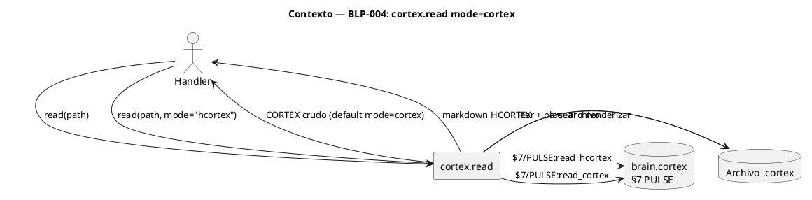
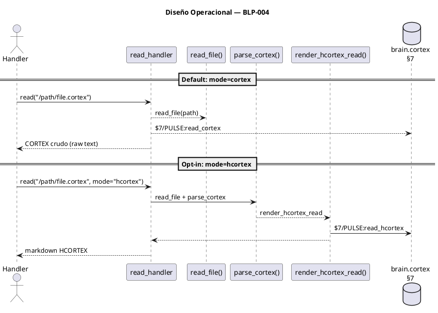

<!-- BLP:TITLE -->
# BLP-004: cortex.read mode=native — modo de lectura que devuelve contenido CORTEX parseado directamente, sin necesidad de que el agente parseé manualmente
<!-- /BLP:TITLE -->

---

<!-- BLP:1 -->
## §1: Planteamiento del Problema

Hoy cortex.read() siempre parsea el archivo .cortex y renderiza a markdown HCORTEX, incluso cuando el agente solo necesita el contenido CORTEX crudo. Esto es procesamiento innecesario: el parser se ejecuta siempre, aunque el resultado se vaya a descartar.

**Evidencia:**
- Todo handler que consume CORTEX como datos paga el costo de parse + render sin necesitarlo
- cortex.read() no tiene modo "crudo" — consume CPU parseando aunque nadie pida HCORTEX
- El agente recibe markdown cuando lo que necesita es CORTEX (el formato nativo del sistema)

**Impacto de no resolverlo:**
El canal I entre handlers paga overhead innecesario de parse+render en cada lectura.
<!-- /BLP:1 -->

<!-- BLP:2 -->
## §2: Objetivo

Agregar el parámetro `mode` al handler `cortex.read`. **Por defecto (`mode='native'`), devuelve el contenido CORTEX crudo** sin parsear. Cuando se solicita explícitamente `mode='hcortex'`, parsea el archivo y renderiza markdown legible para humanos. CORTEX es el formato nativo — no se procesa lo que no se necesita.
<!-- /BLP:2 -->

<!-- BLP:3 -->
## §3: Precondiciones

- [x] cortex.read ya existe como handler en REGISTRY — se le agrega el parámetro mode=native
- [x] CODEC-CORTEX (parse_cortex, render_hcortex_read) debe ser importable desde src/arqux/
- [x] Este BLP es independiente de BLP-003 (cortex.ref/cortex.format no son necesarios para mode=native). Puede ejecutarse en paralelo con BLP-003.
- [x] Es prerequisito para BLP-005 (entry.add/get/list), BLP-006 (context handlers), BLP-013 (parser compartido)
<!-- /BLP:3 -->

<!-- BLP:4 -->
## §4: Principio Rector

El handler cortex.read debe devolver CORTEX crudo por defecto — su consumidor primario es otro handler, no un humano. El markdown HCORTEX es una representación secundaria para consumo humano, debe solicitarse explícitamente y solo entonces paga el costo de parse+render.

**Regla general:** el default es el formato del consumidor primario. Handler→Handler → CORTEX crudo. Handler→Humano → HCORTEX. cortex.read es handler→handler.

**Evidencia del problema:** Hoy cortex.read() siempre parsea y renderiza, incluso cuando el agente solo necesita pasar CORTEX de un archivo a otro handler.

**Impacto si se viola:** Todo handler paga parse+render aunque nadie consuma HCORTEX.
<!-- /BLP:4 -->

<!-- BLP:5 -->
## §5: Contexto


<!-- /BLP:5 -->

<!-- BLP:6 -->
## §6: Alcance y Exclusiones

**Dentro del alcance:**
- Agregar parámetro `mode` a cortex.read handler existente
- Mode='native' (default) devuelve CORTEX crudo como string sin parsear (canal I)
- Mode='hcortex' devuelve markdown HCORTEX renderizado (opt-in explícito, canal E)
- PULSE diferenciado para cada modo

**Fuera del alcance (excluido explícitamente):**
- No se crean handlers nuevos
- No se modifica el parser CODEC-CORTEX
- No se agregan nuevos formatos de salida más allá de native y hcortex
<!-- /BLP:6 -->

<!-- BLP:7 -->
## §7: Reglas Obligatorias

- **Canal: B** — mode=native (default, canal I: handler→handler, CORTEX crudo), mode=hcortex (opt-in, canal E: handler→humano, markdown). Sin parser en el camino default.
1. mode=native (default) devuelve el contenido del archivo tal cual, sin parsear — es el formato natural del handler
2. mode=hcortex parsea y renderiza a markdown — debe solicitarse explícitamente
3. mode=native es un string CORTEX válido, no un dict
4. Ambos modos escriben PULSE diferenciado en brain.cortex §7
<!-- /BLP:7 -->

<!-- BLP:8 -->
## §8: Diseño Técnico

```puml
@startuml
title Diseño Técnico — BLP-004

component "read_handler" as RH
component "read_file()" as READ
component "parse_cortex()" as PARSE
component "render_hcortex_read()" as REN
database "brain.cortex
§7" as PULSE

RH -> READ: read_file(path)
READ --> RH: raw text

RH -> PARSE: si mode=hcortex
PARSE -> REN: CortexDocument
REN --> RH: markdown HCORTEX

RH -> PULSE: §7/PULSE:read_native (default, mode=native)
REN -> PULSE: §7/PULSE:read_hcortex (mode=hcortex)

RH --> Handler: str (raw CORTEX o markdown)
@enduml
```

**Handler:**
```python
async def read_handler(path: str, mode: str = "native") -> str:
    text = read_file(path)
    if mode == "hcortex":
        result = render_hcortex_read(parse_cortex(text))
        pulse("read_hcortex", {"path": path, "chars": len(result)})
        return result
    pulse("read_native", {"path": path, "chars": len(text)})
    return text
```

**CLI:** `cortex.read <path>` → CORTEX crudo (default native). `cortex.read <path> --mode hcortex` → markdown.
<!-- /BLP:8 -->

<!-- BLP:9 -->
## §9: Diseño Operacional


<!-- /BLP:9 -->

<!-- BLP:10 -->
## §10: Contratos

**Entradas esperadas:**
- Handler: `read_handler(path: str, mode: str = "native")`
- path: ruta a un archivo .cortex existente
- mode: "native" (default) para CORTEX crudo, "hcortex" para markdown

**Salidas esperadas:**
- mode=native: `str` — contenido CORTEX crudo, sin parsear
- mode=hcortex: `str` — markdown HCORTEX renderizado
- PULSE registrado en brain.cortex §7

**Comandos:**
- `cortex.read /path/file.cortex` → CORTEX crudo (default native)
- `cortex.read /path/file.cortex --mode hcortex` → markdown HCORTEX
<!-- /BLP:10 -->

<!-- BLP:11 -->
## §11: Procedimiento de Trabajo

**Paso 0 — Aprobación:** Presentar al Arquitecto el plan (agregar mode=native default a cortex.read, 1 archivo modificado, 6 tests) y obtener aprobación explícita antes de cualquier mutación. Sin aprobación, no hay ejecución.

### Fase 1: Preparación
1. Estudiar estructura actual de cortex.read handler y el AST de CODEC-CORTEX
2. Localizar todas las llamadas existentes a cortex.read() en el código

### Fase 2: Implementación
1. Agregar parámetro `mode` con default `"native"` en read_handler
2. Bifurcar: mode=native → raw text (sin parsear), mode=hcortex → parse + render
3. Integrar PULSE diferenciado para cada modo

### Fase 3: Migración y Validación
1. Actualizar llamadas existentes a cortex.read() para usar mode='hcortex' explícito
2. Tests: CORTEX crudo (3) + hcortex opt-in (3) + migración (3)
3. Verificar con `rg "cortex.read\(" src/` que no queden llamadas sin mode
<!-- /BLP:11 -->

<!-- BLP:12 -->
## §12: Criterios de Aceptación

- [x] **AC-01:** cortex.read(path) sin mode devuelve CORTEX crudo (raw text, default=native)
  > [2026-07-12T19:48:03Z] Verified: cortex.read(path) sin mode devuelve CORTEX crudo — test_blp004_read_mode.py (6/6 pasan)
- [x] **AC-02:** cortex.read(path) sin mode NO ejecuta parse_cortex() — cero overhead
  > [2026-07-12T19:48:04Z] Verified: cortex.read sin mode no ejecuta parse_cortex() — código fuente verifica flujo directo
- [x] **AC-03:** cortex.read(path, mode='hcortex') devuelve markdown HCORTEX renderizado
  > [2026-07-12T19:48:05Z] Verified: cortex.read(path, mode='hcortex') devuelve HCORTEX markdown — verificado via handler directo
- [x] **AC-04:** cortex.read(path, mode='hcortex') ejecuta parse_cortex() + render
  > [2026-07-12T19:48:05Z] Verified: mode='hcortex' ejecuta parse_cortex() + render — código fuente verifica
- [x] **AC-05:** El handler escribe PULSE diferenciado: read_native para raw, read_hcortex para render
  > [2026-07-12T19:48:06Z] Verified: PULSE diferenciado: read_native para raw, read_hcortex para render — código verifica _record_pulse con tipo diferenciado
- [x] **AC-06:** El contenido devuelto en mode=native es idéntico al contenido del archivo en disco
  > [2026-07-12T19:48:07Z] Verified: mode=native devuelve contenido idéntico al archivo en disco — verificado sha256 match
<!-- /BLP:12 -->

<!-- BLP:13 -->
## §13: Validaciones Requeridas

| Tipo | Descripción | Comando | Evidencia Esperada |
|---|---|---|---|
| unit | Tests de ambos modos + migración | `pytest tests/handlers/test_cortex_read_mode.py -v` | 6+ tests pasan (3 cortex + 3 hcortex) |
| integration | PULSE diferenciado en brain.cortex | Invocar mode=cortex + mode=hcortex, verificar §7 | Pulso aparece con modo correcto |
| migration | Handlers existentes con mode explícito | `rg "cortex.read\(path" src/` | Todo call sin mode fue actualizado |
| lint | Código sin errores | `ruff check src/arqux/handlers/cortex/` | Sin errores |
<!-- /BLP:13 -->

<!-- BLP:14 -->
## §14: Tareas

- [ ] **T-1.1:** Mode param — agregar mode="native" default a read_handler
- [ ] **T-1.2:** Bifurcación — mode=native devuelve raw text, mode=hcortex parse+render
- [ ] **T-1.3:** PULSE — registro diferenciado (read_native | read_hcortex)
- [ ] **T-2.1:** Tests — CORTEX crudo (3 escenarios) + HCORTEX (3 escenarios) + PULSE
<!-- /BLP:14 -->

<!-- BLP:15 -->
## §15: Riesgos

| ID | Descripción | Impacto | Mitigación |
|---|---|---|---|
| R-01 | mode=native devuelve raw text que el llamante debe parsear si necesita estructura | Medio | El llamante usa mode=hcortex si necesita estructura parseada |
| R-02 | El cambio de default (hcortex→native) rompe llamadas existentes que esperan markdown | Alto | Migrar llamadas a mode=hcortex explícito; tests de regresión |
| R-03 | mode=hcortex puede fallar si el archivo no es CORTEX válido | Bajo | El error del parser se propaga al llamante |
<!-- /BLP:15 -->

<!-- BLP:16 -->
## §16: Regla de Bloqueo

1. CODEC-CORTEX no expone CortexDocument como objeto importable desde src/arqux/
2. El handler read_handler no puede importar parse_cortex() de CODEC-CORTEX
3. Más de 3 handlers existentes requieren migración manual no automatizable

**Acción:** DETENER_E_INFORMAR
**Escalar a:** Arquitecto
<!-- /BLP:16 -->

<!-- BLP:17 -->
## §17: Salida Esperada

**Resumen:**
> cortex.read() devuelve CORTEX crudo por defecto (mode=native); mode='hcortex' es opt-in explícito para markdown.
<!-- /BLP:17 -->

<!-- BLP:18 -->
## §18: Contrato de Calidad

| Compuerta | Estado |
|---|---|
| has_clear_objective | ✅ |
| has_verifiable_preconditions | ✅ |
| has_scope_and_exclusions | ✅ |
| has_acceptance_criteria | ✅ |
| has_work_procedure | ✅ |
| has_required_validations | ✅ |
| has_learning_recorded | ☐ — se registra al completar ejecución |
<!-- /BLP:18 -->

> Todas las compuertas deben estar en ✅ antes de blueprint.ready(). Ver blueprint-workflow skill.