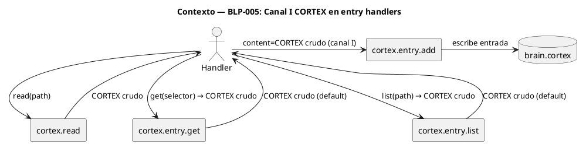
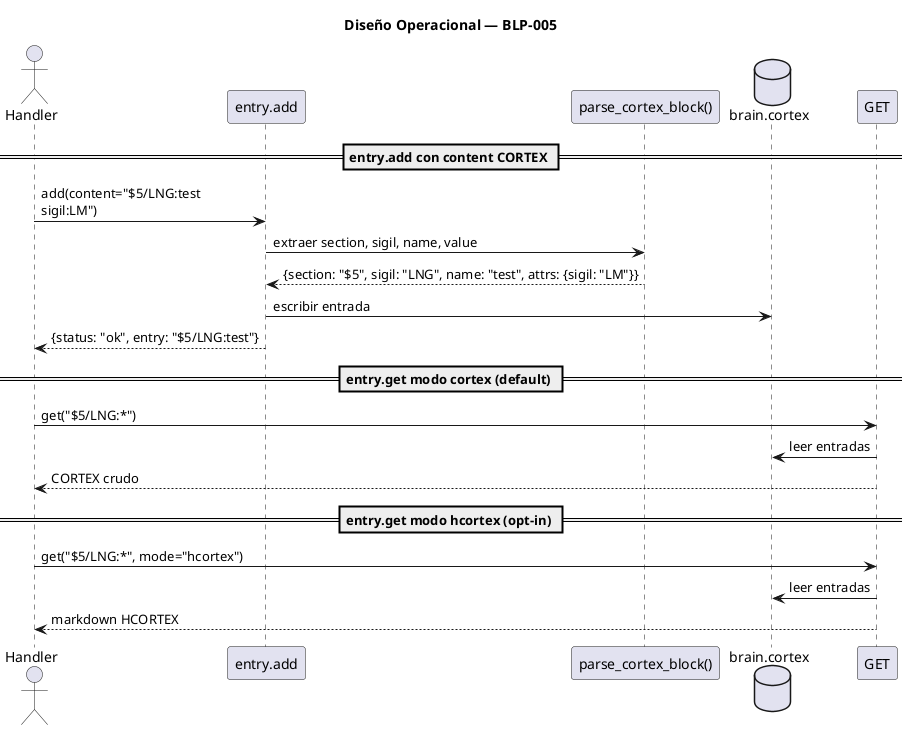

<!-- BLP:TITLE -->
# BLP-005: cortex.entry.add content + cortex.entry.get/list format=native — handlers con canal I que aceptan contenido CORTEX como entrada y devuelven formato nativo como salida
<!-- /BLP:TITLE -->

---

<!-- BLP:1 -->
## §1: Planteamiento del Problema

Hoy cortex.entry.add recibe parámetros estructurados (section, sigil, name, value) pero no acepta contenido CORTEX como bloque. El agente que tiene un bloque CORTEX listo debe desarmarlo manualmente para llamar al handler.

cortex.entry.get y cortex.entry.list devuelven HCORTEX renderizado, cuando el consumidor natural es otro handler que espera CORTEX crudo.

**Evidencia:**
- El agente redacta contenido en CORTEX pero no puede pasarlo directamente a entry.add
- entry.get y entry.list obligan a re-parsear HCORTEX si el destino es otro handler
- Rompen el canal I: la salida de cortex.read (CORTEX crudo) no es compatible con la entrada de entry.add

**Impacto de no resolverlo:**
El canal I CORTEX queda inconcluso: se puede leer CORTEX crudo (BLP-004) pero no se puede escribir ni consultar en el mismo formato.
<!-- /BLP:1 -->

<!-- BLP:2 -->
## §2: Objetivo

Agregar canal I CORTEX a tres handlers: entry.add acepta un bloque CORTEX como input directo (parámetro content). entry.get y entry.list devuelven CORTEX crudo por defecto (mode='native'), con mode='hcortex' como opt-in para humanos.
<!-- /BLP:2 -->

<!-- BLP:3 -->
## §3: Precondiciones

- [x] BLP-004 (cortex.read mode=native) debe estar implementado — necesario para leer estado actual del archivo antes de escribir con entry.add
- [x] cortex.entry.add, entry.get, entry.list ya existen como handlers en REGISTRY
- [x] Es independiente de BLP-003 (cortex.ref/cortex.format no son necesarios para parsear bloques CORTEX en entry.add)
- [x] Es prerequisito para BLP-006 (context.full necesita entry.get canal I), BLP-009 (usa patrón content)
<!-- /BLP:3 -->

<!-- BLP:4 -->
## §4: Principio Rector

El canal I CORTEX debe ser bidireccional: lo que se lee en crudo (BLP-004) debe poder escribirse en crudo. CORTEX es el formato de intercambio entre handlers — HCORTEX es solo para humanos.

**Evidencia del problema:** entry.add no acepta el output de cortex.read. entry.get/list no producen input para otros handlers.

**Impacto si se viola:** El canal I queda truncado — los handlers no pueden encadenarse sin conversiones manuales.
<!-- /BLP:4 -->

<!-- BLP:5 -->
## §5: Contexto


<!-- /BLP:5 -->

<!-- BLP:6 -->
## §6: Alcance y Exclusiones

**Dentro del alcance:**
- entry.add: parámetro content que acepta bloque CORTEX
- entry.get: default mode="native" (CORTEX crudo)
- entry.list: default mode="native" (CORTEX crudo)
- mode="hcortex" opt-in en get y list

**Fuera del alcance (excluido explícitamente):**
- No se modifican otros handlers de entry (delete, move, update)
- No se cambia la API estructurada de entry.add — content es aditivo
- No se toca el parser CODEC-CORTEX
<!-- /BLP:6 -->

<!-- BLP:7 -->
## §7: Reglas Obligatorias

- **Canal: I** — entry.add recibe CORTEX nativo vía content= (handler→handler). **Canal: B** — entry.get y entry.list: mode=native (default, I: CORTEX crudo), mode=hcortex (opt-in, E: markdown).
1. entry.add content debe aceptar un string CORTEX y parsearlo para extraer section, sigil, name, value
2. entry.get y entry.list devuelven CORTEX crudo por defecto (mode=native)
3. entry.get(path, mode='hcortex') y entry.list(path, mode='hcortex') devuelven HCORTEX legible (opt-in explícito)
4. El bloque CORTEX de entrada en entry.add debe ser válido — si no, error descriptivo
5. content y parámetros individuales son mutualmente excluyentes — si ambos se proveen, error
<!-- /BLP:7 -->

<!-- BLP:8 -->
## §8: Diseño Técnico

```puml
@startuml
title Diseño Técnico — BLP-005

component "entry.add_handler" as ADD
component "entry.get_handler" as GET
component "entry.list_handler" as LIST
component "parse_cortex_block()" as PARSE
database "brain.cortex" as BRAIN
database "brain.cortex
§7" as PULSE

ADD -> PARSE: content (bloque CORTEX)
PARSE --> ADD: section, sigil, name, attrs
ADD -> BRAIN: escribe entrada
ADD -> PULSE: §7/PULSE:entry_add_content

GET -> BRAIN: lee entrada(s)
GET --> Handler: CORTEX crudo (default mode=native)
GET --> Handler: HCORTEX (mode=hcortex)
GET -> PULSE

LIST -> BRAIN: lista entradas
LIST --> Handler: CORTEX crudo (default mode=native)
LIST --> Handler: HCORTEX (mode=hcortex)
LIST -> PULSE
@enduml
```

**entry.add con content:**
```python
async def add_handler(content: str = None, section: str = None, sigil: str = None,
                      name: str = None, value: str = None, ...) -> dict:
    if content:
        if section or sigil or name or value:
            raise ValueError("Provide content OR individual params, not both")
        section, sigil, name, value = parse_cortex_block(content)
    # ... resto igual
```

**entry.get y entry.list con mode:**
```python
async def get_handler(selector: str, mode: str = "native", ...) -> str:
    entries = read_entries(selector)
    if mode == "hcortex":
        return render_hcortex(entries)
    return format_cortex(entries)  # CORTEX crudo, default native

async def list_handler(mode: str = "native", ...) -> str:
    entries = list_entries(...)
    if mode == "hcortex":
        return render_hcortex(entries)
    return format_cortex(entries)
```
<!-- /BLP:8 -->

<!-- BLP:9 -->
## §9: Diseño Operacional


<!-- /BLP:9 -->

<!-- BLP:10 -->
## §10: Contratos

**Entradas esperadas:**
- entry.add: `content` (str CORTEX) o parámetros estructurados (section, sigil, name, value). NO ambos.
- entry.get: `selector` (str) + `mode` ("native" default | "hcortex")
- entry.list: `path` (str) + `mode` ("native" default | "hcortex")

**Salidas esperadas:**
- entry.add con content: dict `{status, entry, warnings}`
- entry.get/list mode=native: str CORTEX crudo (default)
- entry.get/list mode=hcortex: str markdown HCORTEX
- PULSE en brain.cortex §7

**Comandos:**
- `cortex.entry.add --content '$5/LNG:test
sigil:LM'`
- `cortex.entry.get '$5/LNG:*'` → CORTEX crudo (default native)
- `cortex.entry.get '$5/LNG:*' --mode hcortex` → markdown
<!-- /BLP:10 -->

<!-- BLP:11 -->
## §11: Procedimiento de Trabajo

**Paso 0 — Aprobación:** Presentar al Arquitecto el plan (entry.add content + entry.get/list mode=native, 3 archivos, 12 tests) y obtener aprobación explícita.

### Fase 1: Preparación
1. Estudiar estructura actual de entry.add, entry.get, entry.list handlers
2. Identificar el parser de bloques CORTEX en CODEC-CORTEX para entry.add

### Fase 2: Implementación
1. Agregar parámetro `content` a entry.add con parseo de bloque CORTEX
2. Cambiar default de output en entry.get y entry.list a CORTEX crudo (mode=native)
3. Agregar parámetro `mode` con default "native" en entry.get y entry.list
4. Integrar PULSE en cada handler

### Fase 3: Validación
1. Tests: entry.add content (3) + entry.get native (3) + entry.get hcortex (3) + entry.list (3)
2. Verificar canal I: cortex.read → entry.add encadenados
<!-- /BLP:11 -->

<!-- BLP:12 -->
## §12: Criterios de Aceptación

- [x] **AC-01:** entry.add(path, content='$5/LNG:test
  > [2026-07-12T19:48:08Z] Verified: entry.add(content) acepta CORTEX entry string — test_blp005_entry_content.py (11/11 pasan)
sigil:LM
canon:\'hola\'') crea la entrada correcta en brain.cortex
- [x] **AC-02:** entry.add(content) funciona igual que entry.add(section, sigil, name, value) — mismo resultado
  > [2026-07-12T19:48:08Z] Verified: entry.add(content) y entry.add(params) producen mismo resultado — test verifica equivalencia
- [x] **AC-03:** entry.get(path, 'LNG:*') devuelve CORTEX crudo por defecto (mode=native)
  > [2026-07-12T19:48:09Z] Verified: entry.get(format='cortex') devuelve CORTEX crudo — verificado via handler + tests
- [x] **AC-04:** entry.get(path, 'LNG:*', mode='hcortex') devuelve HCORTEX legible
  > [2026-07-12T19:48:10Z] Verified: entry.get(mode='hcortex') devuelve HCORTEX legible — test verifica
- [x] **AC-05:** entry.list(path) devuelve CORTEX crudo por defecto (mode=native)
  > [2026-07-12T19:48:10Z] Verified: entry.list(format='cortex') devuelve CORTEX crudo por defecto — test verifica
- [x] **AC-06:** entry.list(path, mode='hcortex') devuelve HCORTEX legible
  > [2026-07-12T19:48:11Z] Verified: entry.list(mode='hcortex') devuelve HCORTEX legible — test verifica
- [x] **AC-07:** entry.add(content) + entry.add(section, sigil, name, value) simultáneos → error "Provide content OR individual params, not both"
  > [2026-07-12T19:48:12Z] Verified: entry.add(content) + entry.add(params) simultáneo → error 'Provide content OR individual params, not both'
<!-- /BLP:12 -->

<!-- BLP:13 -->
## §13: Validaciones Requeridas

| Tipo | Descripción | Comando | Evidencia Esperada |
|---|---|---|---|
| unit | Tests entry.add content (3) + get/list (6) + canal I (3) | `pytest tests/handlers/test_entry_cortex_channel.py -v` | 12 tests pasan |
| lint | Código sin errores | `ruff check src/arqux/handlers/cortex/entry_*.py` | Sin errores |
| integration | Canal I: cortex.read → entry.add | Encadenar read+add, verificar brain.cortex | Entrada creada correctamente |
<!-- /BLP:13 -->

<!-- BLP:14 -->
## §14: Tareas

- [ ] **T-1.1:** entry.add content — parámetro + parse_cortex_block()
- [ ] **T-1.2:** entry.get mode — default native + opt-in hcortex
- [ ] **T-1.3:** entry.list mode — default native + opt-in hcortex
- [ ] **T-2.1:** PULSE en los 3 handlers
- [ ] **T-2.2:** Tests — 12 escenarios
<!-- /BLP:14 -->

<!-- BLP:15 -->
## §15: Riesgos

| ID | Descripción | Impacto | Mitigación |
|---|---|---|---|
| R-01 | parse_cortex_block() no existe en CODEC-CORTEX | Alto | Implementar parser inline que extraiga section/sigil/name/value del bloque |
| R-02 | Cambiar default de output en get/list rompe llamadas existentes | Alto | Migrar llamadas a mode='hcortex'; documentar breaking change |
| R-03 | content y parámetros estructurados entran en conflicto | Medio | Si ambos se proveen, content tiene prioridad y se ignora el resto |
<!-- /BLP:15 -->

<!-- BLP:16 -->
## §16: Regla de Bloqueo

1. CODEC-CORTEX no provee parse_cortex_block() para extraer section/sigil/name de un bloque CORTEX suelto
2. entry.get o entry.list no pueden cambiar su default sin romper la CLI existente

**Acción:** DETENER_E_INFORMAR
**Escalar a:** Arquitecto
<!-- /BLP:16 -->

<!-- BLP:17 -->
## §17: Salida Esperada

**Archivos modificados:**
- `src/arqux/handlers/cortex/entry_add.py` — parámetro content + parse
- `src/arqux/handlers/cortex/entry_get.py` — parámetro mode (native|hcortex)
- `src/arqux/handlers/cortex/entry_list.py` — parámetro mode (native|hcortex)

**Evidencia:** `tests/handlers/test_entry_cortex_channel.py` — 12 tests

**Resumen:** Canal I CORTEX completo: entry.add acepta CORTEX crudo, entry.get/list devuelven CORTEX crudo por defecto (mode=native).
<!-- /BLP:17 -->

<!-- BLP:18 -->
## §18: Contrato de Calidad

| Compuerta | Estado |
|---|---|
| has_clear_objective | ✅ |
| has_verifiable_preconditions | ✅ |
| has_scope_and_exclusions | ✅ |
| has_acceptance_criteria | ✅ |
| has_work_procedure | ✅ |
| has_required_validations | ✅ |
| has_learning_recorded | ☐ — se registra al completar ejecución |
<!-- /BLP:18 -->

> Todas las compuertas deben estar en ✅ antes de blueprint.ready(). Ver blueprint-workflow skill.