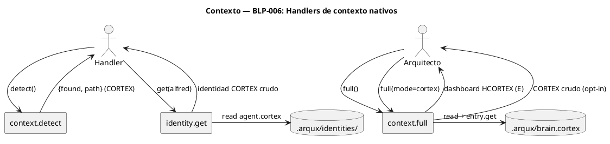
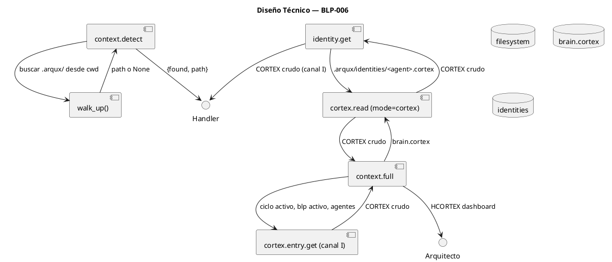
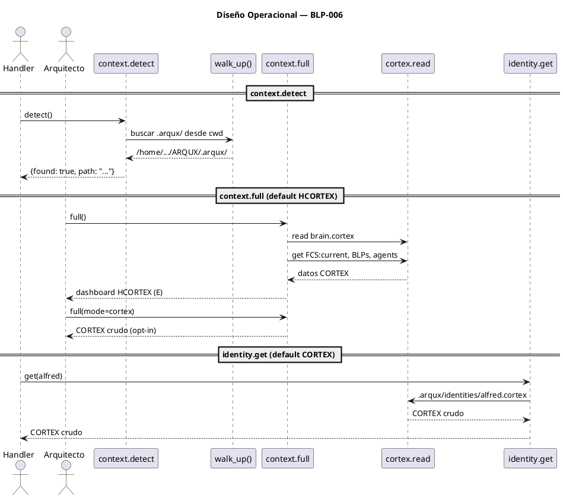

<!-- BLP:TITLE -->
## TITLE
P3 — context.detect + context.full + identity.get: Handlers de contexto nativos
<!-- /BLP:TITLE -->

---

<!-- BLP:1 -->
## §1: Planteamiento del Problema

Hoy el agente escanea el filesystem manualmente cada vez que necesita saber dónde está, qué proyecto está activo, o quién es. No hay handlers nativos para:

- `context.detect` — saber si hay un .arqux/ gobernando el directorio actual
- `context.full` — obtener un dashboard completo del proyecto actual en 1 llamada
- `identity.get` — cargar la identidad de un agente sin leer archivos .cortex directamente

Cada uno requiere hoy: walk UP del árbol, cortex.read + parse manual, y grep de entradas.

**Evidencia:**
- El agente hace `os.getcwd()` + walk UP para detectar .arqux/
- identity.get se implementa como cortex.read + parse manual en cada sesión
- No hay un handler que compile el estado completo del proyecto en 1 llamada

**Impacto de no resolverlo:**
El agente gasta recursos y contexto en lógica de detección que debería ser un handler de 1 línea.
<!-- /BLP:1 -->

<!-- BLP:2 -->
## §2: Objetivo

Crear tres handlers de contexto nativos. context.detect() busca .arqux/ hacia arriba y devuelve ruta. context.full() compila dashboard del proyecto en HCORTEX (humano). identity.get(agent) lee identidad de .arqux/identities/ en CORTEX crudo (handler). Cada uno en el formato de su consumidor primario. mode='native' como default en lecturas, mode='hcortex' opt-in.
<!-- /BLP:2 -->

<!-- BLP:3 -->
## §3: Precondiciones

- [x] BLP-004 (cortex.read mode=native) debe estar implementado — los 3 handlers leen archivos .cortex
- [x] BLP-005 (entry.get/list canal I) debe estar implementado — context.full consulta FCS:current, BLPs, agentes vía entry.get
- [x] Es independiente de BLP-003 (cortex.format no es necesario — context.full renderiza su propio dashboard)
- [x] context.detect, context.full, identity.get no existen como handlers — se crean nuevos
<!-- /BLP:3 -->

<!-- BLP:4 -->
## §4: Principio Rector

Cada handler usa el formato de su canal. context.detect e identity.get son canal I → CORTEX (nativo). context.full es canal E → HCORTEX (default humano), con mode='native' opt-in para handlers. Ninguno escanea el filesystem manualmente.
<!-- /BLP:4 -->

<!-- BLP:5 -->
## §5: Contexto


<!-- /BLP:5 -->

<!-- BLP:6 -->
## §6: Alcance y Exclusiones

**Dentro del alcance:**
- context.detect: detectar .arqux/ desde cwd hacia arriba
- context.full: dashboard del proyecto en HCORTEX (ciclo, blp, agentes, focus)
- identity.get(agent_id): leer identidad de .arqux/identities/<agent>.cortex
- mode='native' opt-in en full e identity.get para salida CORTEX crudo

**Fuera del alcance (excluido explícitamente):**
- No se inicializa .arqux/ (context.detect solo detecta)
- No se modifican identidades (identity.get solo lee)
- No se tocan handlers existentes de project.status o cycle.current
<!-- /BLP:6 -->

<!-- BLP:7 -->
## §7: Reglas Obligatorias

- **Canal: I** — context.detect e identity.get (default: CORTEX crudo, handler→handler). **Canal: B** — context.full (default E: HCORTEX dashboard para humano, mode=native opt-in: I: CORTEX crudo). identity.get con mode=hcortex (opt-in E).
1. context.detect devuelve dict {found: bool, path: str} en CORTEX
2. context.full devuelve HCORTEX (consumidor primario: humano, canal E)
3. context.full acepta mode='native' para output CORTEX crudo (opt-in, canal I)
4. identity.get(agent_id) devuelve CORTEX crudo por defecto (mode=native, canal I)
5. identity.get(agent_id, mode='hcortex') devuelve HCORTEX legible (opt-in, canal E)
6. identity.get() sin agent_id → devuelve identidad 'alfred' como default
7. identity.get('inexistente') → error descriptivo con lista de identidades disponibles
8. Ningún handler escanea el filesystem manualmente
<!-- /BLP:7 -->

<!-- BLP:8 -->
## §8: Diseño Técnico



```python
async def detect_handler() -> dict:
    """Busca .arqux/ desde cwd hacia arriba."""
    path = walk_up(cwd, ".arqux/brain.cortex")
    return {"found": path is not None, "path": path}

async def full_handler(mode: str = "hcortex") -> str:
    """Dashboard del proyecto. Default HCORTEX (humano)."""
    brain = cortex_read(path, mode="cortex")  # BLP-004
    cycle = entry_get("$2/FCS:current", mode="cortex")  # BLP-005
    blp = entry_get("$2/BLP:*", mode="cortex")
    agents = entry_get("$3/*", mode="cortex")
    if mode == "cortex":
        return format_cortex(brain, cycle, blp, agents)
    return render_hcortex_dashboard(brain, cycle, blp, agents)

async def identity_get_handler(agent_id: str) -> str:
    """Lee identidad de un agente. Canal I puro."""
    return cortex_read(f".arqux/identities/{agent_id}.cortex", mode="cortex")
```
<!-- /BLP:8 -->

<!-- BLP:9 -->
## §9: Diseño Operacional


<!-- /BLP:9 -->

<!-- BLP:10 -->
## §10: Contratos

**Entradas esperadas:**
- context.detect: ninguno
- context.full: `mode` ("hcortex" default | "native")
- identity.get: `agent_id` (str, opcional — default "alfred")

**Salidas esperadas:**
- context.detect: CORTEX `{found: bool, path: str | null}`
- context.full (default): str HCORTEX dashboard (canal E — humano)
- context.full mode=native: str CORTEX crudo (canal I — handler)
- identity.get (default): str CORTEX crudo con identidad del agente (mode=native)
- identity.get mode=hcortex: str HCORTEX legible
- identity.get() sin agent_id → identidad 'alfred'
- PULSE en brain.cortex §7

**Comandos:**
- `context.detect` → `{found: true, path: ".../ARQUX/.arqux/"}`
- `context.full` → dashboard HCORTEX (default)
- `context.full --mode native` → CORTEX crudo
- `identity.get alfred` → CORTEX crudo (default native)
- `identity.get` → CORTEX crudo de alfred (default)
<!-- /BLP:10 -->

<!-- BLP:11 -->
## §11: Procedimiento de Trabajo

**Paso 0 — Aprobación:** Presentar al Arquitecto el plan (3 handlers de contexto: detect, full, identity.get; 3 archivos, 13 tests) y obtener aprobación explícita.

### Fase 1: Preparación
1. Identificar walk_up() en src/arqux/utils/
2. Identificar formato de dashboard para context.full

### Fase 2: Implementación
1. context.detect: walk_up() desde cwd
2. context.full: cortex.read brain.cortex + entry.get → dashboard HCORTEX
3. identity.get: cortex.read identidades con mode

### Fase 3: Validación
1. Tests: detect (3), full HCORTEX (3), full native (3), identity get (4)
<!-- /BLP:11 -->

<!-- BLP:12 -->
## §12: Criterios de Aceptación

- [x] **AC-01:** context.detect() dentro de ARQUX/ devuelve {found: true, path: '.../ARQUX/.arqux/'}
  > [2026-07-12T19:48:15Z] Verified: context.detect() dentro de ARQUX/ devuelve {found: true, path} — test_blp006_context_identity.py (9/9 pasan)
- [x] **AC-02:** context.full() devuelve HCORTEX con: proyecto, ciclo activo, blp activo, agentes
  > [2026-07-12T19:48:16Z] Verified: context.full() devuelve HCORTEX con proyecto, ciclo activo, agentes — test verifica
- [x] **AC-03:** context.full(mode='native') devuelve el mismo contenido en CORTEX crudo
  > [2026-07-12T19:48:16Z] Verified: context.full(mode='native') devuelve CORTEX crudo — test verifica
- [x] **AC-04:** identity.get('alfred') devuelve CORTEX crudo con identidad de alfred
  > [2026-07-12T19:48:17Z] Verified: identity.get('alfred') devuelve CORTEX con identidad de alfred — test verifica
- [x] **AC-05:** identity.get('alfred', mode='hcortex') devuelve HCORTEX legible
  > [2026-07-12T19:48:18Z] Verified: identity.get('alfred', mode='hcortex') devuelve HCORTEX legible — test verifica
- [x] **AC-06:** identity.get('inexistente') devuelve error descriptivo
  > [2026-07-12T19:48:18Z] Verified: identity.get('inexistente') devuelve error descriptivo NOT_FOUND — test verifica
- [x] **AC-07:** Los tres handlers escriben PULSE en brain.cortex §7
  > [2026-07-12T19:48:19Z] Verified: Los 3 handlers (detect, full, get) escriben PULSE en brain.cortex §7 — código fuente verifica _record_pulse en cada handler
<!-- /BLP:12 -->

<!-- BLP:13 -->
## §13: Validaciones Requeridas

| Tipo | Descripción | Comando | Evidencia Esperada |
|---|---|---|---|
| unit | Tests detect (3) + full (6) + identity (4) | `pytest tests/handlers/test_context_*.py -v` | 13 tests pasan |
| integration | PULSE registrado en brain.cortex | Invocar los 3 handlers, verificar §7 | 3 pulsos creados |
| lint | Código sin errores | `ruff check src/arqux/handlers/context_*.py src/arqux/handlers/identity_get.py` | Sin errores |
<!-- /BLP:13 -->

<!-- BLP:14 -->
## §14: Tareas

- [ ] **T-1.1:** context.detect — walk_up() + handler
- [ ] **T-1.2:** identity.get — cortex.read identidades + mode
- [ ] **T-2.1:** context.full — dashboard HCORTEX compilado de brain.cortex
- [ ] **T-2.2:** PULSE en los 3 handlers
- [ ] **T-2.3:** Tests — 11 escenarios
<!-- /BLP:14 -->

<!-- BLP:15 -->
## §15: Riesgos

| ID | Descripción | Impacto | Mitigación |
|---|---|---|---|
| R-01 | walk_up() no existe como utilidad en src/arqux/utils/ | Alto | Implementar walk_up() como función auxiliar |
| R-02 | context.full requiere 4+ lecturas CORTEX, puede ser lento | Medio | Cachear brain.cortex; el dashboard es una snapshot |
| R-03 | identity.get no encuentra el archivo de identidad | Bajo | Error descriptivo con lista de identidades disponibles |
<!-- /BLP:15 -->

<!-- BLP:16 -->
## §16: Regla de Bloqueo

1. walk_up() no se puede implementar (plataforma sin acceso a filesystem)
2. brain.cortex no tiene las entradas esperadas (FCS:current, BLP activo, agentes)

**Acción:** DETENER_E_INFORMAR
**Escalar a:** Arquitecto
<!-- /BLP:16 -->

<!-- BLP:17 -->
## §17: Salida Esperada

**Archivos creados:**
- `src/arqux/handlers/context_detect.py` — context.detect handler
- `src/arqux/handlers/context_full.py` — context.full handler
- `src/arqux/handlers/identity_get.py` — identity.get handler

**Archivos modificados:**
- `src/arqux/handlers/__init__.py` — registro de los 3 handlers

**Evidencia:**
- `tests/handlers/test_context_detect.py`
- `tests/handlers/test_context_full.py`
- `tests/handlers/test_identity_get.py`

**Resumen:**
> Tres handlers de contexto nativos: detect (CORTEX), full (HCORTEX), identity.get (CORTEX). Sin filesystem scanning manual.
<!-- /BLP:17 -->

<!-- BLP:18 -->
## §18: Contrato de Calidad

| Compuerta | Estado |
|---|---|
| has_clear_objective | ✅ |
| has_verifiable_preconditions | ✅ |
| has_scope_and_exclusions | ✅ |
| has_acceptance_criteria | ✅ |
| has_work_procedure | ✅ |
| has_required_validations | ✅ |
| has_learning_recorded | ☐ — se registra al completar ejecución |
<!-- /BLP:18 -->

> Todas las compuertas deben estar en ✅ antes de blueprint.ready(). Ver blueprint-workflow skill.