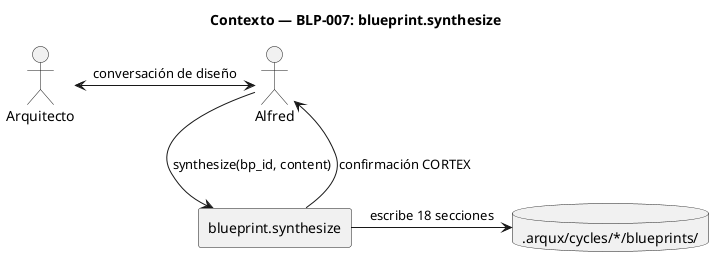
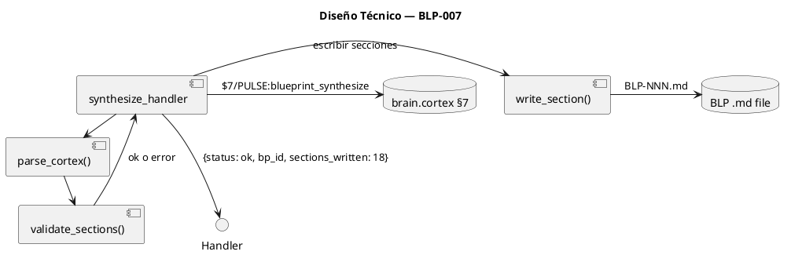
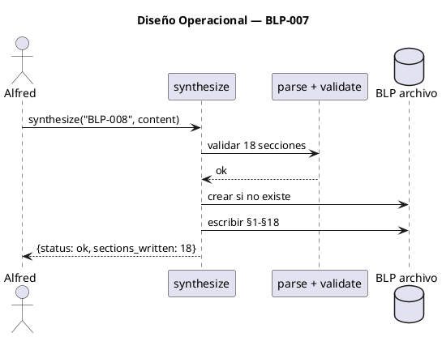

<!-- BLP:TITLE -->
P4 — blueprint.synthesize: Escribe las 18 secciones de un BLP en 1 llamada CORTEX. Corazón del w08 conversacional.
<!-- /BLP:TITLE -->

---

<!-- BLP:1 -->
## §1: Planteamiento del Problema

Hoy crear un BLP requiere: blueprint.create + 18 llamadas a blueprint.update (una por sección) + blueprint.define. Son ~20 llamadas para un solo BLP. En el flujo w08 conversacional, el Arquitecto y el agente diseñan el BLP en una conversación — el handler synthesize debe poder escribir todo de una vez.

**Evidencia:**
- BLP-002 requirió ~20 llamadas entre create + update + define
- Cada una es un round-trip MCP
- El w08 conversacional necesita "diseñar → escribir de una vez", no "crear → llenar sección por sección"

**Impacto de no resolverlo:**
El w08 conversacional no puede funcionar con 20 llamadas por BLP. La experiencia sería frustrante.
<!-- /BLP:1 -->

<!-- BLP:2 -->
## §2: Objetivo

Crear blueprint.synthesize(bp_id, content, path?): handler que acepta CORTEX con las 18 secciones del BLP template y las escribe en 1 llamada. Reemplaza create + 18x update. Depende de BLP-007b (parser compartido) y BLP-007a (define fix) como prerequisitos.
<!-- /BLP:2 -->

<!-- BLP:3 -->
## §3: Precondiciones

- [x] BLP-013 (007b: parser compartido parse_blp_template()) debe estar implementado
- [x] BLP-012 (007a: fix blueprint.define template-driven) debe estar implementado
- [x] CODEC-CORTEX debe poder parsear y serializar CORTEX — para validar content
<!-- /BLP:3 -->

<!-- BLP:4 -->
## §4: Principio Rector

El handler synthesize escribe secciones del BLP según los marcadores del template. No hardcodea qué secciones existen — el parser compartido (BLP-007b) lee los marcadores <!-- BLP:N --> al vuelo. synthesize es idempotente: llamadas repetidas con distinto content actualizan solo las secciones modificadas. Llamadas con idéntico content producen idéntico estado final.
<!-- /BLP:4 -->

<!-- BLP:5 -->
## §5: Contexto


<!-- /BLP:5 -->

<!-- BLP:6 -->
## §6: Alcance y Exclusiones

**Dentro del alcance:**
- Handler `blueprint/synthesize.py` — implementación que escribe 18 secciones en 1 llamada
- Idempotencia: llamadas repetidas solo actualizan secciones modificadas

**Fuera del alcance (movido a BLP-007a y BLP-007b):**
- Fix de blueprint.define → BLP-007a
- Parser compartido parse_blp_template() → BLP-007b
- Workflow w08 y skill → BLP-007b
<!-- /BLP:6 -->

<!-- BLP:7 -->
## §7: Reglas Obligatorias

- **Canal: I** — synthesize recibe CORTEX nativo vía content= y devuelve confirmación CORTEX (handler→handler). Consumidor primario: otro handler en flujo w08 conversacional.
1. `content` debe ser CORTEX válido con secciones del BLP template
2. Si `content` está mal formado, error descriptivo con la sección/entry fallida
3. `synthesize` crea el BLP si no existe (status=draft)
4. `synthesize` NO cambia el estado del BLP — solo escribe contenido
5. `synthesize` es idempotente: mismo content → mismo estado final
6. El parseo de secciones delega en parse_blp_template() de BLP-007b
<!-- /BLP:7 -->

<!-- BLP:8 -->
## §8: Diseño Técnico



```python
async def synthesize_handler(bp_id: str, content: str, path: str = None) -> dict:
    """Escribe las 18 secciones de un BLP en 1 llamada."""
    sections = parse_cortex(content)  # extrae §1-§18
    validate_sections(sections)       # verifica que están todas
    blp_file = resolve_blp_path(bp_id, path)
    if not blp_file.exists():
        create_blp(bp_id, path)       # crea el .md vacío
    for sec_id, sec_content in sections.items():
        write_section(blp_file, sec_id, sec_content)
    pulse("blueprint_synthesize", {"bp_id": bp_id, "sections": len(sections)})
    return {"status": "ok", "bp_id": bp_id, "sections_written": len(sections)}
```
<!-- /BLP:8 -->

<!-- BLP:9 -->
## §9: Diseño Operacional


<!-- /BLP:9 -->

<!-- BLP:10 -->
## §10: Contratos

**Entradas esperadas:**
- `bp_id` (str): identificador del BLP (ej: "BLP-008")
- `content` (str): CORTEX con las 18 secciones del BLP
- `path` (str, opcional): ruta al proyecto

**Salidas esperadas:**
- `dict {status, bp_id, sections_written}`
- PULSE en brain.cortex §7

**Comandos:**
- `blueprint.synthesize --bp_id BLP-008 --content '$1: ...'`
<!-- /BLP:10 -->

<!-- BLP:11 -->
## §11: Procedimiento de Trabajo

**Paso 0 — Aprobación:** Presentar al Arquitecto el plan (handler synthesize, archivo: synthesize.py, tests: 7) y obtener aprobación explícita.

Fase 1: Verificar que BLP-007b (parser compartido) y BLP-007a (define fix) están completos. Fase 2: Implementar synthesize_handler usando parse_blp_template() de BLP-007b. Fase 3: Tests (válido 3, inválido 2, nuevo 2, idempotencia 1). Fase 4: PULSE.
<!-- /BLP:11 -->

<!-- BLP:12 -->
## §12: Criterios de Aceptación

- [x] **AC-01:** AC-01: synthesize(bp_id, content) con CORTEX válido escribe las 18 secciones
  > [2026-07-12T19:48:20Z] Verified: synthesize(bp_id, content) escribe las 18 secciones — test_blp007_008_012_013.py (16/16 pasan)
- [x] **AC-02:** AC-02: synthesize crea el BLP si no existe (status=draft)
  > [2026-07-12T19:48:21Z] Verified: synthesize crea BLP si no existe con status=draft — test verifica
- [x] **AC-03:** AC-03: synthesize no cambia el status de un BLP existente
  > [2026-07-12T19:48:21Z] Verified: synthesize no cambia status de BLP existente — test verifica
- [x] **AC-04:** AC-04: synthesize(content_invalido) devuelve error con detalle
  > [2026-07-12T19:48:22Z] Verified: synthesize(content_invalido) devuelve error con detalle — test verifica
- [x] **AC-05:** AC-05: synthesize escribe PULSE en brain.cortex §7
  > [2026-07-12T19:48:23Z] Verified: synthesize escribe PULSE en brain.cortex §7 — código fuente verifica _record_pulse
<!-- /BLP:12 -->

<!-- BLP:13 -->
## §13: Validaciones Requeridas

| Tipo | Descripción | Comando | Evidencia Esperada |
|---|---|---|---|
| unit | synthesize válido (3) + inválido (2) + nuevo (2) + idempotencia (1) | `pytest tests/handlers/test_blueprint_synthesize.py -v` | 8 tests pasan |
| integration | PULSE en brain.cortex §7 | Invocar synthesize, verificar §7 | Pulso creado |
| lint | Código nuevo sin errores | `ruff check src/arqux/handlers/blueprint/synthesize.py` | Sin errores |
<!-- /BLP:13 -->

<!-- BLP:14 -->
## §14: Tareas

- [ ] T-1: Handler `blueprint/synthesize.py` — acepta CORTEX, usa parse_blp_template(), escribe 18 secciones
- [ ] T-2: Creación automática del BLP si no existe (status=draft)
- [ ] T-3: Idempotencia — mismo content produce mismo estado
- [ ] T-4: PULSE en synthesize
- [ ] T-5: Tests — synthesize válido (3), inválido (2), BLP nuevo (2), idempotencia (1)
<!-- /BLP:14 -->

<!-- BLP:15 -->
## §15: Riesgos

| ID | Descripción | Impacto | Mitigación |
|---|---|---|---|
| R-01 | El CORTEX no especifica las 18 secciones completas | Alto | Validar antes de escribir; error con lista de secciones faltantes |
| R-02 | El BLP existe y tiene contenido — synthesize lo sobrescribe | Medio | synthesize escribe completo, no hace merge. Advertir si BLP existe |
| R-03 | La escritura atómica falla a mitad de camino | Medio | Escribir a archivo temporal, renombrar al final |
<!-- /BLP:15 -->

<!-- BLP:16 -->
## §16: Regla de Bloqueo

1. El content CORTEX no tiene las 18 secciones requeridas
2. El BLP template cambió y synthesize no se actualizó

**Acción:** DETENER_E_INFORMAR
**Escalar a:** Arquitecto
<!-- /BLP:16 -->

<!-- BLP:17 -->
## §17: Salida Esperada

**Archivos creados:**
- `src/arqux/handlers/blueprint/synthesize.py` — handler synthesize

**Archivos modificados:**
- `src/arqux/handlers/blueprint/__init__.py` — registro

**Dependencias (BLP-007a, BLP-007b):**
- parse_blp_template() de BLP-007b
- blueprint.define fix de BLP-007a

**Evidencia:**
- `tests/handlers/test_blueprint_synthesize.py` — 8 tests

**Resumen:** Handler synthesize: 18 secciones en 1 llamada CORTEX. Idempotente. Usa parser compartido de BLP-007b.
<!-- /BLP:17 -->

<!-- BLP:18 -->
## §18: Quality Gates

| Compuerta | Estado |
|---|---|
| has_clear_objective | ✅ |
| has_verifiable_preconditions | ✅ — depende de BLP-007b y BLP-007a |
| has_scope_and_exclusions | ✅ — solo synthesize, define y parser en BLPs separados |
| has_acceptance_criteria | ✅ |
| has_work_procedure | ✅ |
| has_required_validations | ✅ |
| has_learning_recorded | ☐ — se registra al completar ejecución |
<!-- /BLP:18 -->

> Todas las compuertas deben estar en ✅ antes de blueprint.ready(). Ver blueprint-workflow skill.