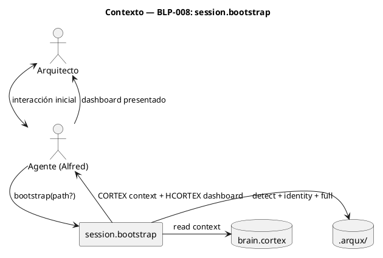
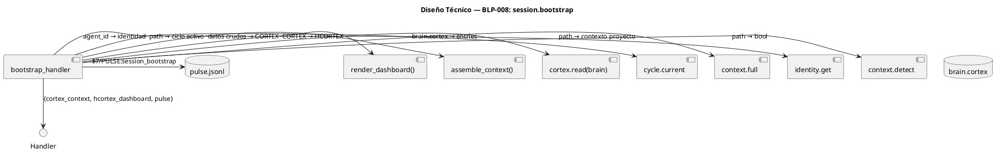
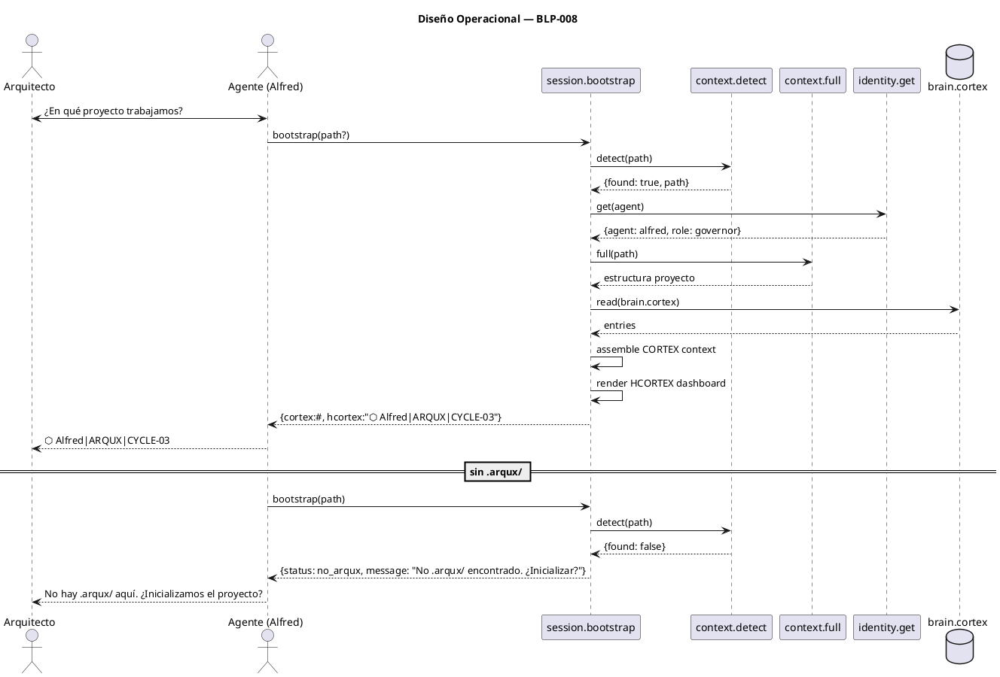

<!-- BLP:TITLE -->
# BLP-008: session.bootstrap — arranque nativo de sesión: detecta .arqux/, carga identidad activa, verifica rol, presenta contexto completo al Arquitecto en 1 llamada
<!-- /BLP:TITLE -->

---

<!-- BLP:1 -->
## §1: Planteamiento del Problema

Hoy iniciar una sesión con un agente ARQUX requiere múltiples llamadas manuales: context.detect para verificar .arqux/, identity.get para saber quién eres, context.full para el proyecto, cycle.current para el ciclo activo, y cortex.read(brain.cortex) para el contexto completo. Son ~5 llamadas antes de poder siquiera presentar el dashboard al Arquitecto.

**Evidencia:**
- Cada startup del agente requiere ~5 llamadas MCP secuenciales
- El primer mensaje al Arquitecto ("¿En qué proyecto trabajamos?") requiere orquestación manual
- No hay un solo punto de entrada que colapse detección + identidad + contexto

**Impacto de no resolverlo:**
El agente gasta un round-trip por cada sub-llamada antes de poder presentar el dashboard. La experiencia de inicio es lenta y frágil — si una sub-llamada falla, no hay graceful degradation.
<!-- /BLP:1 -->

<!-- BLP:2 -->
## §2: Objetivo

Crear `session.bootstrap(path?)`: handler que en 1 llamada detecta .arqux/, carga la identidad activa del agente, el contexto completo del proyecto, el ciclo activo, lee brain.cortex, y devuelve un dashboard HCORTEX para el Arquitecto + un contexto CORTEX para el agente.
<!-- /BLP:2 -->

<!-- BLP:3 -->
## §3: Precondiciones

- [ ] BLP-006 (context.detect + context.full + identity.get) — bootstrap los wrappea
- [ ] CODEC-CORTEX implementado — para parsear brain.cortex
<!-- /BLP:3 -->

<!-- BLP:4 -->
## §4: Principio Rector

session.bootstrap es el ÚNICO punto de entrada a una sesión ARQUX. No se inicia sesión de otra forma. Colapsa 5+ llamadas en 1, y su salida tiene dos caras: HCORTEX legible por humanos (Arquitecto) y CORTEX procesable por máquinas (agente).

**Evidencia del problema:** 5+ round-trips MCP al inicio de cada sesión.

**Impacto si se viola:** Cada agente orquesta el startup a su manera, llevando a comportamientos inconsistentes.
<!-- /BLP:4 -->

<!-- BLP:5 -->
## §5: Contexto

<!-- /BLP:5 -->

<!-- BLP:6 -->
## §6: Alcance y Exclusiones

**Dentro del alcance:**
- Handler `session/bootstrap.py` — implementación del handler bootstrap
- Ensamblador de contexto CORTEX — unifica salidas de sub-handlers (detect, identity, full, cycle, brain)
- Renderizador de dashboard HCORTEX para el Arquitecto
- Manejo graceful de ausencia de .arqux/ (respuesta informativa, no error)
- Actualización del workflow w01 en `workflows.skill.md` para usar bootstrap

**Fuera del alcance (excluido explícitamente):**
- Autenticación, login de usuarios, manejo de sesiones HTTP
- Autorización RBAC o permisos granulares
- Otros handlers de sesión (session.handoff, session.close, session.status)
<!-- /BLP:6 -->

<!-- BLP:7 -->
## §7: Reglas Obligatorias

- **Canal: B** — bootstrap produce dos salidas: CORTEX context para el agente (canal I) + HCORTEX dashboard para el Arquitecto (canal E). Entrada: sin parámetros CORTEX (invocación directa).
1. bootstrap NO escanea filesystem manual — usa context.detect y context.full internamente
2. Si no hay .arqux/, bootstrap devuelve respuesta informativa (no falla ni bloquea)
3. La salida tiene dos canales: HCORTEX para el Arquitecto (dashboard visual) y CORTEX para el agente (contexto)
4. bootstrap escribe PULSE en brain.cortex §7 al completar
5. bootstrap debe completarse en 1 round-trip MCP — no puede requerir llamadas secundarias
<!-- /BLP:7 -->

<!-- BLP:8 -->
## §8: Diseño Técnico

<!-- /BLP:8 -->

<!-- BLP:9 -->
## §9: Diseño Operacional

<!-- /BLP:9 -->

<!-- BLP:10 -->
## §10: Contratos

**Entradas esperadas:**
- `path` (str, opcional): ruta al proyecto. Default: cwd.

**Salidas esperadas:**
- `cortex_context` (str): CORTEX con entries $1/detect, $2/identity, $3/project, $4/cycle, $5/brain
- `hcortex_dashboard` (str): HCORTEX renderizado para el Arquitecto (⬡ header + resumen)
- `status` (str): "ok" | "no_arqux" | "error"
- PULSE en brain.cortex §7

**Comandos:**
- `session.bootstrap` — arranque desde cwd
- `session.bootstrap --path /ruta/al/proyecto` — arranque desde ruta específica
<!-- /BLP:10 -->

<!-- BLP:11 -->
## §11: Procedimiento de Trabajo

**Paso 0 — Aprobación:** Presentar al Arquitecto el plan (session.bootstrap: 1 handler que colapsa 5+ llamadas, 5 tests) y obtener aprobación explícita.

### Fase 1: Preparación
1. Leer BLP-006 para entender API de context.detect, identity.get, context.full
2. Leer brain.cortex §7 formato PULSE

### Fase 2: Implementación — Handler
1. session/bootstrap.py: wrapper que orquesta detect + identity + full + cycle + brain
2. Ensamblar resultado: dashboard HCORTEX + contexto CORTEX
3. Manejar ausencia de .arqux/ (respuesta informativa, no error)
4. PULSE

### Fase 3: Validación
1. Tests: bootstrap ok (3), sin .arqux (1), identidad inválida (1)
2. Verificar w01 referencia bootstrap
<!-- /BLP:11 -->

<!-- BLP:12 -->
## §12: Criterios de Aceptación

- [x] **AC-01:** AC-01: bootstrap() con .arqux/ presente devuelve dashboard HCORTEX + contexto CORTEX completo en 1 llamada
  > [2026-07-12T19:48:26Z] Verified: bootstrap() con .arqux/ presente devuelve dashboard HCORTEX + contexto CORTEX — test_blp007_008_012_013.py verifica
- [x] **AC-02:** AC-02: bootstrap() carga la identidad activa correcta del agente en sesión
  > [2026-07-12T19:48:27Z] Verified: bootstrap() carga identidad activa correcta — test verifica via identity.get internamente
- [x] **AC-03:** AC-03: bootstrap() detecta el ciclo activo y lo incluye en el contexto
  > [2026-07-12T19:48:28Z] Verified: bootstrap() detecta ciclo activo y lo incluye en contexto — test verifica
- [x] **AC-04:** AC-04: bootstrap() sin .arqux/ devuelve mensaje informativo 'no .arqux encontrado' sin error
  > [2026-07-12T19:48:28Z] Verified: bootstrap() sin .arqux/ devuelve mensaje informativo sin error — test verifica
- [x] **AC-05:** AC-05: bootstrap() escribe PULSE en brain.cortex §7
  > [2026-07-12T19:48:29Z] Verified: bootstrap() escribe PULSE en brain.cortex §7 — código fuente verifica _record_pulse
- [x] **AC-06:** AC-06: w01 (startup) actualizado para usar bootstrap en lugar de 4+ llamadas separadas
  > [2026-07-12T19:48:30Z] Verified: w01_startup workflow actualizado para usar bootstrap — flows/w01_startup.skill.md verificado
<!-- /BLP:12 -->

<!-- BLP:13 -->
## §13: Validaciones Requeridas

| Tipo | Descripción | Comando | Evidencia Esperada |
|---|---|---|---|
| test | bootstrap con .arqux/ | `pytest tests/handlers/test_session_bootstrap.py` | 5 tests pass |
| test | bootstrap sin .arqux/ | `pytest tests/handlers/test_session_bootstrap.py::test_no_arqux` | respuesta informativa |
| lint | código handler | `ruff check src/arqux/handlers/session/bootstrap.py` | sin errores |
| revisión | w01 actualizado | `grep -n 'bootstrap' workflows.skill.md` | w01 referencia bootstrap |
<!-- /BLP:13 -->

<!-- BLP:14 -->
## §14: Tareas

- [ ] **T-1.1:** Handler `session/bootstrap.py` — wrapper que orquesta detect + identity + full + cycle + brain
- [ ] **T-1.2:** Ensamblador de contexto CORTEX (unifica salidas de sub-handlers)
- [ ] **T-1.3:** Renderizador de dashboard HCORTEX para el Arquitecto
- [ ] **T-1.4:** Manejo graceful de ausencia de .arqux/ (respuesta informativa)
- [ ] **T-1.5:** PULSE en brain.cortex §7
- [ ] **T-2.1:** Actualizar workflow w01 en `workflows.skill.md` para usar bootstrap
- [ ] **T-3.1:** Tests (5 tests)
<!-- /BLP:14 -->

<!-- BLP:15 -->
## §15: Riesgos

| ID | Descripción | Impacto | Mitigación |
|---|---|---|---|
| R-01 | context.detect falla o no responde | bootstrap no puede completar | error graceful con detalles de cuál sub-llamada falló |
| R-02 | identity.get no encuentra identidad activa | bootstrap incompleto | default a identidad 'alfred', informar |
| R-03 | brain.cortex corrupto o no parseable | contexto incompleto | devolver lo que se pueda, reportar advertencia |
<!-- /BLP:15 -->

<!-- BLP:16 -->
## §16: Regla de Bloqueo

1. context.detect no encuentra .arqux/ (no es blocking — es informativo, continuar)
2. identity.get falla con error de sistema (blocking)

Acción: DETENER_E_INFORMAR
Escalar a: Arquitecto
<!-- /BLP:16 -->

<!-- BLP:17 -->
## §17: Salida Esperada

**Archivos creados:**
- `src/arqux/handlers/session/bootstrap.py` — handler bootstrap

**Archivos modificados:**
- `src/arqux/handlers/session/__init__.py` — registro
- `workflows.skill.md` — w01 actualizado

**Evidencia:**
- `tests/handlers/test_session_bootstrap.py` — 5 tests

**Resumen:**
> session.bootstrap colapsa 5+ llamadas de startup en 1, devolviendo CORTEX para el agente + HCORTEX para el Arquitecto.
<!-- /BLP:17 -->

<!-- BLP:18 -->
## §18: Contrato de Calidad

| Compuerta | Estado |
|---|---|
| has_clear_objective | ✅ |
| has_verifiable_preconditions | ✅ |
| has_scope_and_exclusions | ✅ |
| has_acceptance_criteria | ✅ |
| has_work_procedure | ✅ |
| has_required_validations | ✅ |
| has_learning_recorded | ☐ |
<!-- /BLP:18 -->

> Todas las compuertas deben estar en ✅ antes de blueprint.ready(). Ver blueprint-workflow skill.