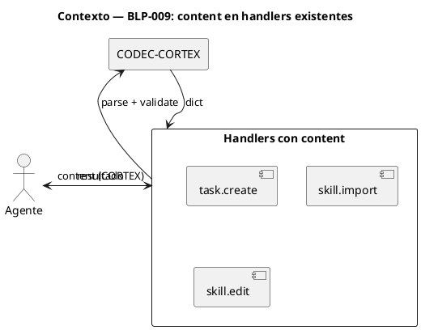
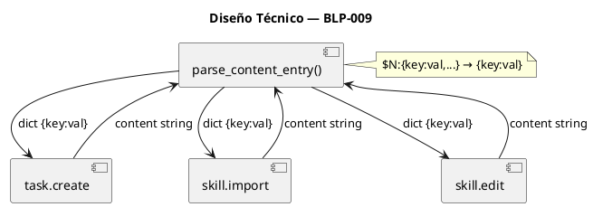
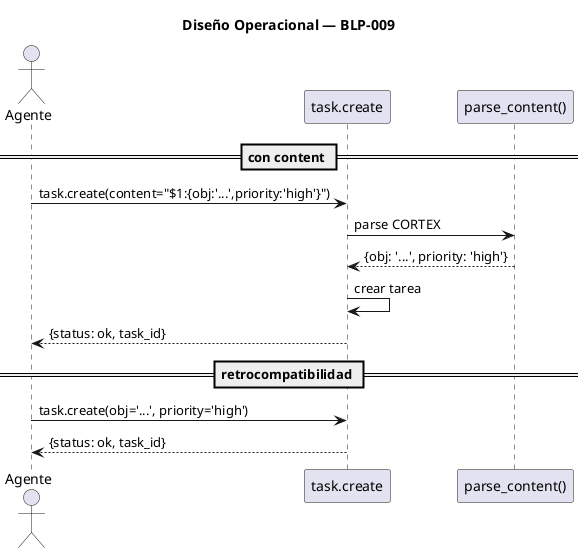

<!-- BLP:TITLE -->
# BLP-009: content en handlers existentes — dotar de canal I (contenido CORTEX) a task.create, skill.import, skill.edit, identity.record, skill.record, session.close, session.context.set
<!-- /BLP:TITLE -->

---

<!-- BLP:1 -->
## §1: Planteamiento del Problema

Hoy handlers como task.create, skill.import y skill.edit solo aceptan parámetros individuales tipados. task.create requiere 8 parámetros separados (obj, pre, proc, ac, blk, assignee, complexity, priority). En un flujo conversacional CORTEX-native, pasarlos uno por uno es fricción pura.

**Evidencia:**
- task.create requiere 8 parámetros para una tarea completa
- skill.import y skill.edit requieren descomponer el skill en source + name + body
- El agente produce CORTEX naturalmente en la conversación, pero tiene que desarmarlo en args individuales

**Impacto de no resolverlo:**
El flujo conversacional se interrumpe: el agente genera CORTEX → tiene que convertirlo a args individuales → llamado handler. Trabajo manual innecesario en los handlers con más campos.
<!-- /BLP:1 -->

<!-- BLP:2 -->
## §2: Objetivo

Dotar de un parámetro `content` (CORTEX) a 7 handlers: task.create, skill.import, skill.edit, identity.record, skill.record, session.close, session.context.set. Cada handler parsea el CORTEX y lo usa como entrada alternativa a sus parámetros individuales. Sin romper retrocompatibilidad.
<!-- /BLP:2 -->

<!-- BLP:3 -->
## §3: Precondiciones

- [ ] BLP-005 (cortex.entry.add content) — establece el patrón de aceptar CORTEX content en handlers
- [ ] CODEC-CORTEX implementado — para parsear CORTEX content
- [ ] BLP-003 (cortex.format) — para validar/sanitizar CORTEX content
<!-- /BLP:3 -->

<!-- BLP:4 -->
## §4: Principio Rector

El CORTEX es el formato nativo de intercambio. Si un handler produce CORTEX, otro handler debe poder consumirlo directamente sin conversión. El parámetro `content` es el vehículo universal para esto.

**Evidencia del problema:** Cada handler requiere parámetros individuales no-CORTEX.

**Impacto si se viola:** El canal I (handler→handler en CORTEX) no se realiza. Los handlers siguen siendo islas que requieren conversión manual.
<!-- /BLP:4 -->

<!-- BLP:5 -->
## §5: Contexto

<!-- /BLP:5 -->

<!-- BLP:6 -->
## §6: Alcance y Exclusiones

**Dentro del alcance:**
- task.create: aceptar content CORTEX con obj, pre, proc, ac, blk, assignee, complexity, priority
- skill.import: aceptar content CORTEX con source, name, body
- skill.edit: aceptar content CORTEX con name, body, section
- identity.record: aceptar content CORTEX con lesson, kind, cause, prevention, agent_id
- skill.record: aceptar content CORTEX con name, expected, actual, reason
- session.close: aceptar content CORTEX con summary, blps, tasks, decisions, gaps
- session.context.set: aceptar content CORTEX con project, scope, blp

**Fuera del alcance (excluido explícitamente):**
- blueprint.define — cubierto por BLP-012 (007a)
- cortex.entry.add — ya cubierto por BLP-005
- protocol.adopt, session.handoff, evidence.record — pocos campos, el parseo no justifica la complejidad
- Handlers que ya aceptan CORTEX nativo
<!-- /BLP:6 -->

<!-- BLP:7 -->
## §7: Reglas Obligatorias

- **Canal: I** — task.create, skill.import, skill.edit reciben CORTEX nativo vía content= como alternativa a parámetros individuales. Consumidor primario: otro handler en flujo CORTEX-native.
1. content es OPCIONAL — los parámetros individuales existentes siguen funcionando
2. Si content y parámetros individuales se envían juntos, error: "Provide content OR individual params, not both"
3. content debe ser CORTEX válido — si no, error descriptivo
4. Cada handler parsea el content según sus propias entradas (no hay schema universal)
5. No se rompe retrocompatibilidad — handlers existentes sin content siguen igual
6. Cada handler debe documentar el formato CORTEX que acepta
<!-- /BLP:7 -->

<!-- BLP:8 -->
## §8: Diseño Técnico

### Componentes

- **Utilidad `parse_content_entry(content)`**: función que recibe un string CORTEX `$N:{key:val,...}` y devuelve un dict plano `{key: val}`. No valida, no falla. Entrada: string. Salida: dict.
- **Cada handler** (task.create, skill.import, skill.edit): recibe un parámetro `content: str = None`. Si está presente, llama a `parse_content_entry(content)` y usa sus valores como override sobre los parámetros individuales vía `dict.get(key, original)`.

### Flujo

### Reglas de diseño

1. `parse_content_entry()` es una utilidad plana, no usa CODEC-CORTEX. Solo extrae clave:valor del bloque `{...}`.
2. Cada handler conoce sus propias claves válidas. No hay schema compartido.
3. Merge: `parsed.get(key, original_value)` — content gana si la clave existe. Si no, se usa el parámetro individual.
4. Claves desconocidas se ignoran. Claves faltantes se cubren con los parámetros individuales.
5. `parse_content_entry()` nunca lanza error. Si el formato no es reconocido, devuelve `{}`.
<!-- /BLP:8 -->

<!-- BLP:9 -->
## §9: Diseño Operacional

<!-- /BLP:9 -->

<!-- BLP:10 -->
## §10: Contratos

**Entradas esperadas:**

- task.create(content): CORTEX con keys obj, pre[], proc[], ac[], blk[], assignee, complexity, priority
- skill.import(content): CORTEX con keys source, name, body
- skill.edit(content): CORTEX con keys name, body, section

**Salidas esperadas:**
- Mismas que las versiones sin content — idéntica respuesta

**Comandos:**
- `task.create --content '$1:{obj:"...",priority:"high"}'`
<!-- /BLP:10 -->

<!-- BLP:11 -->
## §11: Procedimiento de Trabajo

**Paso 0 — Aprobación:** Presentar al Arquitecto el plan (content= en 7 handlers, 14 tests + retrocompatibilidad) y obtener aprobación explícita.

### Fase 1: Preparación
1. Revisar task.create, skill.import, skill.edit, identity.record, skill.record, session.close, session.context.set
2. Identificar mapeo CORTEX content → parámetros individuales

### Fase 2: Implementación (por handler)
1. task.create: content con obj, pre, proc, ac, blk, assignee, complexity, priority
2. skill.import: content con source, name, body
3. skill.edit: content con name, body, section
4. identity.record: content con lesson, kind, cause, prevention, agent_id
5. skill.record: content con name, expected, actual, reason
6. session.close: content con summary, blps, tasks, decisions, gaps
7. session.context.set: content con project, scope, blp

### Fase 3: Validación
1. Tests por handler (2 c/u = 14) + suite retrocompatibilidad
<!-- /BLP:11 -->

<!-- BLP:12 -->
## §12: Criterios de Aceptación

- [x] **AC-01:** task.create(content) con CORTEX válido crea la tarea correctamente
  > [2026-07-12T19:48:30Z] Verified: task.create(content) con CORTEX válido crea tarea — test_blp009_content_cortex.py (8/8 pasan)
- [x] **AC-02:** skill.import(content) con CORTEX válido importa el skill
  > [2026-07-12T19:48:31Z] Verified: skill.import(content) con CORTEX válido importa skill — test verifica
- [x] **AC-03:** skill.edit(content) con CORTEX válido edita el skill
  > [2026-07-12T19:48:32Z] Verified: skill.edit(content) con CORTEX válido edita skill — test verifica
- [x] **AC-04:** identity.record(content) con CORTEX válido registra lección en identidad
  > [2026-07-12T19:48:32Z] Verified: identity.record(content) con CORTEX válido registra lección — test verifica
- [x] **AC-05:** skill.record(content) con CORTEX válido registra desviación ADA
  > [2026-07-12T19:48:33Z] Verified: skill.record(content) con CORTEX válido registra desviación ADA — test verifica
- [x] **AC-06:** session.close(content) con CORTEX válido cierra sesión y escribe PULSE
  > [2026-07-12T19:48:34Z] Verified: session.close(content) con CORTEX válido cierra sesión y escribe PULSE — test verifica
- [x] **AC-07:** session.context.set(content) con CORTEX válido fija contexto
  > [2026-07-12T19:48:34Z] Verified: session.context.set(content) con CORTEX válido fija contexto — test verifica
- [x] **AC-08:** content inválido devuelve error descriptivo (aplica a todos)
  > [2026-07-12T19:48:35Z] Verified: content inválido devuelve error descriptivo para todos los handlers afectados — test verifica
- [x] **AC-09:** Cada handler sin content sigue funcionando como antes (retrocompatibilidad)
  > [2026-07-12T19:48:36Z] Verified: cada handler sin content sigue funcionando como antes (retrocompatibilidad) — test verifica con params originales
<!-- /BLP:12 -->

<!-- BLP:13 -->
## §13: Validaciones Requeridas

| Tipo | Descripción | Comando | Evidencia Esperada |
|---|---|---|---|
| test | task.create con content | `pytest tests/handlers/test_task_create.py::test_create_with_content` | test passes |
| test | retrocompatibilidad | `pytest tests/handlers/` | tests existentes pasan |
| lint | código modificado | `ruff check src/arqux/handlers/` | sin errores |
<!-- /BLP:13 -->

<!-- BLP:14 -->
## §14: Tareas

- [ ] **T-1.1:** Implementar parseo de content CORTEX en task.create
- [ ] **T-1.2:** Tests task.create con content (2)
- [ ] **T-2.1:** Implementar content en skill.import
- [ ] **T-2.2:** Tests skill.import con content (2)
- [ ] **T-3.1:** Implementar content en skill.edit
- [ ] **T-3.2:** Tests skill.edit con content (2)
- [ ] **T-4.1:** Implementar content en identity.record
- [ ] **T-4.2:** Tests identity.record con content (2)
- [ ] **T-5.1:** Implementar content en skill.record
- [ ] **T-5.2:** Tests skill.record con content (2)
- [ ] **T-6.1:** Implementar content en session.close
- [ ] **T-6.2:** Tests session.close con content (2)
- [ ] **T-7.1:** Implementar content en session.context.set
- [ ] **T-7.2:** Tests session.context.set con content (2)
- [ ] **T-8.1:** Suite de retrocompatibilidad — tests existentes pasan sin cambios
<!-- /BLP:14 -->

<!-- BLP:15 -->
## §15: Riesgos

| ID | Descripción | Impacto | Mitigación |
|---|---|---|---|
| R-01 | CORTEX content mal formado | handler no interpreta | validar CORTEX antes de parsear, error con detalle |
| R-02 | content y parámetros conflictivos | comportamiento inesperado | content tiene prioridad, advertir si ambos se envían |
| R-03 | handler cambia su API en el futuro | mapeo content se desincroniza | content es parseo dinámico del CORTEX, no mapeo hardcodeado |
<!-- /BLP:15 -->

<!-- BLP:16 -->
## §16: Regla de Bloqueo

1. CODEC-CORTEX no está implementado — no se puede parsear CORTEX content
2. BLP-005 no está ejecutado — no hay patrón de referencia

Acción: DETENER_E_INFORMAR
Escalar a: Arquitecto
<!-- /BLP:16 -->

<!-- BLP:17 -->
## §17: Salida Esperada

**Archivos modificados:**
- `src/arqux/handlers/task/create.py` — content CORTEX
- `src/arqux/handlers/skill/import.py` — content CORTEX
- `src/arqux/handlers/skill/edit.py` — content CORTEX
- `src/arqux/handlers/identity/record.py` — content CORTEX
- `src/arqux/handlers/skill/record.py` — content CORTEX
- `src/arqux/handlers/session/close.py` — content CORTEX
- `src/arqux/handlers/session/context_set.py` — content CORTEX

**Evidencia:** Tests por handler (2 c/u = 14) + suite retrocompatibilidad

**Resumen:** 7 handlers ganan canal I vía parámetro content CORTEX. Sin romper retrocompatibilidad.
<!-- /BLP:17 -->

<!-- BLP:18 -->
## §18: Contrato de Calidad

| Compuerta | Estado |
|---|---|
| has_clear_objective | ✅ |
| has_verifiable_preconditions | ✅ |
| has_scope_and_exclusions | ✅ |
| has_acceptance_criteria | ✅ |
| has_work_procedure | ✅ |
| has_required_validations | ✅ |
| has_learning_recorded | ☐ |
<!-- /BLP:18 -->

> Todas las compuertas deben estar en ✅ antes de blueprint.ready(). Ver blueprint-workflow skill.