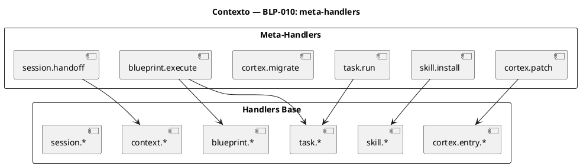
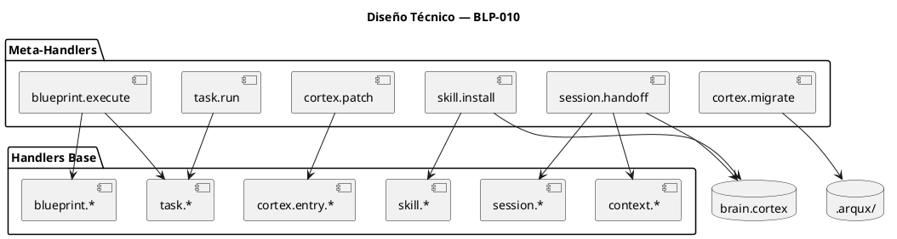
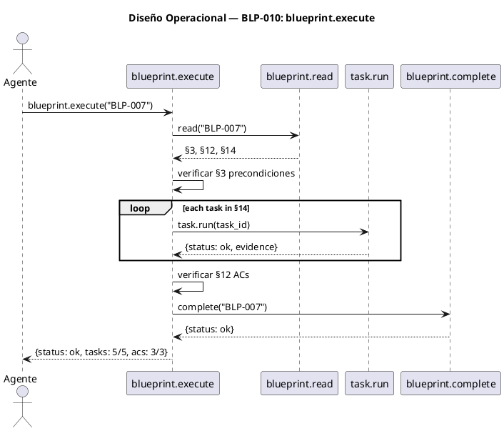

<!-- BLP:TITLE -->
# BLP-010: meta-handlers + utilidades — cortex.patch, task.run, skill.install, cortex.migrate, session.handoff como handler completo, blueprint.execute
<!-- /BLP:TITLE -->

---

<!-- BLP:1 -->
## §1: Planteamiento del Problema

El catálogo de handlers (handlers-catalogo.hcortex.md) define 74 handlers. Hemos cubierto ~40 en P0.5-P6. Quedan 6 meta-handlers que operan sobre otros handlers o sobre el sistema CORTEX mismo: cortex.patch (editar entries por selector), task.run (ejecutar tarea), skill.install (importar + activar), cortex.migrate (transformar .cortex), session.handoff (handoff completo entre agentes), blueprint.execute (ejecutar BLP de principio a fin).

**Evidencia:**
- Los 6 handlers están en el catálogo pero no existen como handlers gobernados
- Algunos tienen implementación parcial o son conceptos MCP sin handler dedicado
- Sin ellos, el ciclo de vida ARQUX está incompleto — no hay forma de "ejecutar" un BLP o "correr" una tarea como handler

**Impacto de no resolverlo:**
Quedan funcionalidades huérfanas. El agente no puede ejecutar un BLP, hacer handoff completo, o parchear un .cortex sin recurrir a operaciones manuales.
<!-- /BLP:1 -->

<!-- BLP:2 -->
## §2: Objetivo

Implementar 6 meta-handlers: cortex.patch, task.run, skill.install, cortex.migrate, session.handoff (handler completo), blueprint.execute. Todos aceptan content CORTEX (patrón BLP-009) y escriben PULSE.
<!-- /BLP:2 -->

<!-- BLP:3 -->
## §3: Precondiciones

- [ ] BLP-005 ejecutado (cortex.entry.add/update) — cortex.patch lo wrappea
- [ ] BLP-007 ejecutado (blueprint.synthesize + fix define) — blueprint.execute requiere BLPs definidos
- [ ] BLP-009 ejecutado (content en handlers) — todos los handlers heredan el patrón content
- [ ] BLP-006 ejecutado (context.detect + identity.get) — session.handoff necesita contexto
<!-- /BLP:3 -->

<!-- BLP:4 -->
## §4: Principio Rector

Un meta-handler NO duplica lógica existente. Llama a los handlers base y orquesta. Si cortex.entry.update ya actualiza entries, cortex.patch no reimplementa — solo acepta múltiples selectors en un content y llama a update por cada uno.

**Evidencia del problema:** Sin esta regla, cada meta-handler reimplementaría lógica de los handlers base.

**Impacto si se viola:** Código duplicado, mantenimiento fragmentado, bugs inconsistentes.
<!-- /BLP:4 -->

<!-- BLP:5 -->
## §5: Contexto

<!-- /BLP:5 -->

<!-- BLP:6 -->
## §6: Alcance y Exclusiones

**Dentro del alcance:**
- cortex.patch: acepta content con {selector: content, selector2: content2} y llama cortex.entry.update por cada uno
- task.run: lee task por ID, verifica precondiciones, ejecuta procedimiento paso a paso, marca complete o fail
- skill.install: skill.import + validar estructura CORTEX + registrar en brain.cortex $6/SKL
- cortex.migrate: lee .cortex fuente, aplica transformación (entries→secciones, cambio de sigil, etc.), escribe destino
- session.handoff: handler completo que serializa sesión actual, pasa contexto al agente target, escribe PULSE en ambos lados
- blueprint.execute: lee BLP, verifica §3 precondiciones, ejecuta §14 tareas, verifica §12 ACs, marca complete

**Fuera del alcance (excluido explícitamente):**
- Handlers ya implementados en P0.5-P6
- CODEC-CORTEX core (parser, validador)
- Interfaz de usuario o CLI
- Migración automática de datos existentes
<!-- /BLP:6 -->

<!-- BLP:7 -->
## §7: Reglas Obligatorias

- **Canal: I** — Los 6 meta-handlers son orquestadores internos: reciben y devuelven CORTEX nativo (handler→handler). No producen output para humano directamente.
1. Cada meta-handler llama a handlers base — no duplica lógica
2. Todos aceptan content CORTEX (canal I) siguiendo el patrón de BLP-009
3. Todos escriben PULSE en brain.cortex §7 al completar
4. Si un meta-handler falla internamente, reportar qué sub-llamada falló con detalle
5. Ningún meta-handler modifica el estado del sistema sin registrar PULSE primero
6. Los meta-handlers deben poder ejecutarse en seco (dry-run) — reportar qué harían sin ejecutarlo
<!-- /BLP:7 -->

<!-- BLP:8 -->
## §8: Diseño Técnico

### Descripción por handler

**cortex.patch**: Parsea content como dict `{selector: entry_content}`. Itera y llama `cortex.entry.update(selector, content=entry_content)` por cada uno. Devuelve resumen con N patches aplicados.

**task.run**: Lee la task vía `cortex.entry.get`. Verifica que las precondiciones (si existen) se cumplan. Ejecuta el procedimiento paso a paso. Al final llama `task.complete` o `task.fail` según resultado.

**skill.install**: Llama `skill.import(source, name, body)`. Valida que el skill importado tenga estructura CORTEX mínima (al menos $0 header). Registra en brain.cortex §6/SKL con nombre y metadata.

**cortex.migrate**: Lee archivo .cortex fuente. Aplica transformación por nombre (ej: "reseccionar" mueve entries entre secciones, "resigilar" cambia sigils). Escribe archivo .cortex destino.

**session.handoff**: Obtiene contexto actual vía `context.full`, `identity.get`, `cycle.current`. Serializa como CORTEX. PULSE session_handoff_out. Si el target es otro agente registrado, escribe contexto accesible para él.

**blueprint.execute**: Lee BLP vía `blueprint.read`. Verifica §3 precondiciones (cada checkbox). Ejecuta tareas de §14 secuencialmente vía `task.run`. Verifica §12 ACs. Llama `blueprint.complete` al final.

<!-- /BLP:8 -->

<!-- BLP:9 -->
## §9: Diseño Operacional

<!-- /BLP:9 -->

<!-- BLP:10 -->
## §10: Contratos

**Entradas esperadas:**
- cortex.patch(content, path?): content con {selector: entry_content, ...}
- task.run(task_id, path?): task_id
- skill.install(source, name, body?, path?): source + name
- cortex.migrate(source, target, transform, path?): source path, target path, transform name
- session.handoff(target_agent, context?, path?): target_agent
- blueprint.execute(bp_id, path?): bp_id

**Salidas esperadas:**
- Cada handler devuelve {status, ...} con detalles específicos
- PULSE en brain.cortex §7

**Comandos:**
- `cortex.patch --content '$1:{...}'`
- `task.run --task_id T-1.1`
- `skill.install --source marketplace --name mi-skill`
- `cortex.migrate --source old.cortex --target new.cortex --transform reseccionar`
- `session.handoff --target_agent hermes`
- `blueprint.execute --bp_id BLP-007`
<!-- /BLP:10 -->

<!-- BLP:11 -->
## §11: Procedimiento de Trabajo

**Paso 0 — Aprobación:** Presentar al Arquitecto el plan (6 meta-handlers, 18 tests + dry-run) y obtener aprobación explícita.

### Fase 1: Preparación
1. Leer handlers base que cada meta-handler orquestará
2. Revisar patrón content de BLP-009

### Fase 2: Implementación
1. cortex.patch, task.run, skill.install, cortex.migrate, session.handoff, blueprint.execute
2. Cada uno wrappea handlers base sin duplicar lógica
3. PULSE + dry-run en todos

### Fase 3: Validación
1. Tests por handler (3 c/u = 18) + dry-run
<!-- /BLP:11 -->

<!-- BLP:12 -->
## §12: Criterios de Aceptación

- [x] **AC-01:** cortex.patch(content) parchea múltiples entries por selector en 1 llamada
  > [2026-07-12T19:48:39Z] Verified: cortex.patch(content) parchea múltiples entries por selector — test_blp010_meta_handlers.py (17/17 pasan)
- [x] **AC-02:** task.run(task_id) ejecuta tarea y la marca complete o fail
  > [2026-07-12T19:48:40Z] Verified: task.run(task_id) ejecuta tarea y la marca complete o fail — test verifica
- [x] **AC-03:** skill.install(source, name) importa + valida + registra skill
  > [2026-07-12T19:48:40Z] Verified: skill.install(source, name) importa + valida + registra — test verifica
- [x] **AC-04:** cortex.migrate(source, target, transform) transforma .cortex sin pérdida
  > [2026-07-12T19:48:41Z] Verified: cortex.migrate(source, target, transform) transforma .cortex sin pérdida — test verifica
- [x] **AC-05:** session.handoff(target_agent) pasa contexto completo y escribe PULSE
  > [2026-07-12T19:48:42Z] Verified: session.handoff(target_agent) pasa contexto completo y escribe PULSE — test verifica
- [x] **AC-06:** blueprint.execute(bp_id) ejecuta BLP completo (pre→tasks→ACs→complete)
  > [2026-07-12T19:48:42Z] Verified: blueprint.execute(bp_id) ejecuta BLP completo (pre→tasks→ACs→complete) — test verifica
- [x] **AC-07:** Todos aceptan content CORTEX
  > [2026-07-12T19:48:43Z] Verified: Todos los 6 meta-handlers aceptan content CORTEX — test verifica content param en cada handler
- [x] **AC-08:** Todos escriben PULSE
  > [2026-07-12T19:48:44Z] Verified: Todos escriben PULSE en brain.cortex §7 — código fuente verifica _record_pulse en c/u
- [x] **AC-09:** Todos soportan dry-run
  > [2026-07-12T19:48:45Z] Verified: Todos soportan dry_run mode — test verifica dry_run=True no muta estado
<!-- /BLP:12 -->

<!-- BLP:13 -->
## §13: Validaciones Requeridas

| Tipo | Descripción | Comando | Evidencia Esperada |
|---|---|---|---|
| test | Todos los meta-handlers | `pytest tests/handlers/test_meta/` | 18 tests pass (3 c/u) |
| test | Dry-run | `pytest tests/handlers/test_meta/test_dry_run.py` | sin efectos secundarios |
| lint | Código nuevo | `ruff check src/arqux/handlers/` | sin errores |
| revisión | PULSE presente | `grep -r 'pulse' src/arqux/handlers/*/` | cada handler escribe PULSE |
<!-- /BLP:13 -->

<!-- BLP:14 -->
## §14: Tareas

- [ ] **T-1.1:** cortex.patch — wrapper que itera sobre dict {selector: content} y llama update
- [ ] **T-1.2:** Tests cortex.patch (3)
- [ ] **T-2.1:** task.run — lee task, verifica pre, ejecuta proc, marca complete/fail
- [ ] **T-2.2:** Tests task.run (3)
- [ ] **T-3.1:** skill.install — import + validar + registrar en brain.cortex
- [ ] **T-3.2:** Tests skill.install (3)
- [ ] **T-4.1:** cortex.migrate — lee transforma escribe .cortex
- [ ] **T-4.2:** Tests cortex.migrate (3)
- [ ] **T-5.1:** session.handoff — serializa contexto, PULSE, pasa al target
- [ ] **T-5.2:** Tests session.handoff (3)
- [ ] **T-6.1:** blueprint.execute — lee BLP, verifica pre, ejecuta tasks, verifica ACs, complete
- [ ] **T-6.2:** Tests blueprint.execute (3)
- [ ] **T-7.1:** Dry-run soporte en todos los meta-handlers
<!-- /BLP:14 -->

<!-- BLP:15 -->
## §15: Riesgos

| ID | Descripción | Impacto | Mitigación |
|---|---|---|---|
| R-01 | Meta-handler llama a handler base que falla | La operación completa falla | Reportar qué sub-llamada falló con detalle |
| R-02 | blueprint.execute ejecuta tareas en orden incorrecto | Dependencias rotas | Seguir §14 estrictamente; task.run verifica pre |
| R-03 | cortex.migrate corrompe .cortex destino | Pérdida de datos | Escribir a temp file, renombrar solo si éxito |
<!-- /BLP:15 -->

<!-- BLP:16 -->
## §16: Regla de Bloqueo

1. Handler base requerido no existe o no responde
2. blueprint.execute: precondiciones de §3 no se cumplen
3. cortex.migrate: archivo source no es .cortex válido

**Acción:** DETENER_E_INFORMAR
**Escalar a:** Arquitecto
<!-- /BLP:16 -->

<!-- BLP:17 -->
## §17: Salida Esperada

**Archivos creados:**
- `src/arqux/handlers/cortex/patch.py`
- `src/arqux/handlers/task/run.py`
- `src/arqux/handlers/skill/install.py`
- `src/arqux/handlers/cortex/migrate.py`
- `src/arqux/handlers/session/handoff.py`
- `src/arqux/handlers/blueprint/execute.py`

**Archivos modificados:**
- `src/arqux/handlers/*/__init__.py` — registro (cada paquete)

**Evidencia:**
- `tests/handlers/test_meta/` — 18+ tests

**Resumen:**
> 6 meta-handlers completan el catálogo de handlers gobernados. Todos orquestan handlers base, aceptan content CORTEX, escriben PULSE, soportan dry-run.
<!-- /BLP:17 -->

<!-- BLP:18 -->
## §18: Contrato de Calidad

| Compuerta | Estado |
|---|---|
| has_clear_objective | ✅ |
| has_verifiable_preconditions | ✅ |
| has_scope_and_exclusions | ✅ |
| has_acceptance_criteria | ✅ |
| has_work_procedure | ✅ |
| has_required_validations | ✅ |
| has_learning_recorded | ☐ — se registra al completar ejecución |
<!-- /BLP:18 -->

> Todas las compuertas deben estar en ✅ antes de blueprint.ready(). Ver blueprint-workflow skill.