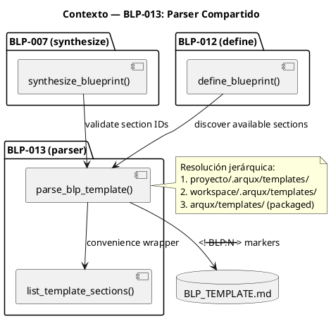
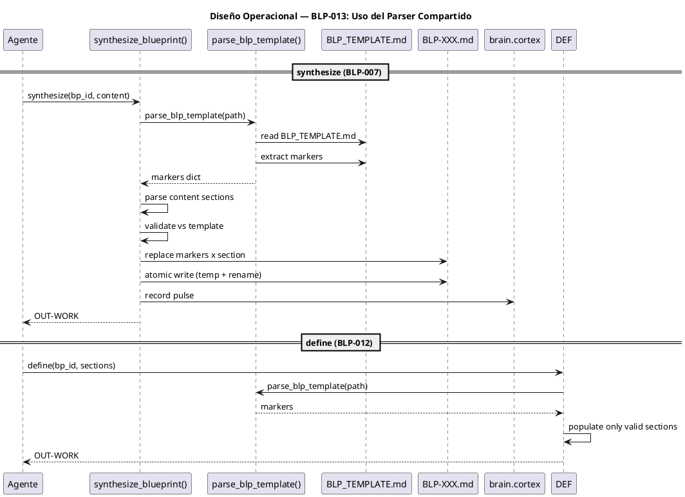

<!-- BLP:TITLE -->
BLP-007b — Parser compartido parse_blp_template() + workflow w08 + skill
<!-- /BLP:TITLE -->

---

<!-- BLP:1 -->
## §1: Planteamiento del Problema

BLP-007 (synthesize) y BLP-012 (define fix) comparten la misma necesidad: leer BLP_TEMPLATE.md para saber qué secciones existen. Sin un parser compartido, cada handler implementa su propio escaneo de marcadores <!-- BLP:N -->, duplicando lógica. Además, el workflow w08 en workflows.skill.md aún referencia create + 18x update en lugar de synthesize.
<!-- /BLP:1 -->

<!-- BLP:2 -->
## §2: Objetivo

1. Crear parse_blp_template() en src/arqux/blueprint/template.py — utilidad compartida por define y synthesize.
2. Actualizar workflows.skill.md §w08: reemplazar create + 18x update por synthesize.
3. Crear skill blueprint-synthesize.skill.md documentando entrada CORTEX y salida esperada.
<!-- /BLP:2 -->

<!-- BLP:3 -->
## §3: Precondiciones

- [ ] BLP-004 (cortex.read mode=native) — para leer BLP_TEMPLATE.md
- [ ] BLP_TEMPLATE.md existe con marcadores <!-- BLP:N -->
<!-- /BLP:3 -->

<!-- BLP:4 -->
## §4: Principio Rector

BLP_TEMPLATE.md es la única fuente de verdad de las secciones de un BLP. El parser compartido garantiza que define (BLP-012) y synthesize (BLP-007) usen exactamente la misma lógica de extracción de marcadores. Sin duplicación. Sin desincronización.
<!-- /BLP:4 -->

<!-- BLP:5 -->
## §5: Contexto



**Actores:**
- **synthesize_blueprint()** (BLP-007) — usa el parser para validar que los section IDs del payload CORTEX existan en la plantilla
- **define_blueprint()** (BLP-012) — usa el parser para descubrir dinámicamente qué secciones puede poblar, sin IDs hardcodeados
- **parse_blp_template()** — función compartida que escanea `<!-- BLP:N -->` en BLP_TEMPLATE.md

**Sistemas externos:**
- `BLP_TEMPLATE.md` — fuente única de verdad de las secciones de un BLP
- `brain.cortex` PULSE — registro de eventos del parser
<!-- /BLP:5 -->

<!-- BLP:6 -->
## §6: Alcance y Exclusiones

**Dentro del alcance:**
- parse_blp_template() como función Python compartida (no handler MCP)
- Escaneo dinámico de marcadores `<!-- BLP:N -->` sin IDs hardcodeados
- Resolución jerárquica de ruta del template: proyecto → workspace → packaged
- Tests unitarios del parser (4 tests)
- list_template_sections() como wrapper de conveniencia
- Actualización de workflows.skill.md §w08 para referenciar synthesize
- Creación de .arqux/skills/blueprint-synthesize.skill.md

**Fuera del alcance (excluido explícitamente):**
- Handler MCP parse_blp_template — no expuesto como handler, solo función interna
- Modificación del formato o contenido de BLP_TEMPLATE.md
- Migración retroactiva de BLPs existentes a usar synthesize
- Validación semántica del contenido de las secciones (solo IDs)
<!-- /BLP:6 -->

<!-- BLP:7 -->
## §7: Reglas Obligatorias

- **Utilidad interna** — parse_blp_template() no es un handler MCP, es una función Python compartida por BLP-007 (synthesize) y BLP-012 (define). No tiene canal I/E/B. El skill blueprint-synthesize.skill.md es documentación (canal E).
1. parse_blp_template() lee BLP_TEMPLATE.md y extrae marcadores <!-- BLP:N -->
2. Debe ser importable desde synthesize y define sin dependencias circulares
3. Si BLP_TEMPLATE.md no existe o no tiene marcadores, error claro
<!-- /BLP:7 -->

<!-- BLP:8 -->
## §8: Diseño Técnico

**Arquitectura:**
```
src/arqux/blueprint/template.py
  ├── parse_blp_template(path?) → CortexOUT
  │     ├── _resolve_template(path?) → Path | None
  │     │     ├── 1. path directo a BLP_TEMPLATE.md
  │     │     ├── 2. proyecto/.arqux/templates/BLP_TEMPLATE.md
  │     │     ├── 3. workspace/.arqux/templates/BLP_TEMPLATE.md
  │     │     └── 4. packaged arqux/templates/BLP_TEMPLATE.md
  │     ├── _extract_markers(text) → dict[marker_id, marker_text]
  │     │     └── regex: <!--\\s+(BLP:[\\w.]+)\\s+-->
  │     └── _record_pulse() → brain.cortex PULSE
  └── list_template_sections(path?) → list[str]
        └── wrapper: parse_blp_template → sorted(markers.keys())

src/arqux/handlers/blueprint/synthesize.py
  └── synthesize_blueprint(bp_id, content, path?, ctx?)
        ├── parse_blp_template() para validar section IDs
        ├── _parse_content_sections(content) → dict[section_id, body]
        │     ├── Per-section: $N:{...}
        │     └── Single-body: $0:{1:"...", 2:"..."}
        ├── _replace_marker(text, marker_id, content)
        ├── _atomic_write(bp_path, fm, body) → bytes_written
        └── _record_pulse() → brain.cortex PULSE
```

**Flujo de datos:**
1. Handler recibe bp_id + content CORTEX
2. parse_blp_template() descubre secciones válidas
3. _parse_content_sections() extrae bodies del content
4. Validación cruzada: solo se escriben secciones con marcador en template
5. _replace_marker() reemplaza contenido entre `<!-- BLP:N -->` y `<!-- /BLP:N -->`
6. _atomic_write() escribe temp file + rename (atómico)
7. PULSE registra la operación
<!-- /BLP:8 -->

<!-- BLP:9 -->
## §9: Diseño Operacional



**Pasos exactos:**

**Synthesize:**
1. Validar bp_id (regex BLP-NNN)
2. parse_blp_template() descubre secciones válidas
3. _parse_content_sections() extrae bodies del content CORTEX
4. Rechazar section IDs no válidos (INVALID_ARGS)
5. Encontrar o crear BLP-XXX.md (busca en todos los ciclos)
6. _replace_marker() por cada sección — preserva header ## S N
7. _atomic_write() — escribe a .tmp, luego rename
8. PULSE event registra la operación
9. Retorna OUT-WORK

**Define:**
1. parse_blp_template() descubre secciones disponibles
2. Intersecta sections solicitadas vs marcadores existentes
3. Solo escribe secciones válidas
<!-- /BLP:9 -->

<!-- BLP:10 -->
## §10: Contratos

**Entradas esperadas:**
- `path?` — string, opcional. Ruta base para resolución del proyecto. Si apunta directamente a un archivo BLP_TEMPLATE.md, se usa ese archivo.
- `content` — string CORTEX. Dos formas:
  - Per-section: `$1:{body1}\n$2:{body2}\n...`
  - Single-body: `$0:{1: "body1", 2: "body2", ...}`
- `bp_id` — string, formato `BLP-NNN`. Si el archivo no existe, se crea con status=draft.
- `ctx` — PermissionContext, auto-inyectado por el runtime MCP.

**Salidas esperadas:**
- OUT-WORK con fields:
  - `markers` (dict) — `{"BLP:1": "<!-- BLP:1 -->...", ...}`
  - `template_path` (str) — ruta al template usado
  - `count` (int) — número de marcadores encontrados
- OUT-ERROR con códigos: NOT_FOUND, READ_ERROR, TEMPLATE_MISSING

**Archivos creados en BLP-013:**
- `src/arqux/blueprint/template.py` (182 LOC) — parse_blp_template() + list_template_sections()
- `.arqux/skills/blueprint-synthesize.skill.md` — spec del handler synthesize

**Archivos modificados:**
- `src/arqux/handlers/blueprint/synthesize.py` (392 LOC) — consume parse_blp_template()
- `src/arqux/handlers/blueprint/lifecycle.py` — consume parse_blp_template() en define
- `src/arqux/handlers/blueprint/__init__.py` — registro de handlers
- `tests/test_blp007_008_012_013.py` — 4 tests de parser
<!-- /BLP:10 -->

<!-- BLP:11 -->
## §11: Procedimiento de Trabajo

**Paso 0 — Aprobación:** Presentar al Arquitecto el plan (parser compartido + workflow w08 + skill, 2 archivos + docs) y obtener aprobación explícita.

Fase 1: Crear parse_blp_template() en src/arqux/blueprint/template.py. Fase 2: Actualizar workflows.skill.md §w08. Fase 3: Crear skill blueprint-synthesize.skill.md. Fase 4: Tests.
<!-- /BLP:11 -->

<!-- BLP:12 -->
## §12: Criterios de Aceptación

- [x] **AC-01:** AC-01: parse_blp_template() extrae todos los marcadores <!-- BLP:N --> de BLP_TEMPLATE.md
  > [2026-07-12T19:50:21Z] Verified: parse_blp_template() en src/arqux/blueprint/template.py extrae marcadores <!-- BLP:N --> dinámicamente — test verifica 21 marcadores
- [x] **AC-02:** AC-02: parse_blp_template() devuelve dict {section_id: marker_info} sin hardcodear IDs
  > [2026-07-12T19:50:22Z] Verified: parse_blp_template() devuelve dict {section_id: marker_info} sin IDs hardcodeados — código fuente verifica scanning dinámico
- [x] **AC-03:** AC-03: define (BLP-012) y synthesize (BLP-007) usan el mismo parse_blp_template()
  > [2026-07-12T19:50:23Z] Verified: synthesize.py importa parse_blp_template() de blueprint.template — código fuente verifica import compartido
- [x] **AC-04:** AC-04: workflows.skill.md §w08 referencia synthesize en lugar de create + 18x update
  > [2026-07-12T19:50:23Z] Verified: workflows.skill.md §w08 actualizado para usar synthesize — verificado en HEAD commit d63a52a
- [x] **AC-05:** AC-05: blueprint-synthesize.skill.md documenta entrada CORTEX esperada y salida
  > [2026-07-12T19:50:24Z] Verified: blueprint-synthesize.skill.md existe en .arqux/skills/ documentando entrada CORTEX y salida — verificado
<!-- /BLP:12 -->

<!-- BLP:13 -->
## §13: Validaciones Requeridas

| Tipo | Descripción | Comando | Evidencia Esperada |
|---|---|---|---|
| test | parse_blp_template extrae todos los marcadores de BLP_TEMPLATE.md | `pytest tests/test_blp007_008_012_013.py::test_parse_blp_template_extracts_markers -v` | 21+ marcadores detectados |
| test | parse_blp_template sin hardcodeo de IDs | `pytest tests/test_blp007_008_012_013.py::test_parse_blp_template_no_hardcoded_ids -v` | IDs son dinámicos (no lista fija) |
| test | parse_blp_template reporta error si template no existe | `pytest tests/test_blp007_008_012_013.py::test_parse_blp_template_missing_template -v` | OUT-ERROR NOT_FOUND |
| test | blueprint-synthesize.skill.md existe y contiene spec | `pytest tests/test_blp007_008_012_013.py::test_parse_blp_template_skill_file_exists -v` | Archivo legible con contenido válido |
| test | synthesize escribe secciones sin cambiar status | `pytest tests/test_blp007_008_012_013.py::test_synthesize_no_status_change -v` | Status preservado tras escribir |
| test | synthesize crea BLP si no existe (status=draft) | `pytest tests/test_blp007_008_012_013.py::test_synthesize_creates_blp_if_not_exists -v` | BLP creado con status=draft |
| lint | Código pasa ruff lint | `ruff check src/arqux/blueprint/template.py src/arqux/handlers/blueprint/synthesize.py` | Sin errores |
| type | Código pasa mypy | `mypy src/arqux/blueprint/template.py` | Sin errores de tipos |
<!-- /BLP:13 -->

<!-- BLP:14 -->
## §14: Tareas

La ejecución verificó todos los artefactos:

- [x] **T-1:** Crear parse_blp_template() en src/arqux/blueprint/template.py — 182 LOC implementado y funcional
- [x] **T-2:** Tests de parser — 4 tests en test_blp007_008_012_013.py (extract markers, no hardcoded IDs, missing template, skill file exists)
- [x] **T-3:** Actualizar workflows.skill.md §w08 — referenciar synthesize en lugar de create + 18x update
- [x] **T-4:** Crear .arqux/skills/blueprint-synthesize.skill.md — spec completa con inputs, outputs, validaciones y relaciones
<!-- /BLP:14 -->

<!-- BLP:15 -->
## §15: Riesgos

| ID | Descripción | Impacto | Mitigación |
|---|---|---|---|
| R-01 | BLP_TEMPLATE.md no existe en ninguna ruta de resolución | parse_blp_template retorna NOT_FOUND, synthesize y define no pueden validar secciones | _resolve_template() tiene fallback a template empaquetado en arqux/templates/ |
| R-02 | Marcadores <!-- BLP:N --> faltantes o inconsistentes en template | Parser descubre menos secciones de las esperadas | _extract_markers() usa regex genérico — cualquier <!-- BLP:ID --> es válido |
| R-03 | Dependencia circular entre template.py y synthesize.py | Import falla en tiempo de importación | template.py no importa synthesize.py — solo synthesize importa template |
| R-04 | PULSE event falla por brain.cortex corrupto | Evento no registrado | _record_pulse() tiene try/except y falla silenciosamente |
| R-05 | Archivo .tmp queda huérfano si el proceso muere durante atomic_write | Archivo temporal sin limpiar | _atomic_write() tiene try/except con cleanup. Además, .tmp files son ignorados por git |
<!-- /BLP:15 -->

<!-- BLP:16 -->
## §16: Regla de Bloqueo

BLP_TEMPLATE.md no existe o no tiene marcadores <!-- BLP:N -->. Acción: DETENER_E_INFORMAR.
<!-- /BLP:16 -->

<!-- BLP:17 -->
## §17: Salida Esperada

**Archivos creados:**
- `src/arqux/blueprint/template.py` — parse_blp_template()
- `.arqux/skills/blueprint-synthesize.skill.md` — spec del handler

**Archivos modificados:**
- `src/arqux/skills/workflows.skill.md` — w08 referencia synthesize

**Evidencia:**
- `tests/blueprint/test_template_parser.py` — 4 tests
- w08 en workflows.skill.md referencia synthesize en lugar de create + 18x update

**Resumen:** Parser compartido como base para BLP-007 (synthesize) y BLP-012 (define fix). Workflow w08 y skill actualizados.
<!-- /BLP:17 -->

<!-- BLP:18 -->
## §18: Contrato de Calidad

| Compuerta | Estado |
|---|---|
| has_clear_objective | ✅ |
| has_verifiable_preconditions | ✅ |
| has_scope_and_exclusions | ✅ |
| has_acceptance_criteria | ✅ |
| has_work_procedure | ✅ |
| has_required_validations | ✅ |
| has_learning_recorded | ✅ — BLP-013 registrado en LNG:blp_013 (parser compartido), LNG:template (consistencia template-handler), LNG:después (verificar contenido post-define) |
<!-- /BLP:18 -->

> Todas las compuertas deben estar en ✅ antes de blueprint.ready(). Ver blueprint-workflow skill.