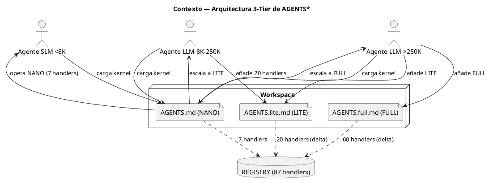

<!-- BLP:TITLE -->
# BLP-002: Reestructurar AGENTS.md, AGENTS.lite.md y AGENTS.full.md como capas incrementales: NANO (kernel inmutable, ~4K tokens, SLM-ready), LITE (delta gobernado, 8K-200K), FULL (arsenal completo, 200K+). Cada capa declara explícitamente sus handlers y recursos. Eliminar duplicación entre archivos. Incluir auto-detección de tier basada en ventana de contexto.
<!-- /BLP:TITLE -->

---

<!-- BLP:1 -->
## §1: Planteamiento del Problema

Revisar si existe un proceso automático de sincronía entre el meta-brain del workspace y los brain.cortex de cada proyecto. Si no existe o es insuficiente, implementarlo.
<!-- /BLP:1 -->

<!-- BLP:2 -->
## §2: Objetivo

Revisar sync_brain() existente como helper. Si está incompleto o desintegrado, corregirlo e integrarlo como handler MCP o post-write hook.
<!-- /BLP:2 -->

<!-- BLP:3 -->
## §3: Precondiciones

- [ ] sync_brain() existe en src/arqux/sync.py. - [ ] Meta-brain tiene DOM entries para cada proyecto. - [ ] Handler cortex.entry.* existe. - [ ] Ciclo CYCLE-06 activo.
<!-- /BLP:3 -->

<!-- BLP:4 -->
## §4: Principio Rector

Un agente debe poder operar con solo AGENTS.md (NANO). LITE y FULL son extensiones incrementales — cada una declara SOLO lo que añade, sin repetir la capa anterior. AGENTS.md no referencia skills externas: es autocontenido para SLMs. La auto-detección de tier permite que cualquier agente evalúe su ventana de contexto y decida si carga solo NANO, NANO+LITE, o NANO+LITE+FULL.
<!-- /BLP:4 -->

<!-- BLP:5 -->
## §5: Contexto

<!-- /BLP:5 -->

<!-- BLP:6 -->
## §6: Alcance y Exclusiones

Dentro del alcance: revisar sync_brain() existente, implementar sync automático post-mutación de brain.cortex. Fuera del alcance: migración de datos, refactor de CODEC-CORTEX.
<!-- /BLP:6 -->

<!-- BLP:7 -->
## §7: Reglas Obligatorias

Regla 1: No duplicar sync_brain() — extender si existe. Regla 2: El sync no debe bloquear escrituras. Regla 3: Debe poder ejecutarse bajo demanda y automáticamente.
<!-- /BLP:7 -->

<!-- BLP:8 -->
## §8: Diseño Técnico

Capa handler: crear sync.run() o integrar en cortex.write como post-hook. sync_brain() actualizar meta-brain desde brain.cortex de cada proyecto.
<!-- /BLP:8 -->

<!-- BLP:9 -->
## §9: Diseño Operacional

sync_brain() existe pero no se llama automáticamente. Propuesta: post-write hook en cortex.write para proyectos nivel 3, o handler sync.run() para invocación manual + CI.
<!-- /BLP:9 -->

<!-- BLP:10 -->
## §10: Contratos

Entradas: AGENTS.md actual (workspace), REGISTRY de 87 handlers. Salidas: AGENTS.md (kernel NANO, ~150 líneas CORTEX), AGENTS.lite.md (delta LITE, ~80 líneas), AGENTS.full.md (delta FULL, ~100 líneas). Formato: CORTEX ultra-denso con $0 glossary, sigils, tablas de handlers. Cada archivo es autocontenido en su capa.
<!-- /BLP:10 -->

<!-- BLP:11 -->
## §11: Procedimiento de Trabajo

1. Diseñar matriz de handlers por tier (NANO=7, LITE=20, FULL=60).
2. Reestructurar AGENTS.md: extraer solo axiomas esenciales ($1-$3) + añadir auto-detección de tier ($4) + tabla NANO ($5). Eliminar referencias a skills, workflows, y handlers fuera de NANO.
3. Reescribir AGENTS.lite.md: comenzar con directiva 'esto es un delta sobre AGENTS.md'. Listar solo handlers y reglas LITE. Sin repetir axiomas.
4. Reescribir AGENTS.full.md: comenzar con directiva 'esto es un delta sobre AGENTS.lite.md'. Listar solo handlers FULL.
5. Verificar: diff NANO vs LITE = solo adiciones. diff LITE vs FULL = solo adiciones.
6. cortex.verify sobre los 3 archivos.
7. Sincronizar template.
<!-- /BLP:11 -->

<!-- BLP:12 -->
## §12: Criterios de Aceptación

AC-01: sync_brain() auditado — documentar qué hace y qué falta. AC-02: Si falta, implementar sync.run() handler. AC-03: Meta-brain refleja cambios en brain.cortex en menos de 1 min. AC-04: Tests. AC-05: Backwards-compatible.
<!-- /BLP:12 -->

<!-- BLP:13 -->
## §13: Validaciones Requeridas

1. AGENTS.md: cortex.verify sin errores. grep 'skill' no debe encontrar referencias externas.
2. AGENTS.lite.md: grep de handlers no debe coincidir con NANO. grep de axiomas no debe duplicar NANO.
3. AGENTS.full.md: grep de handlers no debe coincidir con NANO ni LITE.
4. Conteo: NANO=7, LITE=27 total (7+20), FULL=87 total (27+60).
5. Tokens: AGENTS.md <= 5K tokens objetivo.
6. Auto-detección: AGENTS.md debe incluir lógica NANO(<8K)/LITE(8-250K)/FULL(>250K).
<!-- /BLP:13 -->

<!-- BLP:14 -->
## §14: Tareas

T-1: Auditar sync_brain() existente. T-2: Diseñar solución (post-hook o handler). T-3: Implementar. T-4: Tests. T-5: Verify ACs.
<!-- /BLP:14 -->

<!-- BLP:15 -->
## §15: Riesgos

R-01: SLM no puede cargar AGENTS.md completo por ventana <4K. Impacto: kernel NANO no cabe. Mitigación: target 3-4K tokens con CORTEX ultra-denso.
R-02: Duplicación residual entre capas. Impacto: agente LITE procesa info redundante. Mitigación: diff check post-escritura.
R-03: AGENTS.md muy minimalista omite regla esencial. Impacto: agente NANO opera sin governance real. Mitigación: revisión Arquitecto de axiomas incluidos.
<!-- /BLP:15 -->

<!-- BLP:16 -->
## §16: Regla de Bloqueo

1. AGENTS.md excede 5K tokens → DETENER, compactar más.
2. AGENTS.lite.md contiene contenido ya en AGENTS.md → DETENER, eliminar duplicación.
3. Un archivo no declara su tabla de handlers → DETENER, agregar.
Acción: DETENER_E_INFORMAR. Escalar a: Arquitecto.
<!-- /BLP:16 -->

<!-- BLP:17 -->
## §17: Salida Esperada

Archivos modificados: AGENTS.md (reestructurado a kernel NANO), AGENTS.lite.md (reescrito como delta LITE), AGENTS.full.md (reescrito como delta FULL). Template: src/arqux/templates/AGENTS.md (sincronizado con NANO). Evidencia: diff antes/después de cada archivo, conteo de líneas y tokens, cortex.verify sobre los 3.
<!-- /BLP:17 -->

<!-- BLP:18 -->
## §18: Contrato de Calidad

| Compuerta | Estado |
|---|---|
| has_clear_objective | ☐ |
| has_verifiable_preconditions | ☐ |
| has_scope_and_exclusions | ☐ |
| has_acceptance_criteria | ☐ |
| has_work_procedure | ☐ |
| has_required_validations | ☐ |
| has_learning_recorded | ☐ |
<!-- /BLP:18 -->

> Todas las compuertas deben estar en ✅ antes de blueprint.ready(). Ver blueprint-workflow skill.