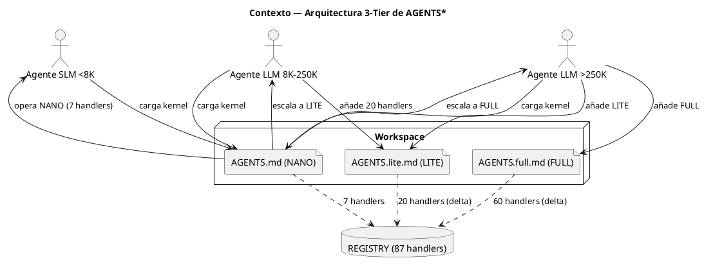
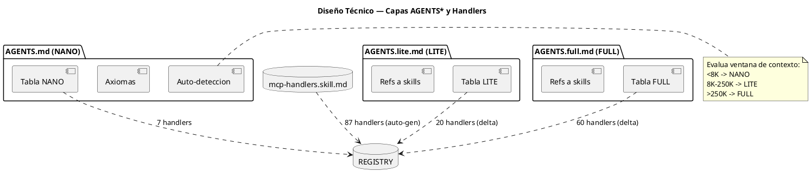
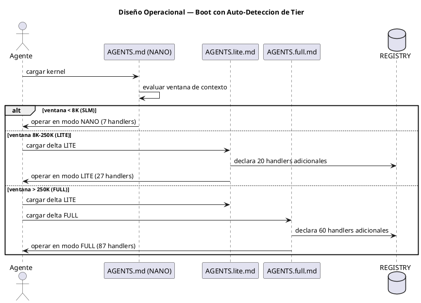

<!-- BLP:TITLE -->
# BLP-002: Reestructurar AGENTS.md, AGENTS.lite.md y AGENTS.full.md como capas incrementales: NANO (kernel inmutable, ~4K tokens, SLM-ready), LITE (delta gobernado, 8K-200K), FULL (arsenal completo, 200K+). Cada capa declara explícitamente sus handlers y recursos. Eliminar duplicación entre archivos. Incluir auto-detección de tier basada en ventana de contexto.
<!-- /BLP:TITLE -->

---

<!-- BLP:1 -->
## §1: Planteamiento del Problema

Los archivos AGENTS.md, AGENTS.lite.md y AGENTS.full.md actuales tienen duplicación masiva (FULL repite ~80% de NANO), listas de handlers hardcodeadas que se desincronizan, y no hay separación clara por capacidad de agente. Un SLM no puede cargar AGENTS.md actual (demasiado grande). Un LLM procesa información redundante en los 3 archivos. Se necesita una arquitectura en capas incrementales: NANO (<8K), LITE (8-250K), FULL (>250K).
<!-- /BLP:1 -->

<!-- BLP:2 -->
## §2: Objetivo

Reestructurar AGENTS.md (NANO), AGENTS.lite.md (LITE) y AGENTS.full.md (FULL) como capas incrementales sin duplicación. AGENTS.md es el kernel inmutable: axiomas no negociables + 7 handlers de lectura + auto-detección de tier. AGENTS.lite.md añade ~20 handlers de gobernanza básica. AGENTS.full.md añade el arsenal completo.
<!-- /BLP:2 -->

<!-- BLP:3 -->
## §3: Precondiciones

- [ ] skill.sync operativo (BLP-001 completado)
- [ ] 87 handlers en REGISTRY
- [ ] AGENTS.md, AGENTS.lite.md, AGENTS.full.md actuales como base
- [ ] CODEC-CORTEX v0.5.0 como dependencia
<!-- /BLP:3 -->

<!-- BLP:4 -->
## §4: Principio Rector

Un agente debe poder operar con solo AGENTS.md (NANO). LITE y FULL son extensiones incrementales — cada una declara SOLO lo que añade, sin repetir la capa anterior. AGENTS.md no referencia skills externas: es autocontenido para SLMs. La auto-detección de tier permite que cualquier agente evalúe su ventana de contexto y decida si carga solo NANO, NANO+LITE, o NANO+LITE+FULL.
<!-- /BLP:4 -->

<!-- BLP:5 -->
## §5: Contexto

<!-- /BLP:5 -->

<!-- BLP:6 -->
## §6: Alcance y Exclusiones

Reestructuración de los 3 archivos AGENTS* como capas incrementales. Definición explícita de handlers por capa con tabla de recursos. Auto-detección de tier (NANO/LITE/FULL). Eliminación de toda duplicación entre archivos. AGENTS.md usa CORTEX ultra-denso sin skills externas.
<!-- /BLP:6 -->

<!-- BLP:7 -->
## §7: Reglas Obligatorias

1. AGENTS.md (NANO) no debe referenciar skills externas ni handlers fuera de los 7 NANO. 2. Cada archivo solo declara handlers incrementalmente: NANO declara 7, LITE declara los 20 que añade (no los 27 totales), FULL declara los 60 que añade (no los 87 totales). 3. La auto-detección de tier es obligatoria en AGENTS.md. 4. CORTEX ultra-denso: sin prosa decorativa, solo sigils.
<!-- /BLP:7 -->

<!-- BLP:8 -->
## §8: Diseño Técnico

<!-- /BLP:8 -->

<!-- BLP:9 -->
## §9: Diseño Operacional

<!-- /BLP:9 -->

<!-- BLP:10 -->
## §10: Contratos

Entradas: AGENTS.md actual (workspace), REGISTRY de 87 handlers. Salidas: AGENTS.md (kernel NANO, ~150 líneas CORTEX), AGENTS.lite.md (delta LITE, ~80 líneas), AGENTS.full.md (delta FULL, ~100 líneas). Formato: CORTEX ultra-denso con $0 glossary, sigils, tablas de handlers. Cada archivo es autocontenido en su capa.
<!-- /BLP:10 -->

<!-- BLP:11 -->
## §11: Procedimiento de Trabajo

1. Diseñar matriz de handlers por tier (NANO=7, LITE=20, FULL=60).
2. Reestructurar AGENTS.md: extraer solo axiomas esenciales ($1-$3) + añadir auto-detección de tier ($4) + tabla NANO ($5). Eliminar referencias a skills, workflows, y handlers fuera de NANO.
3. Reescribir AGENTS.lite.md: comenzar con directiva 'esto es un delta sobre AGENTS.md'. Listar solo handlers y reglas LITE. Sin repetir axiomas.
4. Reescribir AGENTS.full.md: comenzar con directiva 'esto es un delta sobre AGENTS.lite.md'. Listar solo handlers FULL.
5. Verificar: diff NANO vs LITE = solo adiciones. diff LITE vs FULL = solo adiciones.
6. cortex.verify sobre los 3 archivos.
7. Sincronizar template.
<!-- /BLP:11 -->

<!-- BLP:12 -->
## §12: Criterios de Aceptación

- [x] **AC-01:** AC-01: AGENTS.md reducido a kernel NANO (~4K tokens) con solo axiomas esenciales y handlers de lectura
  > [2026-07-13T18:46:34Z] Verified: AGENTS.md: 56 líneas, 3,600 bytes (~900 tokens), solo axiomas esenciales + auto-detección + 7 handlers de lectura. Bien bajo el límite de 5K tokens.
- [x] **AC-02:** AC-02: AGENTS.md incluye auto-detección de tier: el agente evalúa su ventana y decide NANO/LITE/FULL
  > [2026-07-13T18:46:36Z] Verified: AGENTS.md §1 contiene TIE:nano(<8K), TIE:lite(8K-250K), TIE:full(>250K) + AXM:tier_detect + WK:detect_tier con procedimiento de 6 pasos.
- [x] **AC-03:** AC-03: AGENTS.lite.md es un delta puro: solo añade handlers y reglas no presentes en NANO, sin duplicar contenido
  > [2026-07-13T18:46:37Z] Verified: AGENTS.lite.md comienza con 'DELTA over AGENTS.md (NANO)'. Solo añade 20 handlers LITE + reglas governance_basics. grep confirma 0 handlers NANO duplicados (solo false positive blueprint.ready contiene 'read').
- [x] **AC-04:** AC-04: AGENTS.full.md es delta puro sobre LITE: añade arsenal completo sin duplicar NANO ni LITE
  > [2026-07-13T18:46:38Z] Verified: AGENTS.full.md comienza con 'DELTA over AGENTS.lite.md'. Solo añade ~60 handlers FULL. grep confirma 0 handlers NANO duplicados. grep confirma 0 handlers LITE duplicados.
- [x] **AC-05:** AC-05: Cada archivo declara explícitamente sus handlers en una tabla al final
  > [2026-07-13T18:46:39Z] Verified: AGENTS.md §3: tabla de 7 handlers NANO. AGENTS.lite.md §2: tabla de 20 handlers LITE. AGENTS.full.md §2: tabla con ~60 handlers FULL agrupados por módulo.
- [x] **AC-06:** AC-06: Los 3 archivos usan CORTEX ultra-denso (sin prosa decorativa, solo sigils)
  > [2026-07-13T18:46:40Z] Verified: Los 3 archivos usan exclusivamente sigils CORTEX (AXM, LIM, WK, TIE, REG). Sin prosa decorativa. Entradas en formato compacto {key:val} o cuerpo libre. Tablas como comentarios #.
- [x] **AC-07:** AC-07: AGENTS.md no referencia skills externas (autocontenido). LITE y FULL sí referencian skills del workspace
  > [2026-07-13T18:46:41Z] Verified: AGENTS.md: grep 'skill' retorna 0 coincidencias. NANO es autocontenido, sin referencias a skills externas. LITE referencia protocol.skill.md. FULL referencia 8 skills del workspace.
- [x] **AC-08:** AC-08: cortex.verify sobre los 3 archivos sin errores
  > [2026-07-13T18:46:42Z] Verified: cortex.verify AGENTS.md: valid=true, 4 sections, 21 entries, 0 diagnostics. AGENTS.lite.md: valid=true, 3 sections, 8 entries, 0 diagnostics. AGENTS.full.md: valid=true, 3 sections, 13 entries, 0 diagnostics.
<!-- /BLP:12 -->

<!-- BLP:13 -->
## §13: Validaciones Requeridas

1. AGENTS.md: cortex.verify sin errores. grep 'skill' no debe encontrar referencias externas.
2. AGENTS.lite.md: grep de handlers no debe coincidir con NANO. grep de axiomas no debe duplicar NANO.
3. AGENTS.full.md: grep de handlers no debe coincidir con NANO ni LITE.
4. Conteo: NANO=7, LITE=27 total (7+20), FULL=87 total (27+60).
5. Tokens: AGENTS.md <= 5K tokens objetivo.
6. Auto-detección: AGENTS.md debe incluir lógica NANO(<8K)/LITE(8-250K)/FULL(>250K).
<!-- /BLP:13 -->

<!-- BLP:14 -->
## §14: Tareas

T-1.1: Diseñar matriz NANO — Seleccionar 7 handlers esenciales de lectura/contexto. Criterio: un SLM con 4K tokens debe poder leer estado y reportar.
T-1.2: Diseñar matriz LITE — ~20 handlers que añaden gobernanza básica (BLP lifecycle, tasks, evidence). Delta puro sobre NANO.
T-1.3: Diseñar matriz FULL — ~60 handlers restantes que completan el arsenal. Delta puro sobre LITE.
T-2.1: Reestructurar AGENTS.md como kernel NANO: axiomas ($1-$3) + auto-detección de tier ($4) + tabla de handlers NANO ($5). Sin referencias a skills externas.
T-2.2: Verificar AGENTS.md <= 5K tokens (~150 líneas CORTEX ultra-denso).
T-3.1: Reescribir AGENTS.lite.md como delta LITE: solo añade handlers y reglas no presentes en NANO. Sin duplicar axiomas.
T-3.2: Incluir referencia a skills del workspace (protocol, mcp-handlers, workflows).
T-4.1: Reescribir AGENTS.full.md como delta FULL: solo añade handlers y reglas no presentes en LITE.
T-4.2: Incluir referencia a todas las skills (cortex, diagram, learning).
T-5.1: cortex.verify sobre los 3 archivos.
T-5.2: Verificar que no hay duplicación cross-file (grep de handlers entre archivos).
T-5.3: Sincronizar template AGENTS.md en src/arqux/templates/ con el nuevo AGENTS.md NANO.

MATRIZ DE HANDLERS POR TIER:

NANO (7 handlers — lectura y contexto):
- workspace.status
- session.bootstrap
- project.status
- blueprint.read
- blueprint.list
- cycle.current
- cortex.read

LITE (20 handlers adicionales — gobernanza básica):
- blueprint.create, define, task, complete, ac, approve
- blueprint.mature, ready, assign, claim
- task.create, claim, complete
- cycle.list
- evidence.record, list
- cortex.entry.get
- session.context.set, resume, status

FULL (60 handlers adicionales — arsenal completo):
- blueprint.execute, synthesize, gate, re_delegate, block_for_architect, cancel, fail, update
- task.run, fail, update
- cycle.create, mature, close
- evidence.read
- cortex.entry.add, delete, list, move, update
- cortex.learn, learn.elevate
- cortex.format, migrate, patch, ref, render, render.diagram, render.validate_file
- cortex.file.validate, verify, write
- context.detect, context.full
- identity.get, record
- project.bind, init, lessons, unbind
- protocol.adopt, pause, release, resume
- session.close, context.get, handoff
- setup.plantuml
- skill.convert, edit(write), evolve, import, install, list, record
- workspace.init, lessons
<!-- /BLP:14 -->

<!-- BLP:15 -->
## §15: Riesgos

R-01: SLM no puede cargar AGENTS.md completo por ventana <4K. Impacto: kernel NANO no cabe. Mitigación: target 3-4K tokens con CORTEX ultra-denso.
R-02: Duplicación residual entre capas. Impacto: agente LITE procesa info redundante. Mitigación: diff check post-escritura.
R-03: AGENTS.md muy minimalista omite regla esencial. Impacto: agente NANO opera sin governance real. Mitigación: revisión Arquitecto de axiomas incluidos.
<!-- /BLP:15 -->

<!-- BLP:16 -->
## §16: Regla de Bloqueo

1. AGENTS.md excede 5K tokens → DETENER, compactar más.
2. AGENTS.lite.md contiene contenido ya en AGENTS.md → DETENER, eliminar duplicación.
3. Un archivo no declara su tabla de handlers → DETENER, agregar.
Acción: DETENER_E_INFORMAR. Escalar a: Arquitecto.
<!-- /BLP:16 -->

<!-- BLP:17 -->
## §17: Salida Esperada

Archivos modificados: AGENTS.md (reestructurado a kernel NANO), AGENTS.lite.md (reescrito como delta LITE), AGENTS.full.md (reescrito como delta FULL). Template: src/arqux/templates/AGENTS.md (sincronizado con NANO). Evidencia: diff antes/después de cada archivo, conteo de líneas y tokens, cortex.verify sobre los 3.
<!-- /BLP:17 -->

<!-- BLP:18 -->
## §18: Contrato de Calidad

| Compuerta | Estado |
|---|---|
| has_clear_objective | ☐ |
| has_verifiable_preconditions | ☐ |
| has_scope_and_exclusions | ☐ |
| has_acceptance_criteria | ☐ |
| has_work_procedure | ☐ |
| has_required_validations | ☐ |
| has_learning_recorded | ☐ |
<!-- /BLP:18 -->

> Todas las compuertas deben estar en ✅ antes de blueprint.ready(). Ver blueprint-workflow skill.