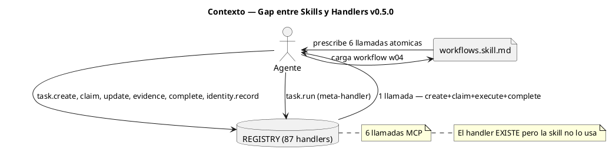
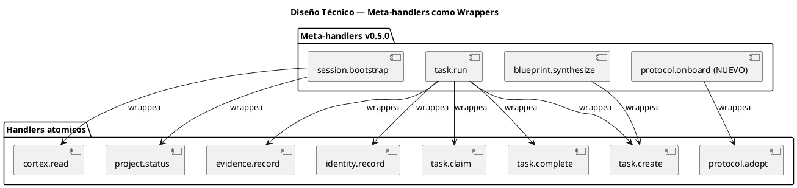
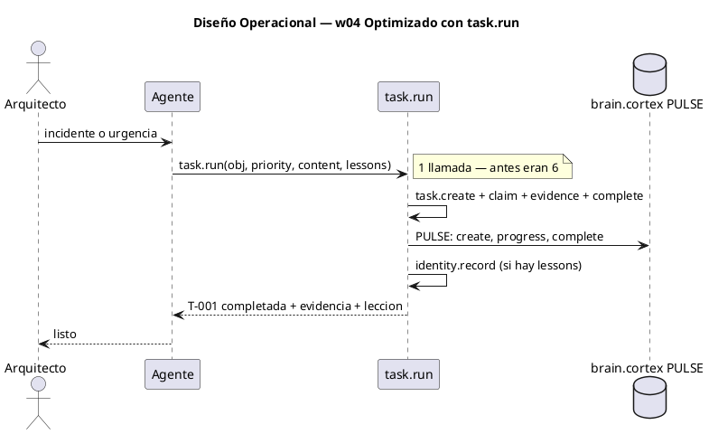

<!-- BLP:TITLE -->
# BLP-003: Actualizar workflows.skill.md y skills gobernadas para reflejar los meta-handlers de v0.5.0: reemplazar flujos multi-call (w03: 3→1 con session.bootstrap, w04: 6→1 con task.run, w08: ~23→4 con blueprint.synthesize) por sus equivalentes optimizados. Implementar protocol.onboard (w06: 2→1). Los handlers ya existen — las skills no los usan.
<!-- /BLP:TITLE -->

---

<!-- BLP:1 -->
## §1: Planteamiento del Problema

v0.5.0 implementó meta-handlers que consolidan múltiples llamadas atómicas en una sola: session.bootstrap (contexto), task.run (tareas), blueprint.synthesize (BLPs). Sin embargo, workflows.skill.md — la fuente de verdad que gobierna el comportamiento del agente — prescribe flujos multi-call obsoletos: w03 pide 3-4 llamadas cuando session.bootstrap las consolida en 1, w04 pide 6 cuando task.run las reduce a 1, w08 pide ~23 cuando blueprint.synthesize las reduce a ~4. El gap no está en los handlers — está en las skills que el agente ejecuta.
<!-- /BLP:1 -->

<!-- BLP:2 -->
## §2: Objetivo

Actualizar protocol.skill.md §1 (SESSION START) para incluir el flujo de inicialización optimizado con session.bootstrap como paso único. La inicialización NO debe ser un workflow separado (w03) — debe ser parte del skill de protocolo, que es lo primero que el agente carga. workflows.skill.md se actualiza para w04, w06, w08 con meta-handlers. Implementar protocol.onboard.
<!-- /BLP:2 -->

<!-- BLP:3 -->
## §3: Precondiciones

Meta-handlers v0.5.0 operativos: session.bootstrap, task.run, blueprint.synthesize, blueprint.execute. REGISTRY con 87 handlers. Arch vision docs como referencia de diseño (w03, w04, w06, w08). BLP-001 (skill.sync) completado.
<!-- /BLP:3 -->

<!-- BLP:4 -->
## §4: Principio Rector

Las skills gobernadas (workflows.skill.md, protocol.skill.md) son la fuente de verdad que el agente ejecuta. Si prescriben flujos ineficientes, el agente los ejecuta ineficientemente — aunque existan handlers más rápidos. La optimización no está en crear nuevos handlers, sino en actualizar las skills para que usen los que ya existen.
<!-- /BLP:4 -->

<!-- BLP:5 -->
## §5: Contexto

<!-- /BLP:5 -->

<!-- BLP:6 -->
## §6: Alcance y Exclusiones

Actualización de protocol.skill.md §1 (inicialización como parte del protocolo, no como workflow externo). Actualización de workflows.skill.md w04 y w08 para usar meta-handlers. Implementación de protocol.onboard. No se modifican handlers existentes.
<!-- /BLP:6 -->

<!-- BLP:7 -->
## §7: Reglas Obligatorias

1. workflows.skill.md es la fuente de verdad — toda actualización debe pasar por skill.edit. 2. Los handlers existentes no se modifican — solo se actualiza la skill que los referencia. 3. protocol.onboard debe seguir el patrón de los meta-handlers existentes (BLP-010).
<!-- /BLP:7 -->

<!-- BLP:8 -->
## §8: Diseño Técnico

<!-- /BLP:8 -->

<!-- BLP:9 -->
## §9: Diseño Operacional

<!-- /BLP:9 -->

<!-- BLP:10 -->
## §10: Contratos

Entradas: arch_vision/*.hcortex.md como referencia de diseño, workflows.skill.md actual, REGISTRY de 87 handlers. Salidas: workflows.skill.md actualizado con flujos optimizados, protocol.skill.md actualizado, handlers/skill.py con protocol.onboard. Formato: CORTEX en skills, Python en handlers.
<!-- /BLP:10 -->

<!-- BLP:11 -->
## §11: Procedimiento de Trabajo

1. Leer workflows.skill.md actual y arch_vision docs (w03, w04, w06, w08) como referencia.
2. Actualizar w03: reemplazar secuencia multi-call por session.bootstrap.
3. Actualizar w04: reemplazar secuencia de 6 llamadas por task.run.
4. Actualizar w08: reemplazar secuencia de ~23 llamadas por flujo conversacional con synthesize.
5. Implementar protocol.onboard: leer identity + adopt en 1 handler.
6. Actualizar protocol.skill.md §1.
7. skill.sync → regenerar mcp-handlers.skill.md.
8. Verificar: pytest + cortex.verify + simulación de cada workflow.
<!-- /BLP:11 -->

<!-- BLP:12 -->
## §12: Criterios de Aceptación

AC-01: workflows.skill.md w03 actualizado: session.bootstrap reemplaza 3-4 llamadas atómicas
AC-02: workflows.skill.md w04 actualizado: task.run reemplaza 6 llamadas atómicas
AC-03: workflows.skill.md w08 actualizado: blueprint.synthesize reemplaza flujo de ~23 llamadas
AC-04: protocol.onboard implementado: cortex.read(identity) + protocol.adopt en 1 llamada
AC-05: protocol.skill.md §1 actualizado con navegación usando meta-handlers
AC-06: skill.sync ejecutado post-cambios — skills regeneradas reflejan handlers reales
AC-07: cortex.verify sobre skills modificadas sin errores
AC-08: 804 tests pasan (sin regresiones)
<!-- /BLP:12 -->

<!-- BLP:13 -->
## §13: Validaciones Requeridas

1. Simular w03: session.bootstrap → verificar que devuelve contexto completo en 1 llamada.
2. Simular w04: task.run → verificar create+claim+execute+complete+evidence en 1 llamada.
3. Simular w08: blueprint.synthesize → verificar 18 secciones en 1 llamada.
4. Simular w06: protocol.onboard → verificar identity.read + protocol.adopt en 1 llamada.
5. cortex.verify sobre workflows.skill.md y protocol.skill.md.
6. skill.sync → verificar hash coincide post-cambios.
7. pytest 804 tests.
<!-- /BLP:13 -->

<!-- BLP:14 -->
## §14: Tareas

T-1.1: Mover inicialización de w03 a protocol.skill.md §1 — session.bootstrap como paso único de contexto. Eliminar w03 como workflow separado.
T-1.2: Actualizar workflows.skill.md w04 — reemplazar flujo de 6 llamadas por task.run.
T-1.3: Actualizar workflows.skill.md w08 — reemplazar flujo de ~23 llamadas por w08 conversacional con synthesize.
T-2.1: Implementar protocol.onboard en handlers/skill.py.
T-2.2: Registrar protocol.onboard en handlers/__init__.py.
T-2.3: Test para protocol.onboard.
T-3.1: Actualizar AGENTS.md si es necesario (alinear con nuevos flujos).
T-4.1: skill.sync → regenerar mcp-handlers.skill.md.
T-4.2: pytest full suite.
T-4.3: cortex.verify sobre skills modificadas.

COMPARATIVA:

| Inicialización | Antes | Después |
|---|---|---|
| Ubicación | w03 en workflows.skill.md | protocol.skill.md §1 |
| Llamadas | 3-4 atómicas | 1 (session.bootstrap) |
| w04 reactive task | 6 llamadas | 1 (task.run) |
| w06 adoption | 2 llamadas | 1 (protocol.onboard) |
| w08 BLP lifecycle | ~23 llamadas | ~4 (synthesize) |
<!-- /BLP:14 -->

<!-- BLP:15 -->
## §15: Riesgos

R-01: Workflow optimizado omite paso de gobierno esencial. Impacto: pérdida de trazabilidad. Mitigación: comparar PULSE antes/después — mismo número de eventos.
R-02: protocol.onboard rompe compatibilidad con flujo existente. Impacto: agentes que usan protocol.adopt directo. Mitigación: protocol.onboard como wrapper, protocol.adopt sigue existiendo.
R-03: skill.sync pisa cambios manuales en workflows.skill.md. Impacto: pérdida de personalizaciones. Mitigación: workflows.skill.md no es auto-generado (solo mcp-handlers lo es).
<!-- /BLP:15 -->

<!-- BLP:16 -->
## §16: Regla de Bloqueo

1. workflow optimizado produce menos entradas PULSE que el original → DETENER, verificar.
2. protocol.onboard no respeta scope de protocol.adopt → DETENER.
3. Tests regresionan → DETENER, no hacer deploy.
Acción: DETENER_E_INFORMAR. Escalar a: Arquitecto.
<!-- /BLP:16 -->

<!-- BLP:17 -->
## §17: Salida Esperada

Archivos modificados: .arqux/skills/workflows.skill.md (w03, w04, w08 actualizados), .arqux/skills/protocol.skill.md (§1 actualizado), handlers/skill.py (+protocol.onboard), handlers/__init__.py (+registro). Archivos creados: tests/test_protocol_onboard.py. Evidencia: diff antes/después de cada skill, comparativa de llamadas MCP por workflow, output de pytest.
<!-- /BLP:17 -->

<!-- BLP:18 -->
## §18: Contrato de Calidad

| Compuerta | Estado |
|---|---|
| has_clear_objective | ☐ |
| has_verifiable_preconditions | ☐ |
| has_scope_and_exclusions | ☐ |
| has_acceptance_criteria | ☐ |
| has_work_procedure | ☐ |
| has_required_validations | ☐ |
| has_learning_recorded | ☐ |
<!-- /BLP:18 -->

> Todas las compuertas deben estar en ✅ antes de blueprint.ready(). Ver blueprint-workflow skill.