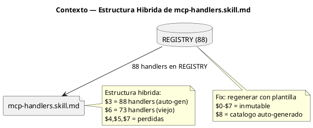
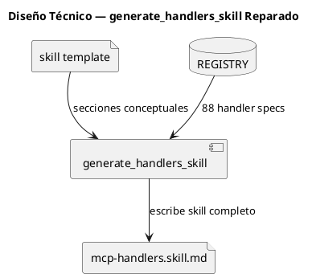
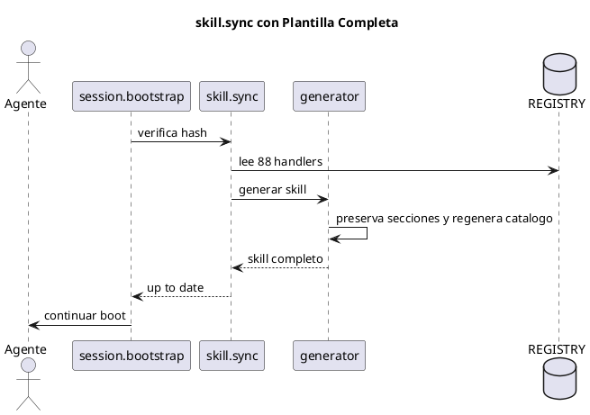

<!-- BLP:TITLE -->
# BLP-004: Consolidar mcp-handlers.skill.md post-BLP-001: reparar estructura hibrida y restaurar secciones conceptuales perdidas
<!-- /BLP:TITLE -->

---

<!-- BLP:1 -->
## §1: Planteamiento del Problema

BLP-001 implemento generate_handlers_skill() que regenera mcp-handlers.skill.md desde REGISTRY. Pero el generador solo preserva $0-$2 y sobrescribe $3+ con el catalogo de handlers. Esto destruyo las secciones conceptuales: $3 CLI FALLBACK, $4 ROLE MODEL, $5 MCP WIRE PROTOCOL, $6 QUICK REFERENCE, $7 HOW TO EXTEND. El skill quedo con estructura hibrida: $3 (88 handlers) y $6 (73 handlers viejos). El sync automatico funciono, pero produjo output defectuoso porque las pruebas de BLP-001 solo verificaron conteo de handlers, no integridad estructural de la skill.
<!-- /BLP:1 -->

<!-- BLP:2 -->
## §2: Objetivo

Reparar generate_handlers_skill() para que preserve TODAS las secciones conceptuales originales ($0-$7) y solo regenere la seccion de catalogo de handlers como nueva seccion $8 HANDLER CATALOG. Re-ejecutar skill.sync para producir un mcp-handlers.skill.md completo y coherente.
<!-- /BLP:2 -->

<!-- BLP:3 -->
## §3: Precondiciones

BLP-001 skill.sync operativo. mcp-handlers.skill.md original disponible (pre-BLP-001) como referencia de secciones conceptuales. 88 handlers en REGISTRY.
<!-- /BLP:3 -->

<!-- BLP:4 -->
## §4: Principio Rector

El generador de skills debe tratar las secciones conceptuales como plantilla inmutable. Solo la seccion de catalogo de handlers ($8) es volatil y se regenera desde REGISTRY. Las secciones $0-$7 son conocimiento arquitectonico que no cambia con los handlers.
<!-- /BLP:4 -->

<!-- BLP:5 -->
## §5: Contexto

<!-- /BLP:5 -->

<!-- BLP:6 -->
## §6: Alcance y Exclusiones

Reparacion de generate_handlers_skill() en handlers/skill.py. Re-ejecucion de skill.sync. Verificacion de MCP visibility para protocol.onboard. No se modifican handlers existentes ni se crean nuevos.
<!-- /BLP:6 -->

<!-- BLP:7 -->
## §7: Reglas Obligatorias

1. El generador debe leer el skill original como plantilla base. 2. Las secciones $0-$7 son inmutables — se copian tal cual. 3. La seccion $8 HANDLER CATALOG se regenera desde REGISTRY con 88 handlers. 4. Si el skill original no tiene $8, se crea. Si existe, se reemplaza.
<!-- /BLP:7 -->

<!-- BLP:8 -->
## §8: Diseño Técnico

<!-- /BLP:8 -->

<!-- BLP:9 -->
## §9: Diseño Operacional

<!-- /BLP:9 -->

<!-- BLP:10 -->
## §10: Contratos

Entrada: mcp-handlers.skill.md original (pre-BLP-001) con secciones $0-$7, REGISTRY con 88 handlers. Salida: mcp-handlers.skill.md completo: $0-$7 (conceptual inmutable) + $8 HANDLER CATALOG (88 handlers auto-generados). Handler modificado: generate_handlers_skill() en skill.py.
<!-- /BLP:10 -->

<!-- BLP:11 -->
## §11: Procedimiento de Trabajo

1. Leer mcp-handlers.skill.md original para extraer secciones $3-$7 como plantilla. 2. Modificar generate_handlers_skill() en skill.py: preservar $0-$7, regenerar solo $8. 3. Ejecutar skill.sync. 4. Verificar estructura: todas las secciones presentes, sin duplicacion. 5. cortex.verify. 6. Verificar MCP visibility de protocol.onboard.
<!-- /BLP:11 -->

<!-- BLP:12 -->
## §12: Criterios de Aceptación

AC-01: generate_handlers_skill() preserva secciones $3-$7 y regenera solo $8
AC-02: mcp-handlers.skill.md tiene estructura $0-$8 sin duplicacion ni secciones huerfanas
AC-03: $8 HANDLER CATALOG lista 88 handlers agrupados por modulo
AC-04: skill.sync re-ejecutado — skill completo y coherente
AC-05: Test de skill.sync verifica estructura (no solo conteo de handlers)
AC-06: cortex.verify sobre mcp-handlers.skill.md sin errores
AC-07: protocol.onboard visible via MCP tools
AC-08: 804+ tests pasan sin regresiones
<!-- /BLP:12 -->

<!-- BLP:13 -->
## §13: Validaciones Requeridas

1. Post-sync: verificar secciones $0-$8 con grep.
2. Verificar $6 no contiene tabla de handlers vieja.
3. Contar handlers en $8: 88.
4. Test estructural: assert skill tiene $3 CLI FALLBACK, $4 ROLE MODEL, etc.
5. cortex.verify.
6. skill.sync idempotencia.
7. MCP tools list incluye protocol.onboard.
8. pytest 804+.
<!-- /BLP:13 -->

<!-- BLP:14 -->
## §14: Tareas

T-1.1: Leer mcp-handlers.skill.md pre-BLP-001 para extraer secciones $3-$7 como plantilla.
T-1.2: Modificar generate_handlers_skill() para preservar $0-$7 y regenerar solo $8.
T-1.3: Anadir validacion post-sync: verificar que todas las secciones $0-$8 estan presentes.
T-2.1: Ejecutar skill.sync para regenerar mcp-handlers.skill.md completo.
T-2.2: Verificar estructura: $0-$8 presentes, sin duplicacion, sin $6 viejo.
T-3.1: Mejorar test de skill.sync: verificar estructura (secciones), no solo conteo de handlers.
T-3.2: cortex.verify sobre mcp-handlers.skill.md.
T-3.3: Verificar idempotencia: segundo sync = up_to_date.
T-4.1: Verificar protocol.onboard visible via MCP.
T-4.2: pytest full suite.
T-4.3: Actualizar test_registry.py (conteo por modulo).
<!-- /BLP:14 -->

<!-- BLP:15 -->
## §15: Riesgos

R-01: Secciones conceptuales originales se perdieron definitivamente. Impacto: no hay plantilla base. Mitigacion: recuperar del git history pre-BLP-001.
R-02: Estructura hibrida persiste tras sync. Impacto: $6 viejo no se limpia. Mitigacion: el generador debe eliminar secciones $3-$7 viejas antes de escribir las nuevas.
R-03: protocol.onboard no aparece en MCP tools. Impacto: agentes no pueden usarlo. Mitigacion: verificar registro en handler_schemas y reiniciar MCP server.
<!-- /BLP:15 -->

<!-- BLP:16 -->
## §16: Regla de Bloqueo

1. No se encuentra el skill original pre-BLP-001 → DETENER, recuperar de git. 2. skill.sync produce estructura hibrida de nuevo → DETENER, revisar generador. 3. Tests regresionan → DETENER.
Accion: DETENER_E_INFORMAR. Escalar a: Arquitecto.
<!-- /BLP:16 -->

<!-- BLP:17 -->
## §17: Salida Esperada

Archivos modificados: handlers/skill.py (generate_handlers_skill), .arqux/skills/mcp-handlers.skill.md (regenerado). Evidencia: diff del skill antes/despues, conteo de secciones y handlers, output de cortex.verify, pytest.
<!-- /BLP:17 -->

<!-- BLP:18 -->
## §18: Contrato de Calidad

| Compuerta | Estado |
|---|---|
| has_clear_objective | ☐ |
| has_verifiable_preconditions | ☐ |
| has_scope_and_exclusions | ☐ |
| has_acceptance_criteria | ☐ |
| has_work_procedure | ☐ |
| has_required_validations | ☐ |
| has_learning_recorded | ☐ |
<!-- /BLP:18 -->

> Todas las compuertas deben estar en ✅ antes de blueprint.ready(). Ver blueprint-workflow skill.