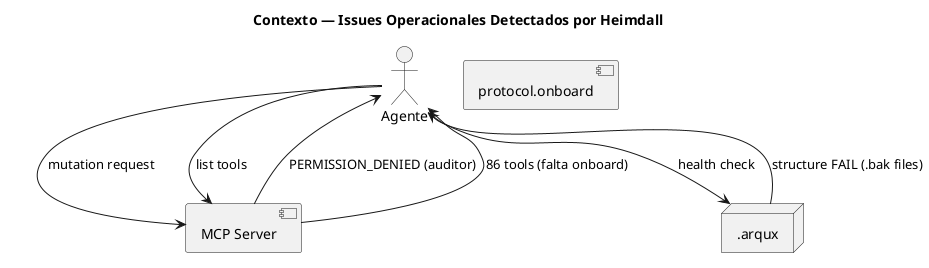
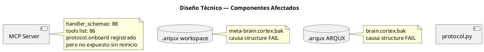
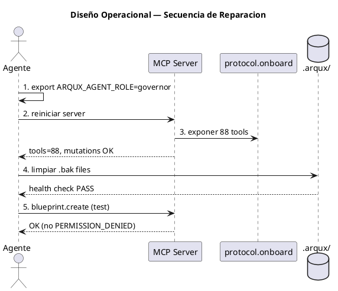

<!-- BLP:TITLE -->
# BLP-005: Resolver issues detectados por Heimdall en dry-run de CYCLE-04: (1) protocol.onboard no visible via MCP — verificar registro y exponer tool, (2) permisos MCP inconsistentes — ARQUX_AGENT_ROLE vacio causa auditor read-only, (3) health check .arqux/ structure FAIL — diagnosticar y reparar
<!-- /BLP:TITLE -->

---

<!-- BLP:1 -->
## §1: Planteamiento del Problema

Heimdall detecto 3 issues operacionales en su dry-run de CYCLE-04. Diagnostico confirmado: (1) ARQUX_AGENT_ROLE no esta en environment → MCP server asume rol auditor, bloqueando toda mutacion (blueprint.create, complete, approve → PERMISSION_DENIED). (2) protocol.onboard implementado y en handler_schemas (88 handlers, tests OK), pero MCP tools list muestra 86 — el server no ha reiniciado desde su registro. (3) .arqux/ structure FAIL causado por archivos .bak presentes: meta-brain.cortex.bak en workspace, brain.cortex.bak en ARQUX/.arqux/.
<!-- /BLP:1 -->

<!-- BLP:2 -->
## §2: Objetivo

Resolver los 3 issues operacionales para que el agente pueda operar con governance completo via MCP. protocol.onboard visible, permisos correctos, health check limpio.
<!-- /BLP:2 -->

<!-- BLP:3 -->
## §3: Precondiciones

- [ ] BLP-001 a BLP-004 completados
- [ ] 88 handlers en REGISTRY
- [ ] MCP server operativo (aunque con permisos inconsistentes)
<!-- /BLP:3 -->

<!-- BLP:4 -->
## §4: Principio Rector

Los issues operacionales son bloqueantes para la adopcion. Si un agente no puede mutar estado via MCP, el gobierno es inutil. La experiencia del agente debe ser: handlers → funcionan, permisos → correctos, health → limpio.
<!-- /BLP:4 -->

<!-- BLP:5 -->
## §5: Contexto

<!-- /BLP:5 -->

<!-- BLP:6 -->
## §6: Alcance y Exclusiones

Diagnostico y reparacion de MCP server config, registro de handlers, y estructura .arqux/. No se modifican handlers ni REGISTRY.
<!-- /BLP:6 -->

<!-- BLP:7 -->
## §7: Reglas Obligatorias

1. ARQUX_AGENT_ROLE debe configurarse en el MCP server como governor para permitir mutaciones. 2. protocol.onboard ya esta en handler_schemas — solo necesita reinicio de MCP para exponerse. 3. Los .bak files deben moverse fuera de .arqux/ o agregarse a .gitignore para limpiar health check.
<!-- /BLP:7 -->

<!-- BLP:8 -->
## §8: Diseño Técnico

<!-- /BLP:8 -->

<!-- BLP:9 -->
## §9: Diseño Operacional

<!-- /BLP:9 -->

<!-- BLP:10 -->
## §10: Contratos

Entrada: MCP server config actual, env vars, handler_schemas en protocol.py, estructura .arqux/. Salida: MCP tools list con 88 handlers, mutations funcionales, health check limpio.
<!-- /BLP:10 -->

<!-- BLP:11 -->
## §11: Procedimiento de Trabajo

1. Verificar ARQUX_AGENT_ROLE en env y MCP config. 2. Verificar handler_schemas en protocol.py incluye protocol.onboard. 3. Si MCP tools != 88, reiniciar server o verificar config. 4. Diagnosticar .arqux/ structure. 5. Reparar segun hallazgo. 6. Verificar mutations via MCP.
<!-- /BLP:11 -->

<!-- BLP:12 -->
## §12: Criterios de Aceptación

AC-01: protocol.onboard visible en MCP tools list
AC-02: ARQUX_AGENT_ROLE configurado — mutations permitidas
AC-03: .arqux/ structure FAIL resuelto o documentado
AC-04: blueprint mutations funcionan via MCP
AC-05: 804 tests pasan
AC-06: health check sin FAIL
<!-- /BLP:12 -->

<!-- BLP:13 -->
## §13: Validaciones Requeridas

1. MCP tools count = 88. 2. blueprint.create via MCP → OK. 3. workspace.status health check → .arqux/ structure: PASS. 4. protocol.onboard callable via MCP.
<!-- /BLP:13 -->

<!-- BLP:14 -->
## §14: Tareas

T-1.1: Diagnosticar ARQUX_AGENT_ROLE — confirmado: no seteado en env.
T-1.2: Verificar protocol.onboard en handler_schemas — confirmado: presente.
T-1.3: Verificar MCP tools count — 86 actual, deberia ser 88.
T-2.1: Configurar ARQUX_AGENT_ROLE=governor en MCP server config (hermes config.yaml).
T-2.2: Reiniciar MCP server para exponer protocol.onboard.
T-3.1: Mover meta-brain.cortex.bak fuera de workspace/.arqux/.
T-3.2: Mover brain.cortex.bak fuera de ARQUX/.arqux/.
T-3.3: Verificar health check .arqux/ structure → PASS.
T-4.1: Verificar MCP tools = 88.
T-4.2: Verificar blueprint.create via MCP sin PERMISSION_DENIED.
T-4.3: pytest + health check final.
<!-- /BLP:14 -->

<!-- BLP:15 -->
## §15: Riesgos

R-01: MCP server no recoge protocol.onboard tras reinicio. Impacto: tool sigue en 86. Mitigacion: verificar handler_schemas en protocol.py, reinstalar paquete si es necesario.
R-02: .bak files son necesarios para recuperacion. Impacto: eliminarlos pierde backup. Mitigacion: mover a .arqux/backups/ en vez de eliminar.
R-03: ARQUX_AGENT_ROLE no persiste entre sesiones. Impacto: permisos se pierden al reiniciar terminal. Mitigacion: configurar en hermes config.yaml de forma permanente.
<!-- /BLP:15 -->

<!-- BLP:16 -->
## §16: Regla de Bloqueo

1. MCP tools != 88 tras correcciones → DETENER. 2. Mutations siguen dando PERMISSION_DENIED → DETENER. 3. Tests regresionan → DETENER.
<!-- /BLP:16 -->

<!-- BLP:17 -->
## §17: Salida Esperada

Archivos modificados: MCP server config (si aplica), .arqux/ structure (si requiere reparacion). Evidencia: MCP tools count, mutation test via MCP, health check output.
<!-- /BLP:17 -->

<!-- BLP:18 -->
## §18: Contrato de Calidad

| Compuerta | Estado |
|---|---|
| has_clear_objective | ☐ |
| has_verifiable_preconditions | ☐ |
| has_scope_and_exclusions | ☐ |
| has_acceptance_criteria | ☐ |
| has_work_procedure | ☐ |
| has_required_validations | ☐ |
| has_learning_recorded | ☐ |
<!-- /BLP:18 -->

> Todas las compuertas deben estar en ✅ antes de blueprint.ready(). Ver blueprint-workflow skill.