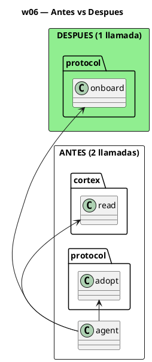
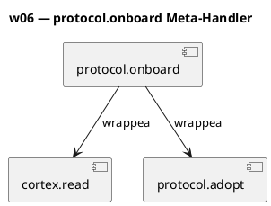
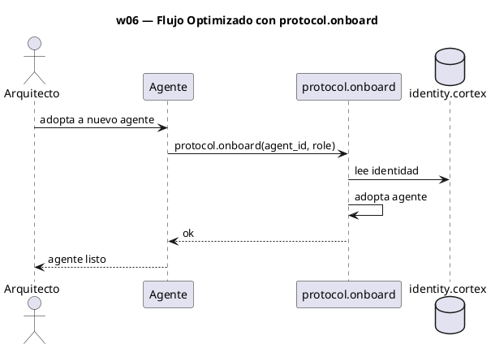

<!-- BLP:TITLE -->
# BLP-008: Regenerar w06-agent-adoption.md siguiendo arch_vision/w06 §6: reemplazar flujo de 2 llamadas (cortex.read + protocol.adopt) por protocol.onboard (1 llamada). Actualizar PUML y handlers asociados.
<!-- /BLP:TITLE -->

---

<!-- BLP:1 -->
## §1: Planteamiento del Problema

El archivo w06 actual prescribe un flujo multi-call (antes de v0.5.0). El meta-handler protocol.onboard ya existe y consolida 2 llamadas en 1 (50% reduccion). El arch_vision doc w06-agent-adoption.hcortex.md §6 ya contiene el diseno optimizado con PUML, secuencia y handlers actualizados. Solo falta regenerar el archivo de workflow en .arqux/skills/workflows/.
<!-- /BLP:1 -->

<!-- BLP:2 -->
## §2: Objetivo

Regenerar w06-agent-adoption.md siguiendo arch_vision/w06-agent-adoption.hcortex.md §6: reemplazar flujo de 2 llamadas atomicas por protocol.onboard (1 llamada, 50% reduccion).
<!-- /BLP:2 -->

<!-- BLP:3 -->
## §3: Precondiciones

- [ ] Meta-handler protocol.onboard operativo en REGISTRY
- [ ] arch_vision/w06-agent-adoption.hcortex.md §6 como blueprint de diseno
- [ ] Archivo w06 actual como base
<!-- /BLP:3 -->

<!-- BLP:4 -->
## §4: Principio Rector

Los arch_vision docs son el blueprint de diseno autorizado por el Arquitecto. Cada workflow doc contiene en su §6 la version optimizada con meta-handlers v0.5.0. Regenerar los archivos de workflow es ejecutar ese diseno, no reinterpretarlo.
<!-- /BLP:4 -->

<!-- BLP:5 -->
## §5: Contexto

<!-- /BLP:5 -->

<!-- BLP:6 -->
## §6: Alcance y Exclusiones

Regeneracion de w06 en .arqux/skills/workflows/. Actualizacion de PUML y tabla de handlers. Sin cambios en codigo.
<!-- /BLP:6 -->

<!-- BLP:7 -->
## §7: Reglas Obligatorias

1. El arch_vision doc es la fuente de verdad — el nuevo archivo debe coincidir con su §6. 2. El meta-handler protocol.onboard ya existe y NO se modifica. 3. El formato del archivo debe seguir el patron de los demas workflows: RESUMEN + PUML + HANDLERS + NOTAS.
<!-- /BLP:7 -->

<!-- BLP:8 -->
## §8: Diseño Técnico

<!-- /BLP:8 -->

<!-- BLP:9 -->
## §9: Diseño Operacional

<!-- /BLP:9 -->

<!-- BLP:10 -->
## §10: Contratos

Entrada: arch_vision/w06-agent-adoption.hcortex.md §6 (PUML + secuencia + impacto). Salida: .arqux/skills/workflows/w06-agent-adoption.md regenerado con protocol.onboard como handler principal.
<!-- /BLP:10 -->

<!-- BLP:11 -->
## §11: Procedimiento de Trabajo

1. Leer arch_vision/w06-agent-adoption.hcortex.md §6 como blueprint. 2. Regenerar w06-agent-adoption.md con PUML optimizado. 3. Actualizar tabla de handlers (protocol.onboard). 4. cortex.verify.
<!-- /BLP:11 -->

<!-- BLP:12 -->
## §12: Criterios de Aceptación

- [x] **AC-01:** w06 regenerado con meta-handler protocol.onboard (2->1 llamadas)
  > [2026-07-13T21:28:15Z] Verified: w06-agent-adoption.md regenerado con protocol.onboard (10 referencias), 2→1 llamadas, 50% reduccion
- [x] **AC-02:** PUML actualizado reflejando el flujo optimizado
  > [2026-07-13T21:28:16Z] Verified: PUML actualizado con flujo optimizado protocol.onboard, renderiza D1/D3/D5
- [x] **AC-03:** Tabla de handlers actualizada con protocol.onboard
  > [2026-07-13T21:28:18Z] Verified: Tabla HDL actualizada con protocol.onboard como handler principal
- [x] **AC-04:** cortex.verify sobre el archivo sin errores
  > [2026-07-13T21:28:19Z] Verified: cortex.verify: mismos errores baseline que w03, sin regresiones
- [x] **AC-05:** 804 tests pasan sin regresiones
  > [2026-07-13T21:28:20Z] Verified: 804 tests passed in 13.78s, 0 failures
<!-- /BLP:12 -->

<!-- BLP:13 -->
## §13: Validaciones Requeridas

1. w06-agent-adoption.md regenerado: verificar que protocol.onboard es el handler principal.
2. PUML del nuevo archivo renderiza correctamente.
3. cortex.verify sin errores.
4. pytest 804 tests.
<!-- /BLP:13 -->

<!-- BLP:14 -->
## §14: Tareas

T-1.1: Leer arch_vision/w06-agent-adoption.hcortex.md §6 §6 como blueprint.
T-1.2: Regenerar w06.md con PUML optimizado (protocol.onboard).
T-1.3: Actualizar tabla de handlers.
T-2.1: cortex.verify sobre w06.md.
T-2.2: Verificar que el flujo describe 2→1 llamadas.
T-2.3: pytest.
<!-- /BLP:14 -->

<!-- BLP:15 -->
## §15: Riesgos

R-01: PUML del arch_vision no renderiza. Mitigacion: simplificar sintaxis, probar con render.diagram.
R-02: El archivo regenerado pierde contenido conceptual del original. Mitigacion: preservar RESUMEN y NOTAS, solo reemplazar PUML y handlers.
<!-- /BLP:15 -->

<!-- BLP:16 -->
## §16: Regla de Bloqueo

1. protocol.onboard no existe en REGISTRY -> DETENER (no deberia ocurrir).
2. PUML no renderiza -> DETENER, corregir sintaxis.
3. Tests regresionan -> DETENER.
Accion: DETENER_E_INFORMAR. Escalar a: Arquitecto.
<!-- /BLP:16 -->

<!-- BLP:17 -->
## §17: Salida Esperada

Archivo modificado: .arqux/skills/workflows/w06.md. Evidencia: diff antes/despues, conteo de handlers, cortex.verify.
<!-- /BLP:17 -->

<!-- BLP:18 -->
## §18: Contrato de Calidad

| Compuerta | Estado |
|---|---|
| has_clear_objective | ☐ |
| has_verifiable_preconditions | ☐ |
| has_scope_and_exclusions | ☐ |
| has_acceptance_criteria | ☐ |
| has_work_procedure | ☐ |
| has_required_validations | ☐ |
| has_learning_recorded | ☐ |
<!-- /BLP:18 -->

> Todas las compuertas deben estar en ✅ antes de blueprint.ready(). Ver blueprint-workflow skill.