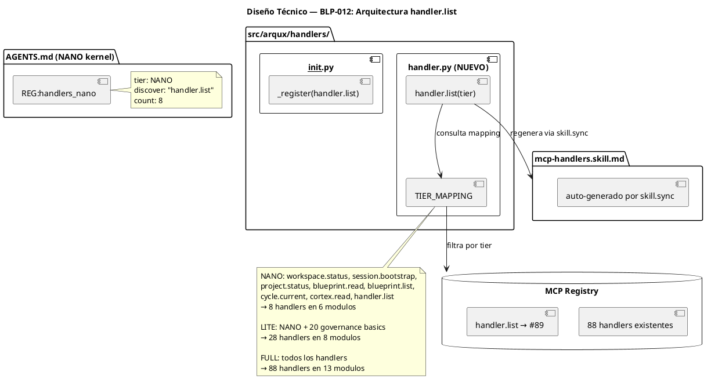
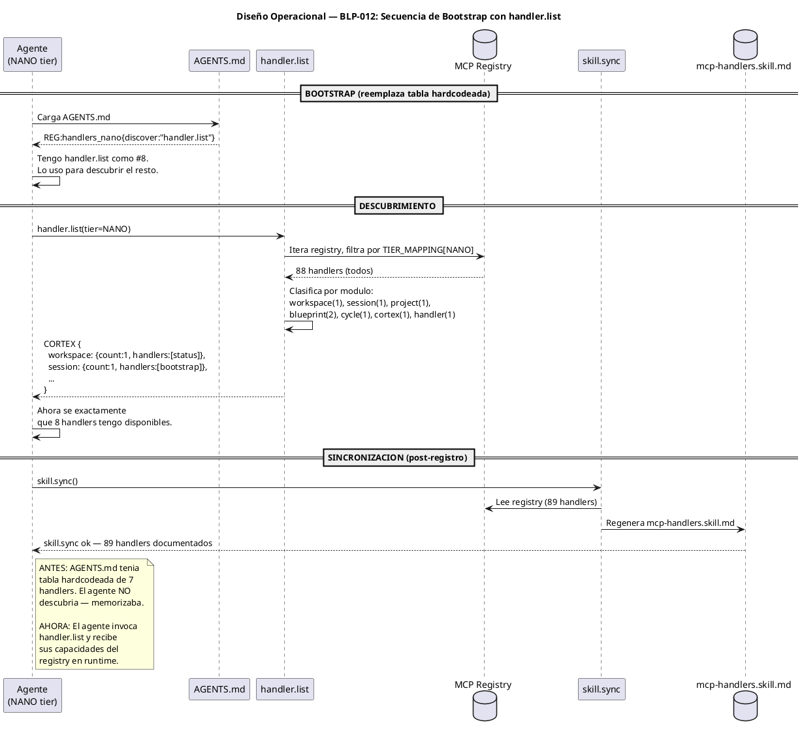

<!-- BLP:TITLE -->
# BLP-012: handler.list — Dynamic Capability Discovery
<!-- /BLP:TITLE -->

---

<!-- BLP:1 -->
## §1: Planteamiento del Problema

Hoy AGENTS.md, AGENTS.lite.md y AGENTS.full.md contienen tablas hardcodeadas de handlers. El agente lee una lista estática para saber qué puede hacer. Esto genera tres problemas:

**Evidencia:**
- **Duplicación frágil:** Los mismos 88 handlers están documentados en 4 lugares (AGENTS.md × 3 + mcp-handlers.skill.md). Cada cambio de registry requiere tocar 4 archivos.
- **Off-by-one:** MCP registry real = 88 handlers. AGENTS.md declara 87. Una actualización no se propagó. Auditoría Heimdall 13-jul-2026.
- **Conocimiento estático:** El agente no "descubre" sus capacidades — las lee de un archivo. Si el registry cambia en runtime (skill.sync), AGENTS.md queda desactualizado hasta que alguien lo edite.

**Impacto de no resolverlo:**
Cada nuevo handler, cada skill.sync, cada evolución del registry requerirá editar 3 archivos AGENTS manualmente. El off-by-one se repetirá. La arquitectura fuerza divergencia entre lo que el agente cree que puede hacer (AGENTS.md) y lo que realmente puede hacer (MCP registry).
<!-- /BLP:1 -->

<!-- BLP:2 -->
## §2: Objetivo

handler.list reemplaza TRES artefactos de una vez: (1) tablas hardcodeadas en AGENTS.md/LITE/FULL, (2) mcp-handlers.skill.md — el archivo de documentacion estatica, (3) skill.sync — el handler que existia solo para regenerar mcp-handlers.skill.md. Ambos se RETIRAN. El agente descubre todo desde el registry en runtime.
<!-- /BLP:2 -->

<!-- BLP:3 -->
## §3: Precondiciones

MCP server operativo con 88 handlers registrados. AGENTS.md 3-tier implementado. CODEC-CORTEX v0.5.0 operativo. mcp-handlers.skill.md y skill.sync actualmente existen y seran retirados como parte de esta BLP.
<!-- /BLP:3 -->

<!-- BLP:4 -->
## §4: Principio Rector

El agente descubre, no memoriza. No hay documentacion estatica de handlers — solo el registry vivo. mcp-handlers.skill.md era un snapshot mantenido artificialmente por skill.sync. Ambos desaparecen: el snapshot y el sincronizador. Si alguien necesita documentacion offline, handler.list(tier=FULL) la genera on-demand.
<!-- /BLP:4 -->

<!-- BLP:5 -->
## §5: Contexto

Nuevo modulo handler en src/arqux/handlers/handler.py con handler list(tier). Retiro de mcp-handlers.skill.md (archivo estatico) y skill.sync (handler que lo mantenia). AGENTS.md y deltas solo referencian el descubridor.
<!-- /BLP:5 -->

<!-- BLP:6 -->
## §6: Alcance y Exclusiones

Dentro del alcance: nuevo modulo handler con handler.list(tier), clasificacion por modulo y tier, actualizacion de AGENTS.md/LITE/FULL. Retiro de mcp-handlers.skill.md y skill.sync. Fuera del alcance: remocion de otros handlers, cambios en logica de registro, clasificacion por rol.
<!-- /BLP:6 -->

<!-- BLP:7 -->
## §7: Reglas Obligatorias

1. handler.list es el UNICO handler nuevo. 2. Clasificacion de tiers en mapping dentro de handler.py. 3. AGENTS.md NANO declara handler.list como #8. 4. mcp-handlers.skill.md se ELIMINA — ya no es necesario. 5. skill.sync se ELIMINA del registry — existia solo para regenerar mcp-handlers.skill.md. 6. Si se necesita doc offline: handler.list(tier=FULL) genera el equivalente on-demand. 7. Conteo de handlers por tier debe coincidir con registry (tests).
<!-- /BLP:7 -->

<!-- BLP:8 -->
## §8: Diseño Técnico


<!-- /BLP:8 -->

<!-- BLP:9 -->
## §9: Diseño Operacional


<!-- /BLP:9 -->

<!-- BLP:10 -->
## §10: Contratos

**Entradas esperadas:**
- `handler.list(tier)` donde `tier ∈ {NANO, LITE, FULL}`

**Salidas esperadas:**
- CORTEX clasificado por módulo:
```
$workspace:{count:1, handlers:[{name:"status", description:"..."}]}
$session:{count:1, handlers:[{name:"bootstrap", description:"..."}]}
...
```
- Total de handlers coincide con TIER_MAPPING

**Comandos:**
- `pytest tests/test_handler_list.py` — validación de conteos por tier
- `python -c "from arqux.handlers import REGISTRY; print(len(REGISTRY))"` — verificar 89 handlers
<!-- /BLP:10 -->

<!-- BLP:11 -->
## §11: Procedimiento de Trabajo

1. Crear handler.py con handler.list(tier) y TIER_MAPPING. 2. Registrar en __init__.py. 3. Actualizar AGENTS.md NANO $3. 4. Actualizar AGENTS.lite.md $2. 5. Actualizar AGENTS.full.md $2. 6. ELIMINAR mcp-handlers.skill.md de .arqux/skills/. 7. ELIMINAR skill.sync del registry (__init__.py) y del codigo. 8. Actualizar workflows.skill.md — remover referencia a skill.sync. 9. Actualizar protocol.skill.md — remover referencia a skill.sync en bootstrap. 10. Verificar conteos por tier.
<!-- /BLP:11 -->

<!-- BLP:12 -->
## §12: Criterios de Aceptación

AC-01: handler.list(NANO)→8. AC-02: handler.list(LITE)→28. AC-03: handler.list(FULL)→88. AC-04: AGENTS.md sin tabla. AC-05: AGENTS.lite.md sin $2 tabla. AC-06: AGENTS.full.md sin $2 tabla. AC-07: mcp-handlers.skill.md NO EXISTE en .arqux/skills/. AC-08: skill.sync NO EXISTE en registry. AC-09: respuesta CORTEX valido clasificado por modulo.
<!-- /BLP:12 -->

<!-- BLP:13 -->
## §13: Validaciones Requeridas

| Tipo | Descripción | Comando | Evidencia Esperada |
|---|---|---|---|
| test | Conteo NANO = 8 | `pytest tests/test_handler_list.py -k nano` | 8 handlers, 6 modulos |
| test | Conteo LITE = 28 | `pytest tests/test_handler_list.py -k lite` | 28 handlers, 8 modulos |
| test | Conteo FULL = 88 | `pytest tests/test_handler_list.py -k full` | 88 handlers, 13 modulos |
| lint | Sin tablas en AGENTS | `grep -rn "|--" AGENTS*.md` | 0 resultados |
| seguridad | handler.list no modifica estado | `pytest tests/test_handler_list.py -k readonly` | solo lectura |
<!-- /BLP:13 -->

<!-- BLP:14 -->
## §14: Tareas

T-1: Crear handler.py con handler.list(tier) + TIER_MAPPING. T-2: Registrar en __init__.py. T-3: Actualizar AGENTS.md NANO $3. T-4: Actualizar AGENTS.lite.md $2. T-5: Actualizar AGENTS.full.md $2. T-6: ELIMINAR mcp-handlers.skill.md. T-7: ELIMINAR skill.sync del registry. T-8: Actualizar skills que referencian skill.sync (workflows, protocol). T-9: Verificar conteos NANO/LITE/FULL. T-10: Verificar AGENTS sin tablas y sin referencias a skill.sync.
<!-- /BLP:14 -->

<!-- BLP:15 -->
## §15: Riesgos

R-01: handler.list no disponible en NANO → alto → declarado como #8. R-02: clasificacion incorrecta → medio → tests de conteo. R-03: skill.sync era usado por otros workflows → medio → auditar referencias antes de eliminar (T-8). R-04: mcp-handlers.skill.md era referencia humana → bajo → handler.list(tier=FULL) genera equivalente on-demand.
<!-- /BLP:15 -->

<!-- BLP:16 -->
## §16: Regla de Bloqueo

1. Si handler.list no se registra → DETENER. 2. Si skill.sync tiene referencias activas en otros skills/workflows → DETENER, auditar antes de eliminar. 3. Si algun AGENTS*.md conserva tablas hardcodeadas → DETENER. 4. Si mcp-handlers.skill.md no se puede eliminar limpiamente → DETENER. Accion: DETENER_E_INFORMAR. Escalar a: Arquitecto.
<!-- /BLP:16 -->

<!-- BLP:17 -->
## §17: Salida Esperada

Archivos creados: handler.py. Archivos modificados: __init__.py, AGENTS.md, AGENTS.lite.md, AGENTS.full.md, workflows.skill.md, protocol.skill.md. Archivos ELIMINADOS: mcp-handlers.skill.md, skill.sync (handler + codigo). Handlers totales: 88 (88 originales + handler.list - skill.sync = 88). Evidencia: handler.list(tier=NANO/LITE/FULL) con conteos correctos, grep confirma eliminacion.
<!-- /BLP:17 -->

<!-- BLP:18 -->
## §18: Contrato de Calidad

| Compuerta | Estado |
|---|---|
| has_clear_objective | ✅ |
| has_verifiable_preconditions | ✅ |
| has_scope_and_exclusions | ✅ |
| has_acceptance_criteria | ✅ |
| has_work_procedure | ✅ |
| has_required_validations | ✅ |
| has_learning_recorded | ✅ |
<!-- /BLP:18 -->

> Todas las compuertas deben estar en ✅ antes de blueprint.ready(). Ver blueprint-workflow skill.