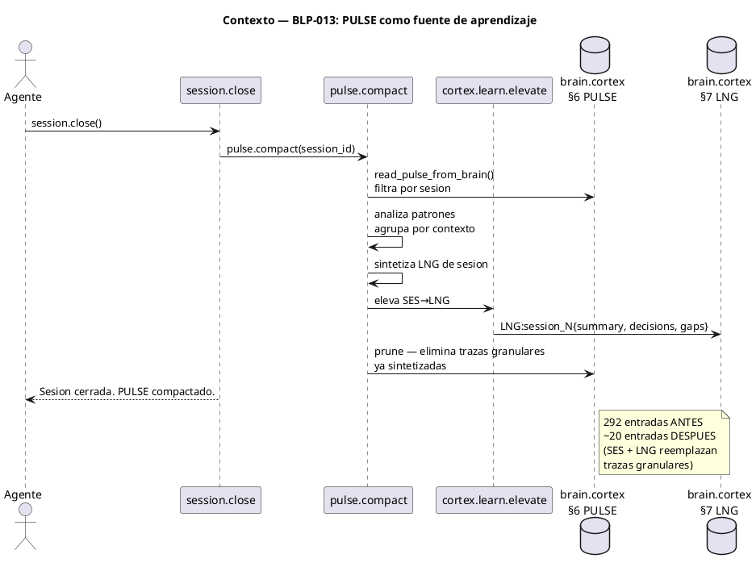

<!-- BLP:TITLE -->
# BLP-013: pulse.compact — Compactación de PULSE en cierre de sesión vía aprendizaje CORTEX
<!-- /BLP:TITLE -->

---

<!-- BLP:1 -->
## §1: Planteamiento del Problema

El PULSE del proyecto acumula 292 entradas de auditoría. Diecisiete handlers escriben en él. Ninguno lo compacta. El resultado: un vertedero de trazas granulares donde el 90% son eventos de ciclos cerrados sin valor operacional presente.

**Evidencia:**
- 292 entradas AUD en brain.cortex §6. Solo ~20 de la sesión actual son relevantes.
- 17 archivos Python importan y escriben PULSE. Cero archivos lo gestionan.
- CYCLE-03 diseñó PULSE writing en 10+ handlers (BLP-003 a BLP-010), pero CYCLE-03/BLP-002 (PULSE integration + cycle.validate) fue cancelado. La escritura quedó sin su contraparte de gestión.
- BLP-038 definió 3 líneas de aprendizaje paralelas (conductual, procedimental, contextual) y cortex.learn.elevate para SES→LNG→KNW, pero la elevación nunca compacta el PULSE fuente.

**Impacto de no resolverlo:**
El PULSE crece linealmente con cada sesión. En 10 sesiones más tendrá +2000 entradas. Buscar eventos relevantes se vuelve imposible. El brain.cortex se infla con ruido histórico. El aprendizaje CORTEX (SES→LNG→KNW) extrae conocimiento pero deja el residuo acumulándose.
<!-- /BLP:1 -->

<!-- BLP:2 -->
## §2: Objetivo

Agregar `pulse.compact` al módulo existente `pulse.py`: un handler que se ejecuta como parte de `session.close`, analiza los PULSE de la sesión que cierra, sintetiza un resumen LNG de sesión, y poda las trazas granulares que ya cumplieron su propósito. El PULSE deja de ser un vertedero y se vuelve un registro vivo con aprendizaje integrado.

**Resultado:** Al cerrar sesión, los pulses granulares se elevan a LNG. Lo que no se eleva se poda. El PULSE queda limpio, trazable, y con memoria útil.
<!-- /BLP:2 -->

<!-- BLP:3 -->
## §3: Precondiciones

- [ ] Módulo `pulse.py` existente con `append_pulse_to_brain()`, `next_pulse_event_id()`, `read_pulse_from_brain()`
- [ ] `session.close` operativo y escribiendo SES en brain.cortex
- [ ] `cortex.learn` y `cortex.learn.elevate` operativos (BLP-038)
- [ ] 292+ entradas PULSE acumuladas (caso real de prueba)
- [ ] BLP-012 completado (handler.list, mcp-handlers.skill.md retirado)
<!-- /BLP:3 -->

<!-- BLP:4 -->
## §4: Principio Rector

El PULSE no acumula, aprende. pulse.compact es un handler completo — el agente lo invoca directamente (con dry_run para inspeccionar, o sin él para ejecutar) y también se dispara automáticamente en session.close. Lo que no merece ser lección, no merece persistir.
<!-- /BLP:4 -->

<!-- BLP:5 -->
## §5: Contexto

<!-- /BLP:5 -->

<!-- BLP:6 -->
## §6: Alcance y Exclusiones

**Dentro del alcance:**
- Nuevo handler `pulse.compact` en `pulse.py`
- Integración con `session.close` — se ejecuta automáticamente al cerrar sesión
- Síntesis de PULSE granulares → LNG de sesión (1 entrada por sesión)
- Poda de trazas granulares ya sintetizadas
- Preservación de SES (session checkpoints) — nunca se podan
- Preservación de eventos de la sesión actual (no cerrada)

**Fuera del alcance (excluido explícitamente):**
- Compactación de ciclos completos (eso es para cycle.close + cortex.learn)
- Eliminación de LNG existentes
- Modificación de `next_pulse_event_id` o `append_pulse_to_brain`
- Cambios en los 17 handlers que escriben PULSE
- Interfaz interactiva de revisión de compactación
<!-- /BLP:6 -->

<!-- BLP:7 -->
## §7: Reglas Obligatorias

1. pulse.compact es un handler completo disponible para el agente via MCP — invocable directamente, no solo como parte de session.close. 2. La integración con session.close es automática pero no exclusiva: el agente puede compactar bajo demanda. 3. Las entradas SES nunca se podan. 4. Los pulses de la sesión indicada se analizan. 5. La síntesis LNG usa CORTEX: LNG:session_{id}{type:session, summary, decisions, gaps}. 6. Si <5 entradas, se reporta skip sin modificar. 7. Idempotente. 8. La compactación se registra como meta-evento AUD. 9. El handler acepta dry_run para que el agente pueda inspeccionar qué se compactará antes de ejecutar.
<!-- /BLP:7 -->

<!-- BLP:8 -->
## §8: Diseño Técnico

Nuevo handler pulse.compact en pulse.py, expuesto al agente via MCP. Acepta parámetros: session_id (requerido), dry_run (default false). Si dry_run=true, reporta qué se compactará sin modificar el brain. La integración con session.close lo invoca con dry_run=false automáticamente. El handler lee PULSE con read_pulse_from_brain(), filtra por sesión, agrupa por kind, sintetiza LNG, y poda granulares preservando SES. Se registra en handler_schemas de pulse.py para que handler.list lo descubra.
<!-- /BLP:8 -->

<!-- BLP:9 -->
## §9: Diseño Operacional

Secuencia operacional: (a) Agente invoca pulse.compact(session_id=X, dry_run=true) para inspeccionar. (b) Agente revisa el plan de compactación. (c) Agente invoca pulse.compact(session_id=X). O bien: session.close invoca pulse.compact automáticamente. En ambos casos: leer PULSE, filtrar, agrupar, sintetizar LNG, elevar, podar, registrar meta-evento.
<!-- /BLP:9 -->

<!-- BLP:10 -->
## §10: Contratos

**Entradas esperadas:**
- `compact_session_pulse(project_root, session_id, agent_id)` — invocado por session.close
- PULSE existente en brain.cortex §6 con entradas de la sesión

**Salidas esperadas:**
- 1 entrada LNG en brain.cortex §7 con resumen de sesión
- N entradas granulares eliminadas de §6 PULSE
- 1 meta-evento AUD en §6: "pulse.compact ok"
- SES preservada intacta

**Comandos:**
- `pytest tests/test_pulse_compact.py` — validación de compactación
- `python -c "from arqux.pulse import compact_session_pulse"` — verificar import
<!-- /BLP:10 -->

<!-- BLP:11 -->
## §11: Procedimiento de Trabajo

### Fase 1: Implementación en pulse.py
1. Agregar `compact_session_pulse(project_root, session_id, agent_id)` a `pulse.py`
2. Leer PULSE con `read_pulse_from_brain()`, filtrar por agente y timestamp de sesión
3. Si < 5 entradas → skip (sesión trivial)
4. Agrupar entradas por `kind` (task_complete, blueprint_lifecycle, decision, etc.)
5. Sintetizar LNG: `LNG:session_{id}{type:session, summary, patterns, decisions, gaps}`
6. Escribir LNG vía `cortex.entry.add` en §7
7. Podar entradas granulares del PULSE (reescribir brain sin ellas)
8. Registrar meta-evento AUD en PULSE

### Fase 2: Integración con session.close
1. Modificar `session.close` en `handlers/session.py` para llamar a `compact_session_pulse` después de escribir SES
2. Pasar `project_root`, `session_id`, `agent_id` desde el contexto de cierre

### Fase 3: Registro y validación
1. Agregar `pulse.compact` a `handler_schemas` en `pulse.py` (o en `handlers/__init__.py`)
2. Ejecutar skill.sync ← BLP-012 lo retiró. Usar handler.list en su lugar.
3. Verificar: sesión con 50+ pulses → cierra → 1 LNG + SES + meta-evento
4. Verificar: sesión con 3 pulses → skip, sin cambios

> **Reversión:** `git checkout src/arqux/pulse.py src/arqux/handlers/session.py`
<!-- /BLP:11 -->

<!-- BLP:12 -->
## §12: Criterios de Aceptación

AC-01: pulse.compact(session_id) procesa 50+ entradas → 1 LNG en §7, SES preservada. AC-02: <5 entradas → skip reportado. AC-03: session.close llama a pulse.compact automáticamente. AC-04: SES nunca podadas. AC-05: Meta-evento AUD registrado. AC-06: Idempotente. AC-07: PULSE post-compactación más chico. AC-08: LNG CORTEX válido. AC-09: pulse.compact visible en handler.list(tier=FULL). AC-10: dry_run=true reporta sin modificar.
<!-- /BLP:12 -->

<!-- BLP:13 -->
## §13: Validaciones Requeridas

| Tipo | Descripción | Comando | Evidencia Esperada |
|---|---|---|---|
| test | Compactación 50+ entries | `pytest tests/test_pulse_compact.py -k large` | 1 LNG, SES intacta |
| test | Skip <5 entries | `pytest tests/test_pulse_compact.py -k small` | sin cambios |
| test | Idempotencia | `pytest tests/test_pulse_compact.py -k idempotent` | sin duplicados |
| test | SES preservada | `pytest tests/test_pulse_compact.py -k ses` | SES intacta |
| integration | session.close → compact | Invocar session.close con 20+ pulses previos | PULSE reducido |
<!-- /BLP:13 -->

<!-- BLP:14 -->
## §14: Tareas

T-1: Agregar compact_session_pulse() a pulse.py. T-2: Agregar _prune_pulse_entries(). T-3: Registrar pulse.compact como handler MCP en handler_schemas con soporte dry_run. T-4: Integrar en session.close. T-5: Tests: compactación, skip, idempotencia, SES preservada, dry_run. T-6: Verificar handler.list(FULL) incluye pulse.compact. T-7: Probar con datos reales.
<!-- /BLP:14 -->

<!-- BLP:15 -->
## §15: Riesgos

| ID | Descripción | Impacto | Mitigación |
|---|---|---|---|
| R-01 | Poda elimina SES por error | Alto — pérdida de trazabilidad | SES marcadas con kind=session_checkpoint, NUNCA podadas |
| R-02 | Síntesis LNG pierde información crítica | Medio — pérdida de contexto | LNG incluye summary + decisions + gaps explícitos |
| R-03 | Reescritura de brain.cortex corrupta el archivo | Alto — pérdida de datos | Backup automático antes de escribir (atomic write de CODEC-CORTEX) |
| R-04 | session.close se vuelve lento con PULSE grande | Bajo — latencia | Compactación solo analiza entradas de la sesión actual (filtradas por timestamp) |
<!-- /BLP:15 -->

<!-- BLP:16 -->
## §16: Regla de Bloqueo

1. Si `read_pulse_from_brain` falla o retorna datos corruptos → DETENER, no compactar.
2. Si la reescritura del brain falla (atomic write error) → DETENER, restaurar backup.
3. Si una entrada SES es candidata a poda → DETENER, bug en filtro de preservación.

**Acción:** DETENER_E_INFORMAR
**Escalar a:** Arquitecto
<!-- /BLP:16 -->

<!-- BLP:17 -->
## §17: Salida Esperada

Archivos modificados: pulse.py (compact_session_pulse, handler_schemas), session.py (integración). pulse.compact visible en handler.list(tier=FULL). Handler completo con dry_run. Evidencia: tests pasan, PULSE reducido, LNG en §7.
<!-- /BLP:17 -->

<!-- BLP:18 -->
## §18: Contrato de Calidad

| Compuerta | Estado |
|---|---|
| has_clear_objective | ✅ |
| has_verifiable_preconditions | ✅ |
| has_scope_and_exclusions | ✅ |
| has_acceptance_criteria | ✅ |
| has_work_procedure | ✅ |
| has_required_validations | ✅ |
| has_learning_recorded | ☐ |
<!-- /BLP:18 -->

> Todas las compuertas deben estar en ✅ antes de blueprint.ready(). Ver blueprint-workflow skill.