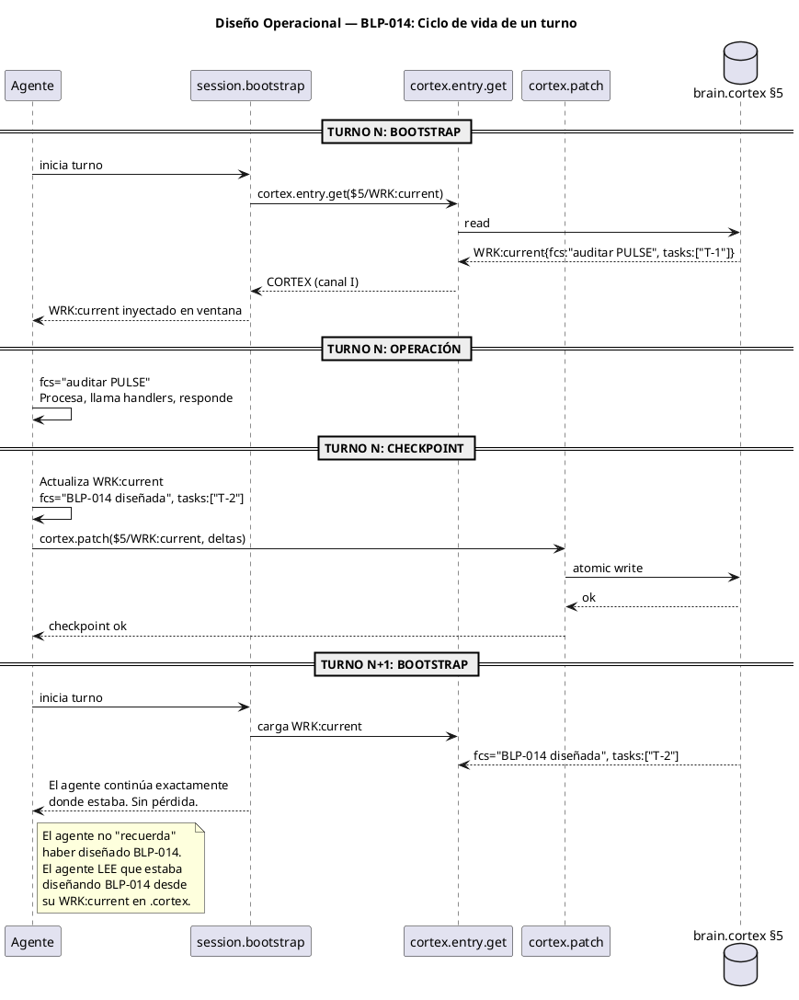

<!-- BLP:TITLE -->
# BLP-014: CORTEX-native Working Memory — checkpoint, bootstrap, compact
<!-- /BLP:TITLE -->

---

<!-- BLP:1 -->
## §1: Planteamiento del Problema

El agente opera con memoria volátil. Su ventana de contexto es una secuencia de tokens que se pierde entre sesiones y se degrada por compactación del harness. AGENTS.md declara `AXM:memory_format{Native memory:CODEC-CORTEX}` pero en la práctica el agente piensa en prosa, responde en HCORTEX, y su estado de trabajo solo se persiste al cerrar sesión (SES).

**Evidencia:**
- BLP-016 (CYCLE-02, in_progress) diseñó el mecanismo pero nunca se completó: binder, proxy checkpoint, AX:compact quedaron como axiomas sin implementación.
- session.bootstrap ya carga contexto CORTEX del brain (canal I). Pero el checkpoint entre turnos no existe.
- 9 handlers de cortex.entry.* existen para leer/escribir estado. La infraestructura está. Falta el mecanismo.
- El agente puede generar CORTEX — es solo un formato de texto denso. El LLM procesa tokens; CORTEX es una secuencia de tokens más eficiente que la prosa.

**Impacto de no resolverlo:**
Entre turnos, el agente pierde su foco. Cada turno es una "mini-sesión" donde reconstruye contexto. La memoria declarada como CORTEX-native es en realidad prosa en la ventana. AXM:memory_format es una aspiración, no una realidad operativa.
<!-- /BLP:1 -->

<!-- BLP:2 -->
## §2: Objetivo

Implementar el ciclo completo de memoria CORTEX-native:

1. **Bootstrap:** Al iniciar turno, cargar `WRK:current` desde brain.cortex §5. El agente arranca con su estado de trabajo en la ventana.
2. **Checkpoint:** Al finalizar turno, persistir `WRK:current` a brain.cortex §5 vía `cortex.patch`. El estado sobrevive entre turnos.
3. **Compact:** `AX:compact` — serializar la ventana de contexto completa a .cortex y recargar desde .cortex. Reemplaza resúmenes en prosa por estado CORTEX denso.

**Resultado:** El agente no "recuerda" — el agente "lee su estado". CORTEX es el formato de trabajo, no solo de almacenamiento.
<!-- /BLP:2 -->

<!-- BLP:3 -->
## §3: Precondiciones

- [ ] `cortex.entry.*` handlers operativos (add, get, update, patch)
- [ ] `session.bootstrap` cargando contexto CORTEX (canal I)
- [ ] `session.close` escribiendo SES
- [ ] BLP-012 completado (handler.list)
- [ ] BLP-013 en ejecución (pulse.compact)
- [ ] brain.cortex con sección $5 (WRK) disponible
<!-- /BLP:3 -->

<!-- BLP:4 -->
## §4: Principio Rector

El agente no recuerda. El agente lee su estado. El ciclo es: meta-brain → proyecto → brain.cortex §5 → WRK:current. Cada proyecto tiene su propio WRK:current independiente. CORTEX no es un formato de archivo — es el lenguaje de trabajo del agente a nivel proyecto.
<!-- /BLP:4 -->

<!-- BLP:5 -->
## §5: Contexto

Workspace root: .arqux/meta-brain.cortex con DOM entries. Proyecto ARQUX/: .arqux/brain.cortex con §5 WRK:current. Agentes: alfred (governor), jarvis (executor), heimdall/seshat (auditores). El ciclo bootstrap→checkpoint opera a nivel proyecto — cada proyecto tiene su propio WRK:current independiente.
<!-- /BLP:5 -->

<!-- BLP:6 -->
## §6: Alcance y Exclusiones

**Dentro del alcance:**
- `WRK:current` en brain.cortex §5 como estado de trabajo del agente
- `session.bootstrap` carga `WRK:current` al iniciar (modo canal I, ya lo hace parcialmente)
- Nuevo handler `cortex.checkpoint` — persiste `WRK:current` post-turno vía `cortex.patch`
- Función `compact_context()` — serializa ventana a WRK:full, recarga desde .cortex
- AGENTS.md actualizado: `AXM:memory_format` con procedimiento concreto

**Fuera del alcance:**
- Cambiar el sustrato de memoria del LLM (imposible — es tokens)
- Forzar al harness/transporte a inyectar CORTEX (gap 3/4 de BLP-016)
- Binder para plataformas no-ArqUX
- Modificar la ventana de contexto del modelo (eso lo hace el harness)
<!-- /BLP:6 -->

<!-- BLP:7 -->
## §7: Reglas Obligatorias

1. WRK:current vive en brain.cortex §5 del proyecto activo. Es UNA LINEA CORTEX. 2. El agente bootea: meta-brain → proyecto → brain.cortex §5 → WRK:current. 3. Todo turno comienza cargando WRK:current de §5 (cortex.entry.get). 4. Todo turno termina persistiendo WRK:current en §5 (cortex.patch — reemplaza la linea). 5. AX:compact serializa ventana como una entrada CORTEX en §5. 6. Si WRK:current no existe, se inicializa con defaults en una linea. 7. Formato: WRK:current{fcs:, obj:, tasks:, state:, last_turn:} — todo en una linea.
<!-- /BLP:7 -->

<!-- BLP:8 -->
## §8: Diseño Técnico

Nuevo handler cortex.checkpoint en handlers/session.py. Persiste WRK:current en brain.cortex §5 del proyecto activo vía cortex.patch. Acepta content (CORTEX) o infiere del contexto. Se registra como handler MCP. session.bootstrap se modifica para cargar WRK:current de §5 — carga ocurre después de resolver el proyecto desde el meta-brain. El meta-brain no contiene WRK — solo DOM y referencias a proyectos.
<!-- /BLP:8 -->

<!-- BLP:9 -->
## §9: Diseño Operacional

<!-- /BLP:9 -->

<!-- BLP:10 -->
## §10: Contratos

WRK:current{fcs:"lo que el agente esta haciendo", obj:"objetivo del turno", tasks:"T-1,T-2", state:in_progress, last_turn:"2026-07-13T23:00:00Z", blp:"BLP-014", cycle:"CYCLE-04"}

CORTEX es UNA LINEA por entrada. No es JSON, no es multi-linea, no es un bloque. Es un sigil seguido de un cuerpo compacto key:value en una sola linea. El checkpoint escribe UNA linea en §5. cortex.patch reemplaza UNA linea.
<!-- /BLP:10 -->

<!-- BLP:11 -->
## §11: Procedimiento de Trabajo

### Fase 1: checkpoint_context handler
1. Crear `checkpoint_context()` en `handlers/session.py`
2. Acepta `content` (CORTEX con nuevo WRK:current) o infiere del contexto de sesión
3. Usa `cortex.patch` para escribir en brain.cortex §5
4. Registra evento AUD en PULSE

### Fase 2: Bootstrap enhancement
1. Modificar `session.bootstrap` para cargar `WRK:current` de §5
2. Incluir `wrf_current` en `cortex_context` del bootstrap
3. Si no existe WRK:current, inicializar con defaults

### Fase 3: AGENTS.md update
1. Actualizar `AXM:memory_format` con referencia a `cortex.checkpoint`
2. Agregar `WK:cortex_memory` con el procedimiento bootstrap→work→checkpoint
3. Agregar `AXM:compact` documentando AX:compact

### Fase 4: AX:compact
1. Implementar `compact_context()` que serializa la ventana a WRK:full
2. Recarga desde WRK:full (el agente obtiene estado CORTEX en vez de resumen prosa)

> **Reversión:** `git checkout` de los archivos modificados.
<!-- /BLP:11 -->

<!-- BLP:12 -->
## §12: Criterios de Aceptación

- [ ] **AC-01:** `session.bootstrap` retorna `wrf_current` con el estado de trabajo del agente
- [ ] **AC-02:** `cortex.checkpoint(content)` persiste WRK:current en brain.cortex §5
- [ ] **AC-03:** WRK:current sobrevive entre turnos (verificado con 2 bootstraps consecutivos)
- [ ] **AC-04:** Si WRK:current no existe, bootstrap lo inicializa con defaults (sin error)
- [ ] **AC-05:** `cortex.checkpoint` escribe PULSE (meta-evento AUD)
- [ ] **AC-06:** AGENTS.md $2 `AXM:memory_format` actualizado con referencia concreta a checkpoint
- [ ] **AC-07:** `AX:compact` serializa y recarga desde .cortex
- [ ] **AC-08:** `handler.list(tier=FULL)` incluye `cortex.checkpoint`
<!-- /BLP:12 -->

<!-- BLP:13 -->
## §13: Validaciones Requeridas

| Tipo | Descripción | Comando | Evidencia Esperada |
|---|---|---|---|
| test | Bootstrap carga WRK:current | `pytest tests/test_cortex_memory.py -k bootstrap` | wf_current en respuesta |
| test | Checkpoint persiste | `pytest tests/test_cortex_memory.py -k checkpoint` | WRK:current en §5 |
| test | Sobrevive entre turnos | `pytest tests/test_cortex_memory.py -k persistence` | segundo bootstrap ve cambios |
| test | Default en primer turno | `pytest tests/test_cortex_memory.py -k default` | inicializado sin error |
| integration | AX:compact serializa | Invocar compact, verificar WRK:full | WRK:full creado |
<!-- /BLP:13 -->

<!-- BLP:14 -->
## §14: Tareas

- [x] **T-1:** Agregar `checkpoint_context()` a `handlers/session.py` — acepta content CORTEX, persiste vía cortex.patch a §5
- [x] **T-2:** Modificar `session.bootstrap` para cargar `WRK:current` de §5 e incluirlo en cortex_context (depende de T-1)
- [x] **T-3:** Inicializar `WRK:current` con defaults si no existe (depende de T-2)
- [x] **T-4:** Registrar `cortex.checkpoint` como handler MCP (depende de T-1)
- [x] **T-5:** Actualizar AGENTS.md $2: `AXM:memory_format` + `WK:cortex_memory` + `AXM:compact` (depende de T-1)
- [x] **T-6:** Implementar `compact_context()` para AX:compact (depende de T-1, T-2)
- [~] **T-7:** Tests: bootstrap, checkpoint, persistencia, default, compact (depende de T-1 a T-6)
- [ ] **T-8:** Verificar `handler.list(FULL)` incluye `cortex.checkpoint` (depende de T-4)
<!-- /BLP:14 -->

<!-- BLP:15 -->
## §15: Riesgos

| ID | Descripción | Impacto | Mitigación |
|---|---|---|---|
| R-01 | Checkpoint entre turnos no se ejecuta (el agente olvida llamarlo) | Alto — estado perdido | AGENTS.md declara obligatorio; el agente lo internaliza como paso final de cada turno |
| R-02 | WRK:current crece indefinidamente | Medio — brain.cortex inflado | WRK:current es reemplazado, no appendeado. Tamaño constante |
| R-03 | Bootstrap carga estado corrupto | Alto — agente desorientado | Validación CORTEX antes de inyectar; si falla, inicializa defaults |
| R-04 | Multi-agente: dos agentes pisan WRK:current | Medio — race condition | WRK:current es por agente (agent_id en la key). Cada agente tiene su propio WRK |
<!-- /BLP:15 -->

<!-- BLP:16 -->
## §16: Regla de Bloqueo

1. Si `cortex.patch` falla al escribir WRK:current → DETENER. El estado no se persiste, pero la sesión continúa (degradación gracefully).
2. Si `session.bootstrap` no puede leer WRK:current → inicializar defaults, NO bloquear.
3. Si WRK:current está corrupto (cortex.verify fail) → DETENER, reportar al Arquitecto.

**Acción:** DETENER_E_INFORMAR (solo caso 3)
**Escalar a:** Arquitecto
<!-- /BLP:16 -->

<!-- BLP:17 -->
## §17: Salida Esperada

**Archivos modificados:**
- `src/arqux/handlers/session.py` — `checkpoint_context()`, bootstrap cargando WRK:current
- `AGENTS.md` — `AXM:memory_format` + `WK:cortex_memory` + `AXM:compact`

**Archivos creados:**
- `tests/test_cortex_memory.py`

**Evidencia:**
- Bootstrap retorna `wrf_current` con estado del agente
- Checkpoint persiste entre turnos
- `handler.list(FULL)` incluye `cortex.checkpoint`
- AGENTS.md documenta el ciclo bootstrap→work→checkpoint

**Resumen:**
> El agente no recuerda. El agente lee su estado de .cortex. CORTEX es el formato de trabajo, no solo de almacenamiento.
<!-- /BLP:17 -->

<!-- BLP:18 -->
## §18: Contrato de Calidad

| Compuerta | Estado |
|---|---|
| has_clear_objective | ✅ |
| has_verifiable_preconditions | ✅ |
| has_scope_and_exclusions | ✅ |
| has_acceptance_criteria | ✅ |
| has_work_procedure | ✅ |
| has_required_validations | ✅ |
| has_learning_recorded | ☐ |
<!-- /BLP:18 -->

> Todas las compuertas deben estar en ✅ antes de blueprint.ready(). Ver blueprint-workflow skill.