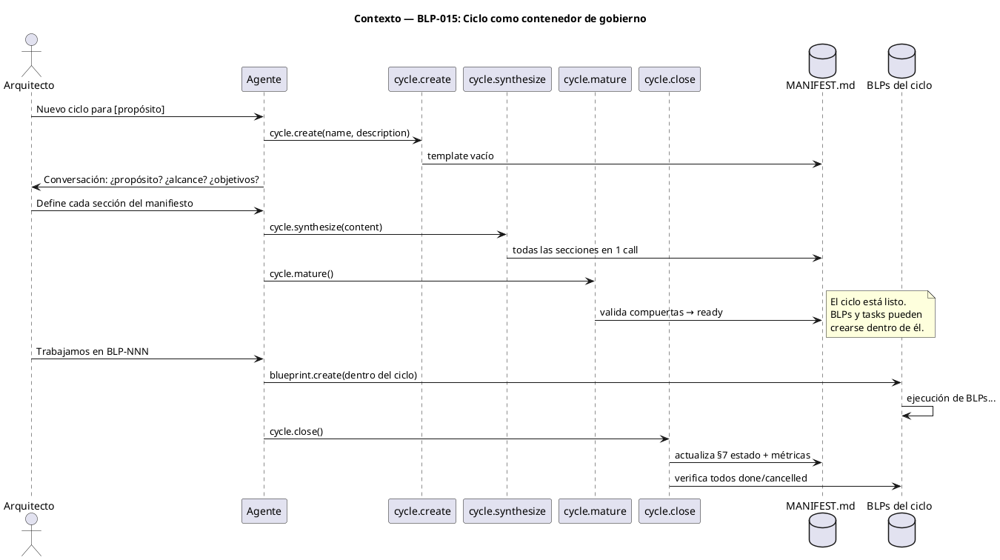
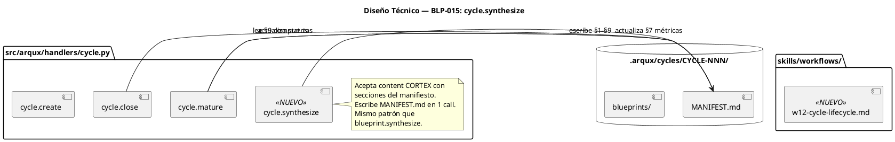
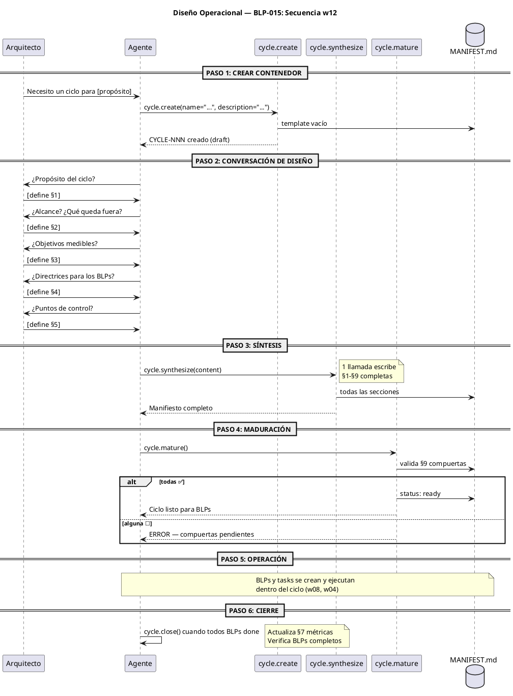

<!-- BLP:TITLE -->
# BLP-015: w12-cycle-lifecycle — Ciclo de vida del ciclo como contenedor de gobierno
<!-- /BLP:TITLE -->

---

<!-- BLP:1 -->
## §1: Planteamiento del Problema

Los manifiestos de ciclo están vacíos. CYCLE-04 tiene 14 BLPs completados pero su MANIFEST.md es un template sin rellenar: propósito placeholder, objetivos vacíos, 0 BLPs en el índice, compuertas de calidad todas ☐.

**Evidencia:**
- CYCLE-04/MANIFEST.md: §1 "_¿Por qué existe este ciclo?_", §6 "0 BLPs", §7 "0% progreso", §9 todas ☐
- CYCLE-03 tiene manifiesto lleno (manual). CYCLE-04 fue creado después y nunca se pobló.
- `cycle.create` copia el template. `cycle.mature` debía llenarlo — BLP-002 (CYCLE-03) fue CANCELLED.
- No existe workflow w12 para el ciclo de vida del ciclo.
- `arch_vision/w00-triage.hcortex.md` ya preveía: "Nuevo ciclo → cycle.create + definir manifiesto". La visión existe desde CYCLE-03.

**Impacto de no resolverlo:**
Cada ciclo nuevo nace con un manifiesto vacío. El gobernador no tiene documento rector. Los BLPs no se asocian al ciclo. Las compuertas de calidad del ciclo nunca se validan. El ciclo es un cascarón sin contenido.
<!-- /BLP:1 -->

<!-- BLP:2 -->
## §2: Objetivo

Implementar el ciclo de vida completo del ciclo con el mismo patrón conversacional que w08 (blueprint lifecycle):

1. `cycle.create` — crea el contenedor con template vacío
2. Conversación con el Arquitecto — define propósito, alcance, objetivos, directrices, puntos de control
3. `cycle.synthesize` — escribe todas las secciones del manifiesto en 1 llamada
4. `cycle.mature` — valida compuertas de calidad, transiciona draft→ready
5. BLPs y tasks existen y operan DENTRO del ciclo
6. `cycle.close` — cierra el ciclo cuando todos los BLPs están done/cancelled

**El ciclo es el contenedor de gobierno. No ejecuta trabajo — gobierna el trabajo que ocurre dentro de él.**
<!-- /BLP:2 -->

<!-- BLP:3 -->
## §3: Precondiciones

- [ ] `cycle.create`, `cycle.list`, `cycle.current`, `cycle.mature`, `cycle.close` handlers existentes
- [ ] `CYCLE_MANIFEST_TEMPLATE.md` en templates
- [ ] `blueprint.synthesize` operativo (BLP-007)
- [ ] `arch_vision/w00-triage.hcortex.md` con visión de "Nuevo ciclo"
- [ ] BLP-012 completado (handler.list)
- [ ] BLP-013 completado (pulse.compact)
- [ ] CYCLE-04 con manifiesto vacío (caso real)
<!-- /BLP:3 -->

<!-- BLP:4 -->
## §4: Principio Rector

**El ciclo gobierna, no ejecuta.** Es el contenedor que abre la puerta a BLPs y tasks. Sin un ciclo definido (manifiesto lleno, compuertas validadas), el trabajo carece de marco de gobierno. El mismo patrón conversacional que w08 aplica aquí: una conversación → un synthesize → manifiesto completo.

**Evidencia:** CYCLE-03 tiene manifiesto rico porque se llenó manualmente. CYCLE-04 está vacío porque no hubo mecanismo. El patrón ya funciona para BLPs (blueprint.synthesize). Aplicarlo a ciclos es la extensión natural.
<!-- /BLP:4 -->

<!-- BLP:5 -->
## §5: Contexto


<!-- /BLP:5 -->

<!-- BLP:6 -->
## §6: Alcance y Exclusiones

**Dentro del alcance:**
- Nuevo workflow w12-cycle-lifecycle.md en skills/workflows/
- Nuevo handler `cycle.synthesize` — escribe todas las secciones del manifiesto en 1 call
- Actualización de `cycle.mature` — valida compuertas de calidad antes de transicionar
- Actualización de `cycle.close` — actualiza §7 del manifiesto con métricas finales
- Actualización de `cycle.create` — acepta parámetros iniciales para pre-llenar
- Documento `arch_vision/w12-cycle-lifecycle.hcortex.md`
- Actualización de `workflows.skill.md` con entrada w12

**Fuera del alcance:**
- Modificar la estructura del template CYCLE_MANIFEST_TEMPLATE.md
- Cambiar cómo los BLPs se asocian a ciclos (ya funciona)
- Migración retroactiva de CYCLE-04 (se hará manualmente)
- Crear nuevos handlers de ciclo (solo modificar existentes)
<!-- /BLP:6 -->

<!-- BLP:7 -->
## §7: Reglas Obligatorias

1. `cycle.create` copia el template. No lo llena — el llenado es responsabilidad de `cycle.synthesize`.
2. `cycle.synthesize` escribe el manifiesto en UNA llamada, mismo patrón que `blueprint.synthesize`.
3. `cycle.mature` valida TODAS las compuertas de calidad (§9) antes de transicionar draft→ready. Si alguna es ☐, rechaza con error.
4. El ciclo no ejecuta trabajo — gobierna el trabajo. BLPs y tasks existen DENTRO del ciclo.
5. `cycle.close` verifica que todos los BLPs del ciclo estén done o cancelled antes de cerrar.
6. `cycle.close` actualiza §7 del manifiesto con métricas reales (total BLPs, done, cancelled, progreso).
7. El workflow w12 documenta el flujo completo con diagrama PUML.
8. `cycle.synthesize` está disponible como handler MCP para el agente.
<!-- /BLP:7 -->

<!-- BLP:8 -->
## §8: Diseño Técnico


<!-- /BLP:8 -->

<!-- BLP:9 -->
## §9: Diseño Operacional


<!-- /BLP:9 -->

<!-- BLP:10 -->
## §10: Contratos

**cycle.synthesize:**
```
Entrada: content CORTEX con secciones del manifiesto
         $1:{propósito}, $2:{alcance}, $3:{objetivos},
         $4:{directrices}, $5:{puntos de control},
         $8:{reglas}
Salida:  MANIFEST.md con todas las secciones pobladas
         PULSE audit event registrado
```

**cycle.mature (actualizado):**
```
Entrada: cycle_id
Acción:  Lee MANIFEST.md §9, valida todas las compuertas
         Si todas ✅ → status: ready
         Si alguna ☐ → error con lista de pendientes
Salida:  PULSE audit event
```

**cycle.close (actualizado):**
```
Entrada: cycle_id, summary
Acción:  Verifica todos los BLPs done/cancelled
         Actualiza MANIFEST.md §7 con métricas reales
         Escribe SES en brain PULSE
Salida:  PULSE audit event
```
<!-- /BLP:10 -->

<!-- BLP:11 -->
## §11: Procedimiento de Trabajo

### Fase 1: cycle.synthesize
1. Implementar `synthesize_cycle()` en `handlers/cycle.py`
2. Acepta `content` CORTEX con secciones del manifiesto
3. Parsea secciones, escribe en MANIFEST.md usando markers
4. Registra PULSE
5. Registrar como handler MCP

### Fase 2: cycle.mature (fix)
1. Implementar validación de §9 compuertas
2. Leer quality_gates del frontmatter YAML
3. Si todas true → transicionar a ready
4. Si alguna false → error descriptivo

### Fase 3: cycle.close (update)
1. Verificar todos los BLPs del ciclo
2. Actualizar §7 del manifiesto con métricas
3. Escribir cierre en PULSE

### Fase 4: Workflow w12
1. Crear `skills/workflows/w12-cycle-lifecycle.md`
2. Diagrama PUML de secuencia completa
3. Referencias a handlers
4. Actualizar `workflows.skill.md`

### Fase 5: arch_vision
1. Crear `docs/arch_vision/w12-cycle-lifecycle.hcortex.md`

> **Reversión:** `git checkout` de archivos modificados.
<!-- /BLP:11 -->

<!-- BLP:12 -->
## §12: Criterios de Aceptación

- [ ] **AC-01:** `cycle.synthesize(cycle_id, content)` escribe todas las secciones del manifiesto en 1 call
- [ ] **AC-02:** `cycle.mature(cycle_id)` rechaza con error si alguna compuerta §9 es false
- [ ] **AC-03:** `cycle.mature(cycle_id)` transiciona a ready si todas las compuertas son true
- [ ] **AC-04:** `cycle.close(cycle_id)` actualiza §7 del manifiesto con métricas reales
- [ ] **AC-05:** `cycle.close(cycle_id)` rechaza si hay BLPs en estado != done/cancelled
- [ ] **AC-06:** `cycle.synthesize` visible en `handler.list(tier=FULL)`
- [ ] **AC-07:** `w12-cycle-lifecycle.md` existe con diagrama PUML
- [ ] **AC-08:** `workflows.skill.md` incluye entrada w12
- [ ] **AC-09:** `arch_vision/w12-cycle-lifecycle.hcortex.md` existe
- [ ] **AC-10:** CYCLE-04 manifiesto poblado con datos reales (prueba real)
<!-- /BLP:12 -->

<!-- BLP:13 -->
## §13: Validaciones Requeridas

| Tipo | Descripción | Comando | Evidencia Esperada |
|---|---|---|---|
| test | synthesize escribe manifiesto | `pytest tests/test_cycle_lifecycle.py -k synthesize` | MANIFEST.md poblado |
| test | mature rechaza compuertas false | `pytest tests/test_cycle_lifecycle.py -k mature_reject` | error descriptivo |
| test | mature acepta compuertas true | `pytest tests/test_cycle_lifecycle.py -k mature_accept` | status: ready |
| test | close actualiza métricas | `pytest tests/test_cycle_lifecycle.py -k close` | §7 actualizado |
| integration | flujo completo create→close | `pytest tests/test_cycle_lifecycle.py -k full` | ciclo completo |
<!-- /BLP:13 -->

<!-- BLP:14 -->
## §14: Tareas

- [x] **T-1:** Implementar `cycle.synthesize(cycle_id, content)` en `handlers/cycle.py`
  > [2026-07-13T23:40:23Z] synthesize_cycle() + mature_cycle gating + close_cycle BLP check + handler registered
- [x] **T-2:** Actualizar `cycle.mature` — validar compuertas §9, transicionar o rechazar (depende de T-1)
  > [2026-07-13T23:40:25Z] mature_cycle now validates §9 quality gates, rejects with QUALITY_GATES_FAILED if any ☐
- [x] **T-3:** Actualizar `cycle.close` — métricas §7, verificar BLPs done/cancelled (depende de T-1)
  > [2026-07-13T23:40:26Z] close_cycle scans BLPs, blocks if active, updates MANIFEST.md §7 metrics
- [x] **T-4:** Registrar `cycle.synthesize` como handler MCP (depende de T-1)
  > [2026-07-13T23:40:27Z] cycle.synthesize registered in handler_schemas with name/description/input_schema
- [x] **T-5:** Crear `skills/workflows/w12-cycle-lifecycle.md` con PUML (depende de T-1)
  > [2026-07-13T23:41:18Z] w12-cycle-lifecycle.md with PUML diagrams + workflows.skill.md updated
- [x] **T-6:** Actualizar `workflows.skill.md` con entrada w12 (depende de T-5)
  > [2026-07-13T23:41:19Z] w12 entry added to workflows.skill.md
- [x] **T-7:** Crear `docs/arch_vision/w12-cycle-lifecycle.hcortex.md` (depende de T-5)
  > [2026-07-13T23:41:44Z] docs/arch_vision/w12-cycle-lifecycle.hcortex.md created
- [~] **T-8:** Tests: synthesize, mature, close, flujo completo (depende de T-1 a T-3)
- [ ] **T-9:** Poblar CYCLE-04 MANIFEST.md con datos reales (depende de T-1)
- [ ] **T-10:** Verificar `handler.list(FULL)` incluye `cycle.synthesize` (depende de T-4)
<!-- /BLP:14 -->

<!-- BLP:15 -->
## §15: Riesgos

| ID | Descripción | Impacto | Mitigación |
|---|---|---|---|
| R-01 | cycle.mature rechaza ciclos legacy con manifiestos vacíos | Medio — ciclos existentes no maduran | Si el manifiesto es template (placeholders), permitir maduración con warning |
| R-02 | cycle.close bloquea cierre de ciclos con BLPs in_progress | Bajo — por diseño | El error es informativo: lista los BLPs que faltan |
| R-03 | cycle.synthesize sobreescribe manifiesto ya poblado | Medio — pérdida de datos | Backup antes de escribir; advertir si el manifiesto ya tiene contenido |
<!-- /BLP:15 -->

<!-- BLP:16 -->
## §16: Regla de Bloqueo

1. Si `cycle.synthesize` no puede parsear el content CORTEX → DETENER, error de formato.
2. Si `cycle.mature` encuentra un manifiesto corrupto (YAML inválido) → DETENER, reparar primero.
3. Si `cycle.close` detecta BLPs activos → DETENER, completar o cancelar BLPs primero.

**Acción:** DETENER_E_INFORMAR
**Escalar a:** Arquitecto
<!-- /BLP:16 -->

<!-- BLP:17 -->
## §17: Salida Esperada

**Archivos modificados:**
- `src/arqux/handlers/cycle.py` — `synthesize_cycle()`, mature actualizado, close actualizado
- `workflows.skill.md` — entrada w12

**Archivos creados:**
- `skills/workflows/w12-cycle-lifecycle.md`
- `docs/arch_vision/w12-cycle-lifecycle.hcortex.md`
- `tests/test_cycle_lifecycle.py`

**Evidencia:**
- `cycle.synthesize` escribe MANIFEST.md completo en 1 call
- `cycle.mature` valida compuertas
- CYCLE-04 manifiesto poblado con 14 BLPs reales
- `handler.list(FULL)` incluye `cycle.synthesize`

**Resumen:**
> El ciclo gobierna, no ejecuta. w12 cierra el gap: create → synthesize → mature → [BLPs] → close.
<!-- /BLP:17 -->

<!-- BLP:18 -->
## §18: Contrato de Calidad

| Compuerta | Estado |
|---|---|
| has_clear_objective | ✅ |
| has_verifiable_preconditions | ✅ |
| has_scope_and_exclusions | ✅ |
| has_acceptance_criteria | ✅ |
| has_work_procedure | ✅ |
| has_required_validations | ✅ |
| has_learning_recorded | ☐ |
<!-- /BLP:18 -->

> Todas las compuertas deben estar en ✅ antes de blueprint.ready(). Ver blueprint-workflow skill.