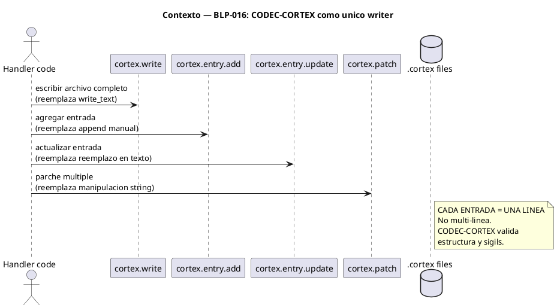
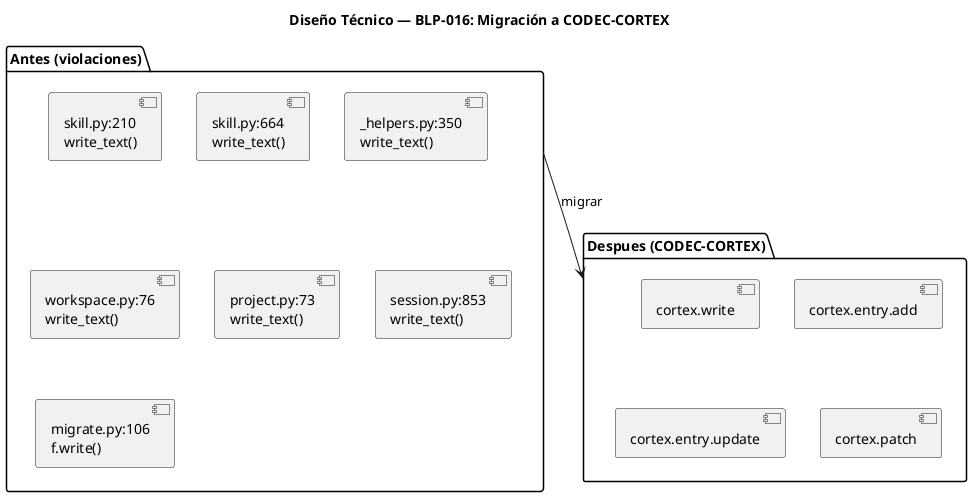

<!-- BLP:TITLE -->
# BLP-016: CODEC-CORTEX compliance — migrar escrituras directas a handlers CORTEX
<!-- /BLP:TITLE -->

---

<!-- BLP:1 -->
## §1: Planteamiento del Problema

El código fuente viola su propio axioma. `skill.py:914` declara `AXM:codec_cortex_writer{All .cortex file writes MUST go through CODEC-CORTEX. Direct write_text() is FORBIDDEN.}` — pero `skill.py:210` y `skill.py:664` usan exactamente `write_text()` para escribir archivos .cortex. Esta hipocresía se repite en 6 archivos.

**Evidencia:**
- `skill.py:210` — `dst.write_text(cortex_content)` escribe skill a .arqux/skills/
- `skill.py:664` — `brain_path.write_text(brain_text)` escribe brain.cortex
- `blueprint/_helpers.py:350` — `brain_path.write_text(cortex_text)` escribe brain.cortex
- `workspace.py:76` — `meta_brain_path.write_text(...)` escribe meta-brain.cortex
- `project.py:73` — `(gov_dir / BRAIN_CORTEX).write_text(seed)` escribe brain.cortex con seed
- `session.py:853` — `handoff_path.write_text(handoff_cortex)` escribe handoff .cortex
- `cortex/migrate.py:106` — `f.write(migrated_text)` escribe archivo migrado

Además, algunas escrituras generan contenido multi-línea, violando el estándar CORTEX de UNA LÍNEA por entrada.

**Impacto de no resolverlo:**
El código se contradice a sí mismo. La integridad de los archivos .cortex no está garantizada (sin validación CODEC-CORTEX). El estándar single-line se viola sistemáticamente. La confianza en el sistema de gobierno se erosiona.
<!-- /BLP:1 -->

<!-- BLP:2 -->
## §2: Objetivo

Migrar TODAS las escrituras directas a archivos .cortex para que usen exclusivamente handlers CODEC-CORTEX (`cortex.write`, `cortex.entry.add`, `cortex.entry.update`, `cortex.patch`). Toda entrada CORTEX debe ser UNA SOLA LÍNEA. Eliminar `write_text()` y `open().write()` de cualquier operación sobre archivos .cortex.
<!-- /BLP:2 -->

<!-- BLP:3 -->
## §3: Precondiciones

- [ ] `cortex.write`, `cortex.entry.add`, `cortex.entry.update`, `cortex.patch` operativos
- [ ] CODEC-CORTEX v0.5.0 instalado y funcional
- [ ] 6 archivos con violaciones identificadas
- [ ] BLP-012 completado (handler.list)
<!-- /BLP:3 -->

<!-- BLP:4 -->
## §4: Principio Rector

**CODEC-CORTEX es el ÚNICO escritor de archivos .cortex.** Ningún `write_text()`, ningún `open().write()`, ningún bypass. Toda entrada es UNA LÍNEA. El código debe cumplir sus propios axiomas.

**Evidencia:** El axioma existe desde BLP-014 (`AXM:codec_cortex_writer`). El código lo ignora. Esta BLP cierra la brecha entre lo declarado y lo implementado.
<!-- /BLP:4 -->

<!-- BLP:5 -->
## §5: Contexto

<!-- /BLP:5 -->

<!-- BLP:6 -->
## §6: Alcance y Exclusiones

**Dentro del alcance:**
- `skill.py:210` → `cortex.write` para skill files
- `skill.py:664` → `cortex.patch` o `cortex.entry.update` para brain.cortex
- `blueprint/_helpers.py:350` → `cortex.patch` para brain.cortex PULSE
- `workspace.py:76` → `cortex.write` para meta-brain.cortex
- `project.py:73` → `cortex.write` para brain.cortex (seed)
- `session.py:853` → `cortex.write` para handoff .cortex
- `cortex/migrate.py:106` → `cortex.write` para migrated cortex
- Verificación: todas las entradas son single-line

**Fuera del alcance:**
- Cambiar la API de CODEC-CORTEX
- Modificar handlers que ya usan CODEC-CORTEX correctamente
- Migrar archivos .cortex existentes (solo nuevas escrituras)
<!-- /BLP:6 -->

<!-- BLP:7 -->
## §7: Reglas Obligatorias

1. NINGUN write_text() o open().write() sobre archivos .cortex. Solo cortex.write, cortex.entry.*, cortex.patch.
2. TODA entrada CORTEX es UNA SOLA LINEA. Sin excepciones. Sin multi-linea.
3. cortex.write para archivo completo. cortex.entry.add/update/patch para entradas individuales.
4. Si un .cortex existe con entradas multi-linea, se audita y repara via cortex.repair.
5. Validacion CODEC-CORTEX en cada escritura.
6. cortex.repair: nuevo handler que escanea archivos .cortex existentes, detecta entradas multi-linea, y las colapsa a single-line preservando el contenido.
<!-- /BLP:7 -->

<!-- BLP:8 -->
## §8: Diseño Técnico

<!-- /BLP:8 -->

<!-- BLP:9 -->
## §9: Diseño Operacional

Secuencia para cada sitio de violación:

1. Identificar si la operación es: crear/reemplazar archivo completo → `cortex.write`, agregar entrada → `cortex.entry.add`, modificar entrada → `cortex.entry.update`, múltiples cambios → `cortex.patch`.

2. Construir contenido CORTEX en formato single-line (usar `\n` solo entre entradas, nunca dentro de una entrada).

3. Reemplazar `write_text(content)` por el handler correspondiente.

4. Verificar que el handler no introduce errores (los handlers validan estructura).

5. Actualizar imports: remover `BRAIN_CORTEX`, `META_BRAIN_CORTEX` de constantes si ya no se usan para paths de escritura directa.
<!-- /BLP:9 -->

<!-- BLP:10 -->
## §10: Contratos

**Mapping de violaciones a handlers:**

| Archivo | Violación | Handler CODEC-CORTEX |
|---|---|---|
| skill.py:210 | write_text skill | cortex.write |
| skill.py:664 | write_text brain | cortex.patch |
| _helpers.py:350 | write_text brain PULSE | cortex.entry.add |
| workspace.py:76 | write_text meta-brain | cortex.write |
| project.py:73 | write_text brain seed | cortex.write |
| session.py:853 | write_text handoff | cortex.write |
| migrate.py:106 | f.write migrated | cortex.write |
<!-- /BLP:10 -->

<!-- BLP:11 -->
## §11: Procedimiento de Trabajo

### Fase 1: Auditar y mapear
1. Verificar cada sitio de violación
2. Determinar el handler CODEC-CORTEX correcto para cada caso
3. Identificar dependencias (imports, constantes)

### Fase 2: Migrar uno por uno
1. skill.py:210 → cortex.write
2. skill.py:664 → cortex.patch
3. _helpers.py:350 → cortex.entry.add
4. workspace.py:76 → cortex.write
5. project.py:73 → cortex.write
6. session.py:853 → cortex.write
7. migrate.py:106 → cortex.write

### Fase 3: Verificar single-line
1. grep de entradas multi-línea en .cortex generados
2. Asegurar que todo contenido CORTEX es una línea por entrada

### Fase 4: Tests
1. Verificar que los handlers existentes no se rompen
2. Verificar que las escrituras producen .cortex válidos (cortex.verify)

> **Reversión:** `git checkout` de cada archivo modificado.
<!-- /BLP:11 -->

<!-- BLP:12 -->
## §12: Criterios de Aceptación

- [ ] **AC-01:** `grep -rn "write_text\|\.write(" src/arqux/handlers/ | grep cortex` → 0 resultados
- [ ] **AC-02:** skill.py:210 usa cortex.write (no write_text)
- [ ] **AC-03:** skill.py:664 usa cortex.patch (no write_text)
- [ ] **AC-04:** _helpers.py:350 usa cortex.entry.add (no write_text)
- [ ] **AC-05:** workspace.py:76 usa cortex.write
- [ ] **AC-06:** project.py:73 usa cortex.write
- [ ] **AC-07:** session.py:853 usa cortex.write
- [ ] **AC-08:** migrate.py:106 usa cortex.write
- [ ] **AC-09:** Todas las entradas CORTEX generadas son single-line
- [ ] **AC-10:** Tests existentes pasan sin modificaciones
- [ ] **AC-11:** cortex.repair escanea y reporta entradas multi-linea en archivos .cortex
- [ ] **AC-12:** cortex.repair corrige entradas multi-linea a single-line sin perder datos
<!-- /BLP:12 -->

<!-- BLP:13 -->
## §13: Validaciones Requeridas

| Tipo | Descripción | Comando | Evidencia Esperada |
|---|---|---|---|
| grep | Sin write_text en .cortex | `grep -rn "write_text" src/arqux/handlers/` | 0 en paths .cortex |
| test | Tests pasan | `pytest tests/ -x -q` | todos pasan |
| verify | .cortex valido | `cortex.verify` en brain generado | sin errores |
| single-line | Entradas una linea | verificar \n dentro de entradas | 0 multi-linea |
<!-- /BLP:13 -->

<!-- BLP:14 -->
## §14: Tareas

- [ ] **T-1:** Migrar skill.py:210 → cortex.write
- [ ] **T-2:** Migrar skill.py:664 → cortex.patch
- [ ] **T-3:** Migrar _helpers.py:350 → cortex.entry.add
- [ ] **T-4:** Migrar workspace.py:76 → cortex.write
- [ ] **T-5:** Migrar project.py:73 → cortex.write
- [ ] **T-6:** Migrar session.py:853 → cortex.write
- [ ] **T-7:** Migrar migrate.py:106 → cortex.write
- [ ] **T-8:** Verificar single-line compliance en todas las entradas
- [ ] **T-9:** Ejecutar tests y verificar que pasan
- [ ] **T-10:** Implementar cortex.repair — escanea .cortex, detecta multi-linea, colapsa a single-line
- [ ] **T-11:** Ejecutar cortex.repair sobre brain.cortex y meta-brain.cortex del proyecto ARQUX
<!-- /BLP:14 -->

<!-- BLP:15 -->
## §15: Riesgos

| ID | Descripción | Impacto | Mitigación |
|---|---|---|---|
| R-01 | cortex.write no soporta el formato actual de contenido | Alto — bloquea migración | Adaptar contenido al formato CORTEX esperado por el handler |
| R-02 | Migración rompe tests existentes | Medio — regresión | Migrar uno por uno, verificar tests entre cada paso |
| R-03 | Entradas multi-línea existentes causan errores de parseo | Bajo | Solo nuevas escrituras son single-line; legacy se audita aparte |
| R-04 | cortex.repair colapsa mal una entrada multi-linea | Medio | Backup antes de reparar; dry-run primero |
<!-- /BLP:15 -->

<!-- BLP:16 -->
## §16: Regla de Bloqueo

1. Si `cortex.write` rechaza el contenido → DETENER, adaptar formato.
2. Si un test falla tras migrar un sitio → DETENER, revertir ese sitio.
3. Si se detecta escritura directa residual post-migración → DETENER, no cerrar BLP.

**Acción:** DETENER_E_INFORMAR
**Escalar a:** Arquitecto
<!-- /BLP:16 -->

<!-- BLP:17 -->
## §17: Salida Esperada

**Archivos modificados:**
- `src/arqux/handlers/skill.py`
- `src/arqux/handlers/blueprint/_helpers.py`
- `src/arqux/handlers/workspace.py`
- `src/arqux/handlers/project.py`
- `src/arqux/handlers/session.py`
- `src/arqux/handlers/cortex/migrate.py`

**Evidencia:**
- `grep write_text` en handlers → 0 resultados para .cortex
- Tests pasan
- cortex.verify sin errores en archivos generados

**Resumen:**
> CODEC-CORTEX es el único escritor de archivos .cortex. El código cumple su propio axioma.
<!-- /BLP:17 -->

<!-- BLP:18 -->
## §18: Contrato de Calidad

| Compuerta | Estado |
|---|---|
| has_clear_objective | ✅ |
| has_verifiable_preconditions | ✅ |
| has_scope_and_exclusions | ✅ |
| has_acceptance_criteria | ✅ |
| has_work_procedure | ✅ |
| has_required_validations | ✅ |
| has_learning_recorded | ☐ |
<!-- /BLP:18 -->

> Todas las compuertas deben estar en ✅ antes de blueprint.ready(). Ver blueprint-workflow skill.