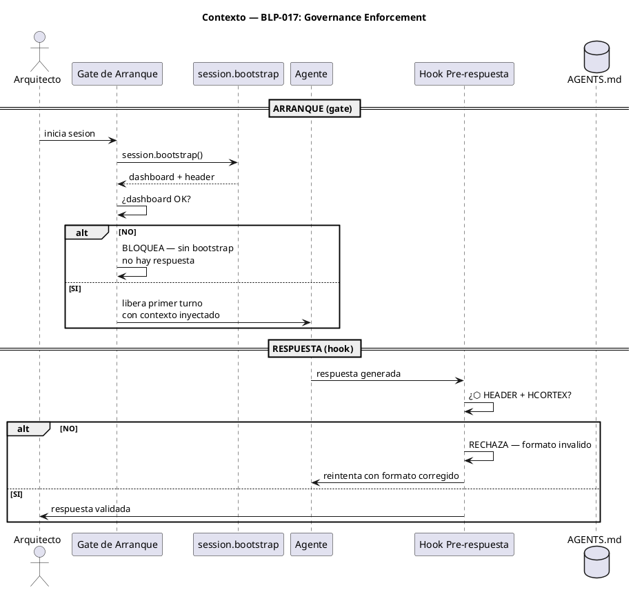
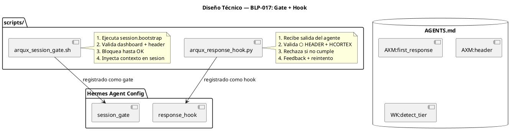

<!-- BLP:TITLE -->
# BLP-017: Governance Enforcement — gate de arranque + hook pre-respuesta
<!-- /BLP:TITLE -->

---

<!-- BLP:1 -->
## §1: Planteamiento del Problema

AGENTS.md declara axiomas obligatorios: `AXM:first_response` (dashboard HCORTEX antes de cualquier respuesta), `AXM:header` (cabecera ⬡ AGENT|PROJECT|SCOPE), `WK:detect_tier` (bootstrap de descubrimiento). Pero estos axiomas dependen de la **disciplina del modelo** — si el agente los omite, no hay consecuencia. Un modelo nuevo puede saludar con "¡Hola!" y AGENTS.md no puede impedirlo.

**Evidencia:**
- El prompt es "advisory": cualquier LLM puede ignorarlo por reflejo.
- `docs/gov-enforcement-design.md` documenta el problema y propone 4 mecanismos.
- La causa raíz no es falta de instrucción — es depender de la voluntad del modelo.
- Hoy no existe ninguna capa determinística que fuerce el cumplimiento.

**Impacto de no resolverlo:**
Cada nuevo agente, cada nuevo modelo, cada nueva sesión — riesgo de que los axiomas de gobernanza sean papel mojado. La confianza en ARqUX como infraestructura de gobierno se basa en que sus reglas se cumplan, no en que se recuerden.
<!-- /BLP:1 -->

<!-- BLP:2 -->
## §2: Objetivo

Implementar dos mecanismos de enforcement determinístico:

1. **Gate de arranque:** Un script de inicio de sesión que ejecuta `session.bootstrap`, obtiene el dashboard, y **no libera el primer turno** hasta que el contexto de gobernanza está cargado. Sin bootstrap → sin respuesta.

2. **Hook pre-respuesta:** Una regla de validación que inspecciona cada salida del agente y rechaza aquellas que no cumplan el formato `⬡ AGENT|PROJECT|SCOPE` + estructura HCORTEX. El harness es el guardián, no el modelo.

**Resultado:** AGENTS.md deja de ser advisory. Es enforce. La gobernanza es estructura, no voluntad.
<!-- /BLP:2 -->

<!-- BLP:3 -->
## §3: Precondiciones

- [ ] `session.bootstrap` operativo (BLP-008)
- [ ] `handler.list` operativo (BLP-012)
- [ ] AGENTS.md con axiomas AXM:first_response, AXM:header, WK:detect_tier
- [ ] `docs/gov-enforcement-design.md` como documento de diseño
- [ ] Hermes Agent como harness (acceso a hooks/gates)
<!-- /BLP:3 -->

<!-- BLP:4 -->
## §4: Principio Rector

**Gobernanza = estructura, no voluntad.** El estándar debe ser imposible de omitir. No se trata de recordarle al agente que cumpla — se trata de que el sistema no acepte una respuesta que no cumpla. La capa de enforcement es determinística y agnóstica al modelo.

**Evidencia:** Hoy dependemos de que el agente "recuerde" mostrar el dashboard. Mañana un modelo nuevo no lo hará. La única defensa es que el sistema lo exija.
<!-- /BLP:4 -->

<!-- BLP:5 -->
## §5: Contexto


<!-- /BLP:5 -->

<!-- BLP:6 -->
## §6: Alcance y Exclusiones

**Dentro del alcance:**
- Script `scripts/arqux_session_gate.sh` — gate de arranque que bloquea hasta bootstrap
- Regla `scripts/arqux_response_hook.py` — hook pre-respuesta que valida formato
- Integración con Hermes Agent (configuración de hooks/gates)
- Documentación en `docs/gov-enforcement.md`

**Fuera del alcance:**
- Mecanismo 3 (wrapper/ formatter) — se implementa como fallback si el harness no soporta hooks
- Mecanismo 4 (AGENTS.md inyectado) — ya existe
- Soportar plataformas sin capacidad de hooks (Codex, terminal puro) — requieren diseño separado
- Modificar AGENTS.md (los axiomas ya están)
<!-- /BLP:6 -->

<!-- BLP:7 -->
## §7: Reglas Obligatorias

1. El gate de arranque es BLOQUEANTE pero INVISIBLE para el usuario — ejecuta bootstrap en background, inyecta contexto automáticamente.
2. El hook pre-respuesta CORRIGE, no castiga — si falta header lo inyecta. El usuario siempre ve formato correcto.
3. Ambos mecanismos son agnósticos al modelo — funcionan para cualquier LLM.
4. El gate inyecta el dashboard y header en el contexto del agente antes del primer turno.
5. El hook valida contra el patrón `⬡ \w+ \| [A-Z]+ \| [\w-]+` y presencia de estructura HCORTEX. Si falla, inyecta el formato en vez de rechazar.
6. SINCRONIZACIÓN: Todo archivo creado o modificado (scripts, configs, docs) debe reflejarse en runtime (.arqux/), source (src/arqux/), y build (build/lib/arqux/). Lección de auditoría Heimdall CYCLE-04.
<!-- /BLP:7 -->

<!-- BLP:8 -->
## §8: Diseño Técnico


<!-- /BLP:8 -->

<!-- BLP:9 -->
## §9: Diseño Operacional

Secuencia de una sesión con enforcement:

1. Arquitecto inicia sesión → gate se activa.
2. Gate ejecuta `session.bootstrap()` → obtiene dashboard + header + handler list.
3. Gate valida: ¿dashboard populado? ¿header presente? Si no → bloquea.
4. Gate inyecta contexto en la sesión del agente.
5. Agente procesa primer turno con contexto completo.
6. Agente genera respuesta → hook la inspecciona.
7. Hook valida: ¿⬡ HEADER? ¿HCORTEX? Si no → rechaza, feedback, reintento.
8. Hook entrega respuesta validada al Arquitecto.
<!-- /BLP:9 -->

<!-- BLP:10 -->
## §10: Contratos

**Gate de arranque:**
```
Entrada:  inicio de sesión (Arquitecto)
Acción:   session.bootstrap() → validar dashboard + header
Salida:   contexto inyectado en sesión, o BLOQUEO
```

**Hook pre-respuesta:**
```
Entrada:  texto de respuesta del agente
Acción:   validar ⬡ HEADER + HCORTEX
Salida:   respuesta validada, o RECHAZO + feedback
Patrón:   ^⬡ \w+ \| [A-Z]+ \| [\w-]+
          seguido de estructura HCORTEX (tablas, listas, o diagramas)
```
<!-- /BLP:10 -->

<!-- BLP:11 -->
## §11: Procedimiento de Trabajo

### Fase 1: Gate de arranque
1. Crear `scripts/arqux_session_gate.sh`
2. Invoca `python -c "from arqux.handlers.session import bootstrap; ..."`
3. Valida que el resultado contiene dashboard y header
4. Si falla → exit 1 (bloquea). Si ok → inyecta contexto.

### Fase 2: Hook pre-respuesta
1. Crear `scripts/arqux_response_hook.py`
2. Lee respuesta del agente de stdin
3. Valida con regex: `⬡ \w+ \| [A-Z]+ \| [\w-]+`
4. Valida presencia de estructura HCORTEX
5. Si inválido → stdout con feedback, exit 1
6. Si válido → stdout con respuesta, exit 0

### Fase 3: Integración
1. Configurar Hermes Agent para usar el gate y hook
2. Probar con sesión real: ¿gate bloquea sin bootstrap? ¿hook rechaza sin header?

### Fase 4: Documentación
1. Actualizar `docs/gov-enforcement.md` con instrucciones de uso

> **Reversión:** Desregistrar gate/hook de la configuración de Hermes.
<!-- /BLP:11 -->

<!-- BLP:12 -->
## §12: Criterios de Aceptación

- [ ] **AC-01:** Gate bloquea el primer turno si session.bootstrap falla
- [ ] **AC-02:** Gate inyecta dashboard + header en el contexto del agente
- [ ] **AC-03:** Hook rechaza respuesta sin `⬡ AGENT|PROJECT|SCOPE`
- [ ] **AC-04:** Hook rechaza respuesta sin estructura HCORTEX
- [ ] **AC-05:** Hook acepta respuesta con header + HCORTEX válidos
- [ ] **AC-06:** Agente recibe feedback y reintenta tras rechazo (máx 3)
- [ ] **AC-07:** Gate y hook funcionan con cualquier modelo (agnóstico)
- [ ] **AC-08:** `scripts/arqux_session_gate.sh` existe y es ejecutable
- [ ] **AC-09:** `scripts/arqux_response_hook.py` existe y es ejecutable
<!-- /BLP:12 -->

<!-- BLP:13 -->
## §13: Validaciones Requeridas

| Tipo | Descripción | Comando | Evidencia Esperada |
|---|---|---|---|
| test | Gate bloquea sin bootstrap | `./scripts/arqux_session_gate.sh` sin MCP | exit 1 |
| test | Gate pasa con bootstrap | `./scripts/arqux_session_gate.sh` con MCP | exit 0, contexto |
| test | Hook rechaza sin header | `echo "hola" \| ./scripts/arqux_response_hook.py` | exit 1 |
| test | Hook acepta con header | `echo "⬡ A\|B\|C\\n..." \| ./scripts/arqux_response_hook.py` | exit 0 |
| integration | Sesión real con enforcement | Iniciar sesión, verificar gate + hook | bootstrap automático |
<!-- /BLP:13 -->

<!-- BLP:14 -->
## §14: Tareas

- [ ] **T-1:** Crear `scripts/arqux_session_gate.sh` — bloquea hasta bootstrap OK
- [ ] **T-2:** Crear `scripts/arqux_response_hook.py` — valida header + HCORTEX
- [ ] **T-3:** Integrar gate en configuración de Hermes Agent
- [ ] **T-4:** Integrar hook en configuración de Hermes Agent
- [ ] **T-5:** Probar sesión real: gate + hook funcionando
- [ ] **T-6:** Sincronizar runtime ↔ source ↔ build (scripts, configs, docs)
- [ ] **T-7:** Documentar en `docs/gov-enforcement.md`
<!-- /BLP:14 -->

<!-- BLP:15 -->
## §15: Riesgos

| ID | Descripción | Impacto | Mitigación |
|---|---|---|---|
| R-01 | Hermes Agent no soporta hooks/gates nativos | Alto — bloquea implementación | Fallback a mechanism 3 (wrapper) |
| R-02 | Gate bloquea sesiones legítimas por timeout de bootstrap | Medio — falsos positivos | Timeout generoso (30s), error descriptivo |
| R-03 | Hook es demasiado estricto y rechaza respuestas válidas | Medio — frustración | Regex flexible; HCORTEX detection tolerante |
| R-04 | Multi-agente: gate ejecuta bootstrap múltiple | Bajo — overhead | Cache de bootstrap por sesión |
<!-- /BLP:15 -->

<!-- BLP:16 -->
## §16: Regla de Bloqueo

1. Si el harness no soporta hooks → DETENER, implementar mechanism 3 (wrapper).
2. Si el gate no puede ejecutar bootstrap → DETENER, verificar MCP connectivity.
3. Si el hook rechaza 3 veces consecutivas → DETENER, escalar al Arquitecto.

**Acción:** DETENER_E_INFORMAR
**Escalar a:** Arquitecto
<!-- /BLP:16 -->

<!-- BLP:17 -->
## §17: Salida Esperada

**Archivos creados:**
- `scripts/arqux_session_gate.sh`
- `scripts/arqux_response_hook.py`
- `docs/gov-enforcement.md` (actualizado)

**Archivos modificados:**
- Configuración de Hermes Agent (registro de gate + hook)

**Evidencia:**
- Gate bloquea sin bootstrap, libera con bootstrap
- Hook rechaza sin header, acepta con header
- Sesión real con enforcement automático

**Resumen:**
> Gobernanza = estructura, no voluntad. AGENTS.md es enforce, no advisory.
<!-- /BLP:17 -->

<!-- BLP:18 -->
## §18: Contrato de Calidad

| Compuerta | Estado |
|---|---|
| has_clear_objective | ✅ |
| has_verifiable_preconditions | ✅ |
| has_scope_and_exclusions | ✅ |
| has_acceptance_criteria | ✅ |
| has_work_procedure | ✅ |
| has_required_validations | ✅ |
| has_learning_recorded | ☐ |
<!-- /BLP:18 -->

> Todas las compuertas deben estar en ✅ antes de blueprint.ready(). Ver blueprint-workflow skill.