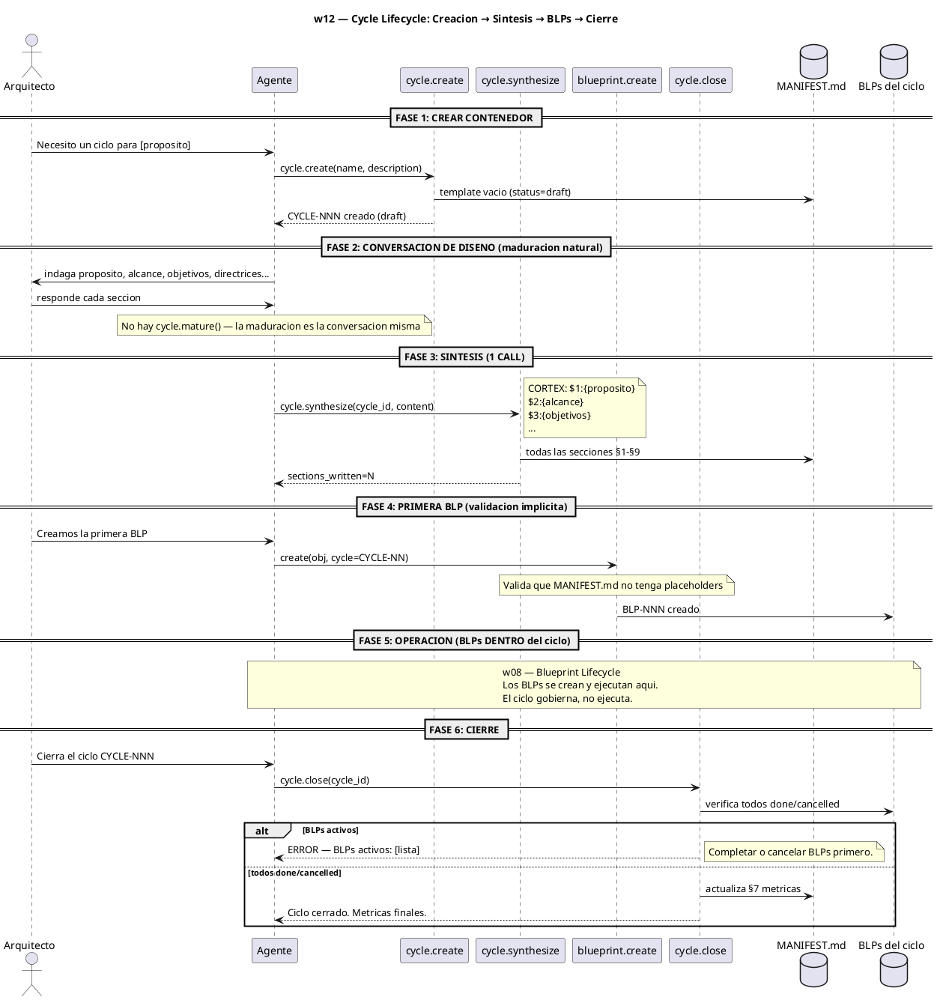
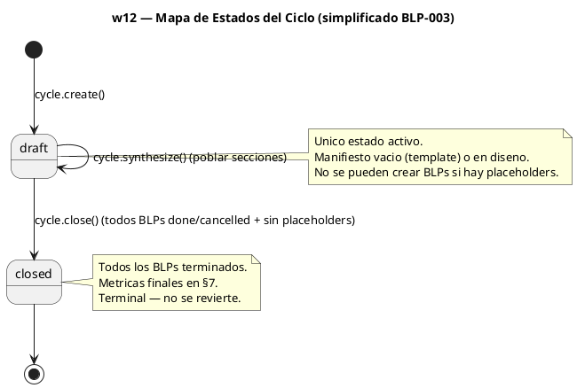

$0

# -- $0: WORKFLOW SKILL GLOSSARY --
# Sigil | Name     | Type   | Risk | Layer        | Description
# IDN   | identity | attrs  | B    | Semantic     | Workflow definition
# STP   | step     | attrs  | M    | Working      | Workflow step
# HDL   | handler  | attrs-pos | M | Semantic    | Handler reference
# AXM   | axiom    | cuerpo | H    | Prefrontal   | Non-negotiable principle

IDN:w12{ name:"Cycle Lifecycle — Creación, Síntesis y Cierre", file:"workflows/w12-cycle-lifecycle.md", purpose:"Gobernar el ciclo de vida del ciclo como contenedor de gobierno: create → synthesize → BLPs → close.", trigger:"Arquitecto: 'Nuevo ciclo para [propósito]' o 'Cierra el ciclo CYCLE-NNN'" }

AXM:cycle_governs{ El ciclo gobierna, no ejecuta. Es el contenedor que abre la puerta a BLPs y tasks. Sin un ciclo definido (manifiesto lleno), el trabajo carece de marco de gobierno. }

AXM:maturation_conversational{ La maduracion es conversacional, no un handler. No existe cycle.mature(). Cuando el Arquitecto dice "creemos la primera BLP", esa es la validacion del ciclo. }

AXM:conversational_synthesis{ Mismo patron que w08 (blueprint lifecycle): una conversacion con el Arquitecto define cada seccion del manifiesto → 1 call a cycle.synthesize → manifiesto completo. }

$1: DIAGRAMA DE SECUENCIA

$2: PASOS DEL WORKFLOW

STP:w12_step1{ 0:"Arquitecto solicita nuevo ciclo", 1:"Agente invoca cycle.create(name, description)", 2:"MANIFEST.md creado con template vacio (draft)", 3:"Agente inicia conversacion de diseno" }

STP:w12_step2{ 0:"Conversacion de diseno guiada por CYCLE_MANIFEST_TEMPLATE.md", 1:"Agente indaga §1 Proposito", 2:"Arquitecto define", 3:"Agente indaga §2 Alcance y Limites", 4:"Arquitecto define", 5:"Agente indaga §3 Objetivos", 6:"Arquitecto define", 7:"Agente indaga §4 Directrices", 8:"Arquitecto define", 9:"Agente indaga §5 Puntos de control", 10:"Arquitecto define", 11:"Agente indaga §8 Reglas", 12:"Arquitecto define", 13:"Agente construye payload CORTEX con todas las secciones", key_rule:"No hay cycle.mature() — la maduracion es la conversacion. Las secciones §6 (BLPs) y §7 (metricas) se auto-poblan." }

STP:w12_step3{ 0:"Agente invoca cycle.synthesize(cycle_id, content)", 1:"CORTEX payload: $1:{proposito}, $2:{alcance}, $3:{objetivos}, $4:{directrices}, $5:{checkpoints}, $8:{reglas}", 2:"Todas las secciones se escriben en 1 call atomico", 3:"PULSE audit registrado", 4:"Agente reporta: sections_written=N" }

STP:w12_step4{ 0:"blueprint.create() valida el ciclo implicitamente", 1:"Lee MANIFEST.md del ciclo en busca de placeholders _..._", 2:"Si hay placeholders → OUT-ERROR: complete el diseno conversacional primero", 3:"Si limpio → BLP creado normalmente (primera BLP = validacion del ciclo)", key_rule:"El Arquitecto decide cuando crear la primera BLP. Esa decision ES la maduracion." }

STP:w12_step5{ 0:"BLPs y tasks se crean DENTRO del ciclo (w08, w04)", 1:"El ciclo gobierna — no ejecuta trabajo", 2:"Cada BLP creado se asocia al ciclo", 3:"MANIFEST.md §6 (indice de BLPs) se actualiza progresivamente" }

STP:w12_step6{ 0:"Arquitecto solicita cierre del ciclo", 1:"Agente invoca cycle.close(cycle_id)", 2:"Si ciclo en draft: verificar placeholders en MANIFEST.md", 3:"Si hay placeholders → OUT-ERROR INVALID_STATE", 4:"Verifica todos los BLPs: done o cancelled", 5:"Si hay BLPs activos → error con lista", 6:"Actualiza MANIFEST.md §7 con metricas reales", 7:"Escribe cierre en brain PULSE", 8:"Genera lecciones LNG automaticas" }

$3: HANDLERS REFERENCIADOS

HDL:cycle.create{ handler:"cycle.create", file:"handlers/cycle.py", description:"Crea un nuevo ciclo con MANIFEST.md template (status=draft)." }

HDL:cycle.synthesize{ handler:"cycle.synthesize", file:"handlers/cycle.py", description:"Escribe todas las secciones del MANIFEST.md en 1 call desde CORTEX payload. Usa marcadores CYCLE:N." }

HDL:cycle.close{ handler:"cycle.close", file:"handlers/cycle.py", description:"Cierra el ciclo: verifica placeholders (si draft) o BLPs done/cancelled. Actualiza §7 metricas." }

HDL:cycle.list{ handler:"cycle.list", file:"handlers/cycle.py", description:"Lista los ciclos del proyecto." }

HDL:cycle.current{ handler:"cycle.current", file:"handlers/cycle.py", description:"Devuelve el ciclo activo actual." }

HDL:blueprint.create{ handler:"blueprint.create", file:"handlers/blueprint/lifecycle.py", description:"Crea BLP. Valida que el manifiesto del ciclo no tenga placeholders." }

> **Eliminado (BLP-003):** `cycle.mature` — la maduracion es conversacional.

$4: PITFALLS

LNG:w12_pitfall1{type:"process", cause:"Buscar cycle.mature() que ya no existe", lesson:"BLP-003 elimino mature(). El ciclo se valida al crear la primera BLP via blueprint.create()."}

LNG:w12_pitfall2{type:"process", cause:"Intentar blueprint.create() en un ciclo con placeholders en el manifiesto", lesson:"Completar el diseno conversacional primero. Usar cycle.synthesize() para escribir las secciones pendientes."}

LNG:w12_pitfall3{type:"process", cause:"Intentar cycle.close() con BLPs activos", lesson:"Todos los BLPs deben estar done o cancelled. El error lista los BLPs activos."}

LNG:w12_pitfall4{type:"format", cause:"Formato incorrecto del CORTEX payload en cycle.synthesize()", lesson:"Usa $N:{cuerpo} por seccion. Las llaves deben estar balanceadas."}
