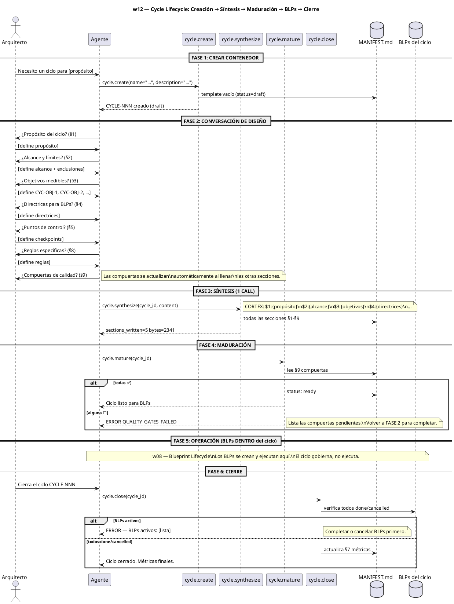
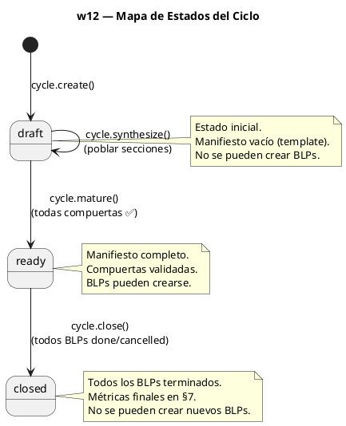

$0

# -- $0: WORKFLOW SKILL GLOSSARY --
# Sigil | Name     | Type   | Risk | Layer        | Description
# IDN   | identity | attrs  | B    | Semantic     | Workflow definition
# STP   | step     | attrs  | M    | Working      | Workflow step
# HDL   | handler  | attrs-pos | M | Semantic    | Handler reference
# AXM   | axiom    | cuerpo | H    | Prefrontal   | Non-negotiable principle

IDN:w12{ name:"Cycle Lifecycle — Creación, Síntesis y Cierre", file:"workflows/w12-cycle-lifecycle.md", purpose:"Gobernar el ciclo de vida del ciclo como contenedor de gobierno: create → synthesize → mature → BLPs → close.", trigger:"Arquitecto: 'Nuevo ciclo para [propósito]' o 'Cierra el ciclo CYCLE-NNN'" }

AXM:cycle_governs{ El ciclo gobierna, no ejecuta. Es el contenedor que abre la puerta a BLPs y tasks. Sin un ciclo definido (manifiesto lleno, compuertas validadas), el trabajo carece de marco de gobierno. }

AXM:conversational_synthesis{ Mismo patrón que w08 (blueprint lifecycle): una conversación con el Arquitecto define cada sección del manifiesto → 1 call a cycle.synthesize → manifiesto completo. }

$1: DIAGRAMA DE SECUENCIA

$2: PASOS DEL WORKFLOW

STP:w12_step1{ 0:"Arquitecto solicita nuevo ciclo", 1:"Agente invoca cycle.create(name, description)", 2:"MANIFEST.md creado con template vacío (draft)", 3:"Agente informa: CYCLE-NNN creado, necesita synthesize" }

STP:w12_step2{ 0:"Conversación de diseño guiada por MANIFEST.md template", 1:"Agente pregunta §1 Propósito", 2:"Arquitecto define", 3:"Agente pregunta §2 Alcance", 4:"Arquitecto define", 5:"Agente pregunta §3 Objetivos", 6:"Arquitecto define", 7:"Agente pregunta §4 Directrices", 8:"Arquitecto define", 9:"Agente pregunta §5 Puntos de control", 10:"Arquitecto define", 11:"Agente pregunta §8 Reglas", 12:"Arquitecto define", 13:"Agente construye payload CORTEX con todas las secciones", key_rule:"Las secciones §6 (BLPs) y §7 (métricas) se auto-poblan. §9 (compuertas) se deriva de las otras secciones." }

STP:w12_step3{ 0:"Agente invoca cycle.synthesize(cycle_id, content)", 1:"CORTEX payload: $1:{propósito}, $2:{alcance}, $3:{objetivos}, $4:{directrices}, $5:{checkpoints}, $8:{reglas}", 2:"Todas las secciones se escriben en 1 call atómico", 3:"PULSE audit registrado", 4:"Agente reporta: sections_written=5, bytes_written=N" }

STP:w12_step4{ 0:"Agente invoca cycle.mature(cycle_id)", 1:"Lee §9 compuertas del manifiesto", 2:"Valida: has_clear_purpose, has_explicit_scope, has_measurable_objectives, has_operational_guidelines, has_control_points, aligns_with_project", 3:"Si todas ✅ → status: ready, BLPs pueden crearse", 4:"Si alguna ☐ → ERROR QUALITY_GATES_FAILED con lista de pendientes", 5:"Instrucción: completar secciones faltantes con cycle.synthesize" }

STP:w12_step5{ 0:"BLPs y tasks se crean DENTRO del ciclo (w08, w04)", 1:"El ciclo gobierna — no ejecuta trabajo", 2:"Cada BLP creado con blueprint.create() se asocia al ciclo", 3:"MANIFEST.md §6 (índice de BLPs) se actualiza progresivamente" }

STP:w12_step6{ 0:"Arquitecto solicita cierre del ciclo", 1:"Agente invoca cycle.close(cycle_id)", 2:"Verifica todos los BLPs: done o cancelled", 3:"Si hay BLPs activos → error con lista", 4:"Actualiza MANIFEST.md §7 con métricas reales (total, done, cancelled, progreso %)", 5:"Escribe cierre en brain PULSE", 6:"Genera lecciones LNG automáticas", 7:"Escanea candidatos de aprendizaje" }

$3: HANDLERS REFERENCIADOS

HDL:cycle.create{ handler:"cycle.create", file:"handlers/cycle.py", description:"Crea un nuevo ciclo con MANIFEST.md template vacío (status=draft)." }

HDL:cycle.synthesize{ handler:"cycle.synthesize", file:"handlers/cycle.py", description:"Escribe todas las secciones del MANIFEST.md en 1 call desde CORTEX payload. Mismo patrón que blueprint.synthesize." }

HDL:cycle.mature{ handler:"cycle.mature", file:"handlers/cycle.py", description:"Valida compuertas §9 y transiciona draft→ready. Rechaza si alguna compuerta es ☐." }

HDL:cycle.close{ handler:"cycle.close", file:"handlers/cycle.py", description:"Cierra el ciclo: verifica BLPs done/cancelled, actualiza §7 métricas, escribe PULSE." }

HDL:cycle.list{ handler:"cycle.list", file:"handlers/cycle.py", description:"Lista los ciclos del proyecto." }

HDL:cycle.current{ handler:"cycle.current", file:"handlers/cycle.py", description:"Devuelve el ciclo activo actual." }

$4: PITFALLS

LNG:w12_pitfall1{type:"process", cause:"Intentar cycle.mature() sin haber ejecutado cycle.synthesize() primero", lesson:"El manifiesto debe estar completo antes de madurar. Usa cycle.synthesize para poblar las secciones."}

LNG:w12_pitfall2{type:"process", cause:"Intentar blueprint.create() en un ciclo en estado draft", lesson:"El ciclo debe estar en ready. Usa cycle.mature() después de cycle.synthesize()."}

LNG:w12_pitfall3{type:"process", cause:"Intentar cycle.close() con BLPs en in_progress", lesson:"Todos los BLPs deben estar done o cancelled. El error lista los BLPs activos."}

LNG:w12_pitfall4{type:"format", cause:"Formato incorrecto del CORTEX payload en cycle.synthesize()", lesson:"Usa $N:{cuerpo} por sección. Las llaves deben estar balanceadas. El contenido dentro de {} es el cuerpo de la sección."}
