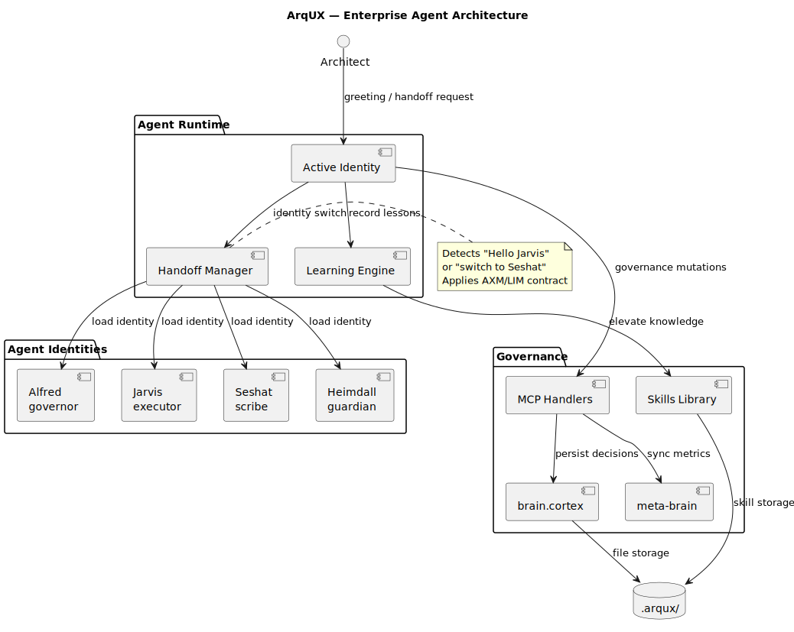
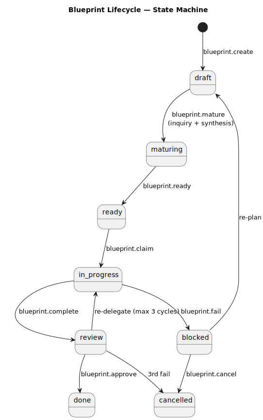
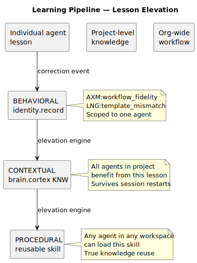

# ⬡ ArqUX v0.3.1

**Enterprise Agent Infrastructure.**

[](https://pypi.org/project/arqux/)
[](LICENSE)
[](https://www.python.org/)
[](https://github.com/FidelErnesto03/arqux)
[](https://github.com/FidelErnesto03/arqux)
[](https://github.com/FidelErnesto03/arqux)
[](https://pypi.org/project/arqux/)

**Tags:** `ai-governance` `agent-orchestration` `llm-framework` `enterprise-ai` `mcp-server` `multi-agent` `audit-trail` `behavioral-contracts` `knowledge-management` `cortex-format`

ArqUX is the first governance infrastructure purpose-built for **AI agents in enterprise environments**. It defines how an agent thinks, acts, learns, and accounts for its decisions — all under binding behavioral contracts that no command can override.

Built on a radical principle: **the agent is the interface.**

---

## 🔍 Use Cases

| Scenario | How ArqUX Helps |
|---|---|
| **AI agent in production** | Traces every decision, enforces role separation, persists institutional memory |
| **Multi-agent team** | Each identity has its own behavioral contract (AXM, LIM, FCS); hot handoff between them |
| **Compliance & audit** | Every handoff, state transition, and mutation is recorded as verifiable evidence in brain.cortex |
| **Knowledge retention** | Lessons auto-elevate from individual → project → organization level without manual intervention |
| **Agent governance** | The framework governs itself (dogfooding) — every feature is a governed Blueprint |
| **Enterprise deployment** | 71 MCP handlers, structured decision maps (18-section Blueprints), session resilience |

---

## ⚡ Quick Start

```bash
pip install arqux
cd your-workspace
arqux init
```

The agent reads `AGENTS.md`, discovers context, and is operational. Everything else it learns on the fly.

---

## 🏛️ Architecture



| Component | Purpose |
|---|---|
| **Active Identity** | Agent operating under a behavioral contract (AXM, LIM, FCS) |
| **Handoff Manager** | Switches identities via greeting or request |
| **MCP Handlers** | 71 handlers for governance operations |
| **brain.cortex** | Project shared memory (decisions, lessons, state) |
| **meta-brain** | Consolidated workspace state across projects |
| **Skills Library** | Reusable workflows across agents and projects |

---

## 🆔 Agent Identities — The Team

ArqUX replaces "one agent" with a **team of specialized identities**, each with its own binding behavioral contract.

| Identity | Role | Scope |
|---|---|---|
| **⬡ Alfred** | Governor | Cycles, BLPs, tasks, approvals |
| **⬡ Jarvis** | Technical executor | Assigned tasks (claim, complete, evidence) |
| **⬡ Seshat** | Scribe | Documentation, diagrams, presentations |
| **⬡ Heimdall** | Guardian | Audit, monitoring, reporting |

The Architect switches between identities with natural fluency:

> *"Hello Jarvis"* → starts as technical executor
> *"Switch to Seshat"* → handoff to documentation
> *"Back to Alfred"* → resumes governance

Each identity has hard limits (LIM) that even the Architect cannot violate without an explicit handoff.

---

## 📋 Blueprints — The Decision Map

A Blueprint (BLP) captures **every dimension of a design decision** in 18 sections that the agent synthesizes autonomously after a single inquiry conversation.

```
§1 Problem → §2 Objective → §3 Preconditions → §4 Guiding Principle
§5 Context → §6 Scope → §7 Rules → §8 Technical Design
§9 Operational Design → §10 Contracts → §11 Work Procedure
§12 Acceptance Criteria → §13 Validations → §14 Tasks
§15 Risks → §16 Blocking Rule → §17 Expected Output → §18 Quality
```

### Lifecycle



```
create → mature (inquiry + synthesis) → ready → claim
→ execution (checkpoint per task) → complete → verify → approve
```

---

## 🧠 Continuous Learning

Every lesson follows an automatic elevation pipeline:



| Level | Description | Persists in |
|---|---|---|
| **BEHAVIORAL** | Individual agent lesson | `identity.record()` → agent .cortex file |
| **CONTEXTUAL** | Project-level knowledge | `brain.cortex` KNW |
| **PROCEDURAL** | Reusable workflow | Skill in `.arqux/skills/` |

A lesson learned by one agent in one project can become a skill for **every agent in the organization**, without manual intervention.

---

## 🎯 Who ArqUX Is For

ArqUX is designed for organizations where:

- ✅ **Compliance is not optional.** Every action must be auditable.
- ✅ **Agents operate continuously** and must maintain coherence across sessions.
- ✅ **Role separation is critical.** Not every identity can do everything.
- ✅ **Institutional knowledge must persist** beyond ephemeral model memory.
- ✅ **The cost of failure justifies investment in governance.**

Not for afternoon experiments. For teams putting AI agents into production with real responsibilities.

---

## 🗺️ Roadmap

### v0.3.x — Foundation (current)
- Governance framework with 71 MCP handlers and 22 BLPs in CYCLE-01
- CORTEX format with sigils, validation, and automatic elevation
- Multi-identity model with binding behavioral contracts
- Hot handoff between identities via greeting or request
- Autonomous Blueprint synthesis (inquiry → batch of 18 sections)
- Learning pipeline: BEHAVIORAL → CONTEXTUAL → PROCEDURAL
- Structural markers `<!-- BLP:N -->` for precise section replacement
- Full dogfooding — ArqUX governs itself

### v1.1 — Operational maturity
- Native HCORTEX ↔ CORTEX translation
- Self-healing structural inconsistencies
- Consolidated workspace dashboard
- Quick-response tasks for lightweight actions

### v2.0 — Enterprise scale
- Progressive mode: from basic operation to full governance
- Institutional skills marketplace
- CODEC-CORTEX as standalone library
- Interoperability with enterprise agent ecosystems
- Visual governance and audit interface

---

## 📚 Documentation

| Resource | Description |
|---|---|
| `AGENTS.md` | Agent entry point — one file to start |
| `protocol.skill.md` | Session protocol, handoff, and decision-making |
| `w08-blueprint-lifecycle.md` | Complete Blueprint lifecycle |
| `w10-identity-handoff.md` | Hot identity handoff workflow |
| `cortex.skill.md` | CORTEX format and HCORTEX reference |

---

*⬡ ArqUX — The agent is the interface.*
