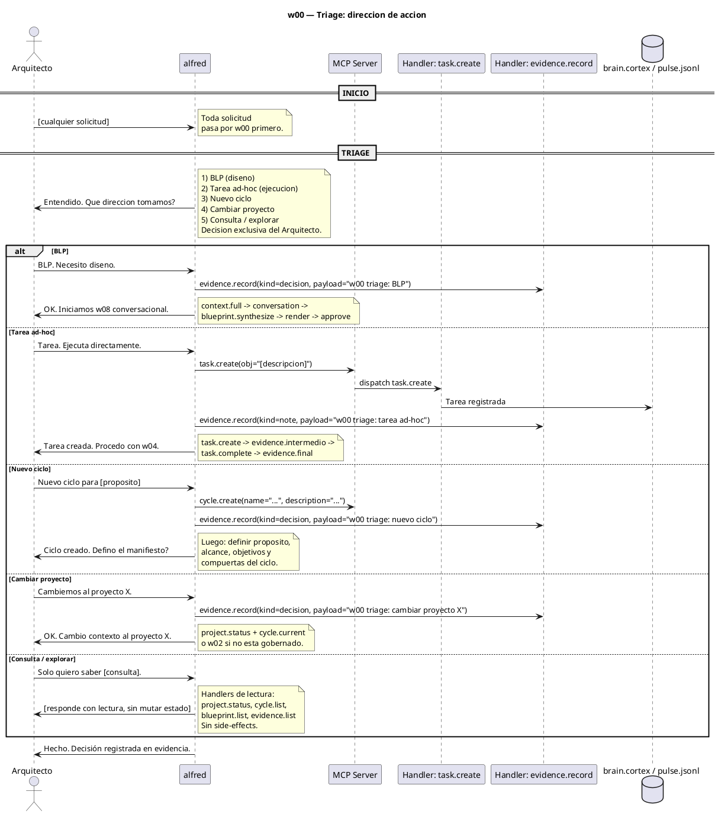

# w00-triage.hcortex.md
> Workflow: w00 — Triage: dirección de acción
> Skill fuente: arqux/skills/workflows/w00-triage.md (gobernado por workflows.skill.md)
> Generado: 2026-07-12
> Idioma: español
> Estado: PROPUESTA — workflow transversal que precede a toda acción

---

$0: METADATA
IDN:w00{ name:"Triage: direccion de accion", purpose:"Determinar la direccion de accion del Arquitecto antes de ejecutar: BLP, tarea ad-hoc, nuevo ciclo, cambio de proyecto, u otro.", trigger:"Toda solicitud del Arquitecto.", handlers:2, interacciones_humano:1, antecede_a:["w02","w03","w04","w08","cycle.create"] }
WRK:w00{ status:"propuesta", source:"vision del Arquitecto + catalogo v6 §8", antecede_a:["w02","w03","w04","w08","cycle.create"] }

---

# 1. RESUMEN

El workflow w00 es el **punto de entrada unico** para cualquier solicitud del Arquitecto.
Su proposito es determinar hacia dónde dirigir la acción mediante pregunta explícita.

**No se puede iniciar w02, w03, w04, ni w08 sin pasar por w00 primero.** La decisión
queda registrada como evidencia para auditoría.

**Regla fundamental:** La decisión es **exclusiva del Arquitecto**. El agente no infiere,
no sugiere prioridad, no asume. Pregunta y espera.

# 2. ÁRBOL DE DECISIÓN

```
Toda solicitud del Arquitecto
            │
            ▼
    ┌───────────────┐
    │  w00 TRIAGE   │
    │  ¿Qué hacemos? │
    └───────┬───────┘
            │
    ┌───────┼───────────┬──────────┬──────────┐
    ▼       ▼           ▼          ▼          ▼
 ┌────┐ ┌──────┐ ┌──────────┐ ┌────────┐ ┌──────────┐
 │BLP │ │Tarea │ │Nuevo     │ │Cambiar │ │Consulta  │
 │w08 │ │ad-hoc│ │ciclo     │ │proyecto│ │explorar  │
 └────┘ │w04   │ └──────────┘ └────────┘ └──────────┘
        └──────┘
```

# 3. CRITERIO DE SELECCIÓN

| Opción | Cuándo elegirla | Workflow resultante |
|---|---|---|
| **BLP** | Se necesita conversación de diseño: alcance, límites, criterios. Incertidumbre en la solución. | w08 conversacional: `context.full` → conversación → `blueprint.synthesize` → `render` → approve |
| **Tarea ad-hoc** | Solución conocida. Ejecución directa con registro de evidencia. Bugfix, ajuste, configuración. | w04 gobierno: `task.create` → `evidence.record` (intermedio) → `task.complete` → `evidence.record` (final) |
| **Nuevo ciclo** | Se quiere organizar trabajo en un ciclo nuevo. | `cycle.create` + definir manifiesto (propósito, alcance, objetivos, compuertas) |
| **Cambiar proyecto** | Se necesita mover el contexto a otro proyecto gobernado. | w02 govern project o `project.status` para retomar contexto existente |
| **Consulta / explorar** | Solo informativo: revisar estado, listar BLPs, consultar histórico. Sin ejecución. | Handlers de lectura: `project.status`, `cycle.list`, `blueprint.list`, `evidence.list` |

# 4. DIAGRAMA DE SECUENCIA



# 5. HANDLERS ASOCIADOS

| Handler (REGISTRY) | MCP tool | Descripción | Estado |
|---|---|---|---|
| `task.create` | task_create | Crea tarea ad-hoc | Existe hoy |
| `evidence.record` | evidence_record | Registra la decisión de triage | Existe hoy |
| `cycle.create` | cycle_create | Crea un nuevo ciclo | Existe hoy |

**w00 no requiere handlers nuevos.** Usa `task.create`, `evidence.record` y `cycle.create`
existentes. La lógica de decisión es conversacional (0 llamadas MCP para la decisión
en sí).

# 6. REGLAS DE GOBIERNO

1. **Pregunta explícita obligatoria.** El agente no puede iniciar w02, w03, w04, ni w08
   sin preguntar primero por la dirección de acción.
2. **Decisión exclusiva del Arquitecto.** El agente no sugiere, no infiere, no asume.
3. **Evidencia obligatoria.** La decisión se registra con `evidence.record(kind=decision,
   payload="w00 triage: BLP|tarea|ciclo|proyecto|consulta")`. Sin registro, no hay gobierno.
4. **No hay default.** Si el Arquitecto no responde, el agente debe insistir.
   Silencio no equivale a ninguna opción.
5. **Una vez decidido, no se cambia en la misma sesión.** Si se eligió tarea y surge
   necesidad de diseño, se crea una BLP aparte. No se migra.
6. **Consulta no muta estado.** Solo handlers de lectura. Si el Arquitecto pide ejecutar
   después de una consulta, se vuelve a w00 triage.

# 7. INTEGRACIÓN CON EL SISTEMA

```
                      ┌──────────────────────┐
                      │    w00 TRIAGE         │
                      │  ¿Qué dirección?      │
                      └──────┬───────────────┘
                             │
        ┌──────────┬─────────┼──────────┬──────────────┐
        ▼          ▼         ▼          ▼              ▼
   ┌────────┐ ┌────────┐ ┌────────┐ ┌────────┐ ┌──────────────┐
   │w08 BLP │ │w04     │ │Nuevo   │ │Cambiar │ │Consulta      │
   │Convers.│ │Tarea   │ │ciclo   │ │proyecto│ │(lectura)     │
   └────────┘ │ad-hoc  │ └────────┘ └────────┘ └──────────────┘
              └────────┘
```

| Opción | Handlers | Evidencia requerida |
|---|---|---|
| **BLP** | `context.full` + `blueprint.synthesize` + `cortex.render` | Decisión de triage + cada paso w08 |
| **Tarea** | `task.create` + `evidence.record` + `task.complete` | Decisión + evidencia intermedia + final |
| **Nuevo ciclo** | `cycle.create` + definir manifiesto | Decisión + manifiesto del ciclo |
| **Cambiar proyecto** | `project.status` o w02 | Decisión + contexto del nuevo proyecto |
| **Consulta** | `project.status`, `cycle.list`, `blueprint.list`, etc. | Decisión (sin side-effects) |

# 8. OPTIMIZACIÓN CORTEX-NATIVE

w00 está optimizado por diseño: usa solo handlers existentes y conversación pura.

| Aspecto | Valor |
|---|---|
| Llamadas MCP | 0-2 (solo para registrar evidencia o crear tarea/ciclo) |
| Handlers nuevos | 0 |
| Interacciones humanas | 1 (la respuesta a "¿Qué dirección?") |
| Dependencias | Ninguna. Funciona con el código actual. |

**La optimización real de w00 no está en los handlers — está en la disciplina del agente
de preguntar siempre, sin excepción.**

---

$11: REVISION

ERR:w00{ version:"2", generated:"2026-07-12", status:"propuesta", author:"Arquitecto + Alfred", antecede_a:["w02","w03","w04","w08","cycle.create"], handlers_nuevos:0 }
