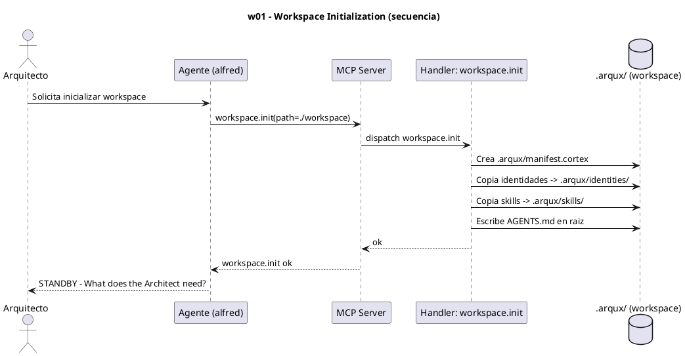

# w01-workspace-init.hcortex.md
> Workflow: w01 — Workspace Initialization
> Skill fuente: arqux/skills/workflows/w01-workspace-init.md (gobernado por workflows.skill.md)
> Generado: 2026-07-12
> Idioma: español
> Estado: FUNCIONAL — handlers verificados en REGISTRY (73 MCP tools)

---

$0: METADATA
IDN:w01{ name:"Workspace Initialization", purpose:"Setup a new workspace from scratch with full governance.", trigger:"arqux init or workspace.init()", handlers:1 }
WRK:w01{ status:"functional", source:"workflows.skill.md $2 IDN:w01" }

---

# 1. RESUMEN

El workflow w01 inicializa un workspace completo con gobernanza ArqUX. El Arquitecto
solicita la inicialización; el Agente invoca el handler `workspace.init`, que materializa
la estructura `.arqux/` (manifest, identidades, skills) y escribe `AGENTS.md` en la raíz.
Al finalizar, el Agente entra en STANDBY.

# 2. DIAGRAMA DE SECUENCIA



# 3. HANDLERS ASOCIADOS

| Handler (REGISTRY) | MCP tool | Descripción | Implementado |
|---|---|---|---|
| workspace.init | workspace_init | Inicializa `.arqux/` en la raíz del workspace: manifest, identidades y skills; escribe AGENTS.md. | ✅ |

# 4. NOTAS

- Efectos internos de `workspace.init` (no son handlers MCP aparte): creación de
  `manifest.cortex`, copia de `.arqux/identities/`, copia de `.arqux/skills/`, escritura de
  `AGENTS.md` en la raíz. Todos ocurren dentro del handler `workspace.init`.
- `workspace.status` y `workspace.lessons` son handlers complementarios del grupo workspace,
  pero no se invocan en este workflow.

# 5. SUGERENCIAS DE EVOLUCION

> Alineadas a la revision del Arquitecto: orden de uso (1), gobernanza vs auxiliares (2), meta-handlers (3), fragmentacion (4). + aportes propios.

- **Orden en la secuencia de uso (1):** w01 es el paso 0 absoluto (bootstrap del workspace). Todo lo demas depende de el. Propuesta de ordenamiento canonico por uso real: `w01 -> w06 -> w02 -> w03 -> w10 -> (w08 | w04) -> w05 -> w07 -> w09 -> w11`.
- **Gobernanza vs auxiliares (2):** w01 usa UN solo handler (`workspace.init`), 100% gobernanza (muta estado). No hay auxiliares: es el flujo mas limpio. Los auxiliares de lectura viven en w03/w09/w11.
- **Meta-handler (3):** no aplica reduccion (1 llamada). Pero `workspace.init` podria devolver en UN solo call el resumen de lo creado (manifest, identities, skills, AGENTS) en vez de que el agente luego dispare `workspace.status` aparte.
- **Fragmentacion (4):** el preambulo "detectar `.arqux/` + leer AGENTS.md" se repite en w01, w03, w06, w10. Sugeriria un meta-handler `session.bootstrap()` (o un w00) que centralice la deteccion y devuelva el punto de entrada, eliminando la fragmentacion del arranque.
- **Aporte de alfred:** marcar en cada workflow un bloque explicito "Nucleo de gobernanza" vs "Soporte auxiliar" para ver de un vistazo que handlers son estructurales.

# 6. OPTIMIZACION CORTEX-NATIVE

> Canal: E (workspace.init produce estructura visible para humano).

## 6.1 Secuencia actual

```
1. workspace.init(path=./workspace)
```

**Total: 1 llamada MCP.**

## 6.2 Secuencia optimizada

```
1. workspace.init(path=./workspace)
```

**Total: 1 llamada MCP. Sin cambio — w01 no tiene handlers con params descompuestos.**

## 6.3 Impacto

- **Llamadas:** 1 → 1 (0% reduccion).
- **Handlers a modificar:** ninguno.
- **Nota:** la optimizacion real de w01 esta en el preambulo comun (detectar `.arqux/` + leer AGENTS.md) que se repite en w01/w03/w06/w10. La solucion es un `session.bootstrap()` (propuesto en §5) como w00 transversal, no un cambio en w01 mismo.

---
### Diagrama: secuencia optimizada

No requiere diagrama nuevo — la secuencia es **identica a §2**. `workspace.init` sigue siendo 1 llamada, sin params descompuestos.
