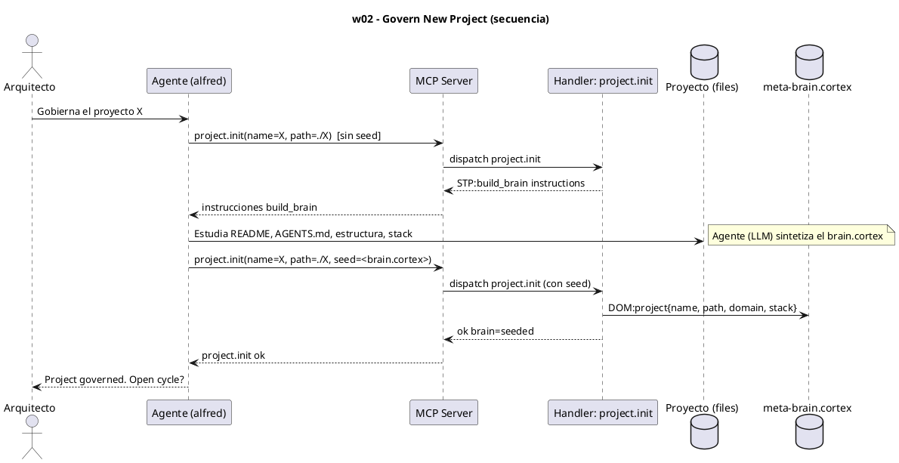

# w02-govern-project.hcortex.md
> Workflow: w02 — Govern New Project
> Skill fuente: arqux/skills/workflows/w02-govern-project.md (gobernado por workflows.skill.md)
> Generado: 2026-07-12
> Idioma: español
> Estado: FUNCIONAL — handlers verificados en REGISTRY (73 MCP tools)

---

$0: METADATA
IDN:w02{ name:"Govern New Project", purpose:"Bring an existing project under Arqux governance with full context.", trigger:"Arquitecto: 'Gobierna el proyecto X'", handlers:1 }
WRK:w02{ status:"functional", source:"workflows.skill.md $2 IDN:w02" }

---

# 1. RESUMEN

El workflow w02 trae un proyecto existente bajo gobernanza ArqUX. Se invoca `project.init`
en dos fases: (1) sin `seed`, devuelve instrucciones `STP:build_brain`; el Agente estudia el
proyecto (README, AGENTS.md, estructura, stack) y sintetiza un `brain.cortex` en CORTEX;
(2) con `seed`, `project.init` escribe el brain y registra el proyecto en `meta-brain.cortex`
(`DOM:project`).

# 2. DIAGRAMA DE SECUENCIA



# 3. HANDLERS ASOCIADOS

| Handler (REGISTRY) | MCP tool | Descripción | Implementado |
|---|---|---|---|
| project.init | project_init | Inicializa `.arqux/` en el proyecto y lo registra en el workspace. Sin `seed` devuelve instrucciones de construcción de brain; con `seed` escribe el brain y actualiza `meta-brain.cortex` (DOM:project). | ✅ |

# 4. NOTAS

- `project.init` agrupa ambas fases (sin/ con `seed`). No hay handlers MCP separados por fase.
- Handlers complementarios del grupo project (no invocados aquí): `project.status`,
  `project.bind`, `project.unbind`, `project.lessons`.
- El estudio del proyecto (lectura de README/AGENTS.md) lo hace el Agente (LLM) directamente,
  no vía handler MCP.

# 5. SUGERENCIAS DE EVOLUCION

> Alineadas a la revision del Arquitecto (1 orden, 2 gov/aux, 3 meta-handler, 4 fragmentacion) + aportes propios.

- **Orden en la secuencia de uso (1):** w02 es paso 2 tras w01 (workspace) y antes de w03 (session start). Solo tiene sentido sobre un workspace ya inicializado y un proyecto a gobernar.
- **Gobernanza vs auxiliares (2):** w02 usa UN handler nucleo (`project.init`, gobernanza). Los auxiliares del grupo (`project.status`, `project.bind/unbind`, `project.lessons`) no se invocan aqui pero son el soporte que el agente usara despues.
- **Meta-handler (3):** `project.init` ya agrupa sin-seed + con-seed, pero el agente aun hace 3-4 llamadas dispersas para "conocer el proyecto completo" (leer README/AGENTS, luego `project.status`, luego `cortex.read` del brain). Un meta-handler `project.onboard(name)` podria devolver en UN call: estructura detectada + brain sintetizado + `project.status` + next-step sugerido.
- **Fragmentacion (4):** el patron "leer proyecto -> sintetizar brain -> registrar" es comun a w02 y a la fase de estudio de w08. Sugeriria un fragmento reutilizable `build_brain` (ya nombrado en el skill como `STP:build_brain`) expuesto como handler para no duplicarlo.
- **Aporte de alfred:** el handler `project.init` con `seed` ya es una forma de "meta-handler" (una sola llamada hace dos fases). Podria documentarse como patron para los demas modulos.

# 6. OPTIMIZACION CORTEX-NATIVE

> Canal: B — `project.init(seed)` acepta CORTEX nativo (I), pero produce estructura visible (E).

## 6.1 Secuencia actual

```
1. project.init(name="mi-proyecto", seed="<CORTEX>")   # seed ya es CORTEX nativo
```

**Total: 1 llamada MCP.**

## 6.2 Secuencia optimizada

```
1. project.init(name="mi-proyecto", seed="<CORTEX>")   # igual, seed ya nativo
```

**Total: 1 llamada MCP. Sin cambio — w02 ya usa CORTEX nativo via `seed`.**

## 6.3 Impacto

- **Llamadas:** 1 → 1 (0% reduccion).
- **Handlers a modificar:** ninguno.
- **Nota:** `project.init` con `seed` es el unico handler del sistema que ya hace bien el canal I (acepta CORTEX nativo). Sirve como patron de diseno para los demas cambios (especialmente `cortex.entry.add` y `blueprint.define`).

---
### Diagrama: secuencia optimizada

No requiere diagrama nuevo — la secuencia es **identica a §2**. `project.init(seed)` ya acepta CORTEX nativo.
