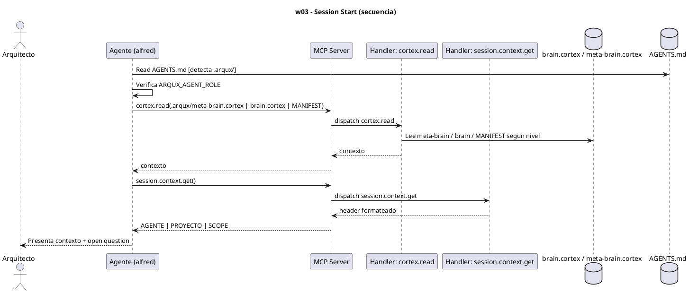
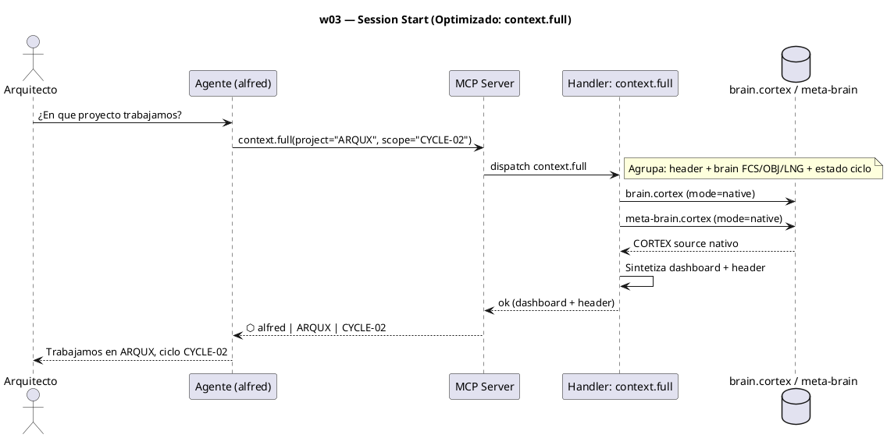

# w03-session-start.hcortex.md
> Workflow: w03 — Session Start
> Skill fuente: arqux/skills/workflows/w03-session-start.md (gobernado por workflows.skill.md)
> Generado: 2026-07-12
> Idioma: español
> Estado: FUNCIONAL — handlers verificados en REGISTRY (73 MCP tools)

---

$0: METADATA
IDN:w03{ name:"Session Start", purpose:"Agent startup in a governed workspace. Presents context from brain.cortex at the appropriate level.", trigger:"Agent starts in a governed workspace.", handlers:2 }
WRK:w03{ status:"functional", source:"workflows.skill.md $2 IDN:w03", axiom:"session_context_first" }

---

# 1. RESUMEN

El workflow w03 es el arranque del Agente en un workspace gobernado. Primero detecta `.arqux/`
leyendo `AGENTS.md` y verifica `ARQUX_AGENT_ROLE`. Luego presenta contexto según el nivel
(workspace / proyecto / ciclo) leyendo los brains vía `cortex.read`, y formatea el header
visible vía `session.context.get`. La primera respuesta SIEMPRE incluye contexto.

# 2. DIAGRAMA DE SECUENCIA



# 3. HANDLERS ASOCIADOS

| Handler (REGISTRY) | MCP tool | Descripción | Implementado |
|---|---|---|---|
| cortex.read | cortex_read | Lee y parsea un `.cortex` (meta-brain, brain, MANIFEST) según el nivel de contexto. | ✅ |
| session.context.get | session_context_get | Lee el puntero de contexto actual y devuelve el header formateado (`⬡ AGENTE \| PROYECTO \| SCOPE`). | ✅ |

# 4. NOTAS

- Regla AXM `session_context_first`: la primera respuesta en workspace gobernado debe incluir
  contexto de `brain.cortex`. El nivel (workspace/proyecto/ciclo) determina qué se lee.
- `session.context.set` no se usa en el arranque (solo lectura/ presentación); se usa en w10
  para cambiar el contexto activo.

# 5. SUGERENCIAS DE EVOLUCION

> Alineadas a la revision del Arquitecto (1 orden, 2 gov/aux, 3 meta-handler, 4 fragmentacion) + aportes propios.

- **Orden en la secuencia de uso (1):** w03 es paso 4 (tras w01-w02). Ocurre cada vez que un agente arranca en el workspace gobernado; precede a todo trabajo operativo (w04/w08) e identidad (w10).
- **Gobernanza vs auxiliares (2):** w03 mezcla 1 handler de gobernanza (`session.context.get`, escribe el header) con 1 auxiliar de lectura (`cortex.read`). Es el primer workflow donde aparece un auxiliar de inspeccion.
- **Meta-handler (3) — caso mas claro:** hoy el agente hace 3-4 llamadas para "contexto completo": `session.context.get` + `cortex.read(meta-brain)` + `cortex.read(brain)` + a veces `project.status`. Un meta-handler `context.full(project?, scope?)` (o extender `session.context.get` con flag `full=True`) deberia devolver en UNA llamada: header + resumen de meta-brain + resumen de brain (FCS/OBJ/LNG) + estado de ciclo/blueprints. Reduce 3-4 -> 1.
- **Fragmentacion (4):** el preambulo "leer AGENTS.md -> verificar rol -> presentar contexto" se repite en w01, w03, w06, w10. Centralizarlo en un `session.bootstrap()` (o w00) eliminaria la fragmentacion del arranque.
- **Aporte de alfred:** `workspace.status` ya es un aggregator (dashboard OUT-MIN). La misma idea de "dashboard handler" deberia existir a nivel proyecto/ciclo (`project.dashboard`, `cycle.dashboard`) para que el agente vea lo completo en 1 llamada.

# 6. OPTIMIZACION CORTEX-NATIVE

> Canal: B — `cortex.read` debe ofrecer modo nativo (I); `session.context.get` produce header para humano (E).

## 6.1 Secuencia actual

```
1. cortex.read(meta-brain)                      # AST: sections/glossary descarta source
2. cortex.read(brain.cortex)                    # AST: idem
3. session.context.get                          # header: ⬡ alfred | ARQUX | CYCLE-02
```

**Total: 3 llamadas MCP.**

## 6.2 Secuencia optimizada

```
# Opcion A: modo native en las lecturas (cambio minimo)
1. cortex.read(meta-brain, mode=native)          # retorna .cortex fuente crudo
2. cortex.read(brain.cortex, mode=native)        # retorna .cortex fuente crudo
3. session.context.get                           # igual (header humano)

# Opcion B: meta-handler context.full (maxima reduccion)
1. context.full(project="ARQUX", scope="CYCLE-02")
   # agrupa: cortex.read(brain, native) + cortex.read(meta-brain, native)
   #        + session.context.get + project.status
   #        → devuelve: header + brain FCS/OBJ/LNG + estado ciclo
```

**Total opcion A: 3 llamadas. Total opcion B: 1 llamada.**

## 6.3 Impacto

| Escenario | Llamadas hoy | Llamadas opt | Reduccion |
|---|---|---|---|
| Solo `mode=native` en reads | 3 | 3 (param cambio) | 0% (mejora tokens internos) |
| `context.full` meta-handler | 3 | 1 | **67%** |

- **Handlers a modificar:** `cortex.read` (anadir `mode=native`).
- **Handlers nuevos:** `context.full` o extender `session.context.get` con `full=True`.

---
### Diagrama: secuencia optimizada (meta-handler `context.full`)



