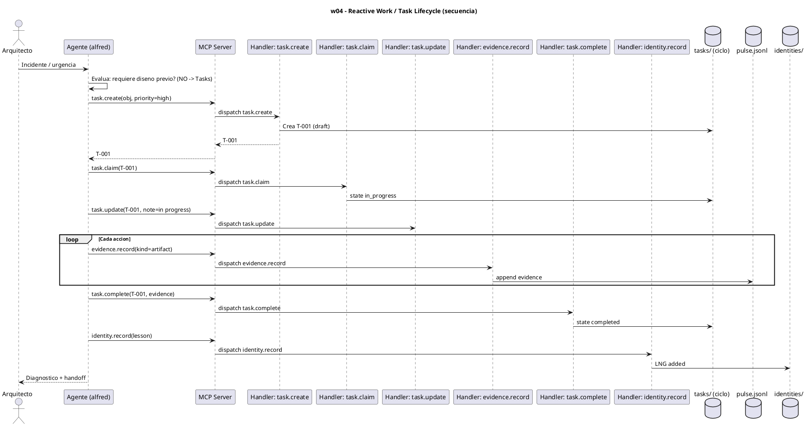

# w04-reactive-task.hcortex.md
> Workflow: w04 — Reactive Work / Task Lifecycle
> Skill fuente: arqux/skills/workflows/w04-reactive-task.md (gobernado por workflows.skill.md)
> Generado: 2026-07-12
> Idioma: español
> Estado: FUNCIONAL — handlers verificados en REGISTRY (73 MCP tools)

---

$0: METADATA
IDN:w04{ name:"Reactive Work — Task Lifecycle", purpose:"For urgent/reactive work: incident response, diagnostics, emergency fixes, monitoring. No pre-design — direct execution with full traceability.", trigger:"An incident, outage, or urgent diagnostic requires immediate action.", handlers:6 }
WRK:w04{ status:"functional", source:"workflows.skill.md $2 IDN:w04", axiom:"task_rigor" }

---

# 1. RESUMEN

El workflow w04 cubre trabajo reactivo (incidentes, diagnósticos, hotfixes) sin diseño previo.
El Agente crea una tarea con `task.create`, la reclama (`task.claim`), ejecuta directo
registrando evidencia por acción (`evidence.record`), la cierra (`task.complete`) y registra
la lección conductual (`identity.record`). La velocidad no exime trazabilidad.

# 2. DIAGRAMA DE SECUENCIA



# 3. HANDLERS ASOCIADOS

| Handler (REGISTRY) | MCP tool | Descripción | Implementado |
|---|---|---|---|
| task.create | task_create | Crea una tarea gobernada en el ciclo activo (obj, prioridad, ACs, bloqueos). | ✅ |
| task.claim | task_claim | El ejecutor reclama la tarea → state in_progress. | ✅ |
| task.update | task_update | Actualiza progreso / nota de la tarea. | ✅ |
| evidence.record | evidence_record | Registra evidencia (note/artifact/decision/metric/blocker) en pulse.jsonl. | ✅ |
| task.complete | task_complete | Cierra la tarea con evidencia → state completed. | ✅ |
| identity.record | identity_record | Registra lección conductual en `.arqux/identities/<agent>.cortex`. | ✅ |

# 4. NOTAS

- Regla AXM `task_rigor`: incluso urgente debe tener objetivo, precondiciones, ACs, bloqueos,
  evidencia por acción y lección aprendida.
- `task.fail` y `task.read`/`task.list` son handlers del grupo task complementarios (no
  obligatorios en el flujo feliz de w04).
- La decisión Tasks vs Blueprints la rige AXM `decision_matrix` del skill.

# 5. SUGERENCIAS DE EVOLUCION

> Alineadas a la revision del Arquitecto (1 orden, 2 gov/aux, 3 meta-handler, 4 fragmentacion) + aportes propios.

- **Orden en la secuencia de uso (1):** w04 es operativo y ALTERNO a w08 (AXM `decision_matrix`): si hay diseno previo -> w08; si es reactivo/urgente -> w04. Ambos van tras w03/w10.
- **Gobernanza vs auxiliares (2):** w04 son 6 handlers TODOS de gobernanza (mutan tasks, pulse, identidad). No hay auxiliares de lectura; es un flujo de escritura puro.
- **Meta-handler (3):** el agente hace 6 llamadas para una tarea reactiva (create, claim, update, evidence xN, complete, identity.record). Un meta-handler `task.run(obj, priority, evidence[], lesson?)` podria agrupar create->claim->execute->complete->record en 1-2 llamadas, conservando la evidencia por accion dentro del payload. Reduce 6 -> 1 (o 2 si la leccion es aparte).
- **Fragmentacion (4):** el bucle "por cada accion: evidence.record" dispersa la evidencia en N llamadas. Un `task.step(note, evidence)` (o pasar `evidence[]` al `task.run`) mantiene la trazabilidad sin fragmentar el log.
- **Aporte de alfred:** `task.run` NO deberia eliminar `task.create`/`task.claim` individuales (se necesitan para recovery/checkpoint). Sugeriria `task.run` como "atajo feliz" y dejar los atomicos para casos edge.

# 6. OPTIMIZACION CORTEX-NATIVE

> Canal: I — w04 son 6 handlers de gobernanza que deberian intercambiar CORTEX nativo.

## 6.1 Secuencia actual

```
1. task.create(obj, pre=["a"], proc=["b"], ac=["c"], blk=["d"],
               assignee="alfred", complexity="simple", priority="high")
                                               # 8 parametros
2. task.claim(task_id)                         # 1 param (ok)
3. evidence.record(task_id, kind="note", payload="avance")
                                               # 3 params (ok)
4. task.complete(task_id, evidence="E-001")    # 2 params (ok)
5. identity.record(lesson="...", kind="behavioral",
                   cause="...", prevention="...")
                                               # 5 parametros
```

**Total: 5 llamadas MCP. 2 handlers con params descompuestos: `task.create` (8) + `identity.record` (5).**

## 6.2 Secuencia optimizada

```
# Opcion A: content en cada handler (cambio minimo, 5 llamadas)
1. task.create(content="TK:task{obj:...|pre:[a]|proc:[b]|ac:[c]|blk:[d]"
                     "|assignee:alfred|complexity:simple|priority:high}")
                                               # 1 param content
2. task.claim(task_id)                         # igual
3. evidence.record(task_id, kind="note", payload="avance")
                                               # igual
4. task.complete(task_id, evidence="E-001")    # igual
5. identity.record(content="$5/LNG:lesson{kind:behavioral|cause:X|prevention:Y}")
                                               # 1 param content

# Opcion B: meta-handler task.run (maxima reduccion, 1-2 llamadas)
1. task.run(obj="hacer X", priority="high",
            content="TK:task{...}",
            lessons=["$5/LNG:lesson{...}"])
   # agrupa: create + claim + execute + evidence + complete + identity.record
```

**Total opcion A: 5 llamadas (params colapsados). Total opcion B: 1 llamada.**

## 6.3 Impacto

| Escenario | Llamadas | Params max por handler | Reduccion params |
|---|---|---|---|
| Hoy | 5 | 8 (`task.create`) | — |
| Opcion A (`content`) | 5 | 1 (`content`) | 8→1 y 5→1 |
| Opcion B (`task.run`) | **1** | 0 (todo en `content`) | **100% llamadas** |

- **Handlers a modificar:** `task.create` (anadir `content`), `identity.record` (anadir `content`).
- **Handlers nuevos:** `task.run` meta-handler (opcional, alta ganancia).
- **Nota:** `evidence.record` y `task.complete` tienen params simples (ID, string) sin ganancia CORTEX — quedan ASIS.

---
### Diagrama: secuencia optimizada (`task.run`)

```puml
' @name: w04_optimized_task_run
' @description: Secuencia optimizada CORTEX-native de tarea reactiva via task.run
' @category: workflow
' @tags: w04,task,run,native,CORTEX
' @version: 1.0.0
@startuml
title w04 — Reactive Task (Optimizado: task.run + identity.record content)

actor "Arquitecto" as A
participant "Agente (alfred)" as G
participant "MCP Server" as S
participant "Handler: task.run" as H

A -> G: Necesito hacer X
G -> S: task.run(obj="hacer X", priority="high",
       content="TK:task{pre:[a]|proc:[b]|ac:[c]|blk:[d]}",
       lessons=["$5/LNG:lesson{kind:behavioral|cause:error|prevention:validar}"])
note right: Agrupa: create + claim + execute +\nevidence + complete + identity.record\nen 1 llamada
S -> H: dispatch task.run
H -> H: Crea tarea, reclama, ejecuta
H -> H: Registra evidencia, cierra
H -> H: Registra leccion en identidad
H --> S: ok (task_id, evidence, lesson)
S --> G: T-001 completada + E-001 + LNG registrada
G --> A: Listo. Tarea completada y leccion aprendida.
@enduml
```
