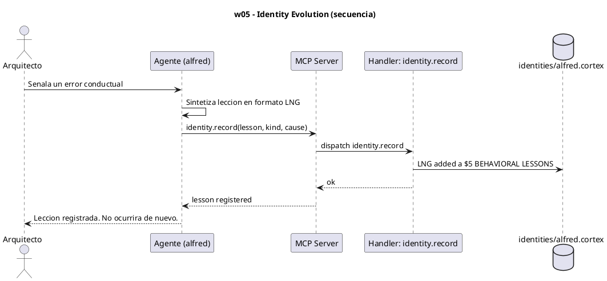

# w05-identity-evolution.hcortex.md
> Workflow: w05 — Identity Evolution
> Skill fuente: arqux/skills/workflows/w05-identity-evolution.md (gobernado por workflows.skill.md)
> Generado: 2026-07-12
> Idioma: español
> Estado: FUNCIONAL — handlers verificados en REGISTRY (73 MCP tools)

---

$0: METADATA
IDN:w05{ name:"Identity Evolution", purpose:"Agent evolves its behavioral identity with lessons learned across sessions.", trigger:"Agent learns a significant behavioral lesson.", handlers:1 }
WRK:w05{ status:"functional", source:"workflows.skill.md $2 IDN:w05" }

---

# 1. RESUMEN

El workflow w05 evoluciona la identidad conductual del Agente. Ante una corrección del
Arquitecto (o una lección descubierta), el Agente sintetiza la lección en formato LNG y la
registra vía `identity.record`, que la anexa a la sección `$5: BEHAVIORAL LESSONS` del
archivo de identidad. La identidad evoluciona de forma permanente.

# 2. DIAGRAMA DE SECUENCIA



# 3. HANDLERS ASOCIADOS

| Handler (REGISTRY) | MCP tool | Descripción | Implementado |
|---|---|---|---|
| identity.record | identity_record | Registra una lección conductual en el archivo de identidad del agente (sección `$5`). | ✅ |

# 4. NOTAS

- La lección se modela como `LNG:lxxx{type, cause, lesson}` (formato CORTEX).
- `identity.record` escribe dentro del handler `cortex.entry.add` sobre el `.cortex` de
  identidad; no es un handler MCP aparte.
- Las identidades viven en `.arqux/identities/` a nivel workspace, no dentro de proyectos.

# 5. SUGERENCIAS DE EVOLUCION

> Alineadas a la revision del Arquitecto (1 orden, 2 gov/aux, 3 meta-handler, 4 fragmentacion) + aportes propios.

- **Orden en la secuencia de uso (1):** w05 es TRANSVERSAL/ongoing: las lecciones se registran durante o despues de operar (lo disparan w04, w08, w11). No es un paso lineal sino un bucle de aprendizaje continuo.
- **Gobernanza vs auxiliares (2):** `identity.record` es gobernanza (muta identidad), PERO internamente delega en `cortex.entry.add` (auxiliar de escritura). Ejemplo perfecto de tu impresion 2: el handler de gobernanza "envuelve" un auxiliar. Documentarlo aclara la cadena real.
- **Meta-handler (3):** 1 llamada, no aplica reduccion. Pero varios workflows (w04, w11) terminan con `identity.record` aparte; un meta-handler `task.complete(obj, evidence, lesson)` o `blueprint.complete(evidence, lesson)` podria absorber la leccion en el cierre, evitando la llamada suelta.
- **Fragmentacion (4):** la leccion aparece como paso final en w04, w05, w11. Sugeriria un paso compartido `record_lesson` (reutilizable) para no repetir la logica de sintesis LNG en cada workflow.
- **Aporte de alfred:** considerar elevar lecciones automaticamente (conectar w05 con `cortex.learn`/`cortex.learn.elevate` de w08) para que la identidad y el brain compartan el mismo motor de aprendizaje.

# 6. OPTIMIZACION CORTEX-NATIVE

> Canal: I — w05 son gobernanza pura que deberia intercambiar CORTEX nativo.

## 6.1 Secuencia actual

```
# Flujo de prueba de leccion
1. cortex.entry.add(path, section="$5", sigil="LNG", name="test_lesson",
                    value="{kind:behavioral}", create_section=True)
                                               # 5 parametros + path
# Flujo real de leccion
2. identity.record(lesson="hacer X", kind="behavioral",
                   cause="error Y", prevention="validar Z",
                   agent_id="alfred")
                                               # 5 parametros
3. evidence.record(task_id=..., kind="decision", payload="leccion registrada")  # igual
```

**Total: 3 llamadas MCP. 2 handlers con params descompuestos: `cortex.entry.add` (5) + `identity.record` (5).**

## 6.2 Secuencia optimizada

```
# Opcion A: content en cada handler (cambio minimo)
1. cortex.entry.add(path, content="LNG:test_lesson{kind:behavioral}")   # 1 param
2. identity.record(content="$5/LNG:lesson{kind:behavioral|cause:error Y|prevention:validar Z}")
                                                                        # 1 param
3. evidence.record(task_id=..., kind="decision", payload="leccion registrada")  # igual

# Opcion B: cortex.patch agrupa add+record (1 llamada)
1. cortex.patch(path=identity_file,
                deltas=(
                    "LNG:test_lesson{kind:behavioral}\n"
                    "~$5/LNG:lesson{kind:behavioral|cause:X|prevention:Y}"
                ))
```

**Total opcion A: 3 llamadas (params colapsados). Total opcion B: 1 llamada.**

## 6.3 Impacto

| Escenario | Llamadas | Params max | Reduccion params |
|---|---|---|---|
| Hoy | 3 | 5 (`entry.add`, `identity.record`) | — |
| Opcion A (`content`) | 3 | 1 | 5→1 en ambos |
| Opcion B (`cortex.patch`) | **1** | 1 | **67% llamadas** |

- **Handlers a modificar:** `cortex.entry.add` (anadir `content`), `identity.record` (anadir `content`).
- **Handlers nuevos:** `cortex.patch` (opcional, alta ganancia cuando hay 2+ mutaciones seguidas).

---
### Diagrama: secuencia optimizada (`cortex.patch`)

```puml
' @name: w05_optimized_cortex_patch
' @description: Secuencia optimizada CORTEX-native de registro de leccion via cortex.patch
' @category: workflow
' @tags: w05,identity,lesson,patch,native,CORTEX
' @version: 1.0.0
@startuml
title w05 — Identity Evolution (Optimizado: cortex.patch + content)

actor "Arquitecto" as A
participant "Agente (alfred)" as G
participant "MCP Server" as S
participant "Handler: cortex.patch" as HP
database "identity.cortex" as ID

A -> G: Registra leccion: hacer X por Y
G -> S: cortex.patch(path="identity.cortex",
       deltas=(
           "LNG:test_lesson{kind:behavioral}\n"
           "~$5/LNG:lesson{kind:behavioral|cause:Y|prevention:validar}"
       ))
S -> HP: dispatch cortex.patch
HP -> ID: ADD LNG:test_lesson
HP -> ID: UPDATE $5/LNG:lesson
HP -> HP: verify + validate
ID --> HP: ok
HP --> S: ok (2 mutations, backup)
S --> G: 2 entradas actualizadas
G --> A: Leccion registrada
@enduml
```
