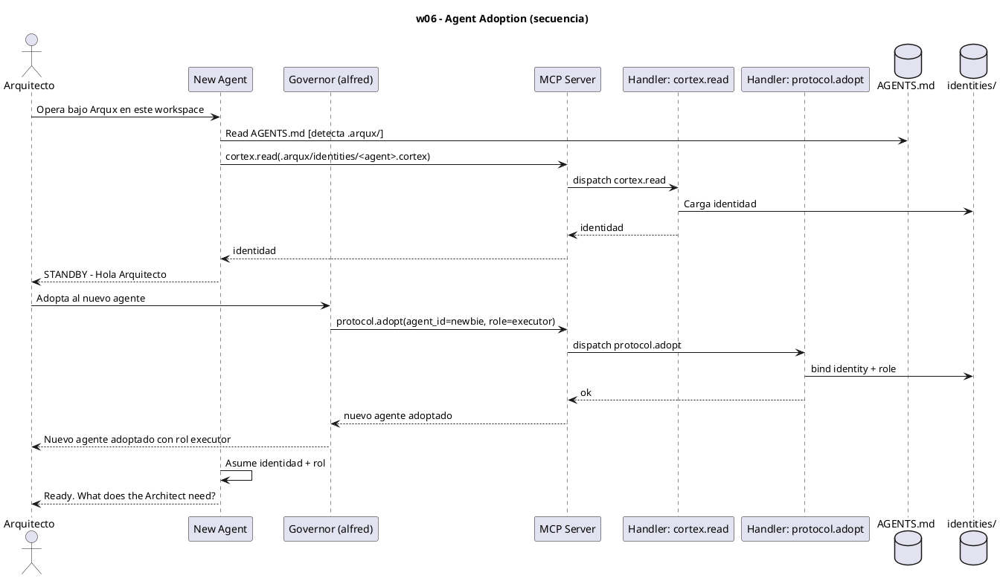
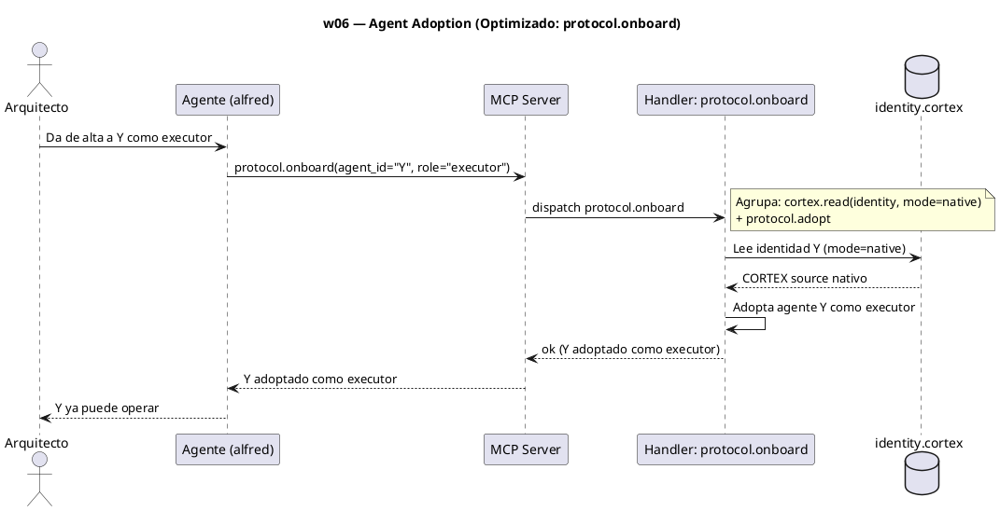

# w06-agent-adoption.hcortex.md
> Workflow: w06 — Agent Adoption Protocol
> Skill fuente: arqux/skills/workflows/w06-agent-adoption.md (gobernado por workflows.skill.md)
> Generado: 2026-07-12
> Idioma: español
> Estado: FUNCIONAL — handlers verificados en REGISTRY (73 MCP tools)

---

$0: METADATA
IDN:w06{ name:"Agent Adoption Protocol", purpose:"Onboard a new agent into the workspace with a specific role.", trigger:"A new agent needs to operate under Arqux.", handlers:2 }
WRK:w06{ status:"functional", source:"workflows.skill.md $2 IDN:w06" }

---

# 1. RESUMEN

El workflow w06 da de alta a un nuevo agente bajo gobernanza ArqUX. El nuevo agente detecta
`.arqux/` leyendo `AGENTS.md` y carga su identidad vía `cortex.read`. Luego el Governador
(alfred) ejecuta `protocol.adopt` para vincular el agente con un rol; el agente asume
identidad + rol y queda listo.

# 2. DIAGRAMA DE SECUENCIA



# 3. HANDLERS ASOCIADOS

| Handler (REGISTRY) | MCP tool | Descripción | Implementado |
|---|---|---|---|
| cortex.read | cortex_read | Lee y parsea el `.cortex` de identidad del agente. | ✅ |
| protocol.adopt | protocol_adopt | Da de alta a un agente con un rol (governor / executor / auditor) en el workspace. | ✅ |

# 4. NOTAS

- `protocol.pause`, `protocol.release`, `protocol.resume` son handlers complementarios del
  grupo protocol (no obligatorios en el flujo feliz de w06).
- La lectura de `AGENTS.md` la hace el agente directamente (archivo, no handler MCP).

# 5. SUGERENCIAS DE EVOLUCION

> Alineadas a la revision del Arquitecto (1 orden, 2 gov/aux, 3 meta-handler, 4 fragmentacion) + aportes propios.

- **Orden en la secuencia de uso (1):** w06 es paso 1 tras w01 (workspace) y antes de w02 (govern project): primero se da de alta a los agentes, luego se gobierna el proyecto donde operaran.
- **Gobernanza vs auxiliares (2):** w06 = 1 gobernanza (`protocol.adopt`) + 1 auxiliar de lectura (`cortex.read` de la identidad). Ilustra tu impresion 2: el flujo de gobernanza depende de un auxiliar de inspeccion previo.
- **Meta-handler (3):** `protocol.adopt` + el `cortex.read` previo de la identidad podrian fusionarse en `protocol.onboard(agent_id, role)` que lee la identidad y adopta en UNA llamada (hoy son 2).
- **Fragmentacion (4):** comparte con w01/w03/w10 el preambulo "leer AGENTS.md -> cargar identidad". El meta-handler `session.bootstrap()` sugerido en w01/w03 eliminaria esta repeticion.
- **Aporte de alfred:** `protocol.pause`/`resume`/`release` (auxiliares de ciclo de vida de sesion) no estan en ningun workflow canonico; sugiero documentarlos como "workflow implícito de sesion" o exponerlos en un w00.

# 6. OPTIMIZACION CORTEX-NATIVE

> Canal: B — `cortex.read` debe ofrecer modo nativo (I); `protocol.adopt` es operacion interna (I).

## 6.1 Secuencia actual

```
1. cortex.read(identity.cortex)     # AST: parsea y descarga source
2. protocol.adopt(agent_id, role)   # 2 params (ok, operacion simple)
```

**Total: 2 llamadas MCP. Handler con mejora: `cortex.read` (AST → native).**

## 6.2 Secuencia optimizada

```
# Opcion A: cortex.read mode=native (cambio minimo)
1. cortex.read(path=identity.cortex, mode=native)   # retorna .cortex fuente crudo
2. protocol.adopt(agent_id, role)                   # igual

# Opcion B: protocol.onboard (meta-handler)
1. protocol.onboard(agent_id="nuevo", role="executor")
   # agrupa: cortex.read(identity) + protocol.adopt
```

**Total opcion A: 2 llamadas (params igual). Total opcion B: 1 llamada.**

## 6.3 Impacto

| Escenario | Llamadas | Reduccion |
|---|---|---|
| Hoy | 2 | — |
| Opcion A (`mode=native`) | 2 | 0% (mejora tokens internos) |
| Opcion B (`protocol.onboard`) | **1** | **50%** |

- **Handlers a modificar:** `cortex.read` (anadir `mode=native`).
- **Handlers nuevos:** `protocol.onboard(agent_id, role)` (reduce 2→1).

---
### Diagrama: secuencia optimizada (`protocol.onboard`)


