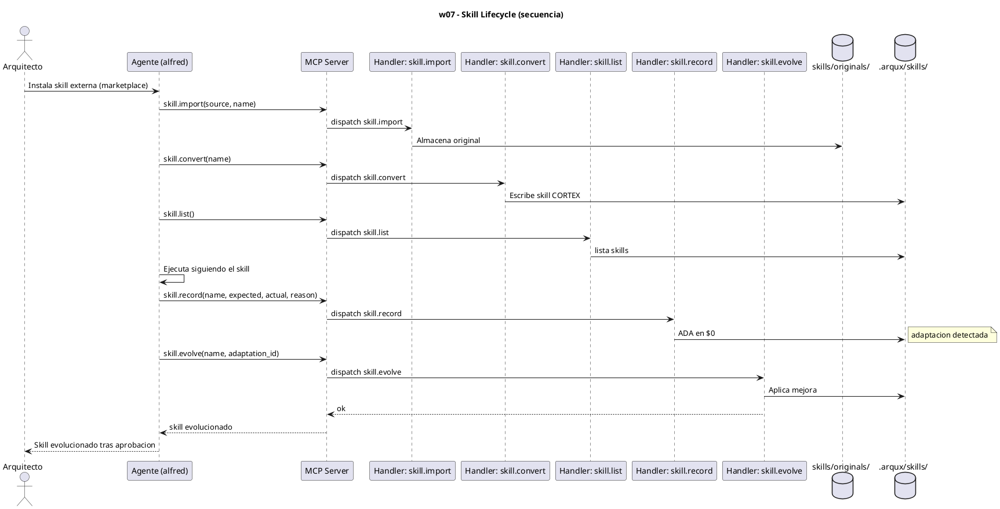
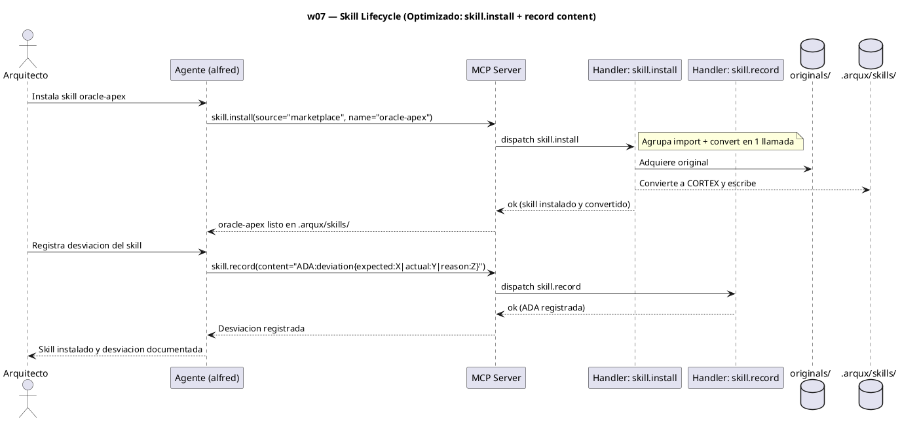

# w07-skill-lifecycle.hcortex.md
> Workflow: w07 — Skill Lifecycle
> Skill fuente: arqux/skills/workflows/w07-skill-lifecycle.md (gobernado por workflows.skill.md)
> Generado: 2026-07-12
> Idioma: español
> Estado: FUNCIONAL — handlers verificados en REGISTRY (73 MCP tools)

---

$0: METADATA
IDN:w07{ name:"Skill Lifecycle", purpose:"Acquire, install, convert to CORTEX, use, adapt, and evolve external skills under Arqux governance.", trigger:"Architect wants to use an external skill (marketplace, platform, third-party)", handlers:5 }
WRK:w07{ status:"functional", source:"workflows.skill.md $2 IDN:w07" }

---

# 1. RESUMEN

El workflow w07 gestiona el ciclo de vida de skills externos: adquisición (`skill.import`,
guarda el original en `originals/`), conversión a CORTEX ultra-denso (`skill.convert`,
escribe en `.arqux/skills/`), uso (carga vía `skill.list`), adaptación (`skill.record` registra
una desviación ADA) y evolución (`skill.evolve` aplica la mejora aprobada).

# 2. DIAGRAMA DE SECUENCIA



# 3. HANDLERS ASOCIADOS

| Handler (REGISTRY) | MCP tool | Descripción | Implementado |
|---|---|---|---|
| skill.import | skill_import | Adquiere skill externa y guarda el original en `originals/`. | ✅ |
| skill.convert | skill_convert | Convierte un skill a formato CORTEX ultra-denso y escribe en `.arqux/skills/`. | ✅ |
| skill.list | skill_list | Lista los skills disponibles en `.arqux/skills/`. | ✅ |
| skill.record | skill_record | Registra una desviación (ADA) cuando el skill no mata el contexto real. | ✅ |
| skill.evolve | skill_evolve | Aplica una adaptación aprobada al skill (dry-run por defecto; `apply=True` aplica). | ✅ |

# 4. NOTAS

- `skill.edit` es handler complementario (edición de secciones de un skill) no obligatorio en
  el flujo feliz de w07.
- El canon externo se preserva en `originals/`; los agentes cargan SOLO desde `.arqux/skills/`.

# 5. SUGERENCIAS DE EVOLUCION

> Alineadas a la revision del Arquitecto (1 orden, 2 gov/aux, 3 meta-handler, 4 fragmentacion) + aportes propios.

- **Orden en la secuencia de uso (1):** w07 es ongoing (ciclo de vida de skills). Va tras w06 (ya hay agentes) y corre en paralelo a w04/w08; no es un paso lineal sino mantenimiento continuo del catálogo.
- **Gobernanza vs auxiliares (2):** w07 son 5 handlers TODOS de gobernanza (mutan skills). El unico auxiliar del grupo (`skill.edit`) no se usa en el flujo feliz. Aqui la gobernanza es "pura".
- **Meta-handler (3):** `skill.import` + `skill.convert` suelen usarse seguidos (adquirir y convertir). Un meta-handler `skill.install(source, name)` agruparia ambos en 1 llamada (hoy 2). `skill.list` ya sirve de aggregator de lectura.
- **Fragmentacion (4):** `skill.record` (ADA) captura desviaciones del skill vs contexto real; es hermano de `identity.record` (w05). Sugeriria un paso compartido `record_deviation` para no duplicar la logica de aprendizaje entre w05 y w07.
- **Aporte de alfred:** `skill.evolve` es dry-run por defecto y requiere `apply=True` + `confirm_hash`; eso es buen diseño (no automate learning). Mantenerlo asi y no fusionarlo en el meta-handler `skill.install`.

# 6. OPTIMIZACION CORTEX-NATIVE

> Canal: I — w07 son 5 handlers de gobernanza; `skill.record` deberia aceptar CORTEX nativo.

## 6.1 Secuencia actual

```
1. skill.import(source="marketplace", name="oracle-apex", content=...)   # 3-4 params
2. skill.convert(name="oracle-apex")                                      # 1 param (ok)
3. skill.list(path=...)                                                  # 0-1 param (ok)
-- opcional --
4. skill.record(name="oracle-apex", expected="X", actual="Y", reason="Z") # 4 parametros
5. skill.evolve(name="oracle-apex", adaptation_id="$5/ADA:...", apply=True) # 3 params (ok)
```

**Total: 3-5 llamadas MCP. Handler con params descompuestos: `skill.record` (4).**

## 6.2 Secuencia optimizada

```
# skill.import + skill.convert → skill.install (meta-handler)
1. skill.install(source="marketplace", name="oracle-apex")                # 2 params (hace import+convert)
2. skill.list(path=...)                                                   # igual
-- opcional --
3. skill.record(content="ADA:deviation{expected:X|actual:Y|reason:Z}")    # 1 param content
4. skill.evolve(name="oracle-apex", adaptation_id="$5/ADA:...", apply=True) # igual
```

**Total: 2-4 llamadas MCP (params colapsados).**

## 6.3 Impacto

| Escenario | Llamadas | Param peor caso | Reduccion params |
|---|---|---|---|
| Hoy | 3-5 | 4 (`skill.record`) | — |
| `skill.install` | **2-4** | 1 (`content`) | 4→1 y 3+2→1 |

- **Handlers a modificar:** `skill.record` (anadir `content`).
- **Handlers nuevos:** `skill.install(source, name)` (une import+convert).
- **Nota:** `skill.evolve`, `skill.list`, `skill.convert` tienen params simples — quedan ASIS.

---
### Diagrama: secuencia optimizada (`skill.install` + `content`)


