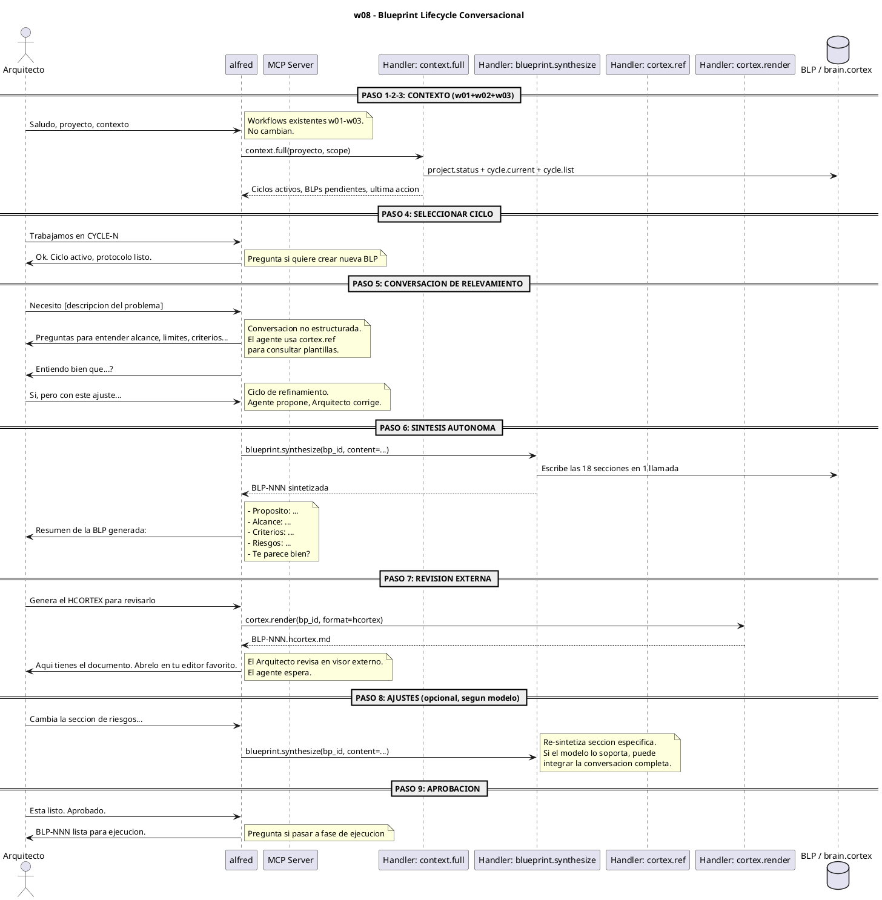
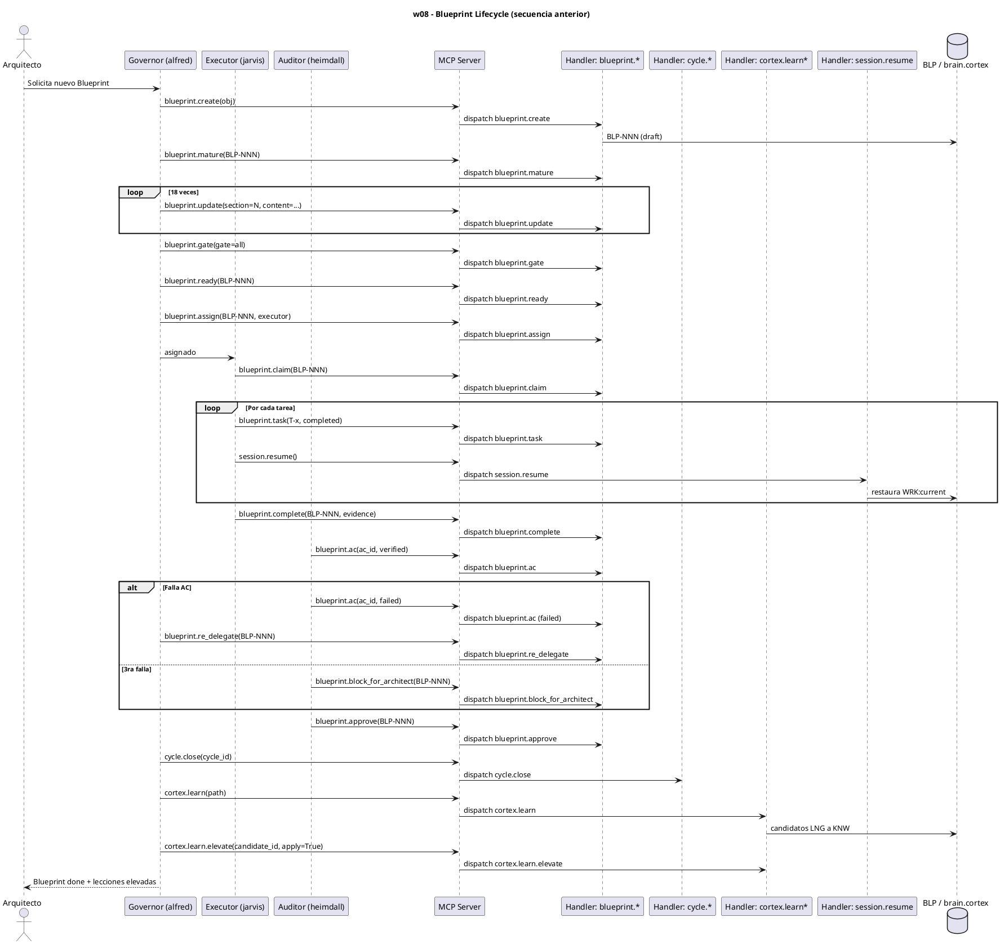

# w08-blueprint-lifecycle.hcortex.md
> Workflow: w08 — Blueprint Lifecycle (conversacional)
> Skill fuente: arqux/skills/workflows/w08-blueprint-lifecycle.md (gobernado por workflows.skill.md)
> Generado: 2026-07-12
> Idioma: español
> Estado: PROPUESTA — Vision del Arquitecto: diseno conversacional, 9 pasos, 3 interacciones humanas

---

$0: METADATA
IDN:w08{ name:"Blueprint Lifecycle Conversacional", purpose:"Diseno colaborativo agente-arquitecto: relevamiento conversacional, sintesis autonoma, revision externa.", trigger:"Nueva funcionalidad, componente, o refactor que requiere diseno.", handlers:4, interacciones_humano:3 }
WRK:w08{ status:"propuesta", source:"vision del Arquitecto + catalogo v4 H-01-H-09" }

---

# 1. RESUMEN

El workflow w08 reemplaza el ciclo secuencial de 18+ llamadas `blueprint.update`
por una **sesion de diseno conversacional** entre el agente y el Arquitecto.
3 interacciones humanas, 4 handlers MCP, 0 stakeholders externos.

**Contraste con w08 anterior:**

| Aspecto | w08 anterior | w08 (nueva vision) |
|---|---|---|
| Llamadas MCP | ~23 | ~4 |
| Interacciones humanas | 6+ (crear, madurar, gatear, ready, asignar, revisar ACs) | 3 (elegir ciclo, conversar, revisar draft) |
| Forma de trabajo | Secuencial: 18x update seccion por seccion | Conversacional: agente propone, Arquitecto refina |
| Stakeholders | Auditor revisa ACs, Governor asigna | Solo Arquitecto + agente. Stakeholders despues |
| Handler central | `blueprint.update` x18 | `blueprint.synthesize` x1 |
| Tiempo estimado | Horas-dias (iteraciones de ida y vuelta) | Minutos (conversacion en vivo) |

# 2. DIAGRAMA DE SECUENCIA



# 3. HANDLERS ASOCIADOS

| Handler (REGISTRY) | MCP tool | Descripcion | Estado |
|---|---|---|---|
| `context.full` | context_full | Agrupa project.status + cycle.current + cycle.list en 1 respuesta | **NUEVO (P3)** |
| `blueprint.synthesize` | blueprint_synthesize | Escribe las 18 secciones de la BLP en 1 llamada CORTEX | **NUEVO (P4)** |
| `cortex.ref` | cortex_ref | Consulta plantillas, sigilos y formatos CORTEX | **NUEVO (P1)** |
| `cortex.read` | cortex_read | Lee CORTEX en modo nativo (mode=native) | **MODIFICADO (P2-a)** |
| `cortex.render` | cortex_render | Renderiza BLP a HCORTEX para revision externa | Existe hoy |
| `blueprint.ready` | blueprint_ready | Arquitecto declara BLP listo para ejecucion | Existe hoy |

**Handlers del w08 anterior que desaparecen en el flujo conversacional:**

| Handler | Razon |
|---|---|
| `blueprint.create` | La BLP se crea via `synthesize`, no via `create` |
| `blueprint.update` x18 | Reemplazado por `synthesize` |
| `blueprint.mature` | La maduracion es la conversacion misma |
| `blueprint.gate` | Las compuertas se verifican durante la conversacion |
| `blueprint.assign` | Quien ejecuta se define en la conversacion |
| `blueprint.claim` | Idem |
| `blueprint.ac` | Los criterios se validan en la conversacion |
| `blueprint.approve` | El Arquitecto aprueba con una palabra |
| `blueprint.re_delegate` | No aplica en flujo conversacional |
| `blueprint.block_for_architect` | No aplica |

# 4. NOTAS

- Los pasos 1-3 (contexto) usan los workflows existentes w01-w02-w03. No cambian.
- `context.full` (P3) es el unico handler nuevo necesario en el preambulo.
- `blueprint.synthesize` (P4) es el corazon del flujo: reemplaza 18 llamadas por 1.
- `cortex.ref` (P1) es necesario para que el agente pueda consultar plantillas durante la conversacion.
- La revision externa (paso 7) usa `cortex.render` existente. No requiere handler nuevo.
- Los ajustes (paso 8) dependen de la capacidad del modelo para integrar la conversacion.
- No hay stakeholders externos en este flujo. La BLP se presenta al Arquitecto solamente.

# 5. SUGERENCIAS DE EVOLUCION

- **La conversacion es el nuevo "mature":** la maduracion de la BLP ocurre durante la conversacion, no via `blueprint.mature`. Cada intercambio agrega contexto y refina el diseno.
- **blueprint.synthesize debe ser idempotente:** llamarlo multiples veces con diferentes fragmentos debe poder parchear secciones especificas sin reescribir todo.
- **cortex.ref como habilitador conversacional:** sin el, el agente no puede producir CORTEX valido durante la conversacion. Es la pieza que permite que el agente "hable CORTEX".
- **El visor externo es clave:** el Arquitecto debe poder abrir el HCORTEX en su editor. Sin esto, la conversacion se vuelve el unico canal y se pierde la capacidad de revision profunda.

# 6. OPTIMIZACION CORTEX-NATIVE

## 6.1 Secuencia actual (w08 anterior)

```
1.  cortex.read(brain.cortex)           # AST: parsea y descarta source
2.  session.resume(path=...)            # checkpoint previo
3.  blueprint.create(obj="...")         # creacion fria
4.  blueprint.update(section=$2)        # x18 secciones!
    ... (hasta 18 llamadas)
5.  blueprint.claim(bp_id)              # reclamo
6.  Loop: blueprint.task + resume       # ejecucion
7.  blueprint.complete(bp_id)           # cierre
8.  Loop: blueprint.ac                  # verificacion ACs
9.  blueprint.gate / ready / approve    # gates humanos
10. cycle.close + learn + evidence      # cierre de ciclo
```

**Total: ~23 llamadas MCP, 6+ interacciones humanas.**

## 6.2 Secuencia conversacional (vision)

```
=== CONTEXTO (w01-w02-w03) ===
1. context.full(proyecto, scope)        # contexto completo en 1 llamada

=== CONVERSACION (0 llamadas MCP) ===
   Agente y Arquitecto conversan.
   Agente usa cortex.ref internamente.

=== SINTESIS ===
2. blueprint.synthesize(bp_id, content) # 18 secciones en 1 llamada

=== REVISION ===
3. cortex.render(bp_id)                 # HCORTEX para visor externo

=== APROBACION ===
   Arquitecto dice "ok"                 # 0 llamadas MCP
```

**Total: ~4 llamadas MCP, 3 interacciones humanas (elegir ciclo, conversar, revisar).**

## 6.3 Comparativa

| Aspecto | w08 anterior | w08 conversacional | Reduccion |
|---|---|---|---|
| Llamadas MCP | ~23 | ~4 | **83%** |
| Interacciones humanas | 6+ | 3 | **50%+** |
| Handlers distintos | 20 | 4 | **80%** |
| Tiempo por BLP | Horas-dias | Minutos | **90%+** |
| Stakeholders necesarios | 3 (Gov, Exec, Aud) | 1 (Arquitecto) | **67%** |

## 6.4 Dependencias con P1-P7

| Handler | Fase | Critico |
|---|---|---|
| `cortex.ref` | P1 | Si — agente consulta plantillas durante la conversacion |
| `cortex.read(mode=native)` | P2-a | Si — leer contexto existente |
| `context.full` | P3 | Si — paso 3 de la vision |
| `blueprint.synthesize` | P4 | Si — corazon del flujo |
| `cortex.render` | existe hoy | Si — paso 7 |
| `session.bootstrap` | P5 | No critico — w00 se puede posponer |

---

### Diagrama: secuencia anterior (w08 clasico — 23 llamadas)



---

$11: REVISION

ERR:w08{ version:"2", generated:"2026-07-12", status:"propuesta", author:"Arquitecto + Alfred + Heimdall", depends_on:["context.full","blueprint.synthesize","cortex.ref","cortex.read mode=native"] }
