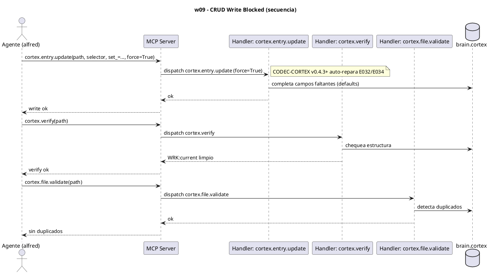

# w09-crud-blocked.hcortex.md
> Workflow: w09 — CRUD Write Blocked
> Skill fuente: arqux/skills/workflows/w09-crud-blocked.md (gobernado por workflows.skill.md)
> Generado: 2026-07-12
> Idioma: español
> Estado: FUNCIONAL — handlers verificados en REGISTRY (73 MCP tools)

---

$0: METADATA
IDN:w09{ name:"CRUD Write Blocked", purpose:"Diagnose and resolve E032/E034 non-bypassable validation errors on brain.cortex writes.", trigger:"E015_ATOMIC_WRITE_FAILED con errores E032/E034.", handlers:3 }
WRK:w09{ status:"functional", source:"workflows.skill.md $2 IDN:w09" }

---

# 1. RESUMEN

El workflow w09 resuelve escrituras bloqueadas en `brain.cortex` por errores no-bypassables
E032 (campos requeridos faltantes) / E034 (campos requeridos vacíos). El handler del skill
`crud_update(..., force=True)` se resuelve en `cortex.entry.update` con `force=True`; CODEC-CORTEX
v0.4.3+ repara automáticamente E032/E034 completando los campos. Se verifica con `cortex.verify`
y `cortex.file.validate`.

# 2. DIAGRAMA DE SECUENCIA



# 3. HANDLERS ASOCIADOS

| Handler (REGISTRY) | MCP tool | Descripción | Implementado |
|---|---|---|---|
| cortex.entry.update | cortex_entry_update | Actualiza una entrada por selector. Con `force=True` aplica auto-repair de E032/E034 (CODEC-CORTEX ≥0.4.3). Es el `crud_update` del skill. | ✅ |
| cortex.verify | cortex_verify | Verifica la estructura del `.cortex` con CODEC-CORTEX (equivalente a `arqux verify`). | ✅ |
| cortex.file.validate | cortex_file_validate | Escanea el archivo por nombres de entrada duplicados y puede renombrarlos. | ✅ |

# 4. NOTAS

- `crud_update` (nombre del skill) NO es un handler MCP: se resuelve en `cortex.entry.update`
  con `force=True`.
- El CLI `arqux brain repair <path> --force` es una vía alternativa (no handler MCP) que
  cubre el mismo caso; el auto-repair en `transactions.py` es el mecanismo común.
- CODEC-CORTEX <0.4.3 no tiene auto-repair: `force=True` no cura E032/E034 (ver RSK del skill).

# 5. SUGERENCIAS DE EVOLUCION

> Alineadas a la revision del Arquitecto (1 orden, 2 gov/aux, 3 meta-handler, 4 fragmentacion) + aportes propios.

- **Orden en la secuencia de uso (1):** w09 es RECUPERACION, cerca del final (tras w08). Se dispara cuando un write falla; es un flujo de excepcion, no lineal.
- **Gobernanza vs auxiliares (2):** w09 son 3 handlers TODOS auxiliares/utilidad (`cortex.*`, lectura/verificacion). Caso extremo de tu impresion 2: un workflow entero de "arreglo" sin un solo handler de gobernanza pesada.
- **Meta-handler (3):** las 3 llamadas (entry.update force + verify + file.validate) podrian fusionarse en `cortex.repair_auto(path, selector, set_)` que hace write-repair + verify + validate en 1 llamada (hoy 3).
- **Fragmentacion (4):** w09 y w11 son ambos "reparacion de .cortex" y se solapan (el skill w11 dice "si w09 falla repetidas veces, escala a w11"). Sugeriria un meta-workflow `w12 Repair` o un `cortex.migrate(path)` que cubra reparacion inmediata (w09) + historica (w11) sin duplicar logica.
- **Aporte de alfred:** el nombre `crud_update` del skill es enganoso (no es handler MCP). Renombrarlo a `cortex.entry.update(force=True)` en el skill evitaria confusion al leer el workflow.

# 6. OPTIMIZACION CORTEX-NATIVE

> Canal: I — w09 son 3 handlers de utilidad; `cortex.entry.update` ya acepta attrs CORTEX.

## 6.1 Secuencia actual

```
1. cortex.entry.update(path, selector, set_="status:done,priority:high",
                       force=True)
                               # set_ ya acepta formato attrs CORTEX (key:val,key2:val2)
2. cortex.verify(path)          # 1 param (ok)
3. cortex.file.validate(path, fix=True)  # 2 params (ok)
```

**Total: 3 llamadas MCP. Handler con params CORTEX nativos: `cortex.entry.update(set_)` ya acepta attrs CORTEX (ver `entries.py:106-114`).**

## 6.2 Secuencia optimizada

```
# Opcion A: cortex.patch agrupa las 3 en 1
1. cortex.patch(path,
       deltas=(
           "~selector{status:done,priority:high}\n"   # update con attrs CORTEX
       ),
       force=True)
   # patch hace update + verify + validate internamente

# Opcion B: mantener llamadas separadas pero con set_ ya nativo (sin cambio real)
1. cortex.entry.update(path, selector, set_="status:done,priority:high", force=True)
2. cortex.verify(path)
3. cortex.file.validate(path, fix=True)
```

**Total opcion A: 1 llamada. Total opcion B: 3 (sin cambio).**

## 6.3 Impacto

| Escenario | Llamadas | Reduccion |
|---|---|---|
| Hoy (`set_` ya CORTEX nativo) | 3 | — |
| `cortex.patch` | **1** | **67%** |

- **Handlers a modificar:** ninguno urgente — `cortex.entry.update(set_)` ya acepta formato attrs CORTEX.
- **Handlers nuevos:** `cortex.patch` (opcional, reduce 3→1 cuando hay update+verify+validate).
- **Nota:** este workflow es el que MENOS cambios necesita porque su handler principal (`entry.update`) ya acepta CORTEX nativo. La ganancia real esta en fusionar las 3 llamadas via `cortex.patch`.

---
### Diagrama: secuencia optimizada (`cortex.patch`)

```puml
' @name: w09_optimized_patch
' @description: Secuencia optimizada CORTEX-native de reparacion de write bloqueado via cortex.patch
' @category: workflow
' @tags: w09,crud,patch,repair,native
' @version: 1.0.0
@startuml
title w09 — CRUD Blocked Write (Optimizado: cortex.patch)

actor "Arquitecto" as A
participant "Agente (alfred)" as G
participant "MCP Server" as S
participant "Handler: cortex.patch" as H
database "brain.cortex" as BC

A -> G: El write fallo, reparalo
G -> S: cortex.patch(path="brain.cortex",
       deltas="~selector{status:done,priority:high}",
       force=true)
note right: Agrupa: entry.update force\n+ verify + file.validate\nen 1 llamada atomica
S -> H: dispatch cortex.patch
H -> BC: UPDATE + backup
H -> H: verify + validate
BC --> H: ok
H --> S: ok (reparado, backup creado)
S --> G: brain.cortex reparado
G --> A: Write reparado (backup preservado)
@enduml
```
