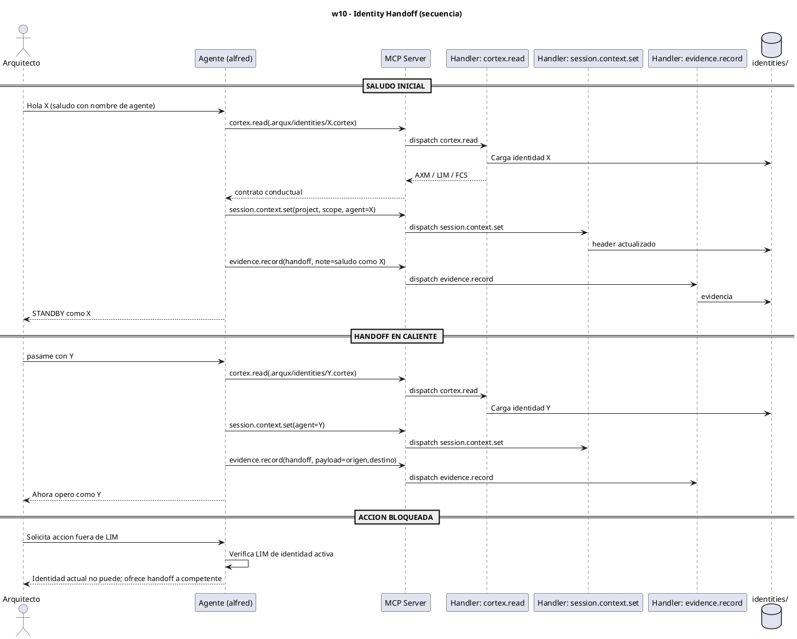
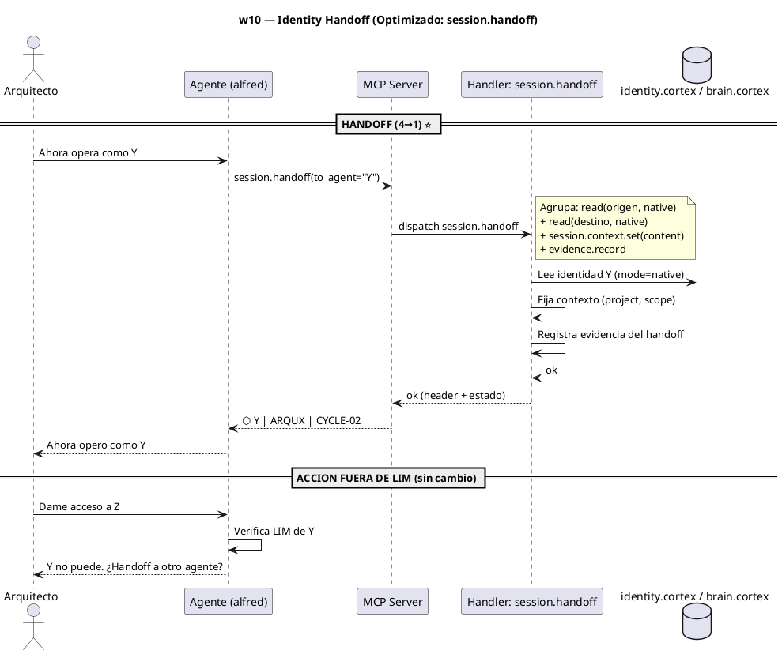

# w10-identity-handoff.hcortex.md
> Workflow: w10 — Identity Handoff
> Skill fuente: arqux/skills/workflows/w10-identity-handoff.md (gobernado por workflows.skill.md)
> Generado: 2026-07-12
> Idioma: español
> Estado: FUNCIONAL — handlers verificados en REGISTRY (73 MCP tools)

---

$0: METADATA
IDN:w10{ name:"Identity Handoff", purpose:"Detect agent identity from user greeting and enable hot handoff between identities during session.", trigger:"Architect greets with agent name at session start, or says pasame con X during active session.", handlers:3 }
WRK:w10{ status:"functional", source:"workflows.skill.md $2 IDN:w10" }

---

# 1. RESUMEN

El workflow w10 gestiona la identidad activa. En el saludo inicial detecta el nombre de agente,
carga su identidad vía `cortex.read`, fija el contexto/header con `session.context.set` y registra
evidencia con `evidence.record`. Durante la sesión, un handoff en caliente recarga la identidad
destino y actualiza el header. Si una acción viola un LIM de la identidad activa, se ofrece
handoff a la identidad competente.

# 2. DIAGRAMA DE SECUENCIA



# 3. HANDLERS ASOCIADOS

| Handler (REGISTRY) | MCP tool | Descripción | Implementado |
|---|---|---|---|
| cortex.read | cortex_read | Carga el `.cortex` de identidad (AXM/LIM/FCS) de la identidad origen/destino. | ✅ |
| session.context.set | session_context_set | Fija el puntero de contexto (proyecto + scope + agente) y el header visible. | ✅ |
| evidence.record | evidence_record | Registra la evidencia del handoff (saludo o cambio de identidad) en pulse.jsonl. | ✅ |

# 4. NOTAS

- El header visible (`⬡ <AGENTE> | <PROYECTO> | <SCOPE>`) debe reflejar SIEMPRE la identidad
  activa (AXM `header_is_identity`); se actualiza vía `session.context.set`.
- `session.context.get` (w03) es complementario para LEER el header; w10 lo ESCRIBE.
- Si la identidad destino no existe en `.arqux/identities/`, se informa y se ofrece la lista.

# 5. SUGERENCIAS DE EVOLUCION

> Alineadas a la revision del Arquitecto (1 orden, 2 gov/aux, 3 meta-handler, 4 fragmentacion) + aportes propios.

- **Orden en la secuencia de uso (1):** w10 es session-scoped y va TRAS w03 (session start). Ocurre durante la sesion activa cuando el Arquitecto pide handoff o saluda con un nombre. Es transversal al trabajo (w04/w08).
- **Gobernanza vs auxiliares (2):** w10 = 1 auxiliar de lectura (`cortex.read` de la identidad) + 2 de gobernanza (`session.context.set` escribe contexto/header, `evidence.record` escribe evidencia). El patron "leer identidad -> actuar" vuelve a aparecer (gov depende de aux).
- **Meta-handler (3):** un handoff hoy son ~4 llamadas (read origen implicito + set + read destino + evidence.record). Un meta-handler `session.handoff(to_agent)` podria hacer: cargar identidad destino + set contexto + record evidencia en 1 llamada. Reduce 4 -> 1.
- **Fragmentacion (4):** w10 comparte con w01/w03/w06 el preambulo "leer AGENTS.md / cargar identidad". El `session.bootstrap()` sugerido en w01/w03/w06 cubriria tambien la carga de identidad de w10.
- **Aporte de alfred:** el header visible es la unica fuente de que identidad esta activa (AXM `header_is_identity`). Sugeriria que `session.handoff` devuelva el header resultante para confirmacion inmediata del Arquitecto.

# 6. OPTIMIZACION CORTEX-NATIVE

> Canal: B — `cortex.read` debe ofrecer modo nativo (I); `session.context.set` debe aceptar `content` (I); header visible es E.

## 6.1 Secuencia actual

```
1. cortex.read(identity_origen.cortex)     # AST: parse source, descarta contenido
2. cortex.read(identity_destino.cortex)    # AST: idem
3. session.context.set(project="ARQUX", scope="CYCLE-02", blp="BLP-014")
                                            # 3 parametros
4. evidence.record(task_id, kind="note", payload="handoff a Y")
                                            # 3 params (ok)
```

**Total: 4 llamadas MCP. Handlers con params descompuestos: `session.context.set` (3).**

## 6.2 Secuencia optimizada

```
# Opcion A: cambios minimos (4 llamadas, params nativos)
1. cortex.read(path=identity_origen.cortex, mode=native)   # source crudo
2. cortex.read(path=identity_destino.cortex, mode=native)  # source crudo
3. session.context.set(content="context{project:ARQUX|scope:CYCLE-02|blp:BLP-014}")
                                                            # 1 param content
4. evidence.record(task_id, kind="note", payload="handoff a Y")  # igual

# Opcion B: session.handoff (maxima reduccion, 1 llamada)
1. session.handoff(to_agent="Y")                             # 1 param
   # agrupa: read(identities) + session.context.set + evidence.record
```

**Total opcion A: 4 llamadas. Total opcion B: 1 llamada.**

## 6.3 Impacto

| Escenario | Llamadas | Reduccion params |
|---|---|---|
| Hoy | 4 | 3 (`session.context.set`) |
| Opcion A (`mode=native` + `content`) | 4 | 3→1 |
| Opcion B (`session.handoff`) | **1** | **75% llamadas** |

- **Handlers a modificar:** `cortex.read` (anadir `mode=native`), `session.context.set` (anadir `content`).
- **Handlers nuevos:** `session.handoff(to_agent)` (reduce 4→1, alta ganancia UX).

---
### Diagrama: secuencia optimizada (`session.handoff`)


