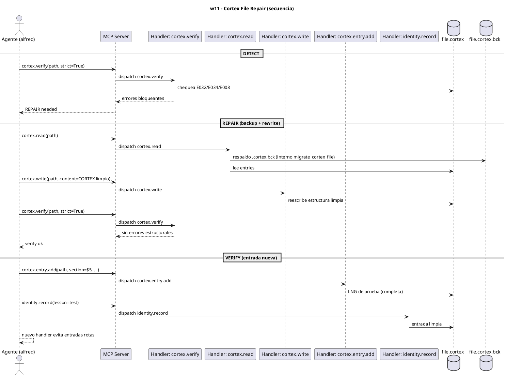

# w11-cortex-file-repair.hcortex.md
> Workflow: w11 — Cortex File Repair — Backup & Rewrite
> Skill fuente: arqux/skills/workflows/w11-cortex-file-repair.md (gobernado por workflows.skill.md)
> Generado: 2026-07-12
> Idioma: español
> Estado: FUNCIONAL — handlers verificados en REGISTRY (73 MCP tools)

---

$0: METADATA
IDN:w11{ name:"Cortex File Repair — Backup & Rewrite", purpose:"Repair .cortex files with blocking validation errors (E032/E034/E008) using the backup to rewrite protocol.", trigger:"cortex verify --strict reveals blocking errors, or w09 auto-repair fails repeatedly.", handlers:5 }
WRK:w11{ status:"functional", source:"workflows.skill.md $2 IDN:w11" }

---

# 1. RESUMEN

El workflow w11 repara archivos `.cortex` estructuralmente corruptos acumulados con errores
bloqueantes (E032/E034/E008). Protocolo BLP-042: respaldar (`mv` a `.cortex.bck`), leer el
respaldo, reescribir con estructura limpia vía `cortex.write`, y verificar con `cortex.verify`.
El handler interno `state.migrate_cortex_file` agrupa estos pasos. Se prueba que las entradas
nuevas (vía `cortex.entry.add` / `identity.record`) quedan completas.

# 2. DIAGRAMA DE SECUENCIA



# 3. HANDLERS ASOCIADOS

| Handler (REGISTRY) | MCP tool | Descripción | Implementado |
|---|---|---|---|
| cortex.verify | cortex_verify | Verifica estructura del `.cortex` (`--strict`): detecta E032/E034/E008. | ✅ |
| cortex.read | cortex_read | Lee y parsea el `.cortex` (origen del respaldo). | ✅ |
| cortex.write | cortex_write | Reescribe el archivo desde texto CORTEX (estructura limpia). | ✅ |
| cortex.entry.add | cortex_entry_add | Añade una entrada (prueba LNG completa tras el fix). | ✅ |
| identity.record | identity_record | Registra lección de prueba; verifica que la entrada queda completa. | ✅ |

# 4. NOTAS

- `arqux.state.migrate_cortex_file(path)` mencionado en el skill NO es un handler MCP: es una
  herramienta interna que agrupa backup + rewrite + verify (usa `cortex.read`/`cortex.write`).
- El backup `.cortex.bck` se preserva indefinidamente (AXM `backup_first`); nunca se borra.
- w11 es para limpieza histórica por lotes; w09 es para fallos de escritura inmediata.
- El CLI `cortex verify --strict` es vía alternativa (no handler MCP) del mismo `cortex.verify`.

# 5. SUGERENCIAS DE EVOLUCION

> Alineadas a la revision del Arquitecto (1 orden, 2 gov/aux, 3 meta-handler, 4 fragmentacion) + aportes propios.

- **Orden en la secuencia de uso (1):** w11 es MANTENIMIENTO/REPAIR, el ultimo del ciclo de vida. Se usa para limpieza historica por lotes; va tras w09 (que cubre fallos inmediatos de escritura).
- **Gobernanza vs auxiliares (2):** w11 = 4 auxiliares de lectura/escritura (`cortex.read/write/verify/entry.add`) + 1 de gobernanza (`identity.record`, solo para la prueba de entrada limpia). Otro workflow de "arreglo" dominado por auxiliares.
- **Meta-handler (3):** `arqux.state.migrate_cortex_file` YA existe internamente y agrupa backup + rewrite + verify, pero NO es handler MCP. Sugeriria promoverlo a `cortex.migrate(path)` (handler MCP) para que el agente haga 1 llamada en vez de read+write+verify+entry.add+identity.record (5 llamadas).
- **Fragmentacion (4):** w11 y w09 se solapan en "reparacion de .cortex" (el propio skill w11 dice escalar de w09 a w11). Un meta-workflow `w12 Repair` o un `cortex.repair(path, mode=immediate|batch)` unificaria ambos sin duplicar logica.
- **Aporte de alfred:** respetar SIEMPRE AXM `backup_first` (el `.cortex.bck` se preserva). El meta-handler `cortex.migrate` debe hacer backup automatico y nunca borrarlo; no automatizar el borrado del respaldo.

# 6. OPTIMIZACION CORTEX-NATIVE

> Canal: B — read/write/verify son utilidad (I); entry.add debe aceptar `content` (I); identity.record prueba final (I).

## 6.1 Secuencia actual

```
1. cortex.verify(path)                                      # 1 param (ok)
2. cortex.read(path)                                        # AST: parse source, descarta
3. cortex.write(path, content="<CORTEX limpio>", force=True)  # content ya CORTEX nativo ✅
4. cortex.entry.add(path, section="$5", sigil="LNG",
                    name="test_lng", value="{kind:test}")    # 5 parametros
5. identity.record(lesson="correccion", kind="behavioral",
                   cause="error", prevention="validar")      # 5 parametros
```

**Total: 5 llamadas MCP. Handlers con params descompuestos: `cortex.entry.add` (5) + `identity.record` (5).**

## 6.2 Secuencia optimizada

```
# Opcion A: cambios minimos (5 llamadas, params nativos)
1. cortex.verify(path)                                       # igual
2. cortex.read(path, mode=native)                            # source crudo
3. cortex.write(path, content="<CORTEX limpio>", force=True) # igual (ya nativo)
4. cortex.entry.add(path, content="LNG:test_lng{kind:test}") # 1 param
5. identity.record(content="$5/LNG:lesson{kind:behavioral|cause:error|prevention:validar}")
                                                             # 1 param

# Opcion B: cortex.migrate promueve read+write+verify (2-3 llamadas)
1. cortex.migrate(path, force=True)                          # backup+rewrite+verify en 1
   # promueve el interno `state.migrate_cortex_file` a handler MCP
2. cortex.entry.add(path, content="LNG:test_lng{kind:test}") # 1 param
3. identity.record(content="$5/LNG:lesson{...}")             # 1 param

# Opcion C: cortex.patch agrupa todo (1-2 llamadas)
1. cortex.patch(path, deltas=(
       "<CORTEX limpio>\n"                                   # rewrite del archivo
       "LNG:test_lng{kind:test}\n"                            # add entrada test
       "~$5/LNG:lesson{kind:behavioral|cause:X|prevention:Y}"  # update leccion
   ), force=True)
   # patch hace: backup + rewrite + add + update + verify + validate
```

**Total opcion A: 5 llamadas. Total opcion B: 3. Total opcion C: 1.**

## 6.3 Impacto

| Escenario | Llamadas | Params max | Reduccion llamadas |
|---|---|---|---|
| Hoy | 5 | 5 (`entry.add`, `identity.record`) | — |
| Opcion A (`content`) | 5 | 1 | 0% (params 5→1) |
| Opcion B (`cortex.migrate`) | **3** | 1 | **40%** |
| Opcion C (`cortex.patch`) | **1** | 1 | **80%** |

- **Handlers a modificar:** `cortex.read` (anadir `mode=native`), `cortex.entry.add` (anadir `content`), `identity.record` (anadir `content`).
- **Handlers nuevos:** `cortex.migrate(path)` (promover desde `state.migrate_cortex_file` ya existente), `cortex.patch` (opcional, maxima ganancia).
- **Nota:** `cortex.write` ya es nativo (`content`) — no tocar. La promocion de `migrate_cortex_file` interno a handler MCP requiere baja implementacion (la logica ya existe).

---
### Diagrama: secuencia optimizada (`cortex.migrate`)

```puml
' @name: w11_optimized_migrate
' @description: Secuencia optimizada CORTEX-native de reparacion de archivo .cortex via cortex.migrate
' @category: workflow
' @tags: w11,repair,migrate,patch,backup,native
' @version: 1.0.0
@startuml
title w11 — Cortex File Repair (Optimizado: cortex.migrate + content)

actor "Arquitecto" as A
participant "Agente (alfred)" as G
participant "MCP Server" as S
participant "Handler: cortex.migrate" as HM
participant "Handler: cortex.entry.add" as HA
database ".cortex" as CX

== MIGRACION (3 llamadas → 1) ⭐ ==
A -> G: Revisa y repara el .cortex corrupto
G -> S: cortex.migrate(path="brain.cortex", force=true)
S -> HM: dispatch cortex.migrate
note right: Promueve state.migrate_cortex_file\na handler MCP. Agrupa:\nbackup + read(native) + rewrite + verify
HM -> CX: backup → .cortex.bck
HM -> CX: read source (mode=native)
HM -> CX: rewrite con CORTEX limpio
HM -> CX: verify estructura
CX --> HM: ok (backup preservado)
HM --> S: ok (migrado, backups creados)
S --> G: brain.cortex reparado

== VERIFICACION CON ENTRADA CORTEX NATIVA ==
A -> G: Prueba que funcione
G -> S: cortex.entry.add(path="brain.cortex",
       content="LNG:test_lng{kind:test}")
S -> HA: dispatch cortex.entry.add
HA -> CX: ADD entrada (content CORTEX)
CX --> HA: ok
HA --> S: LNG:test_lng añadida
S --> G: Entrada de prueba creada
G --> A: .cortex reparado y verificado
@enduml
```
