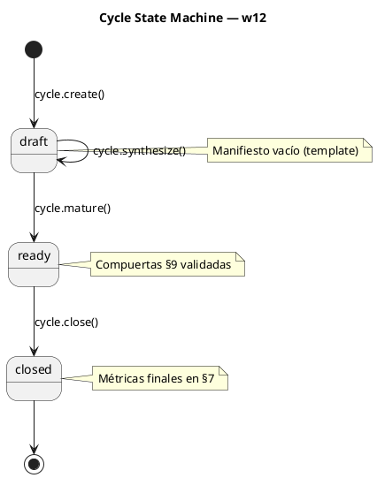

# w12-cycle-lifecycle: Ciclo de vida del ciclo como contenedor de gobierno

> **BLP-015** | CYCLE-04 | 2026-07-13
>
> El ciclo gobierna, no ejecuta. Es el contenedor que abre la puerta a BLPs y tasks. Sin un ciclo definido, el trabajo carece de marco de gobierno.

---

## Visión

Cada ciclo en Arqux tiene un ciclo de vida completo con el mismo patrón conversacional que los Blueprints (w08):

```
create → [conversación de diseño] → synthesize → mature → [BLPs] → close
```

El gap histórico era que `cycle.create` copiaba un template vacío y `cycle.mature` no validaba nada. CYCLE-04 nació con 14 BLPs completados pero su MANIFEST.md era el template sin rellenar. **w12 cierra ese gap.**

---

## Flujo de Estados



---

## Handlers

| Handler | Descripción | Archivo |
|---|---|---|
| `cycle.create` | Crea contenedor con template vacío | `handlers/cycle.py` |
| `cycle.synthesize` | Escribe §1-§9 en 1 call (NUEVO) | `handlers/cycle.py` |
| `cycle.mature` | Valida compuertas §9, transiciona draft→ready | `handlers/cycle.py` |
| `cycle.close` | Verifica BLPs, actualiza §7 métricas | `handlers/cycle.py` |
| `cycle.list` | Lista ciclos del proyecto | `handlers/cycle.py` |
| `cycle.current` | Devuelve el ciclo activo | `handlers/cycle.py` |

---

## Contratos de Handler

### cycle.synthesize

```
Entrada: cycle_id (str), content (str CORTEX)
         $1:{propósito}, $2:{alcance}, $3:{objetivos},
         $4:{directrices}, $5:{puntos de control},
         $8:{reglas}
Salida:  OUT-WORK sections_written=[], bytes_written=N
         PULSE audit registrado
```

### cycle.mature (actualizado)

```
Entrada: cycle_id (str)
Acción:  Lee MANIFEST.md §9, valida todas las compuertas
         Todas ✅ → status: ready
         Alguna ☐ → OUT-ERROR QUALITY_GATES_FAILED
Salida:  OUT-WORK status=ready | OUT-ERROR failed_gates=[...]
```

### cycle.close (actualizado)

```
Entrada: cycle_id (str), summary (str opcional)
Acción:  Escanea BLPs en blueprints/
         Verifica done/cancelled
         Actualiza MANIFEST.md §7 métricas
         Escribe SES en brain PULSE
Salida:  OUT-WORK blps_done=N blps_cancelled=N
```

---

## Secciones del Manifiesto

| § | Título | Poblado por |
|---|---|---|
| §1 | Propósito | cycle.synthesize |
| §2 | Alcance y Límites | cycle.synthesize |
| §3 | Objetivos | cycle.synthesize |
| §4 | Directrices | cycle.synthesize |
| §5 | Puntos de Control | cycle.synthesize |
| §6 | Blueprints (Índice) | Auto-poblado |
| §7 | Estado y Métricas | cycle.close |
| §8 | Reglas del Ciclo | cycle.synthesize |
| §9 | Contrato de Calidad | Derivado de §1-§5, §8 |

---

## Reglas de Diseño

1. **cycle.create** copia el template. No lo llena.
2. **cycle.synthesize** escribe en 1 call, mismo patrón que blueprint.synthesize.
3. **cycle.mature** rechaza si alguna compuerta §9 es ☐.
4. El ciclo gobierna, no ejecuta. BLPs y tasks existen DENTRO del ciclo.
5. **cycle.close** bloquea si hay BLPs no done/cancelled.
6. **cycle.close** actualiza §7 con métricas reales.

---

## Lecciones Aprendidas (CYCLE-04)

- CYCLE-03 tenía manifiesto rico (manual). CYCLE-04 vacío (sin mecanismo).
- BLP-002 (CYCLE-03) fue CANCELLED — el gap persistió 2 ciclos.
- El patrón ya funcionaba para BLPs (`blueprint.synthesize`, BLP-007). Aplicarlo a ciclos era la extensión natural.
- `arch_vision/w00-triage.hcortex.md` preveía esto desde CYCLE-03: "Nuevo ciclo → cycle.create + definir manifiesto".

---

## Workflow

Archivo: `.arqux/skills/workflows/w12-cycle-lifecycle.md`

Referencia: `workflows.skill.md` → IDN:w12
