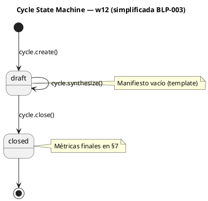

# w12-cycle-lifecycle: Ciclo de vida del ciclo como contenedor de gobierno

> **BLP-003** | CYCLE-07 | 2026-07-15
>
> El ciclo gobierna, no ejecuta. Es el contenedor que abre la puerta a BLPs y tasks. Sin un ciclo definido, el trabajo carece de marco de gobierno.
>
> **Simplificación (BLP-003):** La máquina de estados del ciclo se simplificó a 2 estados: `draft` y `closed`. Se eliminaron `CYCLE_READY`, `CYCLE_ACTIVE` y el handler `cycle.mature`. La maduración es conversacional, no un handler.

---

## Visión

Cada ciclo en Arqux tiene un ciclo de vida conversacional (w08):

```
create → [conversación de diseño] → synthesize → [BLPs] → close
```

La maduración emerge de la conversación con el Arquitecto. No hay handler de mature — cuando el Arquitecto dice "creemos la primera BLP", esa es la validación.

---

## Flujo de Estados



---

## Handlers

| Handler | Descripción | Archivo |
|---|---|---|
| `cycle.create` | Crea contenedor con template vacío | `handlers/cycle.py` |
| `cycle.synthesize` | Escribe §1-§9 en 1 call | `handlers/cycle.py` |
| `cycle.close` | Verifica placeholders (si draft), luego BLPs, cierra | `handlers/cycle.py` |
| `cycle.list` | Lista ciclos del proyecto | `handlers/cycle.py` |
| `cycle.current` | Devuelve el ciclo activo | `handlers/cycle.py` |

> **Eliminado:** `cycle.mature` — la maduración es conversacional.

---

## Contratos de Handler

### cycle.synthesize

```
Entrada: cycle_id (str), content (str CORTEX)
         $1:{propósito}, $2:{alcance}, $3:{objetivos},
         $4:{directrices}, $5:{puntos de control},
         $8:{reglas}
Salida:  OUT-WORK sections_written=[], bytes_written=N
         PULSE audit registrado
```

### cycle.close (BLP-003)

```
Entrada: cycle_id (str), summary (str opcional)
Acción:  Si ciclo en draft → verificar placeholders en MANIFEST.md
         Si hay placeholders → OUT-ERROR INVALID_STATE
         Si no hay placeholders → escanea BLPs en blueprints/
         Verifica done/cancelled
         Actualiza MANIFEST.md §7 métricas
         Escribe SES en brain PULSE
Salida:  OUT-WORK blps_done=N blps_cancelled=N
```

### blueprint.create (BLP-003)

```
Entrada: obj (str), cycle (str opcional)
Acción:  Verifica ciclo no esté closed
         Lee MANIFEST.md del ciclo → busca placeholders
         Si hay placeholders → OUT-ERROR "complete diseño conversacional"
         Si limpio → crea BLP normalmente
Salida:  OUT-WORK blueprint_id=BLP-NNN status=draft
```

---

## Secciones del Manifiesto

| § | Título | Poblado por |
|---|---|---|
| §1 | Propósito | cycle.synthesize |
| §2 | Alcance y Límites | cycle.synthesize |
| §3 | Objetivos | cycle.synthesize |
| §4 | Directrices | cycle.synthesize |
| §5 | Puntos de Control | cycle.synthesize |
| §6 | Blueprints (Índice) | Auto-poblado |
| §7 | Estado y Métricas | cycle.close |
| §8 | Reglas del Ciclo | cycle.synthesize |
| §9 | Contrato de Calidad | Derivado de §1-§5, §8 |

---

## Reglas de Diseño

1. **cycle.create** copia el template. No lo llena.
2. **cycle.synthesize** escribe en 1 call, mismo patrón que blueprint.synthesize.
3. **close_cycle() en draft** rechaza si hay placeholders en el manifiesto.
4. **blueprint.create()** rechaza si el ciclo tiene placeholders en el manifiesto.
5. El ciclo gobierna, no ejecuta. BLPs y tasks existen DENTRO del ciclo.
6. **cycle.close** bloquea si hay BLPs no done/cancelled.
7. **cycle.close** actualiza §7 con métricas reales.

---

## Lecciones Aprendidas

- BLP-003 simplificó la máquina de estados: eliminó CYCLE_READY, CYCLE_ACTIVE y mature_cycle().
- La maduración es conversacional, no un handler. Ciclo tiene 2 estados: draft ↔ closed.
- CYCLE-00 eliminado (bootstrap sin BLPs). CYCLE-01 cerrado (41 BLPs todos done).
