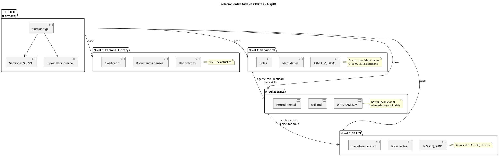
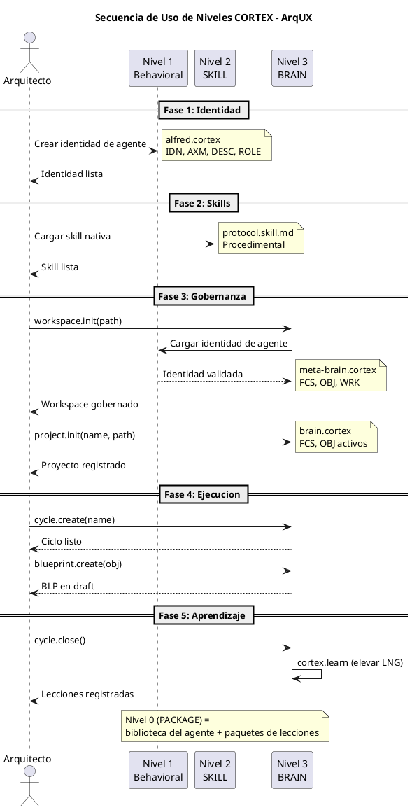

# Niveles de Documento CORTEX — ArqUX Framework

> Referencia completa de los niveles de archivo CORTEX: qué son, cómo se infieren, qué validan.
> Formato: HCORTEX-READ | Perfil: FULL | Versión: 3.0

---

### Niveles CORTEX — Vista Rápida

| Nivel | Nombre | Pregunta | Tipo | Actualización |
|-------|--------|----------|------|---------------|
| **0** | PACKAGE | ¿Qué tengo? | Personal Library | Frecuente (aprendizaje) |
| **1** | BEHAVIORAL | ¿Quién soy? | Identity | Solo por elevación |
| **2** | SKILL | ¿Qué sé hacer? | Procedimental | Por diseño/evolución |
| **3** | BRAIN | ¿Qué estoy haciendo? | Estado | Continua (en tiempo real) |

---

## §1: ¿Qué es un Nivel?

CORTEX define una **sintaxis** universal de sigilos, secciones y tipos.  
ArqUX define **reglas de gobernanza** sobre esa sintaxis mediante **niveles**.

Cada archivo `.cortex` tiene un nivel que determina:
- Qué sigilos están permitidos o prohibidos
- Qué campos son obligatorios
- Qué errores de validación aplican al escribir

| Aspecto | CORTEX (formato) | ArqUX (framework) |
|---|---|---|
| Sintaxis | Sigilos, secciones $0-$N | — |
| Tipos | attrs, cuerpo, attrs-pos | — |
| Niveles | — | Nivel 0, 1, 2, 3 |
| Validaciones | Parseo léxico | E023, E024, E029 |
| Reglas | Schema local | survive, blocking, live state |

**Principio:** CORTEX es el metalenguaje. Los niveles son ArqUX usando CORTEX como soporte.

---

## §2: Nivel 0 — Biblioteca Personal del Agente

**Tipo:** `personal-library`  
**Archivos:** Documentos densos, clasificados, de uso práctico para el agente.

| Propiedad | Valor |
|---|---|
| Sigilos prohibidos | Ninguno |
| Sigilos requeridos | Ninguno |
| Restricciones | Solo las reglas comunes (§7) |
| Naturaleza | **VIVO** — se actualiza con el tiempo según requerimientos de gestión y gobierno |
| Alcance | Global (workspace) o particular (proyecto) |
| Creador | Arquitecto (solicita) o Agente (cuando patrón de aprendizaje lo requiere) |
| Lector principal | El agente |
| Inferencia | Por defecto cuando no hay IDN, filename ni sigilos |

### Propósito

Biblioteca personal del agente: textos densos, clasificados, de uso práctico para recuperación fácil durante el trabajo rutinario. Son documentos VIVOS que pueden ser actualizados con el tiempo y los cambios que la gestión y gobierno vayan requiriendo.

### Uso Típico

- Patrones de uso que el agente repite
- Atajos y procedimientos aprendidos
- Contextos importantes de fácil acceso
- Lecciones que aún no se elevan a nivel superior
- Información práctica para rutinas diarias

### Características

| Característica | Descripción |
|---|---|
| Clasificación | Organizados por tema o contexto |
| Densidad | Información concisa y directa |
| Accesibilidad | Fácil recuperación durante trabajo |
| Evolución | Se actualizan conforme cambia el gobierno |
| Ubicación | Contexto global del workspace o particular de proyecto |

---

## §3: Nivel 1 — Conductual

**Tipo:** `behavioral`  
**Propósito:** Define las dimensiones del comportamiento que el agente puede y debe tener.

### Dos Grupos Fundamentales

#### Grupo 1: Identidades

La identidad que el agente puede asumir. Incluye:

| Dimensión | Descripción |
|---|---|
| Orientación conductual | Forma inicial de comportamiento |
| Principios de acción | Valores y normas que guían el comportamiento |
| Comunicación | Estilo y manera de interactuar |
| Especialización | Área de enfoque o dominio |
| Orientación vocacional | Propósito o llamado profesional |
| Disciplina propia | Autocontrol y constancia |

**Virtud principal:** Establece un nexo de interacción clara entre el agente y el usuario, facilitando la comunicación dependiendo de sus directrices, valores y normas.

#### Grupo 2: Roles

Las atribuciones y limitaciones que se confieren a una identidad en un momento determinado.

**Ejemplo:**
- Alfred como **gobernador** → tiene atribuciones y restricciones específicas
- Alfred como **ejecutor** → tiene atribuciones y restricciones diferentes

**Importante:** Una misma identidad puede asumir roles diferentes. Alfred gobernador no es el mismo Alfred ejecutor. Esto permite ejecutar la misma acción con personalidades diferentes (Jarvis, Heimdall), produciendo resultados diferentes debido a sus valores y disciplinas distintas.

### Regla Fundamental

Las **SKILL** no forman parte directa de este nivel — son **procedimentales**, no conductuales.

### Archivos del Nivel 1

| Tipo | Archivos | Ejemplo |
|---|---|---|
| Identidad | `<agent>.cortex` | `alfred.cortex`, `jarvis.cortex` |
| Rol | Definido en la identidad o separado | `governor.cortex`, `executor.cortex` |

### Sistema de Aprendizaje por Identidad

Cada identidad cuenta con su propio **paquete de lecciones** (Level 0) que permite el aprendizaje regular sin cambiar la identidad directamente.

**Flujo de Aprendizaje:**

```
Aprendizaje rutinario → <agent>.lessons.cortex (Level 0 = PACKAGE)
                              ↓
                    Acumulación de patrones
                              ↓
                    Motor de aprendizaje evalúa
                              ↓
                    ¿Se convierte en conocimiento conductual?
                         ↓              ↓
                        NO            SÍ
                         ↓              ↓
                    Permanece      Eleva a identidad
                    en Level 0     <agent>.cortex (Level 1)
```

**Nota:** `<agent>.lessons.cortex` es un archivo Level 0 (PACKAGE) — no un nivel separado.

**Regla Fundamental:** La personalidad NO cambia directamente. Solo después de una profunda reflexión de aprendizajes, el motor de aprendizaje establece que las lecciones acumuladas se convierten en conocimiento conductual.

**Uso de codec-cortex:** El motor de elevación ya existe en codec-cortex. ArqUX debe usarlo correctamente.

### Sigilos Típicos

| Sigilo | Uso |
|---|---|
| IDN | Identidad del agente (nombre, rol, propósito) |
| AXM | Axiomas de comportamiento |
| LIM | Límites operativos |
| DESC | Descripción textual de la identidad |
| ROLE | Definición de rol (atribuciones y limitaciones) |

### Ejemplo

```cortex
$1: IDENTITY

IDN:alfred{name:"Alfred", role:"assistant", kind:"behavioral",
  purpose:"Asistente personal del Arquitecto", version:"2.0.0"}

$2: BEHAVIORAL DIMENSIONS

AXM:workflow_fidelity{ Respeto irrestricto a los workflows
de gobierno. Cada paso se ejecuta en el orden definido. }

$3: ROLES

ROLE:governor{attributions:"crear BLPs, asignar ejecutores, verificar ACs",
  restrictions:"no ejecutar tareas directamente", status:"current"}

ROLE:executor{attributions:"ejecutar tareas, reportar progreso",
  restrictions:"no modificar governance files", status:"current"}

$4: AXIOMS

AXM:workflow_fidelity{ Respeto irrestricto a los workflows
de gobierno. Cada paso se ejecuta en el orden definido. }
```

---

## §4: Nivel 2 — SKILL

**Tipo:** `procedimental`  
**Propósito:** Habilidades que un agente puede incorporar directamente en sus labores — el "cómo hacerlo" de manera simple, eficiente, ordenada y metodológicamente aceptable.

### Definición

Las SKILLs son un **estándar de la industria** para compartir especialización para agentes sobre tareas/actividades especializadas. Son libros de consulta ultraespecializados.

### Formato

| Propiedad | Descripción |
|-----------|-------------|
| Formato físico | `.md` (markdown) |
| Contenido interno | codec-cortex |
| Propósito | Facilitar adopción universal (agentes + tecnologías) |

### Dos Tipos de SKILLs

| Tipo | Origen | Modificable | Evolución |
|------|--------|-------------|-----------|
| **Nativa** | Construida en ArqUX | SÍ | Se adapta a nuestras necesidades |
| **Heredada** | Terceros / Industry | NO | Se usa tal cual (formato convertido) |

### Flujo de Adoptación de SKILL Heredada

```
SKILL heredada (terceros)
         ↓
skills/originals/   ← MD nativo (NO usado directamente)
         ↓
Conversión a formato CORTEX
         ↓
skills/             ← cortex.md listo para usar
         ↓
Flag interno: heredada/ajena/propietaria
```

### Estructura de Directorios

```
.arqux/skills/
├── protocol.skill.md      ← Nativa (evoluciona)
├── cortex.skill.md        ← Nativa (evoluciona)
├── mcp-handlers.skill.md  ← Heredada (convertida)
└── originals/
    └── mcp-handlers.md    ← Original MD (referencia)
```

### Flag de Herencia

```cortex
SKILL:mcp_handlers{source:"third-party", 
  origin:"opencode", 
  kind:"inherited",
  adapted:"2025-07-10"}
```

### Estado Actual

Todas las SKILLs existentes en ArqUX son **nativas** y evolucionan con el proyecto. El directorio `originals/` se usará cuando se incorporen skills de terceros.

### Reglas

| Regla | Descripción |
|-------|-------------|
| Nativas | Evolucionan, se adaptan, se refinan |
| Heredadas | Se preservan en `originals/`, se convierten a CORTEX |
| Ruido | Evitar introducir contenido no especializado |
| Ultraespecializado | Cada SKILL = una habilidad específica |

### Sigilos Típicos

| Sigilo | Uso |
|---|---|
| WRK | Procedimientos y flujos de trabajo |
| AXM | Axiomas procedimentales |
| LIM | Límites de la habilidad |
| STP | Pasos de ejecución |

### Ejemplo

```cortex
$1: PROTOCOL

WRK:session_start{
  1:"Leer brain.cortex",
  2:"Presentar dashboard",
  3:"Preguntar objetivo"}

$2: DECISION FRAMEWORK

AXM:mode_aware{
  design:"documentar sin ejecutar",
  exec:"ejecutar con checkpoints",
  review:"verificar ACs"}
```

---

## §5: Nivel 3 — BRAIN

**Tipo:** `brain`  
**Archivos:** `brain.cortex`, `meta-brain.cortex`.

### Definición

El Brain es el **estado vivo del proyecto** — captura qué está haciendo el agente en este momento: ciclo activo, blueprints en ejecución, focus y progreso actual.

### Regla Fundamental

Un brain DEBE tener al menos un **FCS** y un **OBJ** activos en todo momento.  
Sin foco y objetivo activos, el brain es semánticamente inválido.

### Campos Obligatorios

| Entry | Campos requeridos | Notas |
|---|---|---|
| FCS | `what` (no vacío), `status` (current/blocked), `survive` | `status:done` NO cuenta como activo |
| OBJ | `goal` (no vacío), `status` (current/blocked), `survive` | `status:done` NO cuenta como activo |
| WRK | `current` (no vacío), `blocked` (no), `survive` | Estado de ejecución actual |

### Errores Asociados

| Código | Condición | Severidad |
|---|---|---|
| E024_LEVEL2_MISSING_FOCUS | No hay FCS activo con `what` no vacío | Error no bypassable |
| E024_LEVEL2_MISSING_FOCUS | No hay OBJ activo con `goal` no vacío | Error no bypassable |
| E034_CRITICAL_REQUIRED_FIELD_EMPTY | Campo requerido existe pero está vacío ("", "null", "tbd") | Error no bypassable |
| E032_CRITICAL_SIGIL_INCOMPLETE | Falta un campo requerido por completo | Error no bypassable |

### Regla de Estado Cerrado

`status: "done"` es un estado de cierre, NO un estado activo.  
Un brain con FCS `status:done` NO satisface Nivel 3.

### Estructura Canónica de un Brain

| Sección | Contenido | Obligatorio |
|---|---|---|
| $0 | Glosario local de sigilos | Sí |
| $1 | IDENTITY — gobernador, proyecto | Sí |
| $2 | FOCUS — FCS activo | Sí |
| $3 | OBJECTIVES — OBJ activo | Sí |
| $4 | SESSIONS — historial de sesiones | Opcional |
| $5 | HANDOFFS — traspasos entre agentes | Opcional |
| $6 | PULSE — auditoría de eventos | Sí |
| $7 | LESSONS — lecciones aprendidas | Opcional |
| $8 | ACTIVE_CONTEXT — WRK actual | Sí |
| $9 | RISKS — riesgos identificados | Opcional |
| $10 | KNOWLEDGE — conocimiento estable | Opcional |
| $11 | CONCURRENCY — control de versiones | Sí |
| $12 | ISSUES — registro de incidencias | Opcional |

### Ejemplo

```cortex
$2: FOCUS

FCS:current{what:"Implementar validación de duplicados",
  priority:"medium", status:"current", survive:"work"}

$3: OBJECTIVES

OBJ:_1{goal:"Completar BLP-003 con auto-numeración",
  status:"current", success:"E3 resuelto", survive:"work"}
```

---

## §6: Inferencia del Nivel

El nivel se determina automáticamente mediante 4 reglas en orden de precedencia:

| Prioridad | Método | Cómo se determina |
|---|---|---|
| 1 | Atributo `kind` en IDN | `IDN:agent{kind:"behavioral"}` → Level 1 |
| 2 | Nombre de archivo | `brain.cortex` → Level 3, `<agent>.cortex` → Level 1 |
| 3 | Firma de sigilos | Presencia de `WRK`+`FCS` → Level 3 (brain) |
| 4 | Default | No clasificado → Level 0 (package) |

### Regla de Firma por Sigilos

| Combinación de sigilos | Nivel inferido |
|---|---|
| `WRK` + `FCS` presentes | Nivel 3 (brain) |
| `IDN` + `AXM` presentes, `WRK` ausente | Nivel 1 (behavioral) |
| Procedimental (WRK sin FCS) | Nivel 2 (skill) |
| Ninguna combinación | Nivel 0 (package) |

---

## §7: Reglas Comunes a Todos los Niveles

### survive — Política de Retención

| Valor | Significado | Prioridad |
|---|---|---|
| `min` | Retención mínima — solo sobrevive a borrado explícito | P0 (crítico) |
| `recovery` | Retención en modo recuperación | P1 |
| `work` | Retención normal de trabajo | P2 (default) |
| `full` | Retención completa | P3+ |

**Validación:** `survive` solo acepta los valores anteriores.  
Cualquier otro valor produce `E025_INVALID_SURVIVE`.

### severity:blocking — Protección Independiente

Un `CNST` con `severity:blocking` se protege independientemente de `survive`.  
La retención y la protección son **ortogonales**.

### attrs-pos — Aridad Posicional

Los sigilos de tipo `attrs-pos` deben tener exactamente la cantidad de valores posicionales que declara su contrato en $0.  
Si hay valores excedentes, se descartan silenciosamente con `E027_ATTRS_POS_ARITY`.

### Secretos — Prohibición Absoluta

Ningún archivo CORTEX puede contener secretos en texto claro:

- API keys, tokens, passwords
- URLs con credenciales incrustadas
- Claves privadas

Esto se aplica en TODOS los niveles sin excepción y no es bypassable.

---

## §8: Tabla Resumen

| Nivel | Nombre | Tipo | Archivos | Estado vivo | Error clave |
|---|---|---|---|---|---|
| 0 | PACKAGE | Personal Library | Documentos densos + `<agent>.lessons.cortex` | **VIVO** (se actualiza) | — |
| 1 | BEHAVIORAL | Identity | `<agent>.cortex` | PROHIBIDO (solo por elevación) | E023_LEVEL1_LIVE_STATE |
| 2 | SKILL | Procedimental | `.md` con contenido cortex | Por diseño/evolución | — |
| 3 | BRAIN | Estado | `brain.cortex`, `meta-brain.cortex` | REQUERIDO (FCS+OBJ) | E024_LEVEL3_MISSING_FOCUS |

---

## §9: Diagramas

### Diagrama de Relación entre Niveles



### Diagrama de Secuencia de Uso



---

> Documento HCORTEX-READ.  
> Versión: 3.0 — 2026-07-10.  
> Pertenece al framework ArqUX, no a CODEC-CORTEX.
