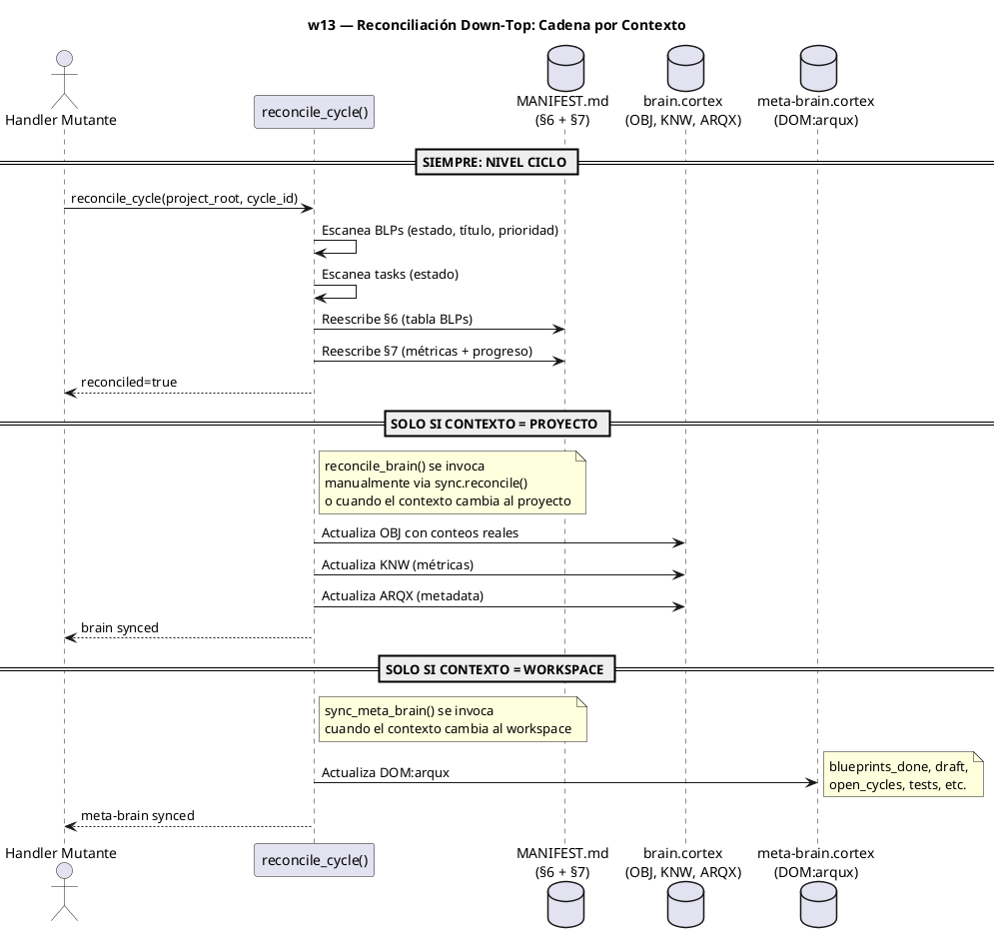

$0

# -- $0: WORKFLOW SKILL GLOSSARY --
# Sigil | Name     | Type   | Risk | Layer        | Description
# IDN   | identity | attrs  | B    | Semantic     | Workflow definition
# STP   | step     | attrs  | M    | Working      | Workflow step
# HDL   | handler  | attrs-pos | M | Semantic    | Handler reference
# AXM   | axiom    | cuerpo | H    | Prefrontal   | Non-negotiable principle
# LNG   | lesson   | attrs  | M    | Episodic     | Learned lesson or pattern

IDN:w13{ name:"Reconciliación Down-Top de Estado", file:"workflows/w13-reconcile-down-top.md", purpose:"Mantener consistente la información de estado entre tareas, BLPs, ciclos, brain.cortex y meta-brain. Cada mutación atómica actualiza solo el nivel inmediatamente superior según el contexto activo.", trigger:"Mutación en task/blueprint/ciclo. O invocación manual via sync.reconcile()." }

AXM:contextual_sync{ La sincronía es por contexto, no global. Mutaciones en task/blueprint llegan solo hasta el ciclo (MANIFEST.md). La reconciliación de brain.cortex ocurre cuando el contexto apunta al proyecto. La de meta-brain cuando apunta al workspace. }

AXM:atomic_cascade{ Cada handler mutante llama a reconcile_cycle() como última operación antes de retornar. No hay eventos diferidos, ni cron, ni propagación parcial. El handler no retorna hasta que el ciclo está consistente. }

AXM:no_eager_global{ NO reconciliar brain.cortex en cada mutación de task — el ciclo es el nivel de granularidad correcto. NO reconciliar meta-brain en cada mutación de BLP — el brain.cortex es el nivel correcto. }

AXM:fail_silent{ reconcile_cycle() es fail-silent: errores se registran pero nunca rompen el handler llamante. }

$1: DIAGRAMA DE SECUENCIA

```puml
@startuml
title w13 — Handlers que disparan reconcile_cycle

[*] --> task_create : task.create
[*] --> task_claim : task.claim
[*] --> task_update : task.update
[*] --> task_complete : task.complete
[*] --> task_fail : task.fail

[*] --> bp_create : blueprint.create
[*] --> bp_define : blueprint.define
[*] --> bp_mature : blueprint.mature
[*] --> bp_ready : blueprint.ready
[*] --> bp_assign : blueprint.assign
[*] --> bp_claim : blueprint.claim
[*] --> bp_complete : blueprint.complete
[*] --> bp_approve : blueprint.approve
[*] --> bp_fail : blueprint.fail
[*] --> bp_cancel : blueprint.cancel
[*] --> bp_redelegate : blueprint.re_delegate
[*] --> bp_block : blueprint.block_for_architect

[*] --> cycle_create : cycle.create
[*] --> cycle_mature : cycle.mature
[*] --> cycle_close : cycle.close
[*] --> cycle_synthesize : cycle.synthesize

state "reconcile_cycle()" as RECONCILE
task_create --> RECONCILE
task_claim --> RECONCILE
task_update --> RECONCILE
task_complete --> RECONCILE
task_fail --> RECONCILE
bp_create --> RECONCILE
bp_define --> RECONCILE
bp_mature --> RECONCILE
bp_ready --> RECONCILE
bp_assign --> RECONCILE
bp_claim --> RECONCILE
bp_complete --> RECONCILE
bp_approve --> RECONCILE
bp_fail --> RECONCILE
bp_cancel --> RECONCILE
bp_redelegate --> RECONCILE
bp_block --> RECONCILE
cycle_create --> RECONCILE
cycle_mature --> RECONCILE
cycle_close --> RECONCILE
cycle_synthesize --> RECONCILE

RECONCILE --> [*] : MANIFEST.md §6+7 actualizado

@enduml
```

$2: PASOS DEL WORKFLOW

STP:w13_step1{ 0:"Handler mutante completa su operación (task.create, blueprint.approve, cycle.close, etc.)", 1:"Handler escribe archivo local (task.cortex, BLP.md, MANIFEST.md)", 2:"Handler llama a sync_brain() para WRK/FCS (liviano)", 3:"Handler llama a reconcile_cycle(project_root, cycle_id) para estado persistente" }

STP:w13_step2{ 0:"reconcile_cycle() escanea BLPs del ciclo", 1:"Lee cada BLP-*.md del directorio blueprints/", 2:"Extrae frontmatter: blueprint_id, title, status, priority, governor", 3:"Cuenta por estado: done, draft, cancelled, review, in_progress, ready, blocked", 4:"Construye tabla §6 con todos los BLPs", 5:"Calcula progreso: (done + cancelled) / total * 100", key_rule:"La tabla §6 se auto-puebla completamente. No tocar manualmente." }

STP:w13_step3{ 0:"reconcile_cycle() escanea tasks del ciclo (si existen)", 1:"Lee cada *.cortex del directorio tasks/", 2:"Extrae WRK:task status de cada archivo", 3:"Cuenta por estado: open, draft, in_progress, done, blocked, cancelled, review", 4:"Agrega métricas de tareas a §7", key_rule:"Tasks son opcionales. Si no hay directorio tasks/, se omite." }

STP:w13_step4{ 0:"reconcile_cycle() reescribe MANIFEST.md del ciclo", 1:"Encuentra §6 (Blueprints Índice) y reemplaza la tabla completa", 2:"Encuentra §7 (Estado y Métricas) y reemplaza conteos + progreso", 3:"Escribe archivo atómicamente (read → replace → write)", key_rule:"Solo se modifican §6 y §7. El resto del MANIFEST.md queda intacto." }

$3: HANDLERS REFERENCIADOS

HDL:sync.reconcile{ handler:"sync.reconcile", file:"handlers/sync/__init__.py", description:"Reconciliación manual. Acepta cycle_id (nivel ciclo) o vacío (nivel proyecto). Acepta level: cycle/project/workspace/auto." }

HDL:sync.run{ handler:"sync.run", file:"handlers/sync/__init__.py", description:"Sincronía manual brain.cortex → meta-brain (legacy)." }

HDL:task.create{ handler:"task.create", file:"handlers/task.py", description:"Crea tarea → llama reconcile_cycle()." }
HDL:task.claim{ handler:"task.claim", file:"handlers/task.py", description:"Reclama tarea → llama reconcile_cycle()." }
HDL:task.update{ handler:"task.update", file:"handlers/task.py", description:"Actualiza tarea → llama reconcile_cycle()." }
HDL:task.complete{ handler:"task.complete", file:"handlers/task.py", description:"Completa tarea → llama reconcile_cycle()." }
HDL:task.fail{ handler:"task.fail", file:"handlers/task.py", description:"Bloquea tarea → llama reconcile_cycle()." }

HDL:blueprint.create{ handler:"blueprint.create", file:"handlers/blueprint/lifecycle.py", description:"Crea BLP → llama reconcile_cycle()." }
HDL:blueprint.define{ handler:"blueprint.define", file:"handlers/blueprint/lifecycle.py", description:"Define BLP → llama reconcile_cycle()." }
HDL:blueprint.mature{ handler:"blueprint.mature", file:"handlers/blueprint/lifecycle.py", description:"Madura BLP → llama reconcile_cycle()." }
HDL:blueprint.ready{ handler:"blueprint.ready", file:"handlers/blueprint/lifecycle.py", description:"Prepara BLP → llama reconcile_cycle()." }
HDL:blueprint.assign{ handler:"blueprint.assign", file:"handlers/blueprint/lifecycle.py", description:"Asigna BLP → llama reconcile_cycle()." }
HDL:blueprint.claim{ handler:"blueprint.claim", file:"handlers/blueprint/lifecycle.py", description:"Reclama BLP → llama reconcile_cycle()." }
HDL:blueprint.complete{ handler:"blueprint.complete", file:"handlers/blueprint/review.py", description:"Completa BLP → llama reconcile_cycle()." }
HDL:blueprint.approve{ handler:"blueprint.approve", file:"handlers/blueprint/review.py", description:"Aprueba BLP → llama reconcile_cycle()." }
HDL:blueprint.fail{ handler:"blueprint.fail", file:"handlers/blueprint/review.py", description:"Bloquea BLP → llama reconcile_cycle()." }
HDL:blueprint.cancel{ handler:"blueprint.cancel", file:"handlers/blueprint/review.py", description:"Cancela BLP → llama reconcile_cycle()." }
HDL:blueprint.re_delegate{ handler:"blueprint.re_delegate", file:"handlers/blueprint/review.py", description:"Re-delega BLP → llama reconcile_cycle()." }
HDL:blueprint.block_for_architect{ handler:"blueprint.block_for_architect", file:"handlers/blueprint/review.py", description:"Bloquea BLP para Arquitecto → llama reconcile_cycle()." }

HDL:cycle.create{ handler:"cycle.create", file:"handlers/cycle.py", description:"Crea ciclo → llama reconcile_cycle()." }
HDL:cycle.mature{ handler:"cycle.mature", file:"handlers/cycle.py", description:"Madura ciclo → llama reconcile_cycle()." }
HDL:cycle.close{ handler:"cycle.close", file:"handlers/cycle.py", description:"Cierra ciclo → llama reconcile_cycle()." }
HDL:cycle.synthesize{ handler:"cycle.synthesize", file:"handlers/cycle.py", description:"Sintetiza ciclo → llama reconcile_cycle()." }

$4: PITFALLS

LNG:w13_pitfall1{type:"process", cause:"Intentar reconciliar brain.cortex en cada mutación de task", lesson:"El ciclo es el nivel de granularidad correcto. reconcile_cycle() es suficiente para tasks."}

LNG:w13_pitfall2{type:"process", cause:"No invocar reconcile_cycle en handlers de solo lectura (read, list, current)", lesson:"reconcile_cycle solo se llama desde handlers mutantes que cambian estado (create, complete, close, etc.)."}

LNG:w13_pitfall3{type:"process", cause:"Escribir directamente en §6 o §7 del MANIFEST.md", lesson:"Esas secciones se auto-pueblan vía reconcile_cycle(). Cualquier edición manual será sobreescrita."}

LNG:w13_pitfall4{type:"process", cause:"Depender de cron para mantener sincronía", lesson:"La reconciliación es atómica y ocurre en el handler. No hay procesos externos ni schedules."}

LNG:w13_pitfall5{type:"process", cause:"Contexto cambia de nivel (ej: BLP → proyecto) sin invocar sync.reconcile()", lesson:"Al cambiar de contexto, invocar sync.reconcile() manualmente para subir el nivel de reconciliación."}
