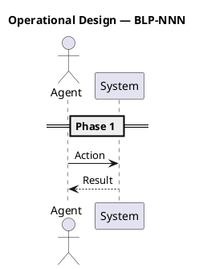

---
# Blueprint Template (BLP_TEMPLATE.md)
# Copied by blueprint.create() to create BLP-NNN.md
# HCORTEX format — human + machine readable
# All sections with "_" are placeholders filled during definition

blueprint_id: ""
title: ""
cycle: ""
status: "draft"
governor: ""
executor: ""
created_at: ""
updated_at: ""
closed_at: ""
priority: "medium"
complexity: "standard"
quality_gates@: {
  has_clear_objective: false,
  has_verifiable_preconditions: false,
  has_scope_and_exclusions: false,
  has_acceptance_criteria: false,
  has_work_procedure: false,
  has_required_validations: false,
}
_template_ref: "BLP_TEMPLATE.md"
---

# BLP-NNN: Title

---

## §1: Problem Statement

_Describe the problem this Blueprint addresses. What evidence exists that it's real?_

**Evidence:**
- _Evidence item 1_
- _Evidence item 2_

**Impact of not solving:**
_

## §2: Objective

_Concrete, verifiable, self-contained. An executor reading only this section should understand what to achieve._

## §3: Preconditions

_What must exist or be true BEFORE execution begins. Each precondition must be verifiable._

- [ ] _Precondition 1 — verifiable via command or inspection_
- [ ] _Precondition 2 — verifiable via command or inspection_

## §4: Guiding Principle

_The rule that governs this Blueprint. Executor must follow it without exception._

**Problem evidence:** _What concrete evidence shows this is the right principle?_

**Impact if violated:** _What happens if it's not followed?_

## §5: Context

_PUML diagram showing the context: actors, systems, flows._

## §6: Scope & Exclusions

**In scope:**
- _Item 1_
- _Item 2_

**Out of scope (explicitly excluded):**
- _Item 1_
- _Item 2_

## §7: Mandatory Rules

_Non-negotiable constraints for the executor._

1. _Rule 1_
2. _Rule 2_

## §8: Technical Design

_Expected architecture, components, data flow._

## §9: Operational Design

_Sequence or activity diagram showing HOW the execution should flow._

## §10: Contracts

**Expected inputs:**
- _Input format, file, or payload_

**Expected outputs:**
- _Files created, modified, or reports generated_

**Commands:**
- `_command_` — _purpose_

## §11: Work Procedure

_Phased execution plan with rollback instructions._

### Phase 1: Preparation
1. _Step_
2. _Step_

### Phase 2: Implementation
1. _Step_
2. _Step_

### Phase 3: Validation
1. _Step_
2. _Step_

> **Rollback:** `_rollback command_`

## §12: Acceptance Criteria

_Each AC must be objectively verifiable._

- [ ] **AC-01:** _Description — verification: command or procedure_
- [ ] **AC-02:** _Description — verification: command or procedure_
- [ ] **AC-03:** _Description — verification: command or procedure_

## §13: Required Validations

| Type | Description | Command | Expected Evidence |
|---|---|---|---|
| test | _Description_ | `_command_` | _output_ |
| lint | _Description_ | `_command_` | _output_ |
| security | _Description_ | `_command_` | _output_ |

## §14: Tasks

_Task breakdown. Tasks live inside this Blueprint._

- [ ] **T-1.1:** _Title — Description_
- [ ] **T-1.2:** _Title — Description (depends on T-1.1)_
- [ ] **T-2.1:** _Title — Description_

## §15: Risks

| ID | Description | Impact | Mitigation |
|---|---|---|---|
| R-01 | _Description_ | _Impact_ | _Mitigation_ |
| R-02 | _Description_ | _Impact_ | _Mitigation_ |

## §16: Blocking Rule

_Conditions under which the executor MUST halt and report._

1. _Condition 1_
2. _Condition 2_

**Action:** HALT_AND_REPORT
**Escalate to:** _responsible agent or Architect_

## §17: Expected Output

**Files created:**
- `_path/to/file_`

**Files modified:**
- `_path/to/file_`

**Evidence:**
- `_path/to/evidence_`

**Summary:**
> _One-line description of expected result._

## §18: Quality Contract

| Gate | Status |
|---|---|
| has_clear_objective | ☐ |
| has_verifiable_preconditions | ☐ |
| has_scope_and_exclusions | ☐ |
| has_acceptance_criteria | ☐ |
| has_work_procedure | ☐ |
| has_required_validations | ☐ |

> All gates must be ✅ before blueprint.ready(). See blueprint-workflow skill.
