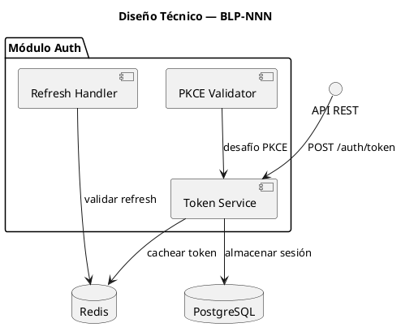
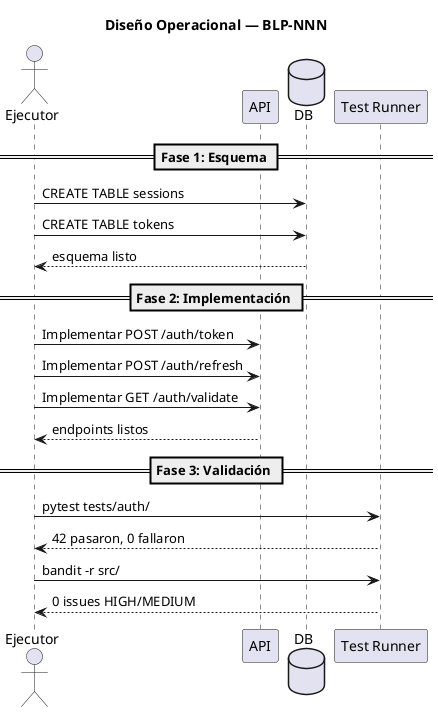

---
# Plantilla de Blueprint (BLP_TEMPLATE.md)
# Copiada por blueprint.create() para crear BLP-NNN.md
# Formato HCORTEX — legible por humanos y máquinas
# Todas las secciones con "_" son marcadores que se completan durante la definición

blueprint_id: ""
title: ""
cycle: ""
status: "draft"
governor: ""
executor: ""
created_at: ""
updated_at: ""
closed_at: ""
priority: "medium"
complexity: "standard"
quality_gates@: {
  has_clear_objective: false,
  has_verifiable_preconditions: false,
  has_scope_and_exclusions: false,
  has_acceptance_criteria: false,
  has_work_procedure: false,
  has_required_validations: false,
  has_learning_recorded: false,
}
_template_ref: "BLP_TEMPLATE.md"
---

# BLP-NNN: Título

---

## §1: Planteamiento del Problema

_Describe el problema que aborda este Blueprint. ¿Qué evidencia existe de que es real?_

**Evidencia:**
- _Evidencia 1_
- _Evidencia 2_

**Impacto de no resolverlo:**
_


## §2: Objetivo

_Concreto, verificable, autocontenido. Un ejecutor leyendo solo esta sección debe entender qué lograr._


## §3: Precondiciones

_¿Qué debe existir o ser cierto ANTES de que comience la ejecución? Cada precondición debe ser verificable._

- [ ] _Precondición 1 — verificable mediante comando o inspección_
- [ ] _Precondición 2 — verificable mediante comando o inspección_


## §4: Principio Rector

_La regla que gobierna este Blueprint. El ejecutor debe seguirla sin excepción._

**Evidencia del problema:** _¿Qué evidencia concreta muestra que este es el principio correcto?_

**Impacto si se viola:** _¿Qué pasa si no se sigue?_


## §5: Contexto

_Diagrama PUML que muestra el entorno: actores, sistemas externos, flujos de datos. Debe responder: "¿Qué necesita entender el ejecutor sobre el mundo en el que opera este Blueprint?"_

```puml
@startuml
title Contexto — BLP-NNN
' REQUERIDO: Mostrar todos los actores, sistemas y sus relaciones
' Usar notación UML para que humanos y agentes lo entiendan sin ambigüedad

actor "Usuario" as U
actor "Admin" as A
participant "API Gateway" as GW
database "PostgreSQL" as DB
cloud "IdP Externo" as IDP

' Flujos de datos
U -> GW: Solicitud
GW -> DB: Consulta
GW -> IDP: Validar
' Las etiquetas deben ser lo suficientemente descriptivas para que un agente entienda qué representa cada flecha
@enduml
```


## §6: Alcance y Exclusiones

**Dentro del alcance:**
- _Ítem 1_
- _Ítem 2_

**Fuera del alcance (excluido explícitamente):**
- _Ítem 1_
- _Ítem 2_


## §7: Reglas Obligatorias

_Restricciones no negociables para el ejecutor._

1. _Regla 1_
2. _Regla 2_


## §8: Diseño Técnico

_Arquitectura esperada: componentes, flujo de datos, capas. Esto es lo que construye el ejecutor. Debe ser inequívoco — un agente leyendo esto debe entender exactamente qué crear._




## §9: Diseño Operacional

_Diagrama de secuencia que muestra el FLUJO DE EJECUCIÓN EXACTO: paso a paso, quién hace qué, en qué orden. Un agente ejecutor sigue esto como un guión._




## §10: Contratos

**Entradas esperadas:**
- _Formato, archivo o payload de entrada_

**Salidas esperadas:**
- _Archivos creados, modificados o reportes generados_

**Comandos:**
- `_comando_` — _propósito_


## §11: Procedimiento de Trabajo

_Plan de ejecución por fases con instrucciones de reversión._

### Fase 1: Preparación
1. _Paso_
2. _Paso_

### Fase 2: Implementación
1. _Paso_
2. _Paso_

### Fase 3: Validación
1. _Paso_
2. _Paso_

> **Reversión:** `_comando de reversión_`


## §12: Criterios de Aceptación

_Cada CA debe ser objetivamente verificable._

- [ ] **AC-01:** _Descripción — verificación: comando o procedimiento_
- [ ] **AC-02:** _Descripción — verificación: comando o procedimiento_
- [ ] **AC-03:** _Descripción — verificación: comando o procedimiento_


## §13: Validaciones Requeridas

| Tipo | Descripción | Comando | Evidencia Esperada |
|---|---|---|---|
| test | _Descripción_ | `_comando_` | _salida_ |
| lint | _Descripción_ | `_comando_` | _salida_ |
| seguridad | _Descripción_ | `_comando_` | _salida_ |


## §14: Tareas

_Desglose de tareas. Las tareas viven dentro de este Blueprint._

- [ ] **T-1.1:** _Título — Descripción_
- [ ] **T-1.2:** _Título — Descripción (depende de T-1.1)_
- [ ] **T-2.1:** _Título — Descripción_


## §15: Riesgos

| ID | Descripción | Impacto | Mitigación |
|---|---|---|---|
| R-01 | _Descripción_ | _Impacto_ | _Mitigación_ |
| R-02 | _Descripción_ | _Impacto_ | _Mitigación_ |


## §16: Regla de Bloqueo

_Condiciones bajo las cuales el ejecutor DEBE detenerse e informar._

1. _Condición 1_
2. _Condición 2_

**Acción:** DETENER_E_INFORMAR
**Escalar a:** _agente responsable o Arquitecto_


## §17: Salida Esperada

**Archivos creados:**
- `_ruta/al/archivo_`

**Archivos modificados:**
- `_ruta/al/archivo_`

**Evidencia:**
- `_ruta/a/la/evidencia_`

**Resumen:**
> _Descripción de una línea del resultado esperado._


## §18: Contrato de Calidad

| Compuerta | Estado |
|---|---|
| has_clear_objective | ☐ |
| has_verifiable_preconditions | ☐ |
| has_scope_and_exclusions | ☐ |
| has_acceptance_criteria | ☐ |
| has_work_procedure | ☐ |
| has_required_validations | ☐ |
| has_learning_recorded | ☐ |

> Todas las compuertas deben estar en ✅ antes de blueprint.ready(). Ver blueprint-workflow skill.
